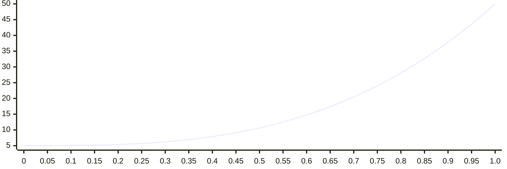
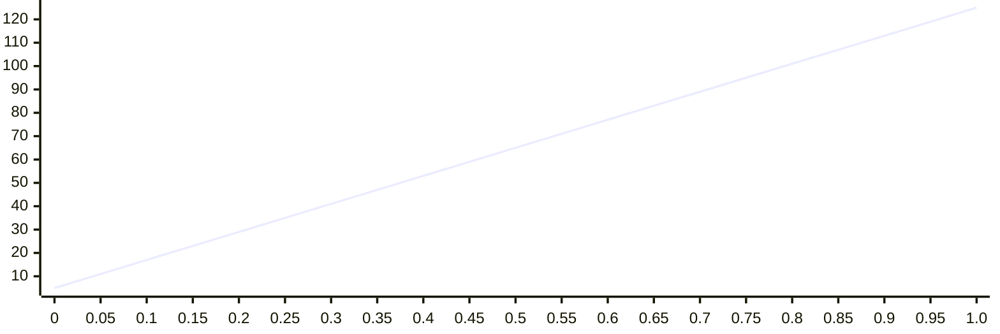
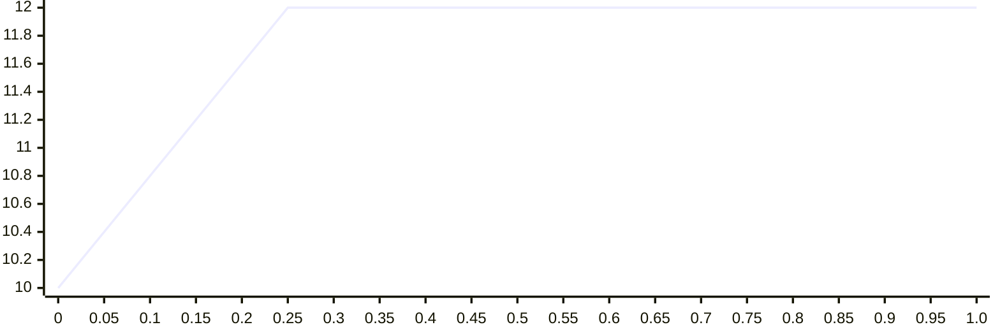
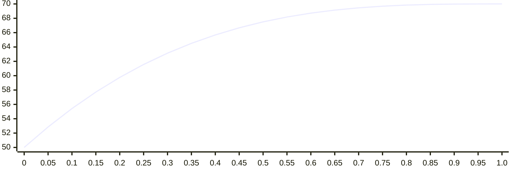
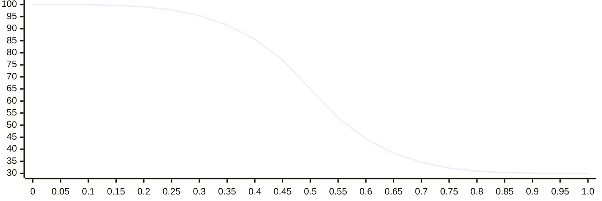
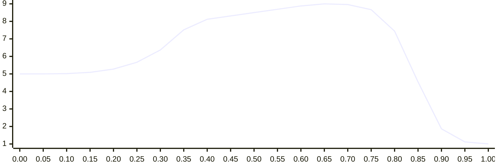
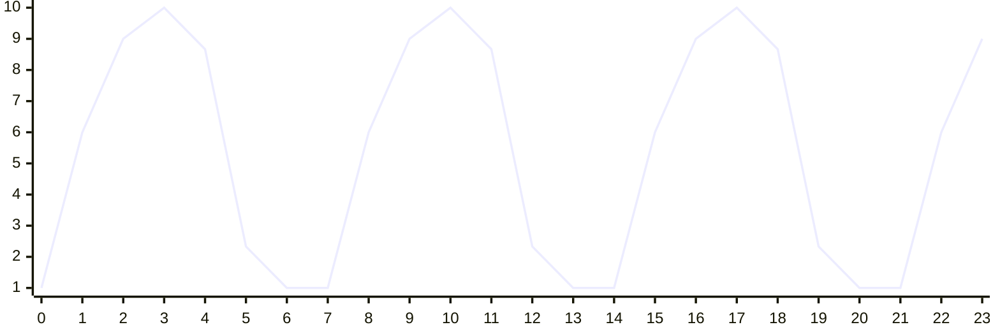
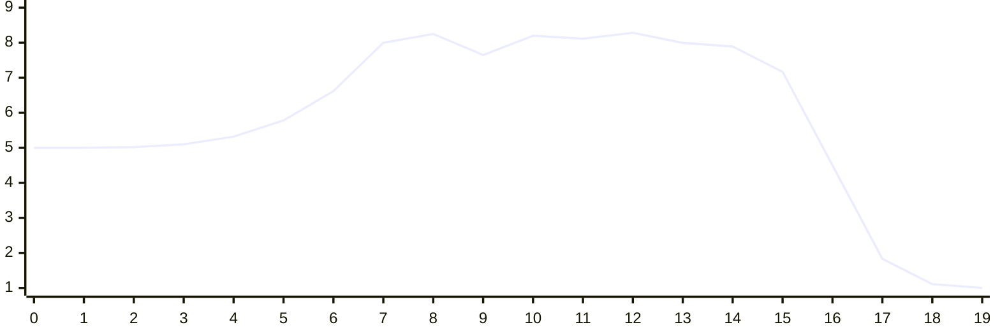

# 🧠 ShadowTraffic LLM Knowledge File

> This file is designed to help large language models (LLMs) generate correct ShadowTraffic configurations.  
> Only use patterns explicitly shown in this file—do not guess, invent new fields, or combine examples in unsupported ways.  
> When in doubt, prefer working examples over interpreting the full documentation.

---

## ✅ Quick Reference

See the overview.md section in the full documentation below for the key product concepts.

---

## 🗂️ Example Gallery

### 

```json
{
    "generators": [
        {
            "topic": "testTopic",
            "value": {
                "_gen": "oneOf",
                "choices": [
                    "👍", "🔥", "❤️"
                ]
            }
        }
    ],
    "connections": {
        "dev-kafka": {
            "kind": "kafka",
            "producerConfigs": {
                "bootstrap.servers": "localhost:9092",
                "key.serializer": "io.shadowtraffic.kafka.serdes.JsonSerializer",
                "value.serializer": "io.shadowtraffic.kafka.serdes.JsonSerializer"
            }
        }
    }
}
```

-----

### Hello world with Kafka

```json
{
    "generators": [
        {
            "topic": "testTopic",
            "value": {
                "_gen": "oneOf",
                "choices": [
                    "👍", "🔥", "❤️"
                ]
            }
        }
    ],
    "connections": {
        "dev-kafka": {
            "kind": "kafka",
            "producerConfigs": {
                "bootstrap.servers": "localhost:9092",
                "key.serializer": "io.shadowtraffic.kafka.serdes.JsonSerializer",
                "value.serializer": "io.shadowtraffic.kafka.serdes.JsonSerializer"
            }
        }
    }
}
```

-----

### Hello world with Postgres

```json
{
    "generators": [
        {
            "table": "testTable",
            "row": {
                "testColumn": {
                    "_gen": "oneOf",
                    "choices": [
                        "👍", "🔥", "❤️"
                    ]
                }
            }
        }
    ],
    "connections": {
        "pg": {
            "kind": "postgres",
            "connectionConfigs": {
                "host": "localhost",
                "port": 5432,
                "db": "mydb"
            }
        }
    }
}
```

-----

### Hello world with S3

```json
{
    "generators": [
        {
            "bucket": "testBucket",
            "data": {
                "_gen": "oneOf",
                "choices": [
                    "👍", "🔥", "❤️"
                ]
            },
            "bucketConfigs": {
                "format": "jsonl",
                "keyPrefix": "part-"
            }
        }        
    ],
    "connections": {
        "s3": {
            "kind": "s3"
        }
    }
}
```

-----

### Hello world with a webhook

```json
{
    "generators": [
        {
            "url": "https://my-site/webhook-endpoint",
            "method": "POST",
            "headers": { "ORIGIN": "US-EAST-2" },
            "queryParams": {
                "foo": "bar",
                "baz": "bip"
            },
            "data": {
                "magicNumber": {
                    "_gen": "normalDistribution",
                    "mean": 100,
                    "sd": 10
                },
                "magicString": {
                    "_gen": "oneOf",
                    "choices": [
                        "👍", "🔥", "❤️"
                    ]
                }
            }
        }
    ],
    "connections": {
        "saas-webhook": {
            "kind": "webhook"
        }
    }
}
```

-----

### The kitchen sink: Kafka retail data

```json
{
    "generators": [
        {
            "topic": "customers",
            "value": {
                "customerId": { "_gen": "uuid" },
                "name": {
                    "_gen": "string", "expr": "#{Name.fullName}"
                },
                "birthday": {
                    "_gen": "string", "expr": "#{Date.birthday '18','80'}"
                },
                "directSubscription": {
                    "_gen": "boolean"
                },
                "membershipLevel": {
                    "_gen": "oneOf", "choices": ["free", "pro", "elite"]
                },
                "shippingAddress": {
                    "_gen": "string", "expr": "#{Address.fullAddress}"
                },
                "activationDate": {
                    "_gen": "formatDateTime",
                    "ms": {
                        "_gen": "uniformDistribution",
                        "bounds": [ 1710176905, { "_gen": "now" } ]
                    }
                }
            }
        },
        {
            "topic": "orders",
            "value": {
                "orderId": { "_gen": "uuid" },
                "customerId": {
                    "_gen": "lookup",
                    "topic": "customers",
                    "path": ["value", "customerId"]
                },
                "orderNumber": {
                    "_gen": "sequentialInteger"
                },
                "product": { "_gen": "string", "expr": "#{Commerce.productName}" },
                "backordered": {
                    "_gen": "weightedOneOf",
                    "choices": [
                        { "weight": 19, "value": false },
                        { "weight": 1,  "value": true }
                    ]
                },
                "cost": {
                    "_gen": "normalDistribution",
                    "mean": 100,
                    "sd": 20
                },
                "description": { "_gen": "string", "expr": "#{Lorem.paragraph}" },
                "create_ts": { "_gen": "now" },
                "creditCardNumber": { "_gen": "string", "expr": "#{Business.creditCardNumber}" },
                "discountPercent": {
                    "_gen": "uniformDistribution",
                    "bounds": [0, 10],
                    "decimals": 0
                }
            }
        }
    ],
    "connections": {
        "dev-kafka": {
            "kind": "kafka",
            "producerConfigs": {
                "bootstrap.servers": "localhost:9092",
                "key.serializer": "io.shadowtraffic.kafka.serdes.JsonSerializer",
                "value.serializer": "io.shadowtraffic.kafka.serdes.JsonSerializer"
            }
        }
    }
}
```

-----

### The kitchen sink: Postgres retail data

```json
{
    "generators": [
        {
            "table": "customers",
            "row": {
                "customerId": { "_gen": "uuid" },
                "name": {
                    "_gen": "string", "expr": "#{Name.fullName}"
                },
                "birthday": {
                    "_gen": "string", "expr": "#{Date.birthday '18','80'}"
                },
                "directSubscription": {
                    "_gen": "boolean"
                },
                "membershipLevel": {
                    "_gen": "oneOf", "choices": ["free", "pro", "elite"]
                },
                "shippingAddress": {
                    "_gen": "string", "expr": "#{Address.fullAddress}"
                },
                "activationDate": {
                    "_gen": "formatDateTime",
                    "ms": {
                        "_gen": "uniformDistribution",
                        "bounds": [ 1710176905, { "_gen": "now" } ]
                    }
                }
            }
        },
        {
            "table": "orders",
            "row": {
                "orderId": { "_gen": "uuid" },
                "customerId": {
                    "_gen": "lookup",
                    "table": "customers",
                    "path": ["row", "customerId"]
                },
                "orderNumber": {
                    "_gen": "sequentialInteger"
                },
                "product": { "_gen": "string", "expr": "#{Commerce.productName}" },
                "backordered": {
                    "_gen": "weightedOneOf",
                    "choices": [
                        { "weight": 19, "value": false },
                        { "weight": 1,  "value": true }
                    ]
                },
                "cost": {
                    "_gen": "normalDistribution",
                    "mean": 100,
                    "sd": 20
                },
                "description": { "_gen": "string", "expr": "#{Lorem.paragraph}" },
                "create_ts": { "_gen": "now" },
                "creditCardNumber": { "_gen": "string", "expr": "#{Business.creditCardNumber}" },
                "discountPercent": {
                    "_gen": "uniformDistribution",
                    "bounds": [0, 10],
                    "decimals": 0
                }
            }
        }
    ],
    "connections": {
        "pg": {
            "kind": "postgres",
            "connectionConfigs": {
                "host": "localhost",
                "port": 5432,
                "db": "mydb"
            }
        }
    }
}
```

-----

### The kitchen sink: S3 retail data

```json
{
    "generators": [
        {
            "bucket": "customers",
            "bucketConfigs": {
                "format": "jsonl",
                "keyPrefix": "part-"
            },
            "data": {
                "customerId": { "_gen": "uuid" },
                "name": {
                    "_gen": "string", "expr": "#{Name.fullName}"
                },
                "birthday": {
                    "_gen": "string", "expr": "#{Date.birthday '18','80'}"
                },
                "directSubscription": {
                    "_gen": "boolean"
                },
                "membershipLevel": {
                    "_gen": "oneOf", "choices": ["free", "pro", "elite"]
                },
                "shippingAddress": {
                    "_gen": "string", "expr": "#{Address.fullAddress}"
                },
                "activationDate": {
                    "_gen": "formatDateTime",
                    "ms": {
                        "_gen": "uniformDistribution",
                        "bounds": [ 1710176905, { "_gen": "now" } ]
                    }
                }
            }
        },
        {
            "bucket": "orders",
            "bucketConfigs": {
                "format": "jsonl",
                "keyPrefix": "part-"
            },
            "data": {
                "orderId": { "_gen": "uuid" },
                "customerId": {
                    "_gen": "lookup",
                    "bucket": "customers",
                    "path": ["data", "customerId"]
                },
                "orderNumber": {
                    "_gen": "sequentialInteger"
                },
                "product": { "_gen": "string", "expr": "#{Commerce.productName}" },
                "backordered": {
                    "_gen": "weightedOneOf",
                    "choices": [
                        { "weight": 19, "value": false },
                        { "weight": 1,  "value": true }
                    ]
                },
                "cost": {
                    "_gen": "normalDistribution",
                    "mean": 100,
                    "sd": 20
                },
                "description": { "_gen": "string", "expr": "#{Lorem.paragraph}" },
                "timestamp": { "_gen": "now" },
                "creditCardNumber": { "_gen": "string", "expr": "#{Business.creditCardNumber}" },
                "discountPercent": {
                    "_gen": "uniformDistribution",
                    "bounds": [0, 10],
                    "decimals": 0
                }
            }
        }
    ],
    "connections": {
        "s3": {
            "kind": "s3"
        }
    }
}
```

-----

### Customers have a name, age, and membership level

```json
{
    "generators": [
        {
            "table": "customers",
            "row": {
                "name": {
                    "_gen": "string",
                    "expr": "#{Name.fullName}"
                },
                "age": {
                    "_gen": "uniformDistribution",
                    "bounds": [
                        18,
                        120
                    ],
                    "decimals": 0
                },
                "membership": {
                    "_gen": "oneOf",
                    "choices": [
                        "gold",
                        "silver",
                        "bronze"
                    ]
                }
            }
        }
    ],
    "connections": {
        "pg": {
            "kind": "postgres",
            "connectionConfigs": {
                "host": "localhost",
                "port": 5432,
                "db": "mydb"
            }
        }
    }
}
```

-----

### 57% of votes are cast for Franklin Roosevelt

```json
{
    "generators": [
        {
            "topic": "votes",
            "key": {
                "voterId": {
                    "_gen": "uuid"
                }
            },
            "value": {
                "candidate": {
                    "_gen": "weightedOneOf",
                    "choices": [
                        {
                            "weight": 57,
                            "value": "Franklin Roosevelt"
                        },
                        {
                            "weight": 43,
                            "value": "Herbert Hoover"
                        }
                    ]
                }
            }
        }
    ],
    "connections": {
        "dev-kafka": {
            "kind": "kafka",
            "producerConfigs": {
                "bootstrap.servers": "localhost:9092",
                "key.serializer": "io.shadowtraffic.kafka.serdes.JsonSerializer",
                "value.serializer": "io.shadowtraffic.kafka.serdes.JsonSerializer"
            }
        }
    }
}
```

-----

### Transactions are uniformly priced between $2 and $200

```json
{
    "generators": [
        {
            "topic": "transactions",
            "key": {
                "_gen": "uuid"
            },
            "value": {
                "price": {
                    "_gen": "uniformDistribution",
                    "bounds": [
                        2,
                        200
                    ],
                    "decimals": 2
                },
                "timestamp": {
                    "_gen": "now"
                }
            }
        }
    ],
    "connections": {
        "dev-kafka": {
            "kind": "kafka",
            "producerConfigs": {
                "bootstrap.servers": "localhost:9092",
                "key.serializer": "io.shadowtraffic.kafka.serdes.JsonSerializer",
                "value.serializer": "io.shadowtraffic.kafka.serdes.JsonSerializer"
            }
        }
    }
}
```

-----

### Orders have a pre-existing customer

```json
{
    "generators": [
        {
            "topic": "customers",
            "key": {
                "name": {
                    "_gen": "string",
                    "expr": "#{Name.fullName}"
                }
            }
        },
        {
            "topic": "orders",
            "value": {
                "orderId": {
                    "_gen": "uuid"
                },
                "customerId": {
                    "_gen": "lookup",
                    "topic": "customers",
                    "path": [
                        "key",
                        "name"
                    ]
                }
            }
        }
    ],
    "connections": {
        "dev-kafka": {
            "kind": "kafka",
            "producerConfigs": {
                "bootstrap.servers": "localhost:9092",
                "key.serializer": "io.shadowtraffic.kafka.serdes.JsonSerializer",
                "value.serializer": "io.shadowtraffic.kafka.serdes.JsonSerializer"
            }
        }
    }
}
```

-----

### Support ticket messages arrive every 5000ms

```json
{
    "generators": [
        {
            "connection": "dev-pg",
            "table": "customers",
            "row": {
                "username": {
                    "_gen": "string",
                    "expr": "#{Name.username}"
                },
                "address": {
                    "_gen": "string",
                    "expr": "#{Address.fullAddress}"
                }
            }
        },
        {
            "connection": "dev-kafka",
            "topic": "purchases",
            "key": {
                "_gen": "uuid"
            },
            "value": {
                "customerId": {
                    "_gen": "lookup",
                    "connection": "dev-pg",
                    "table": "customers",
                    "path": [
                        "username"
                    ]
                },
                "product": {
                    "_gen": "string",
                    "expr": "#{Commerce.productName}"
                },
                "creditCard": {
                    "_gen": "string",
                    "expr": "#{Finance.creditCard}"
                }
            }
        },
        {
            "connection": "dev-kafka",
            "topic": "supportTickets",
            "key": {
                "_gen": "lookup",
                "topic": "purchases",
                "path": [
                    "key"
                ]
            },
            "value": {
                "timestamp": {
                    "_gen": "now"
                }
            },
            "localConfigs": {
                "throttleMs": 5000
            }
        }
    ],
    "connections": {
        "dev-kafka": {
            "kind": "kafka",
            "producerConfigs": {
                "bootstrap.servers": "localhost:9092",
                "key.serializer": "io.shadowtraffic.kafka.serdes.JsonSerializer",
                "value.serializer": "io.shadowtraffic.kafka.serdes.JsonSerializer"
            }
        },
        "dev-pg": {
            "kind": "postgres",
            "connectionConfigs": {
                "host": "localhost",
                "port": 5432,
                "username": "postgres",
                "password": "postgres",
                "db": "mydb"
            }
        }
    }
}
```

-----

### Publish 80% of the tweets from 20% of the users

```json
{
    "generators": [
        {
            "topic": "users",
            "key": {
                "_gen": "string",
                "expr": "#{Name.username}"
            }
        },
        {
            "topic": "tweets",
            "value": {
                "userId": {
                    "_gen": "lookup",
                    "topic": "users",
                    "path": [
                        "key"
                    ],
                    "histogram": {
                        "_gen": "histogram",
                        "bins": [
                            {
                                "bin": 0.2,
                                "frequency": 8
                            },
                            {
                                "bin": 0.8,
                                "frequency": 2
                            }
                        ]
                    }
                }
            }
        }
    ],
    "connections": {
        "dev-kafka": {
            "kind": "kafka",
            "producerConfigs": {
                "bootstrap.servers": "localhost:9092",
                "key.serializer": "io.shadowtraffic.kafka.serdes.JsonSerializer",
                "value.serializer": "io.shadowtraffic.kafka.serdes.JsonSerializer"
            }
        }
    }
}
```

-----

### Send messages every 500 ms with a std dev of 40 ms

```json
{
    "generators": [
        {
            "table": "messages",
            "vars": {
                "delay": {
                    "_gen": "normalDistribution",
                    "mean": 500,
                    "sd": 40
                }
            },
            "row": {
                "id": {
                    "_gen": "string",
                    "expr": "#{Internet.macAddress}"
                },
                "delay": {
                    "_gen": "var",
                    "var": "delay"
                }
            },
            "localConfigs": {
                "throttleMs": {
                    "_gen": "var",
                    "var": "delay"
                }
            }
        }       
    ],
    "connections": {
        "pg": {
            "kind": "postgres",
            "connectionConfigs": {
                "host": "localhost",
                "port": 5432,
                "db": "mydb"
            }
        }
    }
}
```

-----

### Place exactly 15 orders

```json
{
    "generators": [
        {
            "table": "orders",
            "row": {
                "orderId": {
                    "_gen": "uuid"
                },
                "orderDate": {
		    "_gen" : "formatDateTime",
		    "ms" : {
			"_gen" : "now"
		    },
		    "format" : "yyyy-MM-dd"
		}
            },
            "localConfigs": {
                "maxEvents": 15
            }
        }
    ],
    "connections": {
        "pg": {
            "kind": "postgres",
            "connectionConfigs": {
                "host": "localhost",
                "port": 5432,
                "db": "mydb"
            }
        }
    }
}
```

-----

### Pick a date/timestamp between yesterday and tomorrow

```json
{
    "generators": [
        {
            "table": "sensorReadings",
            "vars": {
                "now": {
                    "_gen": "now"
                }
            },
            "row": {
                "reading": {
                    "_gen": "normalDistribution",
                    "mean": 50,
                    "sd": 4
                },
                "timestamp": {
                    "_gen": "formatDateTime",
                    "ms": {
                        "_gen": "uniformDistribution",
                        "bounds": [
                            {
                                "_gen": "subtract",
                                "args": [
                                    { "_gen": "var", "var": "now" },
                                    86400000
                                ]
                            },
                            {
                                "_gen": "add",
                                "args": [
                                    { "_gen": "var", "var": "now" },
                                    86400000
                                ]
                            }
                        ]
                    }
                }
            }
        }
    ],
    "connections": {
        "pg": {
            "kind": "postgres",
            "connectionConfigs": {
                "host": "localhost",
                "port": 5432,
                "db": "mydb"
            }
        }
    }
}
```

-----

### 5 sensors whose value is the previous value plus a random number between -1 and 1

```json
{
    "generators": [
        {
            "table": "sensors",
            "fork": {
                "key": {
                    "_gen": "sequentialString",
                    "expr": "sensor-~d"
                },
                "maxForks": 5,
                "stagger": { "ms": 250 }
            },
            "row": {
                "sensorId": {
                    "_gen": "var", "var": "forkKey"
                },
                "timestamp": {
                    "_gen": "now",
                    "serialize": {
                        "type": "postgresTimestamp"
                    }
                }
            },
            "stateMachine": {
                "_gen": "stateMachine",
                "initial": "start",
                "transitions": {
                    "start": "update",
                    "update": "update"
                },
                "states": {
                    "start": {
                        "row": {
                            "value": {
                                "_gen": "normalDistribution",
                                "mean": 50,
                                "sd": 5
                            }
                        }
                    },
                    "update": {
                        "row": {
                            "value": {
                                "_gen": "add",
                                "args": [
                                    {
                                        "_gen": "uniformDistribution",
                                        "bounds": [-1, 1]
                                    },
                                    {
                                        "_gen": "previousEvent",
                                        "path": [ "row", "value" ]
                                    }
                                ]
                            }
                        }
                    }
                }
            },
            "localConfigs": {
                "throttleMs": 1000
            }
        }
    ],
    "connections": {
        "pg": {
            "kind": "postgres",
            "connectionConfigs": {
                "host": "localhost",
                "port": 5432,
                "username": "postgres",
                "password": "postgres",
                "db": "mydb"
            }
        }
    }
}
```

-----

### Telemetry data gets randomly delayed 10% of the time, discarded 2% of the time, and repeated 5% of the time

```json
{
    "generators": [
        {
            "topic": "telemetryEvents",
	    "value": {
		"latency": {
		    "_gen": "normalDistribution",
                    "mean": 15,
                    "sd": 2
                }
	    },
	    "localConfigs": {
                "delay": {
                    "rate": 0.1,
                    "ms": {
                        "_gen": "uniformDistribution",
                        "bounds": [200, 800]
                    }
                },
		"discard": {
		    "rate": 0.02
		},
                "repeat": {
                    "rate": 0.05,
                    "times": 2
                }
	    }
        }
    ],
    "connections": {
        "kafka": {
            "kind": "kafka",
            "producerConfigs": {
                "bootstrap.servers": "localhost:9092",
                "key.serializer": "io.shadowtraffic.kafka.serdes.JsonSerializer",
                "value.serializer": "io.shadowtraffic.kafka.serdes.JsonSerializer"
            }
        }
    }
}
```

-----

### A stream of the h2o dataset configured for n=10M, k=10

```json
{
    "generators": [
        {
            "table": "h2oGroupBy",
            "varsOnce": {
                "n": 10000000,
                "k": 10
            },
            "vars": {
                "id1": {
                    "_gen": "uniformDistribution",
                    "bounds": [1, { "_gen": "var", "var": "k" }],
                    "decimals": 0
                },
                "id2": {
                    "_gen": "uniformDistribution",
                    "bounds": [1, { "_gen": "var", "var": "k" }],
                    "decimals": 0
                },
                "id3": {
                    "_gen": "uniformDistribution",
                    "bounds": [1, {
                        "_gen": "divide",
                        "args": [{ "_gen": "var", "var": "n" }, { "_gen": "var", "var": "k" }]
                    }],
                    "decimals": 0
                }
            },
            "row": {
                "id1": { "_gen": "string", "expr": "id#{id1}" },
                "id2": { "_gen": "string", "expr": "id#{id2}" },
                "id3": { "_gen": "string", "expr": "id#{id3}" },
                "id4": { "_gen": "uniformDistribution", "bounds": [1, { "_gen": "var", "var": "k" }], "decimals": 0 },
                "id5": { "_gen": "uniformDistribution", "bounds": [1, { "_gen": "var", "var": "k" }], "decimals": 0 },
                "id6": {
                    "_gen": "uniformDistribution",
                    "bounds": [1, {
                        "_gen": "divide",
                        "args": [ { "_gen": "var", "var": "n" }, { "_gen": "var", "var": "k" } ]
                    }],
                    "decimals": 0
                },
                "v1": { "_gen": "uniformDistribution", "bounds": [1, 5], "decimals": 0 },
                "v2": { "_gen": "uniformDistribution", "bounds": [1, 15], "decimals": 0 },
                "v3": { "_gen": "uniformDistribution", "bounds": [0, 100] }
            }
        }
    ],
    "connections": {
        "pg": {
            "kind": "postgres",
            "connectionConfigs": {
                "host": "localhost",
                "port": 5432,
                "db": "mydb"
            }
        }
    }
}
```

-----

### An inventory of films are tracked in 100 stores, like the Sakila dataset

```json
{
    "generators": [
        {
            "table": "store",
            "fork": {
                "key": {
                    "_gen": "uuid"
                },
                "maxForks": 100
            },
            "row": {
                "store_id": {
                    "_gen": "var",
                    "var": "forkKey"
                },
                "manager_staff_id": {
                    "_gen": "uuid"
                },
                "address_id": {
                    "_gen": "uuid"
                },
                "last_update": {
                    "_gen": "now"
                }
            },
            "localConfigs": {
                "throttleMs": 1000
            }
        },
        {
            "table": "inventory",
            "row": {
                "inventory_id": {
                    "_gen": "uuid"
                },
                "film_id": {
                    "_gen": "lookup",
                    "table": "film",
                    "path": [
                        "film_id"
                    ]
                },
                "store_id": {
                    "_gen": "lookup",
                    "table": "store",
                    "path": [ "store_id" ]
                },
                "last_update": {
                    "_gen": "now"
                }
            },
            "localConfigs": {
                "throttleMs": 200
            }
        },
        {
            "table": "film",
            "row": {
                "film_id": {
                    "_gen": "uuid"
                },
                "title": {
                    "_gen": "string",
                    "expr": "#{Lorem.sentence}"
                },
                "description": {
                    "_gen": "string",
                    "expr": "#{Lorem.sentence}"
                },
                "release_year": {
                    "_gen": "uniformDistribution",
                    "bounds": [1900, 2023],
                    "decimals": 0
                },
                "language_id": {
                    "_gen": "uniformDistribution",
                    "bounds": [1, 10],
                    "decimals": 0
                },
                "original_language_id": {
                    "_gen": "uniformDistribution",
                    "bounds": [1, 10],
                    "decimals": 0
                },
                "rental_duration": {
                    "_gen": "uniformDistribution",
                    "bounds": [3, 10],
                    "decimals": 0
                },
                "rental_rate": {
                    "_gen": "normalDistribution",
                    "mean": 10,
                    "sd": 3,
                    "decimals": 0
                },
                "length": {
                    "_gen": "uniformDistribution",
                    "bounds": [60, 240],
                    "decimals": 0
                },
                "replacement_cost": {
                    "_gen": "normalDistribution",
                    "mean": 20,
                    "sd": 4
                },
                "rating": {
                    "_gen": "oneOf",
                    "choices": ["G", "PG", "PG-13", "R", "NC-17"]
                },
                "last_update": {
                    "_gen": "now"
                },
                "special_features": {
                    "_gen" : "repeatedly",
                    "n" : {
                        "_gen" : "uniformDistribution",
                        "bounds" : [
                            0,
                            5
                        ]
                    },
                    "target" : {
                        "_gen" : "string",
                        "expr" : "#{Lorem.sentence}"
                    }
                } ,
                "fulltext": {
                    "_gen": "string",
                    "expr": "#{Lorem.paragraph}"
                }
            }
        }
    ],
    "connections": {
        "pg": {
            "kind": "postgres",
            "connectionConfigs": {
                "host": "localhost",
                "port": 5432,
                "username": "postgres",
                "password": "your_password",
                "db": "your_database_name"
            }
        }
    }
}
```

-----

### A new user comes online every 250ms and changes their IP every 1 second

```json
{
    "generators": [
        {
            "table": "users",
            "fork": {
                "key": { "_gen": "uuid" },
                "stagger": { "ms": 250 }
            },
            "varsOnce": {
                "emailAddress": {
                    "_gen": "string",
                    "expr": "#{Internet.emailAddress}"
                }
            },
            "row": {
                "id": { "_gen": "var", "var": "forkKey", "pgHint": "uuid" },
                "emailAddress": { "_gen": "var", "var": "emailAddress" },
                "lastKnownIp": {
                    "_gen": "string",
                    "expr": "#{Internet.ipV4Address}"
                }
            },
            "stateMachine": {
                "_gen": "stateMachine",
                "initial": "insert",
                "transitions": {
                    "insert": {
                        "_gen": "weightedOneOf",
                        "choices": [
                            { "weight": 4, "value": "update" },
                            { "weight": 1, "value": "delete" }
                        ]
                    },
                    "update": {
                        "_gen": "weightedOneOf",
                        "choices": [
                            { "weight": 3, "value": "update" },
                            { "weight": 1, "value": "delete" }
                        ]
                    }
                },
                "states": {
                    "insert": {
                        "op": "insert"
                    },
                    "update": {
                        "op": "update",
                        "where": {
                            "id": { "_gen": "var", "var": "forkKey" }
                        }
                    },
                    "delete": {
                        "op": "delete",
                        "where": {
                            "id": { "_gen": "var", "var": "forkKey" }
                        }
                    }
                }
            },
            "localConfigs": {
                "throttleMs": 1000
            }
        }
    ],
    "connections": {
        "pg": {
            "kind": "postgres",
            "tablePolicy": "dropAndCreate",
            "connectionConfigs": {
                "host": "localhost",
                "port": 5432,
                "username": "postgres",
                "password": "postgres",
                "db": "mydb"
            }
        }
    }
}
```

-----

### 50 machines DDOSing EC2 instances in us-east-1 with ~200 byte packets every 10 ms

```json
{
    "generators": [
        {
            "topic": "packets",
            "fork": {
                "key": {
                    "_gen": "string",
                    "expr": "#{Internet.ipV4Address}"
                },
                "maxForks": 50
            },
            "vars": {
                "octet": {
                    "_gen": "uniformDistribution",
                    "bounds": [1, 14],
                    "decimals": 0
                }
            },
            "key": { "_gen": "uuid" },
            "value": {
                "sourceIP": { "_gen": "var", "var": "forkKey" },
                "destinationIP": {
                    "_gen": "string",
                    "expr": "52.4.0.0.#{octet}"
                },
                "create_ts": {
                    "_gen": "now"
                },
                "packetSizeBytes": {
                    "_gen": "normalDistribution",
                    "mean": 200,
                    "sd": 4,
                    "decimals": 0
                }
            },
            "localConfigs": {
                "throttleMs": {
                    "_gen": "uniformDistribution",
                    "bounds": [0, 20]
                }
            }
        }        
    ],
    "connections": {
        "dev-kafka": {
            "kind": "kafka",
            "producerConfigs": {
                "bootstrap.servers": "localhost:9092",
                "key.serializer": "io.shadowtraffic.kafka.serdes.JsonSerializer",
                "value.serializer": "io.shadowtraffic.kafka.serdes.JsonSerializer"
            }
        }
    }
}
```

-----

### Suspicious accounts transacting that log in with a new IP address 1% of the time

```json
{
    "generators": [
        {
            "topic": "accounts",
            "key": {
                "accountId": {
                    "_gen": "sequentialInteger"
                }
            },
            "value": {
                "name": {
                    "_gen": "string",
                    "expr": "#{Name.fullName}"
                       
                },
                "accountType": {
                    "_gen": "oneOf",
                    "choices": ["checking", "savings"]
                }
            },
            "localConfigs": {
                "throttleMs": 500
            }
        },
        {
            "topic": "transactions",
            "key": {
                "transactionId": {
                    "_gen": "uuid"
                }
            },
            "value": {
                "accountId": {
                    "_gen": "lookup",
                    "topic": "accounts",
                    "path": ["key", "accountId"]
                },
                "amount": {
                    "_gen": "weightedOneOf",
                    "choices": [
                        {
                            "weight": 19,
                            "value": {
                                "_gen": "uniformDistribution",
                                "bounds": [1, 300]
                            }
                        },
                        {
                            "weight": 1,
                            "value": {
                                "_gen": "normalDistribution",
                                "mean": 3000,
                                "sd": 500
                            }
                        }
                    ]
                },
                "transactionCategory": {
                    "_gen": "string",
                    "expr": "#{Commerce.department}"
                },
                "timestamp": {
                    "_gen": "now"
                }
            },
            "localConfigs": {
                "throttleMs": 150
            }
        },
        {
            "topic": "logins",
            "fork": {
                "key": {
                    "_gen": "lookup",
                    "topic": "accounts",
                    "path": ["key", "accountId"]
                },
                "staggerMs": 500
            },
            "varsOnce": {
                "ip": {
                    "_gen": "string",
                    "expr": "#{Internet.ipV4Address}"
                }
            },
            "value": {
                "accountId": {
                    "_gen": "var",
                    "var": "forkKey"
                },
                "ip": {
                    "_gen": "weightedOneOf",
                    "choices": [
                        {
                            "weight": 99,
                            "value": {
                                "_gen": "var",
                                "var": "ip"
                            }
                        },
                        {
                            "weight": 1,
                            "value": {
                                "_gen": "string",
                                "expr": "#{Internet.ipV4Address}"
                            }
                        }
                    ]
                },
                "timestamp": {
                    "_gen": "now"
                }
            },
            "localConfigs": {
                "throttleMs": 500
            }
        }
    ],
    "connections": {
        "dev-kafka": {
            "kind": "kafka",
            "producerConfigs": {
                "bootstrap.servers": "localhost:9092",
                "key.serializer": "io.shadowtraffic.kafka.serdes.JsonSerializer",
                "value.serializer": "io.shadowtraffic.kafka.serdes.JsonSerializer"
            }
        }
    }
}
```

-----

### 30 JVMs report their heap readings every 250 ms which oscillate around 50 mb

```json
{
    "generators": [
        {
            "topic": "jvmHeapReadings",
            "fork": {
                "key": {
                    "_gen": "sequentialString",
                    "expr": "jvm-~d"
                },
                "maxForks": 30,
                "stagger": { "ms": 2000 }
            },
            "key": {
                "jvmId": {
                    "_gen": "var", "var": "forkKey"
                }
            },
            "value": {
                "timestamp": {
                    "_gen": "now"
                }
            },
            "stateMachine": {
                "_gen": "stateMachine",
                "initial": "start",
                "transitions": {
                    "start": "update",
                    "update": "update"
                },
                "states": {
                    "start": {
                        "value": {
                            "heapSize": {
                                "_gen": "normalDistribution",
                                "mean": 50,
                                "sd": 5
                            }
                        }
                    },
                    "update": {
                        "value": {
                            "heapSize": {
                                "_gen": "add",
                                "args": [
                                    {
                                        "_gen": "uniformDistribution",
                                        "bounds": [-1, 1]
                                    },
                                    {
                                        "_gen": "previousEvent",
                                        "path": [ "value", "heapSize" ]
                                    }
                                ]
                            }
                        }
                    }
                }
            },
            "localConfigs": {
                "throttle": {
                    "ms": 250
                }
            }
        }
    ],
    "connections": {
        "dev-kafka": {
            "kind": "kafka",
            "producerConfigs": {
                "bootstrap.servers": "localhost:9092",
                "key.serializer": "io.shadowtraffic.kafka.serdes.JsonSerializer",
                "value.serializer": "io.shadowtraffic.kafka.serdes.JsonSerializer"
            }
        }
    }
}
```

-----

### 200 merchants have their businesses audited once every ~25 days

```json
{
    "generators": [
        {
            "topic": "merchants",
            "key": {
                "merchantId": {
                    "_gen": "sequentialString",
                    "expr": "merchant-~d"
                }
            },
            "value": {
                "name": {
                    "_gen": "string",
                    "expr": "#{Company.name}"
                },
                "location": {
                    "_gen": "string",
                    "expr": "#{Address.latitude}, #{Address.longitude}"
                }
            },
            "localConfigs": {
                "throttleMs": {
                    "_gen": "uniformDistribution",
                    "bounds": [500, 2000]
                },
                "maxEvents": 200
            }
        },
        {
            "topic": "audits",
            "value": {
                "against": {
                    "_gen": "lookup",
                    "topic": "merchants",
                    "path": ["key", "merchantId"]
                },
                "auditDate": {
                    "_gen": "formatDateTime",
                    "format": "yyy-MM-dd",
                    "ms": {
                        "_gen": "subtract",
                        "args": [
                            {
                                "_gen": "now"
                            },
                            {
                                "_gen": "uniformDistribution",
                                "bounds": [604800000, 2592000000]
                            }
                        ]
                    }
                },
                "findings": {
                    "_gen": "weightedOneOf",
                    "choices": [
                        { "weight": 9, "value": "Acceptable" },
                        { "weight": 1, "value": "KYC violation" }
                    ]
                }
            },
            "localConfigs": {
                "throttleMs": {
                    "_gen": "normalDistribution",
                    "mean": 2160000000,
                    "sd": 500000
                }
            }
        }
    ],
    "connections": {
        "dev-kafka": {
            "kind": "kafka",
            "producerConfigs": {
                "bootstrap.servers": "localhost:9092",
                "key.serializer": "io.shadowtraffic.kafka.serdes.JsonSerializer",
                "value.serializer": "io.shadowtraffic.kafka.serdes.JsonSerializer"
            }
        }
    }
}
```

-----

### Inventory is updated every 200ms and queries check its status every 500ms

```json
{
    "generators": [
        {
            "topic": "transaction.input.topic",
            "value": {
                "transactionId": {
                    "_gen": "sequentialInteger"
                },
                "ts": {
                    "_gen": "now"
                },
                "itemId": {
                    "_gen": "sequentialString",
                    "expr": "item_~d"
                },
                "quantity": {
                    "_gen": "uniformDistribution",
                    "bounds": [1, 5],
                    "decimals": 0
                }
            },
            "localConfigs": {
                "throttleMs": {
                    "_gen": "normalDistribution",
                    "mean": 200,
                    "sd": 50
                }
            }
        },
        {
            "topic": "query.input.topic",
            "value": {
                "queryId": {
                    "_gen": "sequentialInteger"
                },
                "ts": {
                    "_gen": "now"
                },
                "itemId": {
                    "_gen": "lookup",
                    "topic": "transaction.input.topic",
                    "path": [ "value", "itemId" ]
                }
            },
            "localConfigs": {
                "throttleMs": 500
            }
        }
    ],
    "connections": {
        "dev-kafka": {
            "kind": "kafka",
            "producerConfigs": {
                "bootstrap.servers": "localhost:9092",
                "key.serializer": "io.shadowtraffic.kafka.serdes.JsonSerializer",
                "value.serializer": "io.shadowtraffic.kafka.serdes.JsonSerializer"
            }
        }
    }
}
```

-----

### A stream of rides from New York's yellow taxi network

```json
{
    "generators": [
        {
            "table": "rides",
            "vars": {
                "pickup": {
                    "_gen": "now"
                },
                "dropoff": {
                    "_gen": "add",
                    "args": [
                        { "_gen": "var", "var": "pickup" },
                        { "_gen": "normalDistribution", "mean": 600, "sd": 100}
                    ]
                },
                "fare_amount": {
                    "_gen": "uniformDistribution",
                    "bounds": [2.5, 200.0],
                    "decimals": 2
                },
                "extra": {
                    "_gen": "uniformDistribution",
                    "bounds": [0.0, 50.0],
                    "decimals": 2
                },
                "mta_tax": {
                    "_gen": "uniformDistribution",
                    "bounds": [0.5, 1.0],
                    "decimals": 2
                },
                "tip_amount": {
                    "_gen": "uniformDistribution",
                    "bounds": [0.0, 100.0],
                    "decimals": 2
                },
                "tolls_amount": {
                    "_gen": "uniformDistribution",
                    "bounds": [0.0, 50.0],
                    "decimals": 2
                },
                "improvement_surcharge": {
                    "_gen": "uniformDistribution",
                    "bounds": [0.3, 0.4],
                    "decimals": 2
                }
            },
            "row": {
                "vendor_id": {
                    "_gen": "string",
                    "expr": "#{Company.name}"
                },
                "pickup_datetime": {
                    "_gen": "var",
                    "var": "pickup"
                },
                "dropoff_datetime": {
                    "_gen": "var",
                    "var": "dropoff"
                },
                "passenger_count": {
                    "_gen": "uniformDistribution",
                    "bounds": [1, 6],
                    "decimals": 0
                },
                "trip_distance": {
                    "_gen": "uniformDistribution",
                    "bounds": [0.1, 100.0]
                },
                "pickup_longitude": {
                    "_gen": "uniformDistribution",
                    "bounds": [-180, 180]
                },
                "pickup_latitude": {
                    "_gen": "uniformDistribution",
                    "bounds": [-90, 90]
                },
                "rate_code": {
                    "_gen": "oneOf",
                    "choices": [1, 2, 3, 4, 5, 6]
                },
                "dropoff_longitude": {
                    "_gen": "uniformDistribution",
                    "bounds": [-180, 180]
                },
                "dropoff_latitude": {
                    "_gen": "uniformDistribution",
                    "bounds": [-90, 90]
                },
                "payment_type": {
                    "_gen": "oneOf",
                    "choices": [1, 2, 3, 4, 5, 6]
                },
                "fare_amount": { "_gen": "var", "var": "fare_amount" },
                "extra": { "_gen": "var", "var": "extra" },
                "mta_tax": { "_gen": "var", "var": "mta_tax" },
                "tip_amount": { "_gen": "var", "var": "tip_amount" },
                "tolls_amount": { "_gen": "var", "var": "tolls_amount" },
                "improvement_surcharge": { "_gen": "var", "var": "improvement_surcharge" },
                "total_amount": {
                    "_gen": "add",
                    "args": [
                        { "_gen": "var", "var": "fare_amount" },
                        { "_gen": "var", "var": "extra" },
                        { "_gen": "var", "var": "mta_tax" },
                        { "_gen": "var", "var": "tolls_amount" },
                        { "_gen": "var", "var": "improvement_surcharge" }
                    ]
                }
            }
        }
    ],
    "connections": {
        "pg": {
            "kind": "postgres",
            "connectionConfigs": {
                "host": "localhost",
                "port": 5432,
                "db": "mydb"
            }
        }
    }
}
```

-----

### Shopping carts add items, check out, and sometimes get abandoned

```json
{
    "generators": [
        {
            "topic": "shoppingCarts",
            "fork": {
                "key": {
                    "_gen": "string",
                    "expr": "#{Name.username}"
                },
                "stagger": {
                    "ms": 1000
                }
            },
            "key": {
                "cartId": { "_gen": "var", "var": "forkKey" }
            },
            "value": {
                "timestamp": {
                    "_gen": "now"
                }
            },
            "stateMachine": {
                "_gen": "stateMachine",
                "initial": "OPEN",
                "transitions": {
                    "OPEN": {
                        "_gen": "oneOf",
                        "choices": ["OPEN", "MODIFIED", "CANCELLED"]
                    },
                    "MODIFIED": {
                        "_gen": "oneOf",
                        "choices": ["MODIFIED", "CHECKED_OUT", "CANCELLED"]
                    }
                },
                "states": {
                    "OPEN": {
                        "value": {
                            "cartState": "OPEN"
                        }
                    },
                    "MODIFIED": {
                        "value": {
                            "cartState": "MODIFIED",
                            "items": {
                                "_gen": "repeatedly",
                                "n": {
                                    "_gen": "uniformDistribution",
                                    "bounds": [1, 3]
                                },
                                "target": {
                                    "_gen": "string",
                                    "expr": "#{Commerce.productName}"
                                }
                            },
                            "additionalCost": {
                                "_gen": "normalDistribution",
                                "mean": 50,
                                "sd": 10,
                                "decimals": 2
                            }
                        }
                    },
                    "CHECKED_OUT": {
                        "value": {
                            "cartState": "CHECKED_OUT"
                        }
                    },
                    "CANCELLED": {
                        "value": {
                            "cartState": "CANCELLED"
                        }
                    }
                }
            },
            "localConfigs": {
                "throttleMs": {
                    "_gen": "normalDistribution",
                    "mean": 60000,
                    "sd": 10000
                }
            }

        }
    ],
    "connections": {
        "kafka": {
            "kind": "kafka",
            "producerConfigs": {
                "bootstrap.servers": "localhost:9092",
                "key.serializer": "io.shadowtraffic.kafka.serdes.JsonSerializer",
                "value.serializer": "io.shadowtraffic.kafka.serdes.JsonSerializer"
            }
        }
    }
}
```

-----

### The Nexmark streaming benchmark of auction streams

```json
{
    "generators": [
        {
            "topic": "people",
            "value": {
                "id": { "_gen": "sequentialInteger" },
                "name": { "_gen": "string", "expr": "#{Name.fullName}" },
                "emailAddress": { "_gen": "string", "expr": "#{Internet.emailAddress}" },
                "creditCard": { "_gen": "string", "expr": "#{Finance.creditCard}" },
                "city": { "_gen": "string", "expr": "#{Address.cityName}" },
                "state": { "_gen": "string", "expr": "#{Address.state}" },
                "dateTime": {"_gen": "now"},
                "extra": ""
            },
            "localConfigs": {
                "throttleMs": { "_gen": "normalDistribution", "mean": 2000, "sd": 500 }
            }
        },
        {
            "topic": "auctions",
            "vars": {
                "now": { "_gen": "now" }
            },
            "value": {
                "id": { "_gen": "sequentialInteger" },
                "itemName": { "_gen": "string", "expr": "#{Commerce.productName}" },
                "description": { "_gen": "string", "expr": "#{Lorem.sentence}" },
                "initialBid": { "_gen": "uniformDistribution", "bounds": [0, 100], "decimals": 2 },
                "reserve": { "_gen": "uniformDistribution", "bounds": [5, 25], "decimals": 2 },
                "dateTime": { "_gen": "var", "var": "now" },
                "expires": {
                    "_gen": "add",
                    "args": [
                        { "_gen": "var", "var": "now" },
                        { "_gen": "uniformDistribution", "bounds": [1800, 7200] }
                    ]
                },
                "seller": {
                    "_gen": "lookup",
                    "topic": "people",
                    "path": ["value", "name"]
                },
                "category": { "_gen": "uniformDistribution", "bounds": [1, 5], "decimals": 0 },
                "extra": ""
            },
            "localConfigs": {
                "throttleMs": { "_gen": "normalDistribution", "mean": 1000, "sd": 200 }
            }
        },
        {
            "topic": "bids",
            "value": {
                "auction": {
                    "_gen": "lookup",
                    "topic": "auctions",
                    "path": ["value", "id"]
                },
                "bidder": {
                    "_gen": "lookup",
                    "topic": "people",
                    "path": ["value", "id"]
                },
                "price": { "_gen": "uniformDistribution", "bounds": [0, 200], "decimals": 2 },
                "channel": {
                    "_gen": "oneOf",
                    "choices": ["Google", "Facebook", "Baidu", "Apple"]
                },
                "url": { "_gen": "string", "expr": "#{Internet.url}" },
                "dateTime": { "_gen": "now" },
                "extra": ""
            },
            "localConfigs": {
                "throttleMs": { "_gen": "normalDistribution", "mean": 500, "sd": 100 }
            }
        }
    ],
    "connections": {
        "kafka": {
            "kind": "kafka",
            "producerConfigs": {
                "bootstrap.servers": "localhost:9092",
                "key.serializer": "io.shadowtraffic.kafka.serdes.JsonSerializer",
                "value.serializer": "io.shadowtraffic.kafka.serdes.JsonSerializer"
            }
        }
    }
}
```

-----

### 70% of all posts are from repeat users

```json
{
    "generators": [
        {
            "table": "posts",
            "row": {
                "poster": {
                    "_gen": "weightedOneOf",
                    "choices": [
                        {
                            "weight": 7,
                            "value": {
                                "_gen": "lookup",
                                "table": "posts",
                                "path": [
                                    "poster"
                                ]
                            }
                        },
                        {
                            "weight": 3,
                            "value": {
                                "_gen": "string",
                                "expr": "#{Name.username}"
                            }
                        }
                    ]
                },
                "timestamp": {
                    "_gen": "now"
                }
            }
        }
    ],
    "connections": {
        "pg": {
            "kind": "postgres",
            "connectionConfigs": {
                "host": "localhost",
                "port": 5432,
                "db": "mydb"
            }
        }
    }
}
```

-----

### Harvest customer IDs from Postgres for Kafka events

```json
{
    "generators": [
        {
            "connection": "postgres",
            "table": "customers",
            "row": {
                "id": {
                    "_gen": "uuid"
                }
            }
        },
        {
            "connection": "kafka",
            "topic": "orders",
            "value": {
                "customerId": {
                    "_gen": "lookup",
                    "connection": "postgres",
                    "table": "customers",
                    "path": [
                        "id"
                    ]
                }
            }
        }
    ],
    "connections": {
        "postgres": {
            "kind": "postgres",
            "connectionConfigs": {
                "host": "localhost",
                "port": 5432,
                "db": "mydb"
            }
        },
        "kafka": {
            "kind": "kafka",
            "producerConfigs": {
                "bootstrap.servers": "localhost:9092",
                "key.serializer": "io.shadowtraffic.kafka.serdes.JsonSerializer",
                "value.serializer": "io.shadowtraffic.kafka.serdes.JsonSerializer"
            }
        }
    }
}
```

-----

### Customers go through a 4-stage funnel

```json
{
    "generators": [
        {
            "topic": "funnelEvents",
            "fork": {
                "key": {
                    "_gen": "string",
                    "expr": "#{Name.username}"
                },
                "stagger": { "ms": 200 }
            },
            "key": { "_gen": "var", "var": "forkKey" },
            "value": {},
            "stateMachine": {
                "_gen": "stateMachine",
                "initial": "viewLandingPage",
                "transitions": {
                    "viewLandingPage": "addItemToCart",
                    "addItemToCart": {
                        "_gen": "oneOf",
                        "choices": [
                            "viewCart",
                            "addItemToCart"
                        ]
                    },
                    "viewCart": "checkout"
                },
                "states": {
                    "viewLandingPage": {
                        "value": {
                            "stageName": "landingPage",
                            "referrer": {
                                "_gen": "string",
                                "expr": "#{Internet.url}"
                            }
                        }
                    },
                    "addItemToCart": {
                        "value": {
                            "stageName": "addItem",
                            "item": {
                                "_gen": "string",
                                "expr": "#{Commerce.productName}"
                            }
                        }
                    },
                    "viewCart": {
                        "value": {
                            "stageName": "checkCart",
                            "timestamp": {
                                "_gen": "now"
                            }
                        }
                    },
                    "checkout": {
                        "value": {
                            "stageName": "purchase",
                            "price": {
                                "_gen": "uniformDistribution",
                                "bounds": [
                                    1,
                                    100
                                ]
                            }
                        }
                    }
                }
            },
            "localConfigs": {
                "throttle": { "ms": 800 }
            }
        }
    ],
    "connections": {
        "dev-kafka": {
            "kind": "kafka",
            "producerConfigs": {
                "bootstrap.servers": "localhost:9092",
                "key.serializer": "io.shadowtraffic.kafka.serdes.JsonSerializer",
                "value.serializer": "io.shadowtraffic.kafka.serdes.JsonSerializer"
            }
        }
    }
}
```

-----

### Debezium envelopes have 3 discrete states

```json
{
    "generators": [
        {
            "topic": "cdc-events",
            "fork": {
                "key": { "_gen": "uuid" },
                "stagger": { "ms": 500 }
            },
            "key": {
                "_gen": "var", "var": "forkKey"
            },
            "value": {},
            "stateMachine": {
                "_gen": "stateMachine",
                "initial": "insert",
                "merge": { "previous": true },
                "transitions": {
                    "insert": {
                        "_gen": "weightedOneOf",
                        "choices": [
                            { "weight": 4, "value": "update" },
                            { "weight": 1, "value": "delete" }
                        ]
                    },
                    "update": {
                        "_gen": "oneOf",
                        "choices": [
                            "update", "delete"
                        ]
                    },
                    "delete": "insert"
                },
                "states": {
                    "insert": {
                        "value": {
                            "op": "c",
                            "payload": {
                                "before": null,
                                "after": {
                                    "id": { "_gen": "var", "var": "forkKey" },
                                    "firstName": { "_gen": "string", "expr": "#{Name.firstName}" },
                                    "lastName": { "_gen": "string", "expr": "#{Name.lastName}" },
                                    "email": { "_gen": "string", "expr": "#{Internet.emailAddress}" }
                                }
                            }
                        }
                    },
                    "update": {
                        "value": {
                            "op": "u",
                            "payload": {
                                "before": { "_gen": "previousEvent", "path": [ "value", "payload", "after" ] },
                                "after": {
                                    "_gen": "someKeys",
                                    "object": {
                                        "firstName": { "_gen": "string", "expr": "#{Name.firstName}" },
                                        "lastName": { "_gen": "string", "expr": "#{Name.lastName}" },
                                        "email": { "_gen": "string", "expr": "#{Internet.emailAddress}" }
                                    }
                                }
                            }
                        }
                    },
                    "delete": {
                        "value": {
                            "op": "d",
                            "payload": {
                                "before": { "_gen": "previousEvent", "path": [ "value", "payload", "after" ] },
                                "after": null
                            }
                        }

                    }
                }
            },
            "localConfigs": {
                "throttleMs": 250
            }
        }
    ],
    "connections": {
        "kafka": {
            "kind": "kafka",
            "producerConfigs": {
                "bootstrap.servers": "localhost:9092",
                "key.serializer": "io.shadowtraffic.kafka.serdes.JsonSerializer",
                "value.serializer": "io.shadowtraffic.kafka.serdes.JsonSerializer"
            }
        }
    }
}
```

-----

### 3 support agents field phone calls, arriving once a second

```json
{
    "generators": [
        {
            "topic": "agents",
            "value": {"id": {"_gen": "sequentialInteger" }},
            "localConfigs": {"maxEvents": 3}
        },
        {
            "topic": "calls",
            "fork": {
                "key": {
                    "_gen": "lookup",
                    "topic": "agents",
                    "path": [ "value", "id" ]
                },
                "stagger": { "ms": { "_gen": "normalDistribution", "mean": 1000, "sd": 200 } }
            },
            "varsOnce": {
                "callId": {"_gen": "uuid"},
                "duration": {"_gen": "uniformDistribution", "bounds": [1000, 4000]}
            },
            "value": {
                "callId": {"_gen": "var", "var": "callId"},
                "agentId": {"_gen": "var", "var": "forkKey"}
            },
            "stateMachine": {
                "_gen": "stateMachine",
                "initial": "startCall",
                "transitions": {"startCall": "endCall"},
                "states": {
                    "startCall": {"value": {"action": "start", "timestamp": {"_gen": "now"}}},
                    "endCall": {"value": {"action": "end", "timestamp": {"_gen": "now"}}}
                }
            },
            "localConfigs": {
                "throttleMs": {"_gen": "var", "var": "duration"},
                "maxEvents": 2
            }
        }
    ],
    "connections": {
        "kafka": {
            "kind": "kafka",
            "producerConfigs": {
                "bootstrap.servers": "localhost:9092",
                "key.serializer": "io.shadowtraffic.kafka.serdes.JsonSerializer",
                "value.serializer": "io.shadowtraffic.kafka.serdes.JsonSerializer"
            }
        }
    }
}
```

-----

### Flights take off every 5 seconds and report their geolocation

```json
{
    "generators": [
        {
            "topic": "flights",
            "fork": {
                "key": {
                    "_gen": "sequentialString",
                    "expr": "flight-~d"
                },
                "stagger": {"ms": 5000}
            },
            "varsOnce": {
                "src": {
                    "_gen": "oneOf",
                    "choices": [
                        [39.819527, -84.067406],
                        [40.641766, -73.780968],
                        [35.213890, -80.943054],
                        [41.978611, -87.904724],
                        [34.903271, -108.514519],
                        [42.907768, -77.318970],
                        [35.436077, -82.541298],
                        [32.848152, -96.851349],
                        [40.822773, -72.748634],
                        [27.979168, -82.539337],
                        [63.035789, -163.527863],
                        [40.199387, -112.937469],
                        [30.781055, -86.524994],
                        [33.656384, -101.821861],
                        [32.886677, -94.599251],
                        [43.128002, -77.665474],
                        [38.592724, -77.711441],
                        [32.731770, -117.197624],
                        [35.053238, -80.409195],
                        [36.131687, -86.668823],
                        [29.384344, -98.618645],
                        [47.443546, -122.301659],
                        [35.805813, -83.989815],
                        [60.567402, -151.246719],
                        [33.420696, -82.152374],
                        [37.363949, -121.928940],
                        [33.640411, -84.419853],
                        [35.617500, -106.088333],
                        [45.719906, -87.094070]]
                },
                "dst": {
                    "_gen": "oneOf",
                    "choices": [
                        [39.053276, -84.663017],
                        [32.732346, -117.196053],
                        [33.457439, -111.727386],
                        [33.678925, -117.862869],
                        [37.615223, -122.389977],
                        [32.015644, -81.143127],
                        [33.942791, -118.410042],
                        [38.272118, -121.939857],
                        [36.213257, -115.194572],
                        [44.871201, -73.286491],
                        [36.086010, -115.153969],
                        [39.849312, -104.673828],
                        [42.905575, -112.588776],
                        [33.257923, -116.321014],
                        [35.660957, -95.359558],
                        [63.889515, -160.799927],
                        [36.264206, -93.154961],
                        [37.030792, -113.508987],
                        [42.949890, -87.900414],
                        [42.365589, -71.010025],
                        [35.040031, -89.981873],
                        [37.225136, -89.569305],
                        [32.897480, -97.040443],
                        [34.914547, -92.142914],
                        [29.080168, -81.046669],
                        [33.975777, -83.963097]]
                }
            },
            "vars": {
                "step": {
                    "_gen": "waypoints",
                    "waypoints": [
                        { "coordinates": { "_gen": "var", "var": "src" } },
                        { "coordinates": { "_gen": "var", "var": "dst" } } 
                    ],
                    "speed": 500,
                    "scale": 0.025
                }
            },
            "value": {
                "FlightId": {"_gen": "var", "var": "forkKey"},
                "Latitude": {
                    "_gen": "var",
                    "var": "step",
                    "path": ["latitude"]
                },
                "Longitude": {
                    "_gen": "var",
                    "var": "step",
                    "path": ["longitude"]
                }
            },
            "localConfigs": {
                "throttleMs": {
                    "_gen": "var",
                    "var": "step",
                    "path": ["duration"]
                },
                "maxEvents": {"_gen": "var", "var": "step", "path": [ "points" ]}
            }
        }
    ],
    "connections": {
        "kafka": {
            "kind": "kafka",
            "producerConfigs": {
                "bootstrap.servers": "localhost:9092",
                "key.serializer": "io.shadowtraffic.kafka.serdes.JsonSerializer",
                "value.serializer": "io.shadowtraffic.kafka.serdes.JsonSerializer"
            }
        }
    }
}
```

-----

### Every ~2 seconds, a new game is scheduled to start with bets placed every ~500ms

```json
{
    "generators": [
        {
            "topic": "games",
            "fork": {
                "key": {
                    "_gen": "sequentialString",
                    "expr": "game-~d"
                },
                "stagger": {
                    "ms": {
                        "_gen": "normalDistribution",
                        "mean": 2000,
                        "sd": 500
                    }
                }
            },
            "key": { "_gen": "var", "var": "forkKey" },
            "value": {
                "timestamp": {
                    "_gen": "now"
                }
            },
            "stateMachine": {
                "_gen": "stateMachine",
                "initial": "schedule",
                "transitions": {
                    "schedule": "start",
                    "start": "end"
                },
                "states": {
                    "schedule": {
                        "value": {
                            "status": "scheduled"
                        }
                    },
                    "start": {
                        "value": {
                            "status": "started"
                        }
                    },
                    "end": {
                        "value": {
                            "status": "ended"
                        }
                    }
                }
            },
            "localConfigs": {
                "throttleMs": {
                    "_gen": "uniformDistribution",
                    "bounds": [500, 5000]
                }
            }
        },
        {
            "topic": "bets",
            "value": {
                "gameId": {
                    "_gen": "lookup",
                    "topic": "games",
                    "path": ["key"]
                },
                "betType": {
                    "_gen": "oneOf",
                    "choices": ["win", "lose", "tie"]
                },
                "betAmount": {
                    "_gen": "normalDistribution",
                    "mean": 200,
                    "sd": 20
                },
                "timestamp": {
                    "_gen": "now"
                }
            },
            "localConfigs": {
                "throttleMs": {
                    "_gen": "uniformDistribution",
                    "bounds": [200, 600]
                }
            }
        }
    ],
    "connections": {
        "dev-kafka": {
            "kind": "kafka",
            "producerConfigs": {
                "bootstrap.servers": "localhost:9092",
                "key.serializer": "io.shadowtraffic.kafka.serdes.JsonSerializer",
                "value.serializer": "io.shadowtraffic.kafka.serdes.JsonSerializer"
            }
        }
    }
}
```

-----

### Bots post social content that get likes and shares only 5% of the time each

```json
{
    "generators": [
        {
            "topic": "users",
            "key": {
                "id": { "_gen": "uuid" }
            },
            "value": {
                "username": {
                    "_gen": "string",
                    "expr": "#{Name.username}"
                },
                "updatedAt": {
                    "_gen": "now"
                },
                "followerCount": {
                    "_gen": "uniformDistribution",
                    "bounds": [0, 2000],
                    "decimals": 0
                },
                "followingCount": {
                    "_gen": "normalDistribution",
                    "mean": 500,
                    "sd": 200,
                    "decimals": 0
                }
            },
            "localConfigs": {
                "throttleMs": 1000
            }
        },
        {
            "topic": "posts",
            "fork": {
                "key": {
                    "_gen": "uuid"
                },
                "stagger": {
                    "ms": {
                        "_gen": "uniformDistribution",
                        "bounds": [15, 50]
                    }
                }
            },
            "key": {
                "_gen": "var", "var": "forkKey"
            },
            "value": {
                "by": {
                    "_gen": "lookup",
                    "topic": "users",
                    "path": ["key", "id"]
                },
                "content": {
                    "_gen": "string",
                    "expr": "#{Lorem.paragraph}"
                },
                "timestamp": {
                    "_gen": "now"
                }
            },
            "stateMachine": {
                "_gen": "stateMachine",
                "initial": "post",
                "merge": { "previous": true },
                "transitions": {
                    "post": {
                        "_gen": "weightedOneOf",
                        "choices": [
                            { "weight": 18, "value": "exit" },
                            { "weight": 1, "value": "like" },
                            { "weight": 1, "value": "share" }
                        ]
                    },
                    "like": {
                        "_gen": "weightedOneOf",
                        "choices": [
                            { "weight": 18, "value": "exit" },
                            { "weight": 1, "value": "like" },
                            { "weight": 1, "value": "share" }
                        ]
                    },
                    "share":{
                        "_gen": "weightedOneOf",
                        "choices": [
                            { "weight": 18, "value": "exit" },
                            { "weight": 1, "value": "like" },
                            { "weight": 1, "value": "share" }
                        ]
                    }
                },
                "states": {
                    "post": {
                        "value": {
                            "likes": 0,
                            "shares": 0
                        }
                    },
                    "like": {
                        "value": {
                            "likes": {
                                "_gen": "add", "args": [
                                    { "_gen": "previousEvent", "path": ["value", "likes"] },
                                    1
                                ]
                            }
                        }
                    },
                    "share": {
                        "value": {
                            "shares": {
                                "_gen": "add", "args": [
                                    { "_gen": "previousEvent", "path": ["value", "shares"] },
                                    1
                                ]
                            }
                        }
                    }
                }
            },
            "localConfigs": {
                "throttleMs": {
                    "_gen": "normalDistribution",
                    "mean": 50,
                    "sd": 20
                },
                "delay": {
                    "rate": 0.1,
                    "ms": {
                        "_gen": "uniformDistribution",
                        "bounds": [200, 800]
                    }
                },
		"discard": {
		    "rate": 0.02
		},
                "repeat": {
                    "rate": 0.05,
                    "times": 2
                }
            }
        }
    ],
    "connections": {
        "dev-kafka": {
            "kind": "kafka",
            "producerConfigs": {
                "bootstrap.servers": "localhost:9092",
                "key.serializer": "io.shadowtraffic.kafka.serdes.JsonSerializer",
                "value.serializer": "io.shadowtraffic.kafka.serdes.JsonSerializer"
            }
        }
    }
}
```

-----

### Latency is about 10 milliseconds, with bursts to 50 and 150 every 2 and 5 minutes

```json
{
    "generators": [
        {
            "topic": "latencyReadings",
            "value": {
                "latency": {
                    "_gen": "intervals",
                    "intervals": [
                        [ "*/5 * * * *", { "_gen": "normalDistribution", "mean": 150, "sd": 3 } ],
                        [ "*/2 * * * *", { "_gen": "normalDistribution", "mean": 50, "sd": 2 } ]
                    ],
                    "defaultValue": {
                        "_gen": "normalDistribution",
                        "mean": 10,
                        "sd": 1
                    }
                }
            },
            "localConfigs": {
                "throttleMs": 1000
            }
        }
    ],
    "connections": {
        "dev-kafka": {
            "kind": "kafka",
            "producerConfigs": {
                "bootstrap.servers": "localhost:9092",
                "key.serializer": "io.shadowtraffic.kafka.serdes.JsonSerializer",
                "value.serializer": "io.shadowtraffic.kafka.serdes.JsonSerializer"
            }
        }
    }
}
```

-----

### A server transitions between healthcheck statuses every 15 seconds

```json
{
    "generators": [
        {
            "table": "serverStatus",
            "row": {
                "server0": {
                    "_gen": "stateMachine",
                    "initial": "ok",
                    "transitions": {
                        "ok": {
                            "_gen": "weightedOneOf",
                            "choices": [{"value": "ok", "weight": 20}, {"value": "warn", "weight": 2}, {"value": "bad", "weight": 2}]
                        },
                        "warn": {
                            "_gen": "weightedOneOf",
                            "choices": [{"value": "ok", "weight": 5}, {"value": "warn", "weight": 15}, {"value": "bad", "weight": 2}]
                        },
                        "bad": {
                            "_gen": "weightedOneOf",
                            "choices": [{"value": "ok", "weight": 1}, {"value": "warn", "weight": 3}, {"value": "bad", "weight": 15}]
                        }
                    },
                    "states": {
                        "ok": "OK",
                        "warn": "WARN",
                        "bad": "BAD"
                    },
                    "pgHint": "text"
                },
                "timestamp": {
                    "_gen": "now",
                    "pgHint": "timestamp",
                    "serialize": {
                        "type": "postgresTimestamp"
                    }
                }
            },
            "localConfigs": {
                "throttle": { "ms": 15000 }
            }
        }
    ],
    "connections": {
        "pg": {
            "kind": "postgres",
            "tablePolicy": "dropAndCreate",
            "connectionConfigs": {
                "host": "localhost",
                "port": 5432,
                "username": "postgres",
                "password": "postgres",
                "db": "mydb"
            }
        }
    }
}
```

-----

### A client emits OTEL telemetry data

```json
{
    "generators": [
        {
            "topic": "otel",
            "value": {
                "traceId": {
                    "_gen": "uuid"
                },
                "spanId": {
                    "_gen": "uuid"
                },
                "parentSpanId": {
                    "_gen": "uuid"
                },
                "name": {
                    "_gen": "string",
                    "expr": "#{App.name}"
                },
                "startTimeUnixNano": {
                    "_gen": "now"
                },
                "endTimeUnixNano": {
                    "_gen": "add",
                    "args": [
                        { "_gen": "now" },
                        { "_gen": "uniformDistribution", "bounds": [100, 5000] }
                    ]
                },
                "status": {
                    "_gen": "oneOf",
                    "choices": ["OK", "ERROR", "UNSET"]
                },
                "attributes": {
                    "http.method": {
                        "_gen": "oneOf",
                        "choices": ["GET", "POST", "PUT", "DELETE"]
                    },
                    "http.status_code": {
                        "_gen": "weightedOneOf",
                        "choices": [
                            {
                                "weight": 95,
                                "value": 200
                            },
                            {
                                "weight": 1,
                                "value": 201
                            },
                            {
                                "weight": 1,
                                "value": 400
                            },
                            {
                                "weight": 2,
                                "value": 404
                            },
                            {
                                "weight": 1,
                                "value": 500
                            }
                        ]
                    },
                    "service.name": {
                        "_gen": "string",
                        "expr": "#{App.name}"
                    }
                }
            }
        }
    ],
    "connections": {
        "dev-kafka": {
            "kind": "kafka",
            "producerConfigs": {
                "bootstrap.servers": "localhost:9092",
                "key.serializer": "io.shadowtraffic.kafka.serdes.JsonSerializer",
                "value.serializer": "io.shadowtraffic.kafka.serdes.JsonSerializer"
            }
        }
    }
}
```

-----

---

## 📌 Version Compatibility

Version-specific features are listed in the changelog.md section of the full documentation.

---

## ⛔️ DO NOT MODIFY BELOW THIS LINE  
Everything below is a full snapshot of the canonical ShadowTraffic documentation. It is provided only for reference and retrieval.

---

## 📚 Full Documentation (Auto-Synced)

```shadowtraffic-docs
# index.md

## First steps

### Get hands-on

## Getting Started

  [**Try the quickstart**](/quickstart)
  [**Read the overview**](/overview)

### Watch how it's done

### Videos

  [](https://www.youtube.com/watch?v=Ty0syc2TMM4) (external)
  [](https://www.youtube.com/watch?v=hqGWMiHtWHY) (external)
  [](https://www.youtube.com/watch?v=bVggGh3u58k) (external)

See [the full library](/video-guides.mdx).

### Build with AI

✨ If you use Claude, Cursor, or any other agentic coding assistant, load up [ShadowTraffic's AI context](https://github.com/ShadowTraffic/shadowtraffic-ai-context). These LLM-optimized artifacts will strongly increase the accuracy of your AI.

### Videos

  [](https://github.com/ShadowTraffic/shadowtraffic-ai-context) (external)


# changelog.md

You can subscribe to this changelog through [the RSS feed](https://docs.shadowtraffic.io/rss.xml) (external).

## What's new
###  1.11.7

Wed Nov 12 15:05:45 PST 2025

### Changes

- ✅ **Added**: Adds new [built-in linter](/cheatsheet/#linting-your-configuration) to detect unrecognized ShadowTraffic parameters.

---

###  1.11.6

Wed Nov  5 13:45:28 PST 2025

### Changes

- ⚡ **Improved**: S3, Google Cloud Storage, Azure Blob Storage, and file system connectors can now specify `customSuffix` to override their file output extensions.

---

###  1.11.5

Wed Nov  5 10:49:29 PST 2025

### Changes

- ✅ **Added**: Adds support for [connection pooling](/connections/motherduck/#connection-pooling) in a single MotherDuck connection.

---

###  1.11.4

Tue Nov  4 13:08:26 PST 2025

### Changes

- 🐛 **Fixed**: Fixes bug where MotherDuck tables were always created in the default schema. Tables can now be fully qualified with `db.schema.table` syntax.

---

###  1.11.3

Mon Nov  3 09:51:08 PST 2025

### Changes

- 🐛 **Fixed**: Fixes reader generator metrics on the MotherDuck connection.

---

###  1.11.2

Mon Oct 27 18:55:55 CDT 2025

### Changes

- ⚡ **Improved**: [`stateMachine`](/functions/stateMachine) can now take functional arguments for both its `initial` and `transitions` parameter, making it more customizable.

---

###  1.11.1

Fri Oct 24 13:12:02 PDT 2025

### Changes

- 🐛 **Fixed**: Fixes spurious stacktrace during shutdown of a long running MotherDuck connection.

---

###  1.11.0

Thu Oct 23 18:54:19 PDT 2025

### Changes

- ✅ **Added**: Adds new [`interpolate`](/functions/interpolate) function.
- ✅ **Added**: Adds the ability to issue [reader traffic](/connections/motherduck/#generating-reads) to MotherDuck connections.

---

###  1.10.1

Tue Oct 21 19:18:14 PDT 2025

### Changes

- ⚡ **Improved**: Dramatically improves MotherDuck insertion performance.
- 🐛 **Fixed**: Fixes Postgres table creation bug introduced in previous release.

---

###  1.10.0

Mon Oct 20 15:26:16 PDT 2025

### Changes

- ✅ **Added**: Adds new connection for [MotherDuck](/connections/motherduck).

---

###  1.9.3

Thu Oct 16 13:39:15 PDT 2025

### Changes

- 🐛 **Fixed**: Fixes a bug that caused `maxEvents` to prematurely terminate a generator under certain conditions, like forks with high number of contending keys.

---

###  1.9.2

Thu Oct 16 10:25:52 PDT 2025

### Changes

- ⚡ **Improved**: Kafka connections will now log [how their schemas were selected from Schema registry](/connections/kafka/#schema-selection).
- 🐛 **Fixed**: Fixes vars not correctly getting passed to [`customFunction`](/functions/customFunction) calls.

---

###  1.9.1

Wed Oct 15 12:08:08 PDT 2025

### Changes

- ⚡ **Improved**: Introduces batching to the [KurrentDB](/connections/kurrentdb) connection.

---

###  1.9.0

Tue Oct 14 15:03:55 PDT 2025

### Changes

- ⚡ **Improved**: Upgrades the dependencies underpinning [Kafka](/connections/kafka) to Confluent 8.
0.
- ⚡ **Improved**: Upgrades the EventStore connection to the latest, newly branded [KurrentDB](/connections/kurrentdb).

---

###  1.8.9

Wed Oct  8 11:56:03 PDT 2025

### Changes

- 🐛 **Fixed**: Fixes bug where [`time`](/generator-configuration/time) wasn't respected as a global configuration parameter.

---

###  1.8.8

Mon Oct  6 19:31:13 PDT 2025

### Changes

- 🐛 **Fixed**: Fixes bug where Avro schemas would be incorrectly constructed on dynamically nested arrays.

---

###  1.8.7

Fri Oct  3 09:51:23 PDT 2025

### Changes

- ⚡ **Improved**: Extends [`serialize`](/function-modifiers/serialize) to handle SQL Server native datetime columns.

---

###  1.8.6

Fri Oct  3 09:16:45 PDT 2025

### Changes

- 🐛 **Fixed**: Removes hanging debug statement from previous release.

---

###  1.8.5

Fri Oct  3 08:58:27 PDT 2025

### Changes

- ⚡ **Improved**: The metrics port can now be set with `--metrics-port`, and set to `0` to randomize its value.

---

###  1.8.4

Wed Oct  1 13:21:30 PDT 2025

### Changes

- 🐛 **Fixed**: Fixes ShadowTraffic Studio's display when multiple generators share the same output target.
- 🐛 **Fixed**: Fixes SQL Server connection always writing to the default `dbo` schema.

---

###  1.8.3

Mon Sep 29 10:22:12 PDT 2025

### Changes

- ⚡ **Improved**: Adds support for [v7 UUIDs](/functions/uuid).

---

###  1.8.2

Thu Sep 25 14:12:03 PDT 2025

### Changes

- ⚡ **Improved**: Permits dynamic values in [`easing`](/functions/easing)'s `duration` and `events` parameters.

---

###  1.8.1

Wed Sep 24 13:44:26 PDT 2025

### Changes

- ⚡ **Improved**: Performs a deep merge when [`loadJsonFile`](/functions/loadJsonFile) is used with an array of files, making it easier to specify nested overrides.

---

###  1.8.0

Mon Sep 22 09:52:42 PDT 2025

### Changes

- ✅ **Added**: Adds support for direct Iceberg writes to [S3](/connections/s3/#writing-iceberg-data), [GCS](/connections/googleCloudStorage/#writing-iceberg-data), [Azure](/connections/azureBlobStorage/#writing-iceberg-data), and [file system connections](/connections/filesystem/#writing-iceberg-data).

---

###  1.7.1

Mon Sep 15 11:13:32 PDT 2025

### Changes

- ✅ **Added**: [`easing`](/functions/easing) and [`easingChain`](/functions/easingChain) can now iterate along a number of events, not just a timed duration.

---

###  1.7.0

Tue Sep  9 09:10:11 PDT 2025

### Changes

- ✅ **Added**: Adds new [`duration`](/functions/duration) function for expressing wallclock values.
- 🐛 **Fixed**: Fixes `multiBlob` Parquet serialization with the file system connection.
- 🐛 **Fixed**: Adds launch-time validation to catch illegal `lookup` function calls to future schedule `stages` that haven't yet run.

---

###  1.6.3

Mon Sep  8 10:26:38 PDT 2025

### Changes

- 🐛 **Fixed**: Fixes Parquet serialization when `multiBlob` is used with S3 and other object stores. It previously applied an incorrect schema per blob.

---

###  1.6.2

Fri Sep  5 07:44:22 PDT 2025

### Changes

- 🐛 **Fixed**: Mitigates [CVE-2025-58056](https://nvd.nist.gov/vuln/detail/CVE-2025-58056).
- 🐛 **Fixed**: Mitigates [CVE-2025-58057](https://nvd.nist.gov/vuln/detail/CVE-2025-58057).

---

###  1.6.1

Thu Sep  4 08:05:56 PDT 2025

### Changes

- 🐛 **Fixed**: Fixes bug in [`math`](/functions/math) that would throw a stacktrace when `expr` is missing instead of a helpful error message.

---

###  1.6.0

Wed Sep  3 12:11:32 PDT 2025

### Changes

- ✅ **Added**: Adds new [AI function](/functions/ai) that can generate free text from AWS Bedrock and Ollama.

---

###  1.5.8

Tue Sep  2 09:00:14 PDT 2025

### Changes

- 🐛 **Fixed**: [`multiBlob` S3 support](/connections/s3/#writing-multiple-blobs) now raises launch-time error when there are missing keys.

---

###  1.5.7

Thu Aug 21 10:53:55 PDT 2025

### Changes

- ⚡ **Improved**: [`easing`](/functions/easing) can now take dynamic `to` and `from` parameters.

---

###  1.5.6

Mon Aug 18 15:12:51 PDT 2025

### Changes

- ✅ **Added**: Adds new [`sample`](/function-modifiers/sample) function modifier.

---

###  1.5.5

Thu Aug 14 14:05:32 PDT 2025

### Changes

- ✅ **Added**: Adds the ability to write [multiple files per iteration](/connections/s3/#writing-multiple-blobs) to the S3 connection.

---

###  1.5.4

Thu Aug 14 08:26:52 PDT 2025

### Changes

- 🐛 **Fixed**: Fixes a bug in Kafka schema inference that creates single-type unions.

---

###  1.5.3

Thu Aug 14 07:57:45 PDT 2025

### Changes

- 🐛 **Fixed**: Fixes an issue where [`bytes`](/functions/bytes) would emit too many bytes when serialized with Avro through Kafka.
- 🐛 **Fixed**: Fixes poor Avro validation error messages when serializing incorrect deeply nested, unionized data.
- 🐛 **Fixed**: Mitigates [CVE-2024-57699](https://nvd.nist.gov/vuln/detail/CVE-2024-57699).

---

###  1.5.2

Wed Aug 13 11:25:42 PDT 2025

### Changes

- 🐛 **Fixed**: Fixes a bug where Avro serialization errors would falsely claim valid data is the problem. In particular, it would incorrectly target records with an implicit parent namespace.

---

###  1.5.1

Tue Aug 12 12:06:41 PDT 2025

### Changes

- 🐛 **Fixed**: Fixes a bug where [scheduled](/schedule/stages/) generators couldn't [lookup](/functions/lookup/) each other if they shared the same name.

---

###  1.5.0

Tue Aug 12 10:49:08 PDT 2025

### Changes

- ✅ **Added**: Adds new functions [`easing`](/functions/easing) and [`easingChain`](/functions/easingChain) to transition numeric values over time.
- 🐛 **Fixed**: Allows [`throughput`](/generator-configuration/throughput/) to be set by a variable.

---

###  1.4.3

Fri Aug  8 07:37:24 PDT 2025

### Changes

- ⚡ **Improved**: Allows [`throughput`](/generator-configuration/throughput/) to take dynamic values. The docs previously erroneously specified it could do this.

---

###  1.4.2

Wed Aug  6 14:03:03 PDT 2025

### Changes

- 🐛 **Fixed**: Fixes authentication forwarding for auto-schema downloading with Kafka connections.

---

###  1.4.1

Wed Aug  6 13:37:52 PDT 2025

### Changes

- 🐛 **Fixed**: Fixes a spurious authentication issue with Kafka Schema Registry when using SR-enabled serializers.

---

###  1.4.0

Wed Aug  6 10:54:16 PDT 2025

### Changes

- 🐛 **Fixed**: Fixes a performance regression when using `lookup` with `histogram`. Large lookup targets > 10K elements would dramatically reduce output speed. This is now fixed.

---

###  1.3.0

Mon Aug  4 12:09:11 PDT 2025

### Changes

- ✅ **Added**: Adds the ability for Kafka generators to [automatically download schemas](/connections/kafka#automatic-schema-downloading) out of Schema Registry.

---

###  1.2.0

Thu Jul 31 09:48:08 PDT 2025

### Changes

- ✅ **Added**: Adds support for Kafka/Confluent client-side field level encryption (AWS, Azure, GCP, Vault, and local). Follow [Confluent's docs](https://docs.confluent.io/cloud/current/security/encrypt/csfle/client-side.html) to enable it.

---

###  1.1.11

Mon Jul 28 11:49:18 PDT 2025

### Changes

- ✅ **Added**: Adds new function [`cache`](/functions/cache) to create dynamic, immutable relationships.
- 🐛 **Fixed**: Mitigates [CVE-2025-53864](https://nvd.nist.gov/vuln/detail/CVE-2025-53864).
- 🐛 **Fixed**: Mitigates [CVE-2025-48924](https://nvd.nist.gov/vuln/detail/CVE-2025-48924).

---

###  1.1.10

Wed Jul 23 15:27:52 PDT 2025

### Changes

- ⚡ **Improved**: [`intervals`](/functions/intervals) no longer requires a fallback value or index.

---

###  1.1.9

Wed Jul 23 10:10:21 PDT 2025

### Changes

- ✅ **Added**: Adds new function [`cycle`](/functions/cycle) to emit looping sequences of elements.

---

###  1.1.8

Mon Jul 14 10:58:08 PDT 2025

### Changes

- ⚡ **Improved**: Loosens the schema for [`waypoints`](/functions/waypoints) so that `coordinates` can be an array of function calls.

---

###  1.1.7

Fri Jul 11 08:09:41 PDT 2025

### Changes

- 🐛 **Fixed**: Mitigates [CVE-2025-5702](https://nvd.nist.gov/vuln/detail/CVE-2025-5702).
- 🐛 **Fixed**: Mitigates [CVE-2025-49794](https://nvd.nist.gov/vuln/detail/CVE-2025-49794).
- 🐛 **Fixed**: Mitigates [CVE-2025-6021](https://nvd.nist.gov/vuln/detail/CVE-2025-6021).

---

###  1.1.6

Wed Jul  9 10:34:30 PDT 2025

### Changes

- ⚡ **Improved**: Adds the ability to [nest identifiers](/functions/string/#nesting-datafaker-functions) in the `string` function.

---

###  1.1.5

Wed Jul  2 11:56:11 PDT 2025

### Changes

- ⚡ **Improved**: Permits `startingFrom` in [`sequentialString`](/functions/sequentialString) to be a function call.
- 🐛 **Fixed**: Fixes a bug related to [`customFunction`](/functions/customFunction) that would incorrectly advance other fields state.

---

###  1.1.4

Tue Jul  1 12:03:42 PDT 2025

### Changes

- 🐛 **Fixed**: Fixes a bug in ShadowTraffic Studio that crashes the UI when state machine delays are used.

---

###  1.1.3

Tue Jul  1 11:20:59 PDT 2025

### Changes

- ⚡ **Improved**: Adds the ability for state machines to [delay arbitrary states](/functions/stateMachine/#overriding-delay-conditions).

---

###  1.1.2

Fri Jun 27 11:55:57 PDT 2025

### Changes

- 🐛 **Fixed**: Mitigates [CVE-2025-6020](https://nvd.nist.gov/vuln/detail/CVE-2025-6020).
- 🐛 **Fixed**: Mitigates [CVE-2025-48976](https://nvd.nist.gov/vuln/detail/CVE-2025-48976).
- 🐛 **Fixed**: Mitigates [CVE-2025-25724](https://nvd.nist.gov/vuln/detail/CVE-2025-25724).
- 🐛 **Fixed**: Mitigates [CVE-2025-3576](https://nvd.nist.gov/vuln/detail/CVE-2025-3576).

---

###  1.1.1

Mon Jun 23 08:55:28 PDT 2025

### Changes

- ⚡ **Improved**: Improves error messages from AWS KMS while creating leases.

---

###  1.1.0

Wed Jun 18 10:44:20 PDT 2025

### Changes

- ✅ **Added**: Adds new [MySQL](/connections/mysql) connection.

---

###  1.0.10

Fri Jun 13 08:42:19 PDT 2025

### Changes

- 🐛 **Fixed**: Mitigates [CVE-2025-4802](https://nvd.nist.gov/vuln/detail/CVE-2025-4802).

---

###  1.0.9

Tue Jun  10 09:35:00 PDT 2025

### Changes

- ✅ **Added**: Adds new [`avroHint`](/function-modifiers/avroHint) function modifier to override automatic schema inference guesses.

---

###  1.0.8

Wed Jun  4 15:25:44 PDT 2025

### Changes

- 🐛 **Fixed**: Fixes bug where named `lookup` calls against the same collection would collide results.

---

###  1.0.7

Wed Jun  4 09:02:21 PDT 2025

### Changes

- ⚡ **Improved**: Improves error output when ShadowTraffic is fed an invalid license.

---

###  1.0.6

Tue Jun  3 11:33:45 PDT 2025

### Changes

- 🐛 **Fixed**: Fixes Avro schema inference bug on array types.

---

###  1.0.5

Mon Jun  2 11:34:14 PDT 2025

### Changes

- 🐛 **Fixed**: Mitigates [CVE-2025-30065](https://nvd.nist.gov/vuln/detail/CVE-2025-30065).
- 🐛 **Fixed**: Mitigates [CVE-2025-48734](https://nvd.nist.gov/vuln/detail/CVE-2025-48734).
- 🐛 **Fixed**: Mitigates [CVE-2025-46762](https://nvd.nist.gov/vuln/detail/CVE-2025-46762).
- 🐛 **Fixed**: Mitigates [CVE-2022-49043](https://nvd.nist.gov/vuln/detail/CVE-2022-49043).
- 🐛 **Fixed**: Mitigates [CVE-2024-56171](https://nvd.nist.gov/vuln/detail/CVE-2024-56171).
- 🐛 **Fixed**: Mitigates [CVE-2025-24928](https://nvd.nist.gov/vuln/detail/CVE-2025-24928).
- 🐛 **Fixed**: Mitigates [CVE-2024-12797](https://nvd.nist.gov/vuln/detail/CVE-2024-12797).
- 🐛 **Fixed**: Mitigates [CVE-2025-4598](https://nvd.nist.gov/vuln/detail/CVE-2025-4598).
- 🐛 **Fixed**: Mitigates [CVE-2020-11023](https://nvd.nist.gov/vuln/detail/CVE-2020-11023).
- 🐛 **Fixed**: Mitigates [CVE-2025-0395](https://nvd.nist.gov/vuln/detail/CVE-2025-0395).
- 🐛 **Fixed**: Mitigates [CVE-2019-12900](https://nvd.nist.gov/vuln/detail/CVE-2019-12900).
- 🐛 **Fixed**: Mitigates [CVE-2025-24528](https://nvd.nist.gov/vuln/detail/CVE-2025-24528).
- 🐛 **Fixed**: Mitigates [CVE-2024-8176](https://nvd.nist.gov/vuln/detail/CVE-2024-8176).
- 🐛 **Fixed**: Mitigates [CVE-2024-12243](https://nvd.nist.gov/vuln/detail/CVE-2024-12243).
- 🐛 **Fixed**: Mitigates [CVE-2024-12133](https://nvd.nist.gov/vuln/detail/CVE-2024-12133).

---

###  1.0.4

Wed May 28 10:53:32 PDT 2025

### Changes

- ⚡ **Improved**: Defaults ShadowTraffic to use 65% of available container memory, increased from 25%.
- ⚡ **Improved**: Adds [concurrency and buffer depth](/connections/s3/#adjusting-concurrency) parameters for S3.
- 🐛 **Fixed**: Fixes an issue with the S3 connection where large objects could deplete memory.

---

###  1.0.3

Thu May 15 14:36:00 PDT 2025

### Changes

- 🐛 **Fixed**: Fixes Unicode rendering issues related to GraalVM that would emit `?` characters in some log lines.

---

###  1.0.2

Thu May 15 11:14:49 PDT 2025

### Changes

- ⚡ **Improved**: Narrows the scope of state that `customFunction` calls carry to minimize type conversion errors.

---

###  1.0.1

Wed May 14 09:57:35 PDT 2025

### Changes

- 🐛 **Fixed**: Fixes `customFunction` composite types caused by some JavaScript return values.

---

###  1.0.0

Tue May 13 14:22:41 PDT 2025

### Changes

- ✅ **Added**: Introduces [`customFunction`](/functions/customFunction) that lets you extend ShadowTraffic with Python, Ruby, and JavaScript.
- ⚡ **Improved**: Changes the default JVM to use GraalVM 23.0.2, mainly in support of custom functions.

---

###  0.19.4

Mon Apr 28 10:51:34 PDT 2025

### Changes

- ⚡ **Improved**: Deprecates `toInstant` and instead adds a new [`serialize`](/function-modifiers/serialize#serialize-to-postgres-timestamp) target for Postgres timestamps. This makes it easier decouple type-system specifics from the data you're generating.

---

###  0.19.3

Mon Apr 28 09:20:53 PDT 2025

### Changes

- 🐛 **Fixed**: Expands [`waypoints`](/functions/waypoints) so that its `coordinates` parameter can be resolved through lookups.

---

###  0.19.2

Fri Apr 25 12:36:01 PDT 2025

### Changes

- ✅ **Added**: Adds new function modifier [`serialize`](/function-modifiers/serialize) to control last mile byte arrangement.

---

###  0.19.1

Mon Apr 21 09:31:42 PDT 2025

### Changes

- 🐛 **Fixed**: Fixes a bug where stateful functions would fail if nested under `map` calls.

---

###  0.19.0

Tue Apr 15 15:40:33 PDT 2025

### Changes

- ✅ **Added**: Adds new [leasing capability](/cheatsheet/#creating-short-term-leases) for Enterprise users. Leasing allows central teams to issue scoped, short-term access to subteams.

---

###  0.18.9

Mon Apr 14 12:27:27 PDT 2025

### Changes

- 🐛 **Fixed**: Fixes further edge cases continuing through Kafka data quality rules errors.

---

###  0.18.8

Wed Apr  9 13:28:28 PDT 2025

### Changes

- ⚡ **Improved**: Dramatically improves the helpfulness of error messages related to Kafka Avro serialization.

---

###  0.18.7

Mon Apr  7 08:44:20 PDT 2025

### Changes

- 🐛 **Fixed**: Fixes issues related to Kafka data quality rules suppressing errors.
- ⚡ **Improved**: Relaxes schema of [`lookup`](/functions/lookup) to no longer require `path`.

---

###  0.18.6

Fri Apr  4 14:10:15 PDT 2025

### Changes

- ✅ **Added**: [Adds new parameter](/connections/kafka/#triggering-data-quality-rules) to continue generating data to Kafka when data quality rules are violated.

---

###  0.18.5

Wed Apr  2 14:47:15 PDT 2025

### Changes

- 🐛 **Fixed**: Fixes `--bootstrap-from-avro-schema` to correctly handle union types by specifying type hints in generated output.

---

###  0.18.4

Wed Apr  2 13:06:08 PDT 2025

### Changes

- ⚡ **Improved**: Expands `elide`'s [`whenAbsent`](/function-modifiers/elide/#eliding-with-absence) check to trigger on `false` too, not just `null`.
- ⚡ **Improved**: `--bootstrap` will now bundle the original schema as a hint with Kafka targeted generators.
- 🐛 **Fixed**: Swaps the order the `decimals` and `clamp` modifiers run. `decimals` now runs afterward since clamp may introduce more floating point places.

---

###  0.18.3

Tue Apr  1 11:24:56 PDT 2025

### Changes

- 🐛 **Fixed**: Fixes a bug where reusing a generator across `stages` could throw an exception.

---

###  0.18.2

Mon Mar 31 10:49:40 PDT 2025

### Changes

- ⚡ **Improved**: Upgrades the set of available [Kafka serializers](/connections/kafka#built-in-serializers) and permits use of `kafka-schema-rules`.

---

###  0.18.1

Mon Mar 31 08:15:38 PDT 2025

### Changes

- 🐛 **Fixed**: Fixes a bug where `schedule` may throw an exception when used with `--stdout`.
- 🐛 **Fixed**: Fixes `--bootstrap-*` commands for Kafka to now output the right corresponding serializers for the requested format.

---

###  0.18.0

Tue Mar 25 10:05:42 PDT 2025

### Changes

- ⚠️ **Important**: Breaking change: all events are now instantaneously available through the [`lookup`](/functions/lookup) function. The previous behavior, which prevented events from being looked up until they were acknowledged by the target backend systems, [consistently caused confusion](https://github.com/ShadowTraffic/requests/issues/9). This change now unifies how data is generated with and without the `--stdout` flag. See below to restore the old behavior.
- ✅ **Added**: Adds new [`lookupScope`](/generator-configuration/lookupScope) configuration. Set this value to `committed` to [restore the old behavior](/generator-configuration/lookupScope/#setting-committed-scope).
- ❌ **Removed**: Drops the `--allow-unsafe-lookups` CLI flag. Use `lookupScope` instead.

---

###  0.17.16

Mon Mar 24 13:23:10 PDT 2025

### Changes

- ⚡ **Improved**: Allows [concurrency tuning](/connections/azureBlobStorage/#adjusting-concurrency) for the Azure Blob Storage connector.

---

###  0.17.15

Tue Mar 18 12:42:38 PDT 2025

### Changes

- ⚡ **Improved**: Allows [`defaultValue` parameter](/functions/previousEvent/#setting-a-default-value) for `previousEvent` to be a function.

---

###  0.17.14

Mon Mar 17 09:43:26 PDT 2025

### Changes

- ⚡ **Improved**: Adds support for YAML configuration files through the [`--config-format`](/cheatsheet#cli-switches) command line switch.
- ⚡ **Improved**: Adds new [`defaultValue` parameter](/functions/previousEvent/#setting-a-default-value) for `previousEvent`.

---

###  0.17.13

Thu Mar 13 15:25:01 PDT 2025

### Changes

- 🐛 **Fixed**: Fixes `geolocation` support, which recently broke through the underlying Docker image dependencies.

---

###  0.17.12

Tue Mar 11 12:01:43 PDT 2025

### Changes

- ⚡ **Improved**: Improves the performance of the Azure Blob Storage connector for large events.

---

###  0.17.11

Thu Mar  6 13:05:51 PST 2025

### Changes

- 🐛 **Fixed**: Fixes `toInstant`'s schema not requiring the `ms` parameter.

---

###  0.17.10

Wed Mar  5 11:28:08 PST 2025

### Changes

- 🐛 **Fixed**: Fixes a bug where UUIDs weren't casting correctly to Postgres.
- 🐛 **Fixed**: Fixes Postgres `dropAndCreate` so that drops cascading, avoiding throwing errors on dependent object chains.

---

###  0.17.9

Wed Mar  5 09:25:47 PST 2025

### Changes

- 🐛 **Fixed**: Fixes bug where top-level [`math`](/functions/math) variables that refer to other variables could evaluate in the wrong order.

---

###  0.17.8

Tue Mar  4 11:24:53 PST 2025

### Changes

- ⚡ **Improved**: Adds new [`logLevel` parameter](/connections/s3/#changing-the-log-level) for S3 to more easily debug unexpected authentication issues.

---

###  0.17.7

Tue Mar  4 09:45:32 PST 2025

### Changes

- ✅ **Added**: Adds new [`log` format](/connections/filesystem/#writing-log-files) for file system, S3, GCS, and Azure Blob Storage. The same parameter works across all 4 connectors.

---

###  0.17.6

Mon Mar  3 10:46:58 PST 2025

### Changes

- ✅ **Added**: Adds [new debugging mode](/cheatsheet/#debugging-the-container), activated by the `SHADOWTRAFFIC_DEBUG` environment variable.

---

###  0.17.5

Mon Mar  3 09:38:14 PST 2025

### Changes

- ✅ **Added**: Adds new [`sendSynchronous` parameter](/connections/kafka/#sending-events-synchronously) for the Kafka connection.

---

###  0.17.4

Fri Feb 28 11:59:53 PST 2025

### Changes

- ✅ **Added**: Configuration files can now contain JavaScript style comments (both `//` single line and slash asterisks multiline). If use comments, you may want to suffix your configuration files with `*.js` so your editor tolerates them.

---

###  0.17.3

Thu Feb 27 10:12:45 PST 2025

### Changes

- ⚡ **Improved**: Web hook generators can now use [a URL suffix](/connections/webhook/#vary-the-url) to vary the called endpoint.
- ⚡ **Improved**: Web hook `maxRequests` can be set to `0` to [force synchronous request/response exchanges](/connections/webhook/#synchronous-requests).
- 🐛 **Fixed**: Fixes bug where [`printExchange`](/connections/webhook/#log-requestresponse-pairs) on webhook wouldn't run on non-200 HTTP responses.

---

###  0.17.2

Wed Feb 26 11:40:24 PST 2025

### Changes

- ⚡ **Improved**: Adds the ability to [log HTTP exchanges](/connections/webhook/#log-requestresponse-pairs) in the `webhook` connector.
- 🐛 **Fixed**: Fixes a bug that caused output to interleave when using `stages` with Kafka. Previously, the underlying Kafka producer did not flush its buffer between stages, which could cause out of order output on the topic's partitions.

---

###  0.17.1

Tue Feb 25 13:54:59 PST 2025

### Changes

- ✅ **Added**: `--config` can now take a URL to download from a network/the internet.

---

###  0.17.0

Fri Feb 21 16:03:45 PST 2025

### Changes

- ✅ **Added**: Adds a new connector for [Oracle](/connections/oracle).
- ❌ **Removed**: Drops support for TimePlus.
- ❌ **Removed**: Drops support for Proton.
- 🐛 **Fixed**: Mitigates [CVE-2025-24970](https://nvd.nist.gov/vuln/detail/CVE-2025-25193).
- 🐛 **Fixed**: Mitigates [CVE-2025-25193](https://nvd.nist.gov/vuln/detail/CVE-2025-25193).

---

###  0.16.5

Thu Feb 20 10:27:41 PST 2025

### Changes

- ⚡ **Improved**: File suffixes generated by the [file connection](/connections/filesystem) will now always increase in strict order.

---

###  0.16.4

Wed Feb 19 08:55:37 PST 2025

### Changes

- ✅ **Added**: Adds the ability to [retain history during discards](/generator-configuration/discard/#retain-history).

---

###  0.16.3

Tue Feb 18 15:43:20 PST 2025

### Changes

- ✅ **Added**: Adds auth mechanisms to connect to Kafka clusters hosted on Amazon MSK.

---

###  0.16.2

Fri Feb 14 12:37:34 PST 2025

### Changes

- 🐛 **Fixed**: Fixes static variable validation check missed parent-defined `repeatedly` local variables.

---

###  0.16.1

Fri Feb 14 11:11:26 PST 2025

### Changes

- 🐛 **Fixed**: Fixes `loadJsonFile` not printing enough error information during some misconfigured multi-file loads.

---

###  0.16.0

Thu Feb 13 15:30:16 PST 2025

### Changes

- ⚠️ **Important**: Breaking change: the [`fileSystem`](/connections/filesystem) has been updated to require a directory at the generator-level instead of a connection level. This makes it identical in behavior to the S3, Azure, and GCS connectors. Apologies for the breakage.
- ✅ **Added**: Adds the ability to [merge multiple JSON files together](/functions/loadJsonFile/#merging-files) during preprocessing.
- ✅ **Added**: Adds the ability to write multiple files for both [file system](/connections/filesystem/#writing-multiple-files) and [Azure](/connections/azureBlobStorage/#writing-multiple-blobs) connections.
- ✅ **Added**: Adds new serialization option [`explodeJsonlArrays`](/connections/filesystem/#set-the-format-and-compression) to break arrays onto multiple lines.
- ✅ **Added**: Adds new optional [`localVars`](/functions/repeatedly/#setting-local-variables) parameter to `repeatedly` to specify local, randomized values.
- ✅ **Added**: S3, Azure, GCS, and file system connections can now [turn off batching](/connections/filesystem/#instantly-flush-files) and instantenously write files on each iteration.

---

###  0.15.8

Thu Feb 13 12:44:20 PST 2025

### Changes

- 🐛 **Fixed**: Fixes additional SSL connections issues with Kafka and Java 23.

---

###  0.15.7

Mon Feb 10 08:55:58 PST 2025

### Changes

- ✅ **Added**: Adds new `--allow-unsafe-lookups` CLI flag. This flag allows `lookup` to access uncommitted data, which is required for generating identical data streams to asynchronously written connections. In other words, this flag allows you to trade safety for determinism.

---

###  0.15.6

Wed Feb  5 15:00:43 PST 2025

### Changes

- ⚡ **Improved**: Adds explicit support for S3 [path-style access](/connections/s3/#connecting-to-minio), which is useful for S3-compatible services like MinIO.
- 🐛 **Fixed**: Fixes Kafka SSL connectivity, which regressed in 0.15.0 after upgrading the backing Docker image to Java 23.

---

###  0.15.5

Wed Feb  5 10:41:16 PST 2025

### Changes

- 🐛 **Fixed**: Fixes a bug where nested `stateMachine` calls wouldn't terminate the generator when they had no further transitions.

---

###  0.15.4

Wed Feb  5 10:10:11 PST 2025

### Changes

- 🐛 **Fixed**: Mitigates [CVE-2024-7254](https://nvd.nist.gov/vuln/detail/cve-2024-7254).

---

###  0.15.3

Tue Feb  4 15:10:18 PST 2025

### Changes

- 🐛 **Fixed**: Fixes a regression introduced in 0.15.0 where S3 connections would crash in certain environments.

---

###  0.15.2

Tue Feb  4 13:41:11 PST 2025

### Changes

- 🐛 **Fixed**: Fixes a bug where ShadowTraffic would crash if a variable referred to another variable that called `lookup`.

---

###  0.15.1

Mon Feb  3 19:24:32 PST 2025

### Changes

- 🐛 **Fixed**: Mitigates [CVE-2024-6763](https://nvd.nist.gov/vuln/detail/CVE-2024-6763).
- 🐛 **Fixed**: Mitigates [CVE-2023-40167](https://nvd.nist.gov/vuln/detail/CVE-2023-40167).

---

###  0.15.0

Mon Feb  3 15:53:17 PST 2025

### Changes

- 🐛 **Fixed**: Fixes bug that would spawn forks out of order when using `maxForks` with `keepAlive`.
- 🐛 **Fixed**: Mitigates [CVE-2024-22871](https://nvd.nist.gov/vuln/detail/CVE-2024-22871).
- 🐛 **Fixed**: Mitigates [CVE-2024-23944](https://nvd.nist.gov/vuln/detail/cve-2024-23944).
- 🐛 **Fixed**: Mitigates [CVE-2024-12801](https://nvd.nist.gov/vuln/detail/CVE-2024-12801).
- 🐛 **Fixed**: Mitigates [CVE-2024-12798](https://nvd.nist.gov/vuln/detail/CVE-2024-12798).
- 🐛 **Fixed**: Mitigates [CVE-2023-6378](https://nvd.nist.gov/vuln/detail/cve-2023-6378).
- 🐛 **Fixed**: Mitigates [CVE-2023-52428](https://nvd.nist.gov/vuln/detail/cve-2023-6378).
- 🐛 **Fixed**: Mitigates [CVE-2024-25638](https://nvd.nist.gov/vuln/detail/cve-2024-25638).
- 🐛 **Fixed**: Mitigates [CVE-2023-5072](https://nvd.nist.gov/vuln/detail/cve-2023-5072).
- 🐛 **Fixed**: Mitigates [CVE-2024-29133](https://nvd.nist.gov/vuln/detail/cve-2024-29133).
- 🐛 **Fixed**: Mitigates [CVE-2024-29131](https://nvd.nist.gov/vuln/detail/cve-2024-29131).
- 🐛 **Fixed**: Mitigates [CVE-2024-8184](https://nvd.nist.gov/vuln/detail/CVE-2024-8184).
- 🐛 **Fixed**: Mitigates [CVE-2019-9674](https://nvd.nist.gov/vuln/detail/CVE-2019-9674).
- 🐛 **Fixed**: Mitigates [CVE-2024-9681](https://nvd.nist.gov/vuln/detail/CVE-2024-9681).
- 🐛 **Fixed**: Mitigates [CVE-2023-27043](https://nvd.nist.gov/vuln/detail/CVE-2023-27043).
- 🐛 **Fixed**: Mitigates [CVE-2024-5535](https://nvd.nist.gov/vuln/detail/CVE-2024-5535).
- 🐛 **Fixed**: Mitigates [CVE-2024-43802](https://nvd.nist.gov/vuln/detail/CVE-2024-43802).
- 🐛 **Fixed**: Mitigates [CVE-2024-34459](https://nvd.nist.gov/vuln/detail/CVE-2024-34459).
- 🐛 **Fixed**: Mitigates [CVE-2024-33600](https://nvd.nist.gov/vuln/detail/CVE-2024-33600).
- 🐛 **Fixed**: Mitigates [CVE-2024-39689](https://nvd.nist.gov/vuln/detail/CVE-2024-39689).
- 🐛 **Fixed**: Mitigates [CVE-2024-47561](https://nvd.nist.gov/vuln/detail/CVE-2024-47561).
- 🐛 **Fixed**: Mitigates [CVE-2022-25647](https://nvd.nist.gov/vuln/detail/CVE-2022-25647).
- 🐛 **Fixed**: Mitigates [CVE-2024-47554](https://nvd.nist.gov/vuln/detail/CVE-2024-47554).
- 🐛 **Fixed**: Mitigates [CVE-2024-45490](https://nvd.nist.gov/vuln/detail/CVE-2024-45490).
- 🐛 **Fixed**: Mitigates [CVE-2023-44487](https://nvd.nist.gov/vuln/detail/CVE-2023-44487).
- 🐛 **Fixed**: Mitigates [CVE-2023-39410](https://nvd.nist.gov/vuln/detail/CVE-2023-39410).
- 🐛 **Fixed**: Mitigates [CVE-2023-36478](https://nvd.nist.gov/vuln/detail/CVE-2023-36478).
- 🐛 **Fixed**: Mitigates [CVE-2015-5652](https://nvd.nist.gov/vuln/detail/CVE-2015-5652).
- 🐛 **Fixed**: Mitigates [CVE-2023-2976](https://nvd.nist.gov/vuln/detail/CVE-2023-2976).
- 🐛 **Fixed**: Mitigates [CVE-2022-26488](https://nvd.nist.gov/vuln/detail/CVE-2022-26488).
- 🐛 **Fixed**: Mitigates [CVE-2024-26308](https://nvd.nist.gov/vuln/detail/CVE-2024-26308).
- 🐛 **Fixed**: Mitigates [CVE-2024-25710](https://nvd.nist.gov/vuln/detail/CVE-2024-25710).
- 🐛 **Fixed**: Mitigates [CVE-2023-41900](https://nvd.nist.gov/vuln/detail/CVE-2023-41900).
- 🐛 **Fixed**: Mitigates [CVE-2023-36479](https://nvd.nist.gov/vuln/detail/CVE-2023-36479).
- 🐛 **Fixed**: Mitigates [CVE-2020-8908](https://nvd.nist.gov/vuln/detail/CVE-2020-8908).

---

###  0.14.6

Mon Feb  3 11:29:03 PST 2025

### Changes

- ✅ **Added**: Adds the ability for `lookup` calls to access [intermediate variables](/functions/lookup/#accessing-variables) on the target events.

---

###  0.14.5

Fri Jan 31 14:51:47 PST 2025

### Changes

- ✅ **Added**: Adds new [`strategy`](/functions/lookup) parameter to `lookup` to bias how events are chosen: first, last, or randomized.

---

###  0.14.4

Tue Jan 28 11:29:39 PST 2025

### Changes

- 🐛 **Fixed**: Fixes bug where file connections that use `subdir` could roll the same file suffix multiple times.

---

###  0.14.3

Tue Jan 28 08:30:54 PST 2025

### Changes

- ⚡ **Improved**: Increases the speed with which new forks are launched, which is helpful if you're starting a large number of small forks.

---

###  0.14.2

Mon Jan 27 13:16:38 PST 2025

### Changes

- ⚡ **Improved**: Changes the semantics of [fork keys](/fork/key/) so that if `key` is ever `null`, an error is raised. Previously, ShadowTraffic would silently stop forking, which was confusing and unhelpful.
- 🐛 **Fixed**: Fixes a bug where the use of [`oneTimeKeys`](/fork/oneTimeKeys) would not always allow ShadowTraffic to exit if it generated all expected data.
- 🐛 **Fixed**: Fixes bootstrap generated output that targets Kafka connections. Previously the default Kafka connection URL was malformed.

---

###  0.14.1

Tue Jan 21 10:17:45 PST 2025

### Changes

- ✅ **Added**: [File system](/connections/filesystem/#writing-to-subdirectories) and [Azure Blob Storage](/connections/azureBlobStorage/#writing-to-subdirectories) connections now support writing to subdirectories.

---

###  0.14.0

Fri Jan 17 16:32:54 PST 2025

### Changes

- ✅ **Added**: Adds support for [external Avro references](/connections/kafka/#resolving-avro-schema-references) in Kafka connections.

---

###  0.13.11

Wed Jan 15 12:23:32 PST 2025

### Changes

- 🐛 **Fixed**: Fixes lack of schema checks on `map` function.
- 🐛 **Fixed**: Fixes situation where using `iterateVars` on `repeatedly` would break with nested variables.

---

###  0.13.10

Tue Jan 14 14:32:59 PST 2025

### Changes

- ⚡ **Improved**: Improves the error message raised when you using Avro with missing fields in a record.

---

###  0.13.9

Mon Jan 13 12:33:26 PST 2025

### Changes

- ✅ **Added**: Adds new `--report-benchmark` command line flag to print performance metrics after data generation completes.

---

###  0.13.8

Thu Jan  2 08:48:02 PST 2025

### Changes

- ⚡ **Improved**: Improves the performance of `weightedOneOf`.

---

###  0.13.7

Fri Dec 13 11:33:25 PST 2024

### Changes

- 🐛 **Fixed**: Fixes bug where `oneOf` and `weightedOneOf` may throw exceptions when used with subnested, stateful functions.

---

###  0.13.6

Fri Dec 13 10:35:33 PST 2024

### Changes

- ⚡ **Improved**: Adds new [`loopAfter`](/functions/sequentialInteger/#loop-the-value) parameter to `sequentialInteger`.

---

###  0.13.5

Fri Dec 13 07:57:48 PST 2024

### Changes

- ⚡ **Improved**: Improves performance related to throttling generators.
- 🐛 **Fixed**: Removes stray debug output.

---

###  0.13.4

Thu Dec 12 14:18:44 PST 2024

### Changes

- 🐛 **Fixed**: Fixes a bug where ShadowTraffic might hang when using more outgoing connections than number of cores on the machine.

---

###  0.13.3

Wed Dec 11 11:07:18 PST 2024

### Changes

- ⚡ **Improved**: Adds parameter for [`characterString`](/functions/characterString/#generating-unique-strings) to generate only unique chars.

---

###  0.13.2

Mon Dec  9 11:31:56 PST 2024

### Changes

- 🐛 **Fixed**: Fixes issue with EventStore client where certain exceptions were suppressed.

---

###  0.13.1

Fri Dec  6 12:22:24 PST 2024

### Changes

- 🐛 **Fixed**: Fixes ShadowTraffic from hanging on termination. This bug was introduced in 0.12.9

---

###  0.13.0

Thu Dec  5 09:46:18 PST 2024

### Changes

- ✅ **Added**: [--bootstrap](/cheatsheet/#bootstrap) now supports Avro schema files as input.

---

###  0.12.15

Wed Dec  4 12:29:29 PST 2024

### Changes

- ⚡ **Improved**: Adds support for method, headers, and query parameters in the webhook connection.

---

###  0.12.14

Tue Dec  3 11:26:42 PST 2024

### Changes

- ⚡ **Improved**: `lookup` can now [target generators by name](/functions/lookup/#lookup-by-name).

---

###  0.12.13

Mon Dec  2 14:05:21 PST 2024

### Changes

- 🐛 **Fixed**: Fixes fork keys functions that use internal state from throwing errors.

---

###  0.12.12

Mon Dec  2 09:52:19 PST 2024

### Changes

- ⚡ **Improved**: Adds optional `keyPrefix` for lookups against S3 and Azure Blob Storage to narrow searched output.
- 🐛 **Fixed**: Fixes `sequentialString` by requiring the presence of an `expr` parameter.

---

###  0.12.11

Mon Dec  2 08:10:24 PST 2024

### Changes

- 🐛 **Fixed**: Fixes `--bootstrap` so only zero-argument Faker expressions are generated. This means the backing configuration file will always work with no further modifications.

---

###  0.12.10

Wed Nov 27 09:04:46 PST 2024

### Changes

- 🐛 **Fixed**: Fixes an additional memory leak related to serializing Parquet data.

---

###  0.12.9

Tue Nov 26 22:57:05 PST 2024

### Changes

- 🐛 **Fixed**: Fixes a memory leak affecting long-lived generators that write to S3, Google Cloud Storage, Azure Blob Storage, Postgres, and file systems.

---

###  0.12.8

Mon Nov 18 11:04:15 PST 2024

### Changes

- ✅ **Added**: Bootstrap now uses prediction to guess string expressions rather than defaulting to a single stub expression.

---

###  0.12.7

Mon Nov 18 08:57:47 PST 2024

### Changes

- 🐛 **Fixed**: Fixes `--bootstrap-to` bug for fileSystem, proton, and timeplus arguments.

---

###  0.12.6

Fri Nov 15 14:44:23 PST 2024

### Changes

- ✅ **Added**: Adds new [`--bootstrap`](/cheatsheet/#bootstrap) command line switch to automatically generate ShadowTraffic files from JSON Schema files.

---

###  0.12.5

Thu Nov 14 12:42:33 PST 2024

### Changes

- ⚡ **Improved**: Adds [optional `blobPrefix`](/connections/googleCloudStorage/#multiple-lookups) to Google Cloud Storage `lookup` calls so narrow searched output.

---

###  0.12.4

Thu Nov 14 11:17:21 PST 2024

### Changes

- 🐛 **Fixed**: Fixes ShadowTraffic Studio from rendering bad output if loaded mid-run.

---

###  0.12.3

Wed Nov 13 13:14:39 PST 2024

### Changes

- 🐛 **Fixed**: Fixes leaked library debug message on startup.
- ⚡ **Improved**: Improves baseline performance by about 50%.

---

###  0.12.2

Tue Nov 12 13:41:59 PST 2024

### Changes

- ✅ **Added**: Allows [`string`](/functions/string/#overriding-the-locale)'s locale to be overriden, defaulting to United States/English.

---

###  0.12.1

Fri Nov  8 11:10:55 PST 2024

### Changes

- ⚡ **Improved**: Improves the performance of [`cardinality`](/function-modifiers/cardinality) when used with [`sequentialInteger`](/functions/sequentialInteger)

---

###  0.12.0

Thu Nov  7 11:34:54 PST 2024

### Changes

- ⚡ **Improved**: Improves baseline performance of ShadowTraffic by about 25%.
- ⚡ **Improved**: Replaces `string` templating library with Datafaker, resulting in much higher performance for string operations.
- ⚡ **Improved**: Switches `S3` connection to use concurrent uploads. Keys will begin uploading in serial order, but may complete out of order.

---

###  0.11.5

Tue Nov  5 13:46:04 PST 2024

### Changes

- ⚡ **Improved**: Improves the performance of the `string` function by eliding unused code.

---

###  0.11.4

Tue Nov  5 08:07:19 PST 2024

### Changes

- 🐛 **Fixed**: Fixes `cardinality` from working with certain stateful functions.

---

###  0.11.3

Tue Oct 29 08:05:56 PDT 2024

### Changes

- ⚡ **Improved**: Allows configuring [log level](/connections/kafka/#changing-the-log-level) connections to Kafka.

---

###  0.11.2

Thu Oct 24 09:19:41 PDT 2024

### Changes

- 🐛 **Fixed**: Fixes ShadowTraffic Studio failing to render data on state machines with overriden throttles.

---

###  0.11.1

Wed Oct 23 09:42:25 PDT 2024

### Changes

- 🐛 **Fixed**: Fixes the EventStore client from suppressing connection errors if ShadowTraffic exits too quickly.

---

###  0.11.0

Tue Oct 22 14:08:40 PDT 2024

### Changes

- ⚡ **Improved**: Deprecates `kafkaKeyAvroSchemaHint`, `kafkaValueAvroSchemaHint`, `kafkaKeyProtobufSchemaHint`, and `kafkaValueProtobufSchemaHint` in favor of two simpler configurations: [`avroSchemaHint`](/generator-configuration/avroSchemaHint) and [`protobufSchemaHint`](/generator-configuration/protobufSchemaHint).

---

###  0.10.11

Tue Oct 22 08:26:00 PDT 2024

### Changes

- 🐛 **Fixed**: Fixes bug where multiple `sequentialInteger` calls in the same level of a map would erase each other's state.

---

###  0.10.10

Mon Oct 21 15:57:59 PDT 2024

### Changes

- ✅ **Added**: Adds support for new [`jsonSchemaHint`](/generator-configuration/jsonSchemaHint) for Kafka serialization.

---

###  0.10.9

Mon Oct 21 14:44:50 PDT 2024

### Changes

- 🐛 **Fixed**: Fixes `timeMultiplier` throwing spurious errors.
- 🐛 **Fixed**: Fixes bug causing competiting state in `vars` and `stateMachine` not to advance correctly.

---

###  0.10.8

Wed Oct 16 10:40:34 PDT 2024

### Changes

- ✅ **Added**: S3, Google Cloud Storage, Azure Blob Storage, and filesystem connections now support batching on number of serialized bytes with `batchBytes`.
- ✅ **Added**: Adds uniform support for `json`, pretty `json`, `jsonl`, and `parquet` as serialization options for S3, Google Cloud Storage, Azure Blob Storage, and filesystem connections.
- ✅ **Added**: Ditto for compression: all of these connections now support `gzip`.

---

###  0.10.7

Tue Oct 15 08:43:30 PDT 2024

### Changes

- 🐛 **Fixed**: Fixes regression on updates and deletes to Postgres connection.

---

###  0.10.6

Mon Oct 14 13:46:46 PDT 2024

### Changes

- ✅ **Added**: Adds Parquet serialization support for Google Cloud Storage.

---

###  0.10.5

Mon Oct 14 10:46:09 PDT 2024

### Changes

- 🐛 **Fixed**: Fixes `uniformDistribution` throwing error on decimal bounds under `1`.

---

###  0.10.4

Fri Oct 11 13:37:01 PDT 2024

### Changes

- 🐛 **Fixed**: Fixes EventStore connection `eventId` fields not handling UUIDs correctly.

---

###  0.10.3

Fri Oct 11 11:34:00 PDT 2024

### Changes

- 🐛 **Fixed**: Removes addresses from `geolocation` that don't specify a city.

---

###  0.10.2

Fri Oct 11 08:02:36 PDT 2024

### Changes

- ⚡ **Improved**: Fixes error output from the webhook connector when connections timeout.

---

###  0.10.1

Thu Oct 10 11:56:57 PDT 2024

### Changes

- ✅ **Added**: Adds new [`keepAlive`](/fork/keepAlive) parameter so that forks can continue to respawn even after reaching `maxForks`.

---

###  0.10.0

Wed Oct  9 12:59:56 PDT 2024

### Changes

- ✅ **Added**: Adds support for [SQL Server](/connections/sqlServer).
- ⚡ **Improved**: Allows top-level `stateMachine` functions to [override](/functions/stateMachine/#overriding-throttle-values) `throttleMs` local configuration.

---

###  0.9.10

Tue Oct  8 15:15:51 PDT 2024

### Changes

- 🐛 **Fixed**: Fixes JSON formatting in ShadowTraffic Studio for booleans and UUIDs.

---

###  0.9.9

Tue Oct  8 10:48:41 PDT 2024

### Changes

- ⚡ **Improved**: Adds new optional `names` parameter to the `math` function to isolate local variable usage.
- 🐛 **Fixed**: Fixes error message from the `math` function when the expression is malformed.

---

###  0.9.8

Mon Oct  7 15:49:50 PDT 2024

### Changes

- ⚡ **Improved**: Increases the default settings of the webhook connection to support higher concurrency.

---

###  0.9.7

Mon Oct  7 15:23:37 PDT 2024

### Changes

- ⚡ **Improved**: Exposes `maxRequests` parameter in the webhook connection to control request concurrency.

---

###  0.9.6

Mon Oct  7 10:59:18 PDT 2024

### Changes

- 🐛 **Fixed**: Fixes [CVE-2024-47561](https://www.cve.org/CVERecord?id=CVE-2024-47561) pertaining to Avro.
- ⚡ **Improved**: Upgrades Confluent Kafka serializers to 7.7.1

---

###  0.9.5

Thu Oct  3 15:07:47 PDT 2024

### Changes

- ⚡ **Improved**: Adds support for new `string` function transformation `removeSubstring`.
- 🐛 **Fixed**: Fixes uncaught error when `uniformDistributionBoundaries` aren't legal. A better error is now printed.

---

###  0.9.4

Thu Oct  3 10:38:01 PDT 2024

### Changes

- 🐛 **Fixed**: Adds guards to prevent the webhook connection from exhausting memory on too many outbound requests.

---

###  0.9.3

Wed Oct  2 14:16:49 PDT 2024

### Changes

- ⚡ **Improved**: Dramatically improves the performance of the webhook connection.

---

###  0.9.2

Wed Oct  2 11:40:46 PDT 2024

### Changes

- 🐛 **Fixed**: Fixes how UUIDs are printed in ShadowTraffic Studio.
- 🐛 **Fixed**: Fixes timeline stretching beyond viewport in ShadowTraffic Studio.

---

###  0.9.1

Tue Oct  1 14:59:57 PDT 2024

### Changes

- ✅ **Added**: Adds new [ulid](/functions/ulid) function.

---

###  0.9.0

Tue Oct  1 09:12:41 PDT 2024

### Changes

- ✅ **Added**: Adds new connection for [Google Cloud Storage](/connections/googleCloudStorage).

---

###  0.8.12

Thu Sep 26 08:18:48 PDT 2024

### Changes

- 🐛 **Fixed**: Fixes bug preventing UUIDs from being written as a first-class type to Postgres with `pgHint`.

---

###  0.8.11

Wed Sep 25 14:30:06 PDT 2024

### Changes

- 🐛 **Fixed**: Fixes vertical scrolling in ShadowTraffic Studio with a large number of generators.

---

###  0.8.10

Tue Sep 24 15:43:14 PDT 2024

### Changes

- ⚡ **Improved**: Extends `maxBytes` to work for Kafka and webhook connections.

---

###  0.8.9

Tue Sep 24 14:46:10 PDT 2024

### Changes

- ✅ **Added**: Adds new [`maxBytes`](/generator-configuration/maxBytes) configuration to limit the number of data written to an output connection. Note this currently only works with S3, Azure Blob Storage, and file system connections.

---

###  0.8.8

Tue Sep 24 11:58:45 PDT 2024

### Changes

- ✅ **Added**: Adds new [`throughput`](/generator-configuration/throughput) configuration to control how many events per second are generated.

---

###  0.8.7

Mon Sep 23 12:57:04 PDT 2024

### Changes

- 🐛 **Fixed**: Fixes broken images in ShadowTraffic Studio when used with Chrome.

---

###  0.8.6

Mon Sep 23 11:05:45 PDT 2024

### Changes

- ⚡ **Improved**: Improves the error message when Protobuf schema hints aren't set correctly.

---

###  0.8.5

Mon Sep 23 10:53:46 PDT 2024

### Changes

- ✅ **Added**: Adds new Kafka type hints for Protobuf serialization: `kafkaKeyProtobufHint` and `kafkaValueProtobufHint`.

---

###  0.8.4

Fri Sep 20 09:23:13 PDT 2024

### Changes

- ⚡ **Improved**: Adds new `advanceBy` parameter to [`sequentialInteger`](/functions/sequentialInteger) and allows both the starting and step values to be functions.

---

###  0.8.3

Wed Sep 11 12:37:03 PDT 2024

### Changes

- ✅ **Added**: Adds new [`cardinality`](/function-modifiers/cardinality) function modifier to limit the number of uniquely generated values.

---

###  0.8.2

Tue Sep 10 15:25:55 PDT 2024

### Changes

- 🐛 **Fixed**: Fixes visibility of `lookup` calls from forked generators in ShadowTraffic Studio.

---

###  0.8.1

Mon Sep  9 14:42:29 PDT 2024

### Changes

- ⚡ **Improved**: Drops `dataShape` parameter from webhooks, allowing arbitrary shapes of data to be generated.
- ❌ **Removed**: Drops top-level Decodable support, which was misdesigned as a piggyback onto webhooks.

---

###  0.8.0

Mon Sep  9 09:33:35 PDT 2024

### Changes

- ⚡ **Improved**: Improves schema checks on fork configuration.
- 🐛 **Fixed**: Raises an error when the reserved var `mapItem` is used outside of a `mapEach` call.
- ❌ **Removed**: Removes deprecated `geospatialPath` and `geospatialPathScheme` functions. Use [`waypoints`](/functions/waypoints) instead.

---

###  0.7.23

Thu Sep  5 13:05:24 PDT 2024

### Changes

- 🐛 **Fixed**: Fixes `forkKey` variable references in `varsOnce` blocks. These previously returned `null` always.

---

###  0.7.22

Wed Sep  4 14:34:31 PDT 2024

### Changes

- 🐛 **Fixed**: Fixes `lookup` calls in `varOnce` blocks. These previously returned `null`.

---

###  0.7.21

Tue Sep  3 15:00:02 PDT 2024

### Changes

- ⚡ **Improved**: Permits `null` transitions in state machines to terminate the generator early.

---

###  0.7.20

Tue Sep  3 11:28:02 PDT 2024

### Changes

- 🐛 **Fixed**: Fixes bug that corrupted state when using multiple, inline state machines.

---

###  0.7.19

Tue Sep  3 09:20:33 PDT 2024

### Changes

- ⚡ **Improved**: Permits dynamic key prefixes for Azure Blob Storage.
- ⚡ **Improved**: Improves pretty printing on deeply nested data when using --stdout.

---

###  0.7.18

Fri Aug 30 13:17:20 PDT 2024

### Changes

- ⚡ **Improved**: Loosens the JSON schema for Kafka connections, permitting an open-ended range of authentication methods and parameters.

---

###  0.7.17

Fri Aug 30 12:45:36 PDT 2024

### Changes

- ⚡ **Improved**: Prints out the offending line and column number when the configuration file fails JSON parsing.

---

###  0.7.16

Thu Aug 29 10:04:15 PDT 2024

### Changes

- ❌ **Removed**: Removes `pluckEach` in favor of a more general solution. See next lines.
- ✅ **Added**: Adds new function [`mapEach`](/functions/mapEach) that supports general transformations of arrays.
- ✅ **Added**: Adds new reserved variable `mapItem`.

---

###  0.7.15

Wed Aug 28 15:29:14 PDT 2024

### Changes

- 🐛 **Fixed**: Allows fork keys to be traced as origins in ShadowTraffic Studio.

---

###  0.7.14

Wed Aug 28 14:32:20 PDT 2024

### Changes

- ⚡ **Improved**: Allows `add`, `subtract`, `multiply`, `divide`, `min`, and `max` to take functions as arguments instead on only arrays.

---

###  0.7.13

Wed Aug 28 14:22:27 PDT 2024

### Changes

- ✅ **Added**: Adds new `pluckEach` transformation function.

---

###  0.7.12

Fri Aug 23 08:47:43 PDT 2024

### Changes

- ✅ **Added**: Adds new [`clamp`](/function-modifiers/clamp) function modifier.

---

###  0.7.11

Wed Aug 21 14:35:29 PDT 2024

### Changes

- 🐛 **Fixed**: Fixes ShadowTraffic Studio running with development-time resources instead of a production build.

---

###  0.7.10

Tue Aug 20 15:40:06 PDT 2024

### Changes

- ✅ **Added**: Adds new [`oneTimeKeys`](/fork/oneTimeKeys) parameter to fork, making it possible for terminates forks to never restart.
- ⚡ **Improved**: Loosens `stateMachine` schema and allows sequential state transitions to run `0` times. This is useful if you want to sometimes run a state and sometimes skip it.

---

###  0.7.9

Mon Aug 19 13:42:37 PDT 2024

### Changes

- ⚡ **Improved**: Adds new optional `compression` parameter to the S3 connection.

---

###  0.7.8

Fri Aug 16 10:30:36 PDT 2024

### Changes

- ⚡ **Improved**: [`math`](/functions/math) now produces a better error when you reference a variable that evaluates to `null`.

---

###  0.7.7

Thu Aug 15 11:12:58 PDT 2024

### Changes

- ⚡ **Improved**: Changes file suffixes for the S3 and Azure Blob Storage connections to use ULIDs instead of nanosecond timestamps. This ensures multiple writers won't collide and write to the same file, while still making the file names sortable.

---

###  0.7.6

Tue Aug 13 09:13:59 PDT 2024

### Changes

- ⚡ **Improved**: Adds new `whenPresent` and `whenAbsent` parameters for the [`elide`](/function-modifiers/elide) function modifier.
- 🐛 **Fixed**: Fixes schema check for `null` rates

---

###  0.7.5

Mon Aug 12 15:58:03 PDT 2024

### Changes

- 🐛 **Fixed**: Fixes `elide` used in the position of an array index. This would previously raise an exception.

---

###  0.7.4

Mon Aug 12 13:27:43 PDT 2024

### Changes

- 🐛 **Fixed**: Fixes `constant`'s ability to handle functions.

---

###  0.7.3

Wed Aug  7 10:47:04 PDT 2024

### Changes

- ✅ **Added**: Adds new infix [`math`](/functions/math) function to make it easier to evaluate long, nested math expressions.

---

###  0.7.2

Thu Aug  1 11:35:01 PDT 2024

### Changes

- 🐛 **Fixed**: Fixes cases where the Kafka `io.shadowtraffic.kafka.serdes.JsonSerializer` may incorrectly serialize decimals values as literal ratios and produce incorrect JSON.

---

###  0.7.1

Wed Jul 31 08:30:44 PDT 2024

### Changes

- ⚡ **Improved**: Uncaps the throttle of the free trial for the first 5,000,000 generated events. This helps people assess ShadowTraffic's true performance firsthand before buying.

---

###  0.7.0

Tue Jul 30 13:47:33 PDT 2024

### Changes

- ✅ **Added**: Adds [ShadowTraffic Studio](/studio), a light-weight, visual development tool for the browser.

---

###  0.6.12

Thu Jul 18 13:45:33 PDT 2024

### Changes

- ✅ **Added**: Adds new [`pow`](/functions/pow) function.

---

###  0.6.11

Thu Jul 18 13:45:33 PDT 2024

### Changes

- ✅ **Added**: Adds new optional `names` parameter to the [`string`](/functions/string) function, letting you scope identifiers that may be used within `expr`.
- ⚡ **Improved**: Raises a better error when `iterateVars` names a non-existent variable.

---

###  0.6.10

Tue Jul 16 14:40:54 PDT 2024

### Changes

- 🐛 **Fixed**: Fixes `iterateVars` parameter of `repeatedly` to refresh variables in dependency order.
- 🐛 **Fixed**: Fixes nested function call errors that could overlap each other and hide the real error message.

---

###  0.6.9

Tue Jul 16 11:52:08 PDT 2024

### Changes

- 🐛 **Fixed**: Fixes references to generators in schedule `stages` that terminate and are reused through a `lookup`. This previously caused a stacktrace, but is now fixed.

---

###  0.6.8

Tue Jul 16 11:11:29 PDT 2024

### Changes

- ⚡ **Improved**: Adds new `iterateVars` parameter to [`repeatedly`](/functions/repeatedly) so that element variable references can vary between elements.

---

###  0.6.7

Tue Jul 16 10:06:29 PDT 2024

### Changes

- ⚡ **Improved**: Allows `geolocation` to generate multiple formats per invocation.

---

###  0.6.6

Mon Jul 15 14:26:36 PDT 2024

### Changes

- ⚡ **Improved**: Adds jsonl as an output format for the file system connector.

---

###  0.6.5

Fri Jul 12 10:17:51 PDT 2024

### Changes

- 🐛 **Fixed**: Fixes drilling into `object` formatting with `path` for the `geolocation` function.

---

###  0.6.4

Mon Jul  8 10:50:45 PDT 2024

### Changes

- 🐛 **Fixed**: Fixes cosmetic dependency warning when using the Azure Blob Storage connection. The dependencies were always present, but not checkable through the approach Azure uses. This has been fixed.

---

###  0.6.3

Mon Jul  1 15:31:09 PDT 2024

### Changes

- ⚡ **Improved**: Adds new transformation parameters to the output of the [`string`](/functions/string) function.

---

###  0.6.2

Mon Jul  1 09:23:43 PDT 2024

### Changes

- 🐛 **Fixed**: Fixes bug where multiple generators on the filesystem connector would start their file suffixes at different numbers.

---

###  0.6.1

Fri Jun 28 14:40:29 PDT 2024

### Changes

- ✅ **Added**: Adds [Azure Blob storage](/connections/azureBlobStorage) as a new connection type.
- ⚡ **Improved**: Improves the error that gets emitted when ShadowTraffic tries to automatically generate a schema for a function whose type it can't infer.
- ⚡ **Improved**: Improves the error that gets emitted when Avro serialization fails because of either missing fields or mistyped unions.

---

###  0.6.0

Tue Jun 25 13:44:05 PDT 2024

### Changes

- ✅ **Added**: Adds new feature, `schedule`, that allows orchestrating when generators run. See [the overview](/overview#schedules), and reference sections for [`stages`](/schedule/stages) and [`loop`](/schedule/loop).

---

###  0.5.11

Mon Jun 24 12:24:09 PDT 2024

### Changes

- ✅ **Added**: Adds support for headers in Kafka records.
- 🐛 **Fixed**: Fixes bug where forks with state initialization wouldn't have access to variables.
- ⚡ **Improved**: Prints better error message when `waypoints` receives coordinates that don't match expectations.
- ❌ **Removed**: Removes the `number` function. This was added early on with a different API in mind. Use `uniformDistribution` or `normalDistribution` to generate floating point numbers instead.

---

###  0.5.10

Fri Jun 21 11:14:27 PDT 2024

### Changes

- ✅ **Added**: Adds new `fileSystem` connection.

---

###  0.5.9

Thu Jun 20 09:36:11 PDT 2024

### Changes

- ✅ **Added**: Adds new `maxMs` generator configuration to cap how long a generator may run for.
- ⚡ **Improved**: Adds new `default` parameter to the `env` function for fallback values.

---

###  0.5.8

Wed Jun 19 10:25:27 PDT 2024

### Changes

- ⚡ **Improved**: Auto-creating Kafka topics will now use the broker default partition count and replication factor, instead of forcing `1` for both respectively.

---

###  0.5.7

Thu Jun 13 11:54:35 PDT 2024

### Changes

- ✅ **Added**: Adds new `time` global configuration to override the starting wallclock time.
- ✅ **Added**: Adds new `timeMultiplier` global configuration to change the rate at which time advances.

---

###  0.5.6

Wed Jun 12 11:19:16 PDT 2024

### Changes

- ⚡ **Improved**: `loadJsonFile` and `env` now work recursively, meaning you can chain loaded files and nest environment variables within.
- ⚡ **Improved**: `loadJsonFile`'s `data` parameter is now evaluated for other preprocessors, like `env`, before it executes.

---

###  0.5.5

Tue Jun 11 13:27:16 PDT 2024

### Changes

- 🐛 **Fixed**: Prevents raw stack trace from leaking out when state machines transition to a non-existent state. This now shows a helpful error message.

---

###  0.5.4

Tue Jun 11 12:35:21 PDT 2024

### Changes

- ⚡ **Improved**: Adds support for `eventId` in Event Store connections.
- ⚡ **Improved**: Allows `eventType` to be the result of a function call in Event Store connections.
- ⚡ **Improved**: Allows `eventType` to be overriden within a state machine in Event Store connections.
- ⚡ **Improved**: Adds new optional `streamSuffix` to qualify Event Store stream names.

---

###  0.5.3

Tue Jun 11 10:35:13 PDT 2024

### Changes

- ✅ **Added**: Adds new `throttleMs` generator configuration, which supercedes `throttle ms`. Same configuration, improved name.
- ✅ **Added**: Adds new `maxHistoryEvents` generator configuration, which supercedes `history events max`. Same configuration, improved name.
- ❌ **Removed**: Removes the `integer` function, which was confusing. Superceded by the `decimals` function modifier, which when set to `0`, produces integers.
- ❌ **Removed**: Removes the `degenerateDistribution` function, which was a redundant, more narrow version of the `constant` function.

---

###  0.5.2

Tue Jun 11 09:44:06 PDT 2024

### Changes

- 🐛 **Fixed**: Fixes automatic Avro schema creation for Kafka topics with a `-` in their name. Dashes are incompatible with Avro, so ShadowTraffic now replaces them with `_`.

---

###  0.5.1

Mon Jun 10 15:11:15 PDT 2024

### Changes

- 🐛 **Fixed**: Fixes `--watch` mode hanging when certain exceptions were thrown.

---

###  0.5.0

Mon Jun 10 13:35:14 PDT 2024

### Changes

- ✅ **Added**: Allows `transitions` into `stateMachine` functions to be specified sequentially, allowing imperative walks through a set of states.

---

###  0.4.24

Fri Jun  7 14:19:50 PDT 2024

### Changes

- 🐛 **Fixed**: Fixes `oneOf` and `weightedOneOf` not passing up initialization from stateful functions.
- ⚡ **Improved**: Loosens schema to allow `waypoints` to take dynamic coordinates.

---

###  0.4.23

Thu Jun  6 11:28:36 PDT 2024

### Changes

- ✅ **Added**: Allows `metadata` to optionally be supplied for Event Store generators.

---

###  0.4.22

Wed Jun  5 11:38:19 PDT 2024

### Changes

- 🐛 **Fixed**: Fixes bug in `waypoints` where passing `speed` as a function threw an error.

---

###  0.4.21

Wed Jun  5 10:37:01 PDT 2024

### Changes

- 🐛 **Fixed**: Removes stray print output.

---

###  0.4.20

Wed Jun  5 09:38:23 PDT 2024

### Changes

- ✅ **Added**: Adds new optional `data` parameter to `loadJsonFunction` to perform simple templating substitutions.

---

###  0.4.19

Tue Jun  4 15:30:58 PDT 2024

### Changes

- ⚡ **Improved**: Allows `trichotomy` bounds parameters to be function calls.

---

###  0.4.18

Tue Jun  4 14:25:12 PDT 2024

### Changes

- ✅ **Added**: Adds new `trichotomy` math function.

---

###  0.4.17

Tue Jun  4 10:00:22 PDT 2024

### Changes

- ⚡ **Improved**: `--seed` now randomizes for each run when running with `--watch` instead of locking for the entire session.

---

###  0.4.16

Fri May 31 10:19:53 PDT 2024

### Changes

- ✅ **Added**: Adds new `loadJsonFile` function to load configuration fragments from other files.
- ✅ **Added**: Adds new `cast` function modifier to cast values to/from strings.
- 🐛 **Fixed**: Fixes static check for required properties on `digitString` and `characterString` functions.

---

###  0.4.15

Thu May 30 10:27:24 PDT 2024

### Changes

- 🐛 **Fixed**: Fixes bug where function calls may not get invoked through multiple vars / varsOnce call chains.

---

###  0.4.14

Wed May 29 09:17:47 PDT 2024

### Changes

- 🐛 **Fixed**: Fixes automatic schema creation for Postgres binary types.
- 🐛 **Fixed**: Allows `bytes` function to generate zero length arrays.
- 🐛 **Fixed**: Fixes `uniformDistribution` and `normalDistribution` parameters for very large numbers.
- 🐛 **Fixed**: Fixes regression in `someKeys` not evaluating nested values.
- ⚡ **Improved**: Allows `characterString` and `digitString` to generate varying sized text.

---

###  0.4.13

Tue May 28 13:31:43 PDT 2024

### Changes

- ⚡ **Improved**: Dramatically increases the performance of conditional generators like `oneOf` and `weightedOneOf`.

---

###  0.4.12

Fri May 24 14:20:59 PDT 2024

### Changes

- ✅ **Added**: Adds automatic schema generation for the `waypoints` function.
- ⚡ **Improved**: Prevents throttle from applying on terminal states of a state machine. Now, when the state machine is finished, the generator exits immediately.

---

###  0.4.11

Thu May 23 09:42:14 PDT 2024

### Changes

- ✅ **Added**: Adds new `mask` parameter to the `env` function, which suppresses logging of sensitive environment variables.

---

###  0.4.10

Thu May 23 09:10:35 PDT 2024

### Changes

- 🐛 **Fixed**: Fixes bug where `--watch` wouldn't reset `--seed` to produce the same data each run.
- 🐛 **Fixed**: Fixes bug where using forked generators and `--seed` might not produce the same data each run.

---

###  0.4.9

Wed May 22 15:27:25 PDT 2024

### Changes

- 🐛 **Fixed**: Fixes bug where functions in `globalConfigs` weren't referencable.

---

###  0.4.8

Wed May 22 14:57:24 PDT 2024

### Changes

- ⚡ **Improved**: Adds a new `tablePolicy` option to Postgres, `create`, and makes it the default. Prior to this release, ShadowTraffic would default to the `dropAndCreate` mode to truncate tables, which was overly destructive.

---

###  0.4.7

Wed May 22 11:03:39 PDT 2024

### Changes

- ✅ **Added**: Permits `intervals` function to be used in any spot outside of data, including `throttle`.

---

###  0.4.6

Mon May 20 11:35:44 PDT 2024

### Changes

- ⚡ **Improved**: Fork keys powered by a lookup call now spawn forks in the order the original data was created. This behavior is far more intuitive as a default, especially for use cases that make a fork for each element in another data set.

---

###  0.4.5

Mon May 20 10:31:31 PDT 2024

### Changes

- ⚡ **Improved**: Further improves the efficiency that new forks are spawned, minimizing the work to find the next logical fork to launch.

---

###  0.4.4

Fri May 17 14:31:48 PDT 2024

### Changes

- ⚡ **Improved**: Improves the efficiency that new forks are spawned. Prior to this release, you'd see slight delays of forks producing output with the `--stdout` flag. These delays are no longer present.

---

###  0.4.3

Fri May 17 08:10:04 PDT 2024

### Changes

- ✅ **Added**: Adds new `maxEvents` generator configuration, which supercedes `events exactly`. Same configuration, improved name.

---

###  0.4.2

Thu May 16 11:18:26 PDT 2024

### Changes

- ⚡ **Improved**: Permit variables in all spots of `waypoints`.

---

###  0.4.1

Thu May 16 10:45:54 PDT 2024

### Changes

- ⚡ **Improved**: Looses the schema for `waypoints` to permit coordinates from function calls.

---

###  0.4.0

Thu May 16 09:04:31 PDT 2024

### Changes

- ⚠️ **Important**: Changes the require path syntax for `lookup` calls against Postgres. Previously, `path` automatically prepended `"row"`, which was confusing and shortsighted. Now, it no longer prepends, giving you access to the entire geneerated event. Apologies for the breakage.
- ⚡ **Improved**: Simplifies the `waypoints` function. Instead of having this function feed into `geoPosition`, it can now be used alone.
- ❌ **Removed**: Removes the `geoPosition` function, according to the above.
- ✅ **Added**: Adds new `path` function modifier so that it can be applied to any function.
- ✅ **Added**: Adds new `decimals` function modifier so that it can be applied to any function.

---

###  0.3.23

Wed May 15 09:49:13 PDT 2024

### Changes

- 🐛 **Fixed**: Fixes bug where `lookup` functions inside of a variable against a fork would throw an exception.

---

###  0.3.22

Tue May 14 10:48:14 PDT 2024

### Changes

- ✅ **Added**: Adds new `env` function to load environment variables.

---

###  0.3.21

Mon May 13 09:28:13 PDT 2024

### Changes

- ⚡ **Improved**: Kafka topic creation now behaves idempotently to prevent races between competing ShadowTraffic containers.

---

###  0.3.20

Tue May  7 08:25:25 PDT 2024

### Changes

- ✅ **Added**: Adds new `bytes` function for controlling payload size.

---

###  0.3.19

Fri May  3 09:06:45 PDT 2024

### Changes

- 🐛 **Fixed**: Fixes an issue where forks with state machines that terminate wouldn't release their fork key.

---

###  0.3.18

Mon Apr 29 09:55:32 PDT 2024

### Changes

- ⚡ **Improved**: Adds a new optional `loop` parameter to the `waypoints` function, instructing it to travel an infinite loop around the defined coordinates.

---

###  0.3.17

Fri Apr 26 14:48:52 PDT 2024

### Changes

- 🐛 **Fixed**: Fixes bug where `null rate` could throw an error in nested generators.

---

###  0.3.16

Fri Apr 26 14:03:32 PDT 2024

### Changes

- ⚡ **Improved**: `geoPosition` and `geoWander` now include `heading` in the generated data to describe what direction the object is moving.

---

###  0.3.15

Fri Apr 26 13:04:04 PDT 2024

### Changes

- 🐛 **Fixed**: Fixes determinism when using seeded generation with `someKeys`.
- ⚡ **Improved**: Reduces the overload of calling generators that perform a random-nth operation.

---

###  0.3.14

Thu Apr 25 11:42:46 PDT 2024

### Changes

- ✅ **Added**: Top-level state machines can now merge their previously generated events, which is useful for modeling how an object changes over time.

---

###  0.3.13

Thu Apr 18 11:40:38 PDT 2024

### Changes

- 🐛 **Fixed**: Fixes bug in `waypoints` where multiple segments could become disjointed.

---

###  0.3.12

Wed Apr 17 11:41:42 PDT 2024

### Changes

- ❌ **Removed**: Removes CLI option `--show-progress`. Instead, use Prometheus metrics exposed on port `9400` to monitor generated events/s.
- ⚡ **Improved**: Sets smaller Prometheus histogram buckets to discern how long each generator iteration takes.

---

###  0.3.11

Wed Apr 17 09:50:30 PDT 2024

### Changes

- ✅ **Added**: Adds new experimental `geoWander`, `geoPosition`, and `waypoints` generators with the intent to deprecate the older geospatial functions.
- ✅ **Added**: Adds new `selectKeys` option to gran a subset of keys from an object.

---

###  0.3.10

Tue Apr 16 14:18:13 PDT 2024

### Changes

- 🐛 **Fixed**: Fixes double serialization of records with Kafka JSON Schema serializer.

---

###  0.3.9

Mon Apr 15 14:44:53 PDT 2024

### Changes

- ✅ **Added**: Adds `endpoint` option for `connectionConfigs` to S3 connection to make it possible to connect to MinIO and similiar S3-compatible systems.

---

###  0.3.8

Mon Apr 15 09:31:39 PDT 2024

### Changes

- ✅ **Added**: Adds localConfigs options `kafkaKeyAvroSchemaHint` and `kafkaValueAvroSchemaHint` so you can manually supply Kafka Avro schemas. This is useful if your schema is hard to infer, or the inference doesn't guess it correctly.

---

###  0.3.7

Mon Apr 15 08:04:58 PDT 2024

### Changes

- ⚡ **Improved**: Dramatically improves performance for deeply nested generators.
- 🐛 **Fixed**: Fixes fractional throttle values.

---

###  0.3.6

Thu Apr 11 14:06:53 PDT 2024

### Changes

- 🐛 **Fixed**: **Critical**: Fixes a memory leak where `fork` and `lookup` interact across generators.
- ⚡ **Improved**: Optimizes memory footprint by no longer storing history for generators that don't service `lookup`s.

---

###  0.3.5

Wed Apr 10 13:56:12 PDT 2024

### Changes

- ✅ **Added**: Introduces Prometheus metrics to observe how ShadowTraffic is performing.

---

###  0.3.4

Fri Apr  5 13:47:22 PDT 2024

### Changes

- 🐛 **Fixed**: Fixes `heading` calculation formula.

---

###  0.3.3

Thu Apr  4 13:44:30 PDT 2024

### Changes

- ✅ **Added**: Adds new `keyNames` option to rename keys from any generators that return objects.
- ✅ **Added**: Adds new `heading` function to calculate direction in degrees.

---

###  0.3.2

Thu Apr  4 10:31:25 PDT 2024

### Changes

- 🐛 **Fixed**: Fixes step size bug in `geospatialPathScheme` function.
- 🐛 **Fixed**: Fixes radians bug in `geospatialPathScheme` function.

---

###  0.3.1

Wed Apr  3 14:01:10 PDT 2024

### Changes

- ⚡ **Improved**: Relaxes restriction on all `path` arguements requiring at least one element. It can now take zero elements to access the object directly.

---

###  0.3.0

Wed Apr  3 13:48:13 PDT 2024

### Changes

- ✅ **Added**: Adds new experimental connection type to EventStore.

---

###  0.2.7

Wed Apr  3 11:06:03 PDT 2024

### Changes

- ✅ **Added**: Adds new `pgHint` generator option for explicitly defining how Postgres columns get created.

---

###  0.2.6

Tue Apr  2 15:24:36 PDT 2024

### Changes

- 🐛 **Fixed**: Fixes bug where Postgres table isn't auto created correctly with UUIDs.

---

###  0.2.5

Thu Mar 28 08:43:05 PDT 2024

### Changes

- ✅ **Added**: Introduces new `geolocation` generator.
- 🐛 **Fixed**: Fixes race condition where dynamic JSON Schema classes didn't always load on time.
- 🐛 **Fixed**: Fixes bug where local generator overrides for Kafka producer configuration didn't work.
- 🐛 **Fixed**: Fixes bug where Postgres tables weren't always correctly created with certain column types.
- ✅ **Added**: Adds a utility `JsonDeserializer` class.

---

###  0.2.4

Thu Mar 21 12:21:34 PDT 2024

### Changes

- ❌ **Removed**: Remove debug statement.

---

###  0.2.3

Thu Mar 21 11:14:48 PDT 2024

### Changes

- 🐛 **Fixed**: Fixes bug where an automatically generated Avro schema would be incorrect for nested records.

---

###  0.2.2

Wed Mar 20 15:12:03 PDT 2024

### Changes

- ⚡ **Improved**: Relaxes schema of `uniformDistribution` to be a double, not an integer.

---

###  0.2.1

Wed Mar 20 11:49:52 PDT 2024

### Changes

- ❌ **Removed**: Removes extraneous information from being written to S3 bucket.

---

###  0.2.0

Wed Mar 20 11:30:15 PDT 2024

### Changes

- ✅ **Added**: Added new connection type - `s3` - for Amazon S3 endpoints.

---

###  0.1.36

Mon Mar 18 09:40:38 PDT 2024

### Changes

- 🐛 **Fixed**: Fixed bug where inferring an Avro schema on a forked lookup would throw an error.
- ⚡ **Improved**: Made the `uuid` generator compatible with all string serializers.

---

###  0.1.35

Tue Mar 12 09:38:43 PDT 2024

### Changes

- ✅ **Added**: Added new mode for Kafka `topicPolicy` - `create`, and switched it to be the default to prevent surprising behavior.

---

###  0.1.34

Mon Mar 11 11:32:44 PDT 2024

### Changes

- ✅ **Added**: Added new `topicPolicy` to Kafka connection map, with the default to auto-create non-existent topics (and drop/recreate them otherwise). This makes it easier to iterate on data generators without having to flip back and forth between ShadowTraffic and Kafka.
- ⚡ **Improved**: Updated default Postgres behavior for `tablePolicy` from `manual` to `dropAndCreate`, for the same reason as Kafka.

---

###  0.1.33

Mon Mar 11 09:22:35 PDT 2024

### Changes

- 🐛 **Fixed**: Fixed bug in Avro serialization where `oneOf` / `weightedOneOf` could cause problems with type unions.

---

###  0.1.32

Fri Mar  8 10:00:49 PST 2024

### Changes

- 🐛 **Fixed**: Fixed bug where forking could incorrectly raise an uncaught exception.

---

###  0.1.31

Mon Mar  4 10:37:34 PST 2024

### Changes

- 🐛 **Fixed**: Fixed erroneous exception thrown when looking up data across two forked generators.

---

###  0.1.30

Mon Mar  4 09:48:00 PST 2024

### Changes

- 🐛 **Fixed**: Fixed a case where runtime exceptions print a poor error message.

---

###  0.1.29

Fri Feb 23 08:58:10 PST 2024

### Changes

- 🐛 **Fixed**: Fixed a critical bug with the Postgres connection type that prevented `lookup` generators from working correctly.

---

###  0.1.28

Thu Feb 22 10:56:22 PST 2024

### Changes

- ⚡ **Improved**: Loosened configuration validation for Kafka serializers to permit custom serializers. See the Kafka reference docs for instructions.
- ❌ **Removed**: Removed Kafka XML serializer - instead, use a custom serializer.

---

###  0.1.27

Tue Feb 20 13:23:32 PST 2024

### Changes

- 🐛 **Fixed**: Fixed generated Avro types for some dynamically-typed generators like map, merge, etc.

---

###  0.1.26

Tue Feb 20 13:11:06 PST 2024

### Changes

- ✅ **Added**: Added support for Confluent Avro Schema Registry integration. ShadowTraffic now infers the Avro schema of your data, then registers or updates the remote schema.

---

###  0.1.25

Tue Feb 20 11:52:40 PST 2024

### Changes

- ✅ **Added**: Added optional unit to geospatial functions. Default is radians, but may use degrees.

---

###  0.1.24

Tue Feb 20 10:31:01 PST 2024

### Changes

- ⚡ **Improved**: Loosens schema for `throttle ms` and `stagger ms`, permitting not just integers, but now doubles. This is useful to apply throttling, but still allow > 10K events/second to be generated.

---

###  0.1.23

### Changes

- ✅ **Added**: Adds new `decimals` option to `uniformDistribution` and `normalDistribution` generators to limit the number of decimal places.

---

###  0.1.22

### Changes

- ✅ **Added**: Adds new `constant` generator to return known values, which is useful for adding `null` and `elide` parameters.

---

###  0.1.21

### Changes

- ✅ **Added**: Adds new `elide` generator option to periodically elide a key from a map.

---

###  0.1.20

### Changes

- ✅ **Added**: Adds new `map` function to generate key/value pairs.

---

###  0.1.19

### Changes

- 🐛 **Fixed**: Fixes Confluent JSON Schema serializer integration. 

---

###  0.1.18

### Changes

- 🐛 **Fixed**: Fixes edge cases communicating with the TimePlus API.

---

###  0.1.17

### Changes

- 🐛 **Fixed**: Fixes Proton and TimePlus dependency chain.

---

###  0.1.16

### Changes

- 🐛 **Fixed**: Fixes Proton and TimePlus lookup generator calls.

---

###  0.1.15

### Changes

- ✅ **Added**: Added new experimental Proton and TimePlus connections.

---

###  0.1.14

### Changes

- ✅ **Added**: Added new `tablePolicy` for Postgres connections. Set to value `dropAndCreate` to automatically create target tables if they don't exist. Default is `manual`, which leaves it to you to create the tables.

---

###  0.1.13

### Changes

- ✅ **Added**: Added new `digitString` and `characterString` functions to do fast random alphanumeric generation.

---

###  0.1.12

### Changes

- ✅ **Added**: Added new `op` attribute to Postgres generators, allowing updates and deletes, not just inserts.

---

###  0.1.11

### Changes

- 🐛 **Fixed**: Fixed bug in how CLI errors are printed.

---

###  0.1.10

### Changes

- ✅ **Added**: Added new command line switch `--config-base64` to accept base64 encoded literal representations of configuration files, which is useful for programmatically working with ShadowTraffic.

---

###  0.1.9

### Changes

- ✅ **Added**: Added new `io.shadowtraffic.kafka.serdes.XmlSerializer` Kafka serde.

---

###  0.1.8

### Changes

- 🐛 **Fixed**: Fixed bug where non-string variables couldn't be referenced in `string` exprs.

---

###  0.1.7

### Changes

- ✅ **Added**: `string` calls can now reference variables. Variables will attempt to be resolved before any Java Faker invocations.

---

###  0.1.6

### Changes

- ✅ **Added**: Added `--seed` flag to enable repeatable runs. The only things not repeatable are calls to the current wallclock time with `now` and Java Faker's `Internet.uuid` generator, which can't be overriden. For repeatable UUIDs, use the `uuid` generator.

---

###  0.1.5

### Changes

- ⚡ **Improved**: Improved error messages when on bad Java Faker expressions. Now links to the docs with the list of valid exprs.

---

###  0.1.4

### Changes

- 🐛 **Fixed**: Fixed bad build - changes from 0.1.3 appear here, not previous version.

---

###  0.1.3

### Changes

- ⚡ **Improved**: Improved runtime error messages to show all raw and evaluated local values.

---

###  0.1.2

### Changes

- 🐛 **Fixed**: Fixed bug allowing multiple forks to concurrently run under the same forkKey.

---

###  0.1.1

### Changes

- 🐛 **Fixed**: Fixed bug that sometimes transitioned state machines to a null state.

---

###  0.1.0

### Changes

- ❌ **Removed**: Removed `for` in `stateMachine`, superseded by `fork` (see below).
- ❌ **Removed**: Removed `stringSeries` call, superseded by `sequentialString`.
- ✅ **Added**: Added `sequentialString` call to mirror behavior of `sequentialInteger`.
- ✅ **Added**: Added motion calls: `geospatialPathScheme` and `geospatialPath`.
- ✅ **Added**: Added new feature `fork` to dynamically create new generators.
- ✅ **Added**: Added new feature `varsOnce` to lock variable definitions for the lifetime of a generator.

---

###  0.0.41

### Changes

- ✅ **Added**: Added support for Kafka sasl mechanism `SCRAM-SHA-512`.

---

###  0.0.40

### Changes

- ✅ **Added**: Added support for Kafka sasl mechanism `SCRAM-SHA-256`.

---

###  0.0.39

### Changes

- ⚡ **Improved**: Dramatically improved performance to all backends by a factor of 20-30x.
- ✅ **Added**: Added new `delay` configuration option.

---

###  0.0.38

### Changes

- 🐛 **Fixed**: Fixed a bug causing an evaluation error using `oneOf` when `choices` is supplied a generator.

---

###  0.0.37

### Changes

- ✅ **Added**: Added new `repeat` local and global configuration options to generate an event multiple times.

---

###  0.0.36

### Changes

- ⚡ **Improved**: Improved error message when supplying an invalid license expiration date.

---

###  0.0.35

### Changes

- ✅ **Added**: Added static error handling when trying to reference an undefined var.

---

###  0.0.34

### Changes

- ✅ **Added**: Introduced `discard` local and global configuration option.
- 🐛 **Fixed**: Fixed eager evaluation of `oneOf` and `weightedOneOf` parameters.

---


# cheatsheet.md

Use these commands when you need a bit of boilerplate to get up and running.

## Docker commands

### Container start

```
docker run --env-file license.env \
           -v $(pwd)/your-config.json:/home/config.json \
           shadowtraffic/shadowtraffic:latest \
           --config /home/config.json \
           --watch --sample 10 --stdout
```

- `license.env` contains your license environment variables and values.

- `your-config.json` is your ShadowTraffic config file.

### Docker Compose example

```
shadowtraffic:
  image: shadowtraffic/shadowtraffic:latest
  volumes:
    - .:/workspace
  entrypoint: ["java", "-Djava.security.manager=allow", "-Dfile.encoding=UTF-8", "-Dsun.stdout.encoding=UTF-8", "-Dsun.stderr.encoding=UTF-8", "-jar", "/home/shadowtraffic.jar"]
  command: ["--config", "/workspace/your-config.json"]
  env_file:
    - shadowtraffic/license.env
```

---

## The CLI

### CLI switches

```
      --action <action>                          What ShadowTraffic should do (bootstrap, lint, run, sign-lease). Defaults to run.
      --bootstrap-from-avro-schema <file>        Uses the provided Avro Schema file to approximate the ShadowTraffic configuration.
      --bootstrap-from-json-schema <file>        Uses the provided JSON Schema file to approximate the ShadowTraffic configuration.
      --bootstrap-to <to>                        The target connection type to bootstrap the ShadowTraffic configuration file to.
  -c, --config <file>                            Path to configuration file.
      --config-base64 <text>                     Instead of a file, use this Base64 encoded configuration data.
      --config-format <format>             json  Format of the config file: must be one of (json, yaml). Default is json.
  -h, --help                                     Display this information.
      --lease-expiration <expiration>            The date this lease will expire.
      --lease-name <team-name>                   The team name to issue the lease to.
      --lease-signing-aws-kms-key-id <id>        ID for your AWS KMS key to sign leases.
      --metrics-port <n>                         Makes Prometheus metrics available at the specified port. Defaults to 9400 if unset.
      --no-pretty                                Do not use a pretty printer with --stdout when generating data.
  -q, --quiet                                    Do not print any status text other than generated data to the command line.
      --report-benchmark                         Prints performance statistics after all generators complete.
      --sample <n>                               Generates the specified number of events and then stops immediately.
      --seed <n>                                 Initializes random generators with this seed, enabling repeatable runs.
  -s, --stdout                                   Ignore original output targets and forward all generated data to standard out.
  -w, --watch                                    Keep running and restart generation on config file changes.
      --with-studio                              Starts ShadowTraffic Studio on port 8080 to visually interact with your generated data in the browser. Must run with --watch and --sample.
```

---

## Metrics

### Prometheus metrics

ShadowTraffic exposes metrics through Prometheus. Inside the container, curl `http://localhost:9400` to see the metrics, and forward port `9400` to your host if you want to ingest or graph the metrics into your own observability platform.

You can also set the port yourself with the command-line argument `--metrics-port`. A value of `0` will randomize the port, and ShadowTraffic will log out the port it bound to.

All metrics use two labels - connection name, and output target. For example, if you're connection is to Kafka and it's named "kafka", and the topic you're writing to is named "clicks", you'll see a label `("kafka", "clicks")`.

### Metric list

| name | kind | description |
|------|------|-------------|
`generator_events_sent_total` | counter | The total number of events successfully written to the target system. Use this counter with Prometheus `rate` to calculate events/second.|
`generator_iteration_duration_seconds` | histogram | Measures the duration it takes to generate a single event, excluding the time to write it to your target system. Use this to see how fast or slow the data creation part of your ShadowTraffic configuration is.|

All standard JVM metrics are also sent through Prometheus's `JvmMetrics` reporter.

## Bootstrap

### Bootstrapping

If you already have a formal schema that your data needs to adhere to, you can use ShadowTraffic's bootstrap functionality to save you some work. By specifying the schema and a connection type, ShadowTraffic will convert your schema into a configuration file, stubbing out values where appropriate. This can save you a ton of typing if your schema is large.

Currently, JSON Schema and Avro are supported as an input source. See below.

### JSON schema

As an example, imagine you have a simple JSON schema file named `mySchema.json`:

```js
{
    "type": "object",
    "properties": {
        "id": { "type": "integer" },
        "name": { "type": "string" },
        "age": { "type": "integer" },
        "isActive": { "type": "boolean" },
    },
    "required": [ "id", "name" ]
}
```

You can use bootstrap to turn this schema into a configuration file with stubs for each concrete value. In the following command, `mySchema.json` is mounted into the container so that ShadowTraffic can see it.

```
docker run --env-file license.env -v $(pwd)/mySchema.json:/home/mySchema.json shadowtraffic/shadowtraffic:latest --action bootstrap --bootstrap-from-json-schema /home/mySchema.json --bootstrap-to kafka
```

The switch `--action bootstrap` tells ShadowTraffic to try and write a configuration file. Alongside are the `--bootstrap-from-json-schema` and `--bootstrap-to` switches, the latter of which indicates which connection type the data should be generated to.

After running this command, ShadowTraffic should output roughly the following stub with instructions on how to run it. 🎉

```js
{
  "generators" : [
    {
      "topic" : "sandbox",
      "value" : {
        "id" : {
          "_gen" : "uniformDistribution",
          "bounds" : [
            1,
            50
          ],
          "decimals" : 0
        },
        "name" : {
          "_gen" : "string",
          "expr" : "#{Name.fullName}"
        },
        "age" : {
          "_gen" : "uniformDistribution",
          "bounds" : [
            1,
            50
          ],
          "decimals" : 0
        },
        "isActive" : {
          "_gen" : "boolean"
        }
      }
    }
  ],
  "connections" : {
    "kafka" : {
      "kind" : "kafka",
      "producerConfigs" : {
        "bootstrap.servers" : "localhost9092",
        "key.serializer" : "io.shadowtraffic.kafka.serdes.JsonSerializer",
        "value.serializer" : "io.shadowtraffic.kafka.serdes.JsonSerializer"
      }
    }
  }
}
```

### Avro

Just like bootstrapping from a JSON schema, you can bootstrap from an Avro schema, too. Use the following command, with the steps the same as JSON scheama:

```
docker run --env-file license.env -v $(pwd)/mySchema.avsc:/home/mySchema.avsc shadowtraffic/shadowtraffic:latest --action bootstrap --bootstrap-from-avro-schema /home/mySchema.avsc --bootstrap-to kafka
```

## Image locations

### ECR

One of the downsides of storing the ShadowTraffic image in DockerHub is that pulling is subject to rate limits, which can be a problem if you don't have a paid plan. To work around that, you also pull the image from Amazon Elastic Container Registry, where it's listed [as a public image](https://gallery.ecr.aws/s2b8p3j6/shadowtraffic/shadowtraffic) with far more generous pull limits:

```
docker pull public.ecr.aws/s2b8p3j6/shadowtraffic/shadowtraffic:$version
```

## Operations

### Debugging the container

If the ShadowTraffic container isn't running how you expect it to, set the environment variable to `SHADOWTRAFFIC_DEBUG` to any value to force ShadowTraffic into debug mode.

In debug mode, ShadowTraffic will complete its run by printing:

1. Available system resources, like allocated CPUs and max memory
2. The Java version its running on
3. The command line arguments it received at startup
4. The environment variables it can see
5. The Java properties it was set with

Additionally, ShadowTraffic will indefinitely suspend its process to stay running. This makes it easier to log into the container and further investigating you might want to do.

### Linting your configuration

ShadowTraffic parses configuration files in an _open_ manner. That means that if you supply parameters that ShadowTraffic doesn't recognize, it silently ignores them. This works in contrast to _closed_ configuration, which raises errors when parameters aren't recognized.

Open configuration (in the author's opinion) is generally a good design approach in that it permits extensibility and minimizes fuss, but it can sometimes leave you a bit stuck. For instance, you might have a valid parameter, but supplied it in the wrong place.

To get the best of both worlds, ShadowTraffic supplies a built-in linter. When you run it (like below), ShadowTraffic will name all of the keys it doesn't recognize.

```
docker run --env-file license.env shadowtraffic/shadowtraffic:latest --action lint --config /your/path/to/config.json
```

As an example, it might output something like:

```
✔ Linting your configuration file /your/path/to/config.json...

✱ Unrecognized generator keys:
✘ Unrecognized key unexpected at path [ "generators", 0 ]

✱ Unrecognized local configuration keys:
✘ Unrecognized key maxEvents_typo at path [ "generators", 0, "localConfigs" ]

✔ Complete.
```

### Creating short-term leases

**Enterprise Feature**

If you use ShadowTraffic in a larger organization, one obstacle you'll need to contend with is managing team access to the license keys.

For some companies, simply checking the keys into a secret manager is a sufficient strategy. But for companies that want to do internal chargeback, deploy to a very large number of teams, or otherwise more tightly control access need a more precise approach.

To solve this problem, Enterprise users of ShadowTraffic can generate short-term leases.

A lease is like a sublicense that's scoped for a specific team and a short period of time. The idea is that the team which centrally "owns" ShadowTraffic controls access for other teams by generating leases and expiring them at a duration that makes sense for the company.

Leases look almost exactly like normal license keys. ShadowTraffic uses a cryptographic chain of ownership to check that leases are generated by the central owning team, and that both the lease and license are authentically obtained.

To set up your account to generate leases, do the following:

1. Use [Amazon's KMS](https://docs.aws.amazon.com/kms/latest/developerguide/asymm-create-key.html) to generate an encryption key. When you select the key type, choose asymmetric so that you'll generate both a public and private key. For key usage, choose Sign and verify. For key spec, choose an RSA key of any strength, such as RSA_2048. (In the future, other key providers will also be supported)
2. Obtain your *public key* from the KMS console and send it to ShadowTraffic support.

3. You'll be sent back two additional license keys (`LICENSE_LEASE_KEY` and `LICENSE_LEASE_SIGNATURE`), which you should store with the rest of your ShadowTraffic keys. You'll need these specific keys to generate leases in your name.

Finally, to generate a lease, execute the following command:

```
docker run --env-file license.env shadowtraffic/shadowtraffic:latest --action sign-lease --lease-name "Subteam A" --lease-expiration "2025-06-01" --lease-signing-aws-kms-key-id "xxxxxx"
```

- `--lease-name` is the team name who will own the lease.

- `--lease-expiration` is a `yyyy-MM-dd` formatted date when the lease will expire. You can choose any date before your main license expires.

- `--lease-signing-aws-kms-key-id` is your KMS key ID, which can be obtained from the KMS console.

Be sure to set any environment variables needed inside of ShadowTraffic to communicate with AWS. In particular, you may need some combination of `AWS_ACCESS_KEY_ID`, `AWS_SECRET_ACCESS_KEY` `AWS_SESSION_TOKEN`, and `AWS_REGION`.

If everything is set correctly, ShadowTraffic will emit a new set of license keys. Give them to the requesting team:

```
LICENSE_EDITION=ShadowTraffic Enterprise Lease
LICENSE_LEASE_KEY=xxx
LICENSE_LEASE_SIGNATURE=yyy
LEASE_TEAM=Subteam A
LEASE_ORGANIZATION=My organization
LEASE_EXPIRATION=2025-06-01
LEASE_SIGNATURE=zzz
```

When this set of keys is used to authenticate, ShadowTraffic will work indistinguishably from your main Enterprise license.

# overview.md

So you need some synthetic data? Maybe ShadowTraffic can help. This page explains in detail what ShadowTraffic is and how it works. We'll progressively build up a simple example to introduce each of the major features.

---

Let's dive in: ShadowTraffic is a product that helps you rapidly simulate production traffic to your backend—primarily to Apache Kafka, Postgres, S3, webhooks, and a few others.

Specifically, it's a container that you deploy on your own infrastructure. You give it a single JSON configuration file which tells it what you want your data to look like, and it uses that to produce streams of data to your backend. You don't write any code to make this work.

`
  
`

---

## The API

### Functions

So what does that JSON configuration file look like? Let's illustrate it with an example.

Imagine that you want to generate a stream of sensor readings to a Kafka topic. Perhaps the data is as simple as this:

```js
{
    "sensorId": "a94729b9-c375-45a3-8a1b-58b96f6b77dc",
    "reading": 60.53,
    "timestamp": 1716321759
}
```

The guiding principle of ShadowTraffic is that you replace concrete values with functions. A function is a map with a key named `_gen`.

With that in mind, here's how you'd generate more data like the above:

```js
{
    "sensorId": { "_gen": "uuid" },
    "reading": { "_gen": "normalDistribution", "mean": 60, "sd": 5 },
    "timestamp": { "_gen": "now" }
}
```

When you run that (with a fully assembled configuration, which we'll get to in a second), it will produce data like this:

```js
[
    {
        "sensorId" : "c67473fb-46bf-92f3-1323-691ff7307e98",
        "reading" : 54.62383104172507,
        "timestamp" : 1716322323316
    },
    {
        "sensorId" : "18883008-9cc7-318a-5f59-d964cc3ba36e",
        "reading" : 61.93954024611097,
        "timestamp" : 1716322323323
    },
    {
        "sensorId" : "7f25b88f-71c0-1bcc-7f9d-c2069b9bd54e",
        "reading" : 58.074918200513636,
        "timestamp" : 1716322323342
    }
]
```

What is really going on here?

ShadowTraffic scans your configuration file and looks for any maps with a key named `_gen`. If it finds one, it looks at the function name and compiles code at that location. Then at runtime, ShadowTraffic repeatedly invokes those functions to produce synthetic data.

This approach is powerful because the API is a mirror image of your data. You can put functions anywhere you like, and ShadowTraffic will mimic the structure. For example, if the sensor data was more nested like:

```js
{
    "sensorPayload": {
        "identifiers": {
            "v4": "a94729b9-c375-45a3-8a1b-58b96f6b77dc"
        },
        "value": [60.53, "degrees"],
        "time": {
            "recordedAt": 1716321759
        }
    }
}
```

Then all you'd need to do is shape your function calls in the same way:

```js
{
    "sensorPayload": {
        "identifiers": {
            "v4": { "_gen": "uuid" }
        },
        "value": [
            { "_gen": "normalDistribution", "mean": 60, "sd": 5 },
            "degrees"
        ],
        "time": {
            "recordedAt": { "_gen": "now" }
        }
    }
}
```

Funny looking, isn't it? Just remember: replace concrete values with functions. That is all that's happening here.

Before we move on, one thing you might notice is that each event represents a brand new sensor. Those UUIDs are nearly never going to overlap, so each sensor only seems to emit one reading. If you can, ignore this for a moment: we'll show a little later how to model individual sensors over time.

### Function modifiers

Did you notice something a little off about the example above? When we started, we wanted sensor readings that looked neat with two decimal places, like `60.53`, but our generator spits out long values like `54.62383104172507`. How can you control that?

Many functions take specific parameters to control their behavior, but there are a few general parameters that can be used on almost any function. These are called function modifiers.

For instance, on any numeric function, you can use the [`decimals`](/function-modifiers/decimals.mdx) function modifier to trim the number of decimal places. Using `decimals`, we adjust our function call like so:

```js
{
    "_gen": "normalDistribution",
    "mean": 60,
    "sd": 5,
    "decimals": 2
},
```

If we rerun ShadowTraffic, we'll now get reading values in exactly the shape we want them:

```js
[
    {
        "sensorId" : "5a5be9a6-6245-e6c3-9d9d-a67a0121607e"
        "reading" : 65.0,
        "timestamp" : 1716393799097
    },
    {
        "sensorId" : "1ef26028-4e5d-e57f-171a-ae256a1c498f"
        "reading" : 69.44,
        "timestamp" : 1716393799106
    },
    {
        "sensorId" : "5a6798a9-3792-6b1f-b888-74c87170d00a"
        "reading" : 56.41,
        "timestamp" : 1716393799107
    }
]
```

`decimals` works with other functions like [`uniformDistribution`](/functions/uniformDistribution.mdx), [`divide`](/functions/divide.mdx), and anything else that returns numbers.

Other useful function modifiers include [`path`](/function-modifiers/path.mdx), [`selectKeys`](/function-modifiers/selectKeys.mdx), and [`keyNames`](/function-modifiers/keyNames.mdx). You might want to spend a minute or two browsing these since they come in handy so often.

#### Function modifier order

As a reference, modifiers execute in the following order:

- [`cardinality`](/function-modifiers/cardinality)
- [`elide`](/function-modifiers/elide)
- [`null`](/function-modifiers/null)
- [`keyNames`](/function-modifiers/keyNames)
- [`selectKeys`](/function-modifiers/selectKeys)
- [`clamp`](/function-modifiers/clamp)
- [`decimals`](/function-modifiers/decimals)
- [`cast`](/function-modifiers/cast)
- [`path`](/function-modifiers/path)
- [`sample`](/function-modifiers/sample)
- [`serialize`](/function-modifiers/serialize)

If you need to change the order (perhaps you need `selectKeys` to run after `path`), you can use the [`constant`](/functions/constant) function to wrap the result and apply further function modifiers, like so:

```js
{
    "_gen": "constant",
    "x": {
        "_gen": "constant",
        "x": {
            "a": {
                "b": c
            }
        },
        "path": ["a"]
    },
    "selectKeys": ["b"]
}
```

### Generators

So far, we've introduced just enough abstraction to make new data. But we haven't actually run ShadowTraffic to see it producing that data to a particular backend like Kafka or Postgres. To do that, we'll need another concept: generators.

A generator describes the backend-specific attributes of the data. Continuing our example, we want to get our sensor data into a Kafka topic. When you send an event to Kafka, you need to supply a topic, key, value, and perhaps other information.

Slightly reshaping our function calls from above, the generator for Kafka looks like this:

```js
{
    "topic": "sensorReadings",
    "key": {
        "sensorId": { "_gen": "uuid" }
    },
    "value": {
        "reading": { "_gen": "normalDistribution", "mean": 60, "sd": 5 },
        "timestamp": { "_gen": "now" }
    }
}
```

Where did this JSON structure come from? Each backend type has a schema for what its generator must look like. Here's the [Kafka generator schema](/connections/kafka.mdx#generator-json-schema), and here's [the schema for Postgres](/connections/postgres.mdx#generator-json-schema) if that's what you're working with.

Moving our example along, a ShadowTraffic configuration file requires an array of generators, so the nearly-complete configuration file looks like:

```js
{
    "generators": [
        {
            "topic": "sensorReadings",
            "key": {
                "sensorId": { "_gen": "uuid" }
            },
            "value": {
                "reading": { "_gen": "normalDistribution", "mean": 60, "sd": 5 },
                "timestamp": { "_gen": "now" }
            }
        }
    ]
}
```

When you have more than one generator, ShadowTraffic executes them in a round-robin fashion unless otherwise specified. But we'll get to that soon!

### Connections

By now, you can probably guess the last concept we need to tie this all together: connections. Connections describe where, specifically, the data will go. They're a top-level construct in the configuration file, mapping a connection name to its details.

To send our sensor data to a local Kafka cluster, our connection will look something like this:

```js
{
    "generators": [
        {
            "topic": "sensorReadings",
            "key": {
                "sensorId": { "_gen": "uuid" }
            },
            "value": {
                "reading": { "_gen": "normalDistribution", "mean": 60, "sd": 5, "decimals": 2 },
                "timestamp": { "_gen": "now" }
            }
        }
    ],
    "connections": {
        "dev-kafka": {
            "kind": "kafka",
            "producerConfigs": {
                "bootstrap.servers": "localhost:9092",
                "key.serializer": "io.shadowtraffic.kafka.serdes.JsonSerializer",
                "value.serializer": "io.shadowtraffic.kafka.serdes.JsonSerializer"
            }
        }
    }
}
```

A few things to call out:

1. Each connection needs a name, `dev-kafka` in this case. When you have just one connection, ShadowTraffic automatically understands that your generators should use that connection, so you don't need to tell it anything else - like in this example.

2. If you have multiple connections, each generator has to specify a `connection` field to tell it what connection name it should bind to.

3. The `kind` field specifies which connection type this is, and therefore what fields are required for a valid connection. For instance, if you set it to `postgres`, ShadowTraffic would require fields like `host` and `port` instead of `bootstrap.servers`.

4. For you Kafka readers with a keen eye, you'll have noticed the JSON serializers with the ShadowTraffic package name. ShadowTraffic ships this out of the box for your convenience. You're welcome.

See the reference pages for [Kafka](/connections/kafka.mdx), [Postgres](/connections/postgres.mdx), and [S3](/connections/s3.mdx) to learn more about each connection type.

Now, with that much configuration, you can run ShadowTraffic to send sensor data to Kafka. Read on to the next section.

### Dry run

Before you actually send data off to Kafka, you might want to check that the data looks how you'd expect.

ShadowTraffic lets you perform a dry run: you can see exactly what it's going to do, but instead of having the data sent to your connection, it gets printed to standard output on your terminal. Invoke ShadowTraffic with this command, noting `--stdout` and `--sample`.

```
docker run --env-file license.env -v $(pwd)/your-config-file.json:/home/config.json shadowtraffic/shadowtraffic:latest --config /home/config.json --stdout --sample 10
```

You shoud see it print 10 sensor readings similiar to the below, and then exit.

```js
{
    "topic" : "sensorReadings",
    "key" : {
        "sensorId" : "ddc789f7-c9be-7883-da97-ce5759e526f6"
    },
    "value" : {
        "reading" : 64.14,
        "timestamp" : 1716909643832
    }
}
{
    "topic" : "sensorReadings",
    "key" : {
        "sensorId" : "b46da8cb-6cf4-c10a-2426-70e1a10e366d"
    },
    "value" : {
        "reading" : 57.65,
        "timestamp" : 1716909643840
    }
}
{
    "topic" : "sensorReadings",
    "key" : {
        "sensorId" : "e4ce8f14-6b42-36db-c467-6428173f49ff"
    },
    "value" : {
        "reading" : 65.36,
        "timestamp" : 1716909643841
    }
}
```

What's even more useful during development is the `--watch` flag. By running ShadowTraffic with `--stdout --sample 10 --watch`, ShadowTraffic will print 10 sample events to standard output every time your configuration file changes. This is incredibly useful for iterating on your configuration.

### Runtime

When all looks well, you can drop the development flags and run ShadowTraffic like so:

```
docker run --env-file license.env -v $(pwd)/your-config-file.json:/home/config.json shadowtraffic/shadowtraffic:latest --config /home/config.json
```

It should print some logs about connecting to Kafka and block, producing data indefinitely. You can stop it with `Control-C` or stop the container with the Docker CLI.

If you want a quick way to verify how ShadowTraffic is behaving, you can peek at its [Prometheus metrics](/cheatsheet/#metrics).

### Generator configuration

If checked Kafka after you ran ShadowTraffic, the first thing you'll probably notice is that it produced quite a lot of messages in a short span of time. How can you slow it down? Or better yet, how can you generally change an entire generator's behavior?

There are two ways to configure a generator: either locally for a specific generator, or globally for all of them.

For example, to make a generator produce an event at most every 200 milliseconds, you could configure its local [`throttleMs`](/generator-configuration/throttleMs.mdx) parameter:

```js
{
    "topic": "sensorReadings",
    "key": {
        "sensorId": { "_gen": "uuid" }
    },
    "value": {
        "reading": { "_gen": "normalDistribution", "mean": 60, "sd": 5, "decimals": 2 },
        "timestamp": { "_gen": "now" }
    },
    "localConfigs": {
        "throttleMs": 200
    }
}
```

If you had many generators and you wanted all of them to produce events no more than 500 milliseconds each, you could instead use the top-level global configuration field:

```js
{
    "generators": [
        {
            "topic": "sensorReadings",
            "key": {
                "sensorId": { "_gen": "uuid" }
            },
            "value": {
                "reading": { "_gen": "normalDistribution", "mean": 60, "sd": 5, "decimals": 2 },
                "timestamp": { "_gen": "now" }
            }
        }
    ],
    "globalConfigs": {
        "throttleMs": 500
    }
    "connections": {
        "dev-kafka": { ... }
    }
}
```

If you supply the same configuration in both global and local, the local parameter takes precedence.

Similarly, you can use generator configuration to cap the number of generated events ([`maxEvents`](/generator-configuration/maxEvents.mdx)), delay a portion of events from being written to the connection ([`delay`](/generator-configuration/delay.mdx)), among other things.

Notably, you can use functions inside the configuration. If you wanted to generate events anywhere between 100-200 ms each, you could use a function to create that variance:

```js
{
    "globalConfigs": {
        "throttleMs": {
            "_gen": "uniformDistribution",
            "bounds": [100, 200]
        }
    }
}
```

### Lookups

Until now, we've generated data to only one Kafka topic. But it's often the case that you have multiple streams of data which share a common identifier - in other words, a join key.

Imagine, for example, customer and order data. Both data sets usually share a common `customerId` field that links rows in both together.

How would you do that with ShadowTraffic? There's a function just for this purpose: [`lookup`](/functions/lookup.mdx).

When ShadowTraffic runs a generator, it retains a window of history about the events it recently produced. `lookup` is a function that queries that history, picking out a random event to use.

Let's continue our sensor example and imagine there's another stream of data for maintenance requests. Every ~10 seconds, an event is generated which requests that a random sensor get checked for repairs:

```js
{
    "generators": [
        {
            "topic": "sensorReadings",
            "key": {
                "sensorId": { "_gen": "uuid" }
            },
            "value": {
                "reading": { "_gen": "normalDistribution", "mean": 60, "sd": 5, "decimals": 2 },
                "timestamp": { "_gen": "now" }
            },
            "localConfigs": {
                "throttleMs": 200
            }
        },
        {
            "topic": "maintainenceNotifications",
            "value": {
                "sensorId": {
                    "_gen": "lookup",
                    "topic": "sensorReadings",
                    "path": [ "key", "sensorId" ]
                },
                "status": "needs repair"
            },
            "localConfigs": {
                "throttleMs": 10000
            }
        }
    ],
    "connections": {
        "dev-kafka": { ... }
    }
}
```

The generator for `maintainenceNotifications` calls the `lookup` function, asking it for events previously generated to the `sensorReadings` topic. Notice the `path` function modifier. `lookup` returns an entire event that was previously generated, but we only want the `sensorId`. Using `path` lets us drill directly to the value we want.

When you run ShadowTraffic, you'll see common identifiers link up, like the following. Notice how the id `a2c57eea-0589-70f8-b557-25e7ebb399c4` is shared in both events.

```js
{
    "topic" : "sensorReadings",
    "key" : {
      "sensorId" : "a2c57eea-0589-70f8-b557-25e7ebb399c4"
    },
    "value" : {
      "reading" : 57.91,
      "timestamp" : 1716330021188
    }
}
{
    "topic" : "maintainenceNotifications",
    "value" : {
      "sensorId" : "a2c57eea-0589-70f8-b557-25e7ebb399c4",
      "status" : "needs repair"
    }
}
```

By default, the last `1000000` generated events are available for lookups before being purged from memory, but you can raise or lower this value with the [`history`](/generator-configuration/history.mdx) generator configuration.

### Variables

When your generators get complex enough, you'll probably want to share data across multiple fields. Variables are an obvious abstraction for this.

To show how that works, let's extend our example and imagine that each sensor event also contains a URL to see a chart about its recent activity. Perhaps that URL contains the sensor ID itself, so we'll need to reference it in two places.

```js
{
    "topic": "sensorReadings",
    "vars": {
        "sensorId": { "_gen": "uuid" }
    },
    "key": {
        "sensorId": { "_gen": "var", "var": "sensorId" }
    },
    "value": {
        "reading": { "_gen": "normalDistribution", "mean": 60, "sd": 5, "decimals": 2 },
        "timestamp": { "_gen": "now" },
        "url": {
            "_gen": "string",
            "expr": "http://mydomain.com/charts/#{sensorId}"
        }
    }
}
```

You declare variables in a top-level `vars` field, mapping names to expressions. To reference a variable, you simply use the `var` function with the name you want to bind. Notice further how the `string` function can reference variables through `#{}` templating.

When you run it, each event will share the same identifier in its `sensorId` and `url` fields:

```js
{
    "topic" : "sensorReadings",
    "key" : {
      "sensorId" : "6d95332c-fcc2-ff43-d48f-67053ecb5609"
    },
    "value" : {
      "reading" : 60.02,
      "timestamp" : 1716330583941,
      "url" : "http://mydomain.com/charts/6d95332c-fcc2-ff43-d48f-67053ecb5609"
    }
}
```

There might be some cases where you want to randomly generate a variable, but only do so once and lock its value for the lifetime of the generator. To do that, you can use the top-level `varsOnce` field, which works exactly like `vars`, but only evaluates once:

```js
{
    "topic": "sensorReadings",
    "varsOnce": {
        "originalHardware": {
            "_gen": "boolean"
        }
    },
    "vars": {
        "sensorId": { "_gen": "uuid" }
    },
    "key": {
        "sensorId": { "_gen": "var", "var": "sensorId" }
    },
    "value": {
        "reading": { "_gen": "normalDistribution", "mean": 60, "sd": 5, "decimals": 2 },
        "timestamp": { "_gen": "now" },
        "url": {
            "_gen": "string",
            "expr": "http://mydomain.com/charts/#{sensorId}"
        },
        "original": {
            "_gen": "var",
            "var": "originalHardware"
        }
    }
}
```

In the output data, `original` will always be `true` or `false` depending on when you run ShadowTraffic.

And yes, variables can reference other variables.

### Seeding

There are many cases, like correctness testing, where you'll want to generate the exact same data every time. ShadowTraffic can do this with the `--seed` parameter:

```
docker run --env-file license.env -v $(pwd)/your-config-file.json:/home/config.json shadowtraffic/shadowtraffic:latest --config /home/config.json --seed 42
```

When you set a seed, ShadowTraffic will not only generate the same data, but use the same throttle values, delay values, or any other configuration you've provided.

If you want to replicate a particular run, look at the top of ShadowTraffic's logs to see what the seed was:

```
✔ Running with seed 720838425. You can repeat this run by setting --seed 720838425.
```

For example, in the previous section, we discussed how `varsOnce` can lock a boolean value for the lifetime of one ShadowTraffic run, though it may be `true` or `false` the next time you run it. Using `--seed` will lock it to one or the other forever.

### State machines

Earlier, we mentioned something a little weird about this data: every event comes from a new sensor ID. That isn't very realistic. What we want to create is a set of sensors, each of which sends updates over time. In the following two sections, we'll introduce the constructs you need to do it, starting with state machines.

To complete our example, let's imagine that we want 10 sensors sending updates, each at 1 second intervals. Each sensor's reading will start will a value of about 60, and each subsequent reading will be the previous reading plus a random value between `-1` and `1`. This will create a nice drift effect for each sensor.

A state machine is the perfect construct for modeling this. It's what it sounds like: you have a set of states and transitions. Each state describes how to *override* the base generator.

The best way to understand this is to just dive into the example. Notice how `sensorId` has been temporarily set to a specific UUID. We'll come back and fix this in the next section, but for now this makes sense: we're modeling the lifecycle of a single sensor.

```js
{
    "generators": [
        {
            "topic": "sensorReadings",
            "key": {
                "sensorId": "2d9549cc-ac0f-b899-0b8b-cca3fc0691d3"
            },
            "value": {
                "timestamp": { "_gen": "now" }
            },
            "stateMachine": {
                "_gen": "stateMachine",
                "initial": "start",
                "transitions": {
                    "start": "update",
                    "update": "update"
                },
                "states": {
                    "start": {
                        "value": {
                            "reading": {"_gen": "normalDistribution", "mean": 60, "sd": 5, "decimals": 2 }
                        }
                    },
                    "update": {
                        "value": {
                            "reading": {
                                "_gen": "add",
                                "args": [
                                    { "_gen": "uniformDistribution", "bounds": [-1, 1] },
                                    { "_gen": "previousEvent", "path": [ "value", "reading" ] }
                                ],
                                "decimals": 2
                            }
                        }
                    }
                }
            },
            "localConfigs": { "throttleMs": 1000 }
        }
    ],
    "connections": {
        "dev-kafka": { ... }
    }
}
```

Notice a few things:

1. If you run it, you'll see one event written per second. The first event will be from the `start` state, and subsequent events will be from the `update` state.

2. The `reading` field has been moved from the top-level `value` field into each state. The states *merge*, or *override*, its configuration into the base generator. You can observe this by adding more fields besides `reading` to the `update` state. All events but the first will contain your new field.

3. `previousEvent` is a function that grabs the latest event from this generator's history. The `path` function modifier drills into the last sensor reading so it can be added to a random value as described.

We're almost there. In the next section, we'll remove that hardcoded sensor ID, `2d9549cc-ac0f-b899-0b8b-cca3fc0691d3`, and generate data for 10 distinct sensors.

### Forks

If you think about the ways you could take the previous example and generalize it to 10 sensors, one thing you could do is copy and paste that generate 9 more times, altering `sensorId` each time. That could work, but at best it's clumsy. What if you need 1,000 sensors?

Fork is a construct that dynamically clones a generator, running it in parallel many times. You create a top-level field, `fork` and provide at least a `key` field. `key` describes the "identity" of each fork: is this `sensor 1`, `sensor 2`, or `sensor 3`? This is easiest to understand by looking at the configuration:

```js
{
    "generators": [
        {
            "topic": "sensorReadings",
            "fork": {
                "key": { "_gen": "uuid" },
                "maxForks": 10
            },
            "key": {
                "sensorId": { "_gen": "var", "var": "forkKey" }
            },
            "value": {
                "timestamp": { "_gen": "now" }
            },
            "stateMachine": { ... },
            "localConfigs": { "throttleMs": 1000 }
        }
    ],
    "connections": {
        "dev-kafka": { ... }
    }
}
```

Notice how:

1. The `key` field in `fork` has been set to the `uuid` function, which is what it originally was at the start of this page. This will create random sensor IDs for us.

2. There's also a `maxForks` field that's been set to `10`. When unset, `fork` will generate as many instances as possible. Since we want only 10 sensors, `maxForks` puts an upper bound on it.

3. The hardcoded sensor ID has been removed and replaced with a reference to a variable called `forKey`. When you use `fork`, you can use this variable to identify which fork this one is.

If you run this, you'll now see 10 different UUIDs, each of which updates every 1 second.

You might also notice that all the sensors appear to update at nearly the same time: a burst of 10 updates, then nothing for 1 second, and repeat. This is because by default, forks are spawned as fast as possible. You can stagger how quickly forks start with the aptly named [`stagger`](/fork/stagger.mdx) field.

Take care to either put an upper bound on the number of forks you start, with `maxForks`, or ensure that forks eventually stop running through either `maxEvents` or a state machine with a terminal state. Each additional fork consumes memory, so if you start an unbounded number of forks, you'll eventually run out of memory.

### Intervals

You may want to make your synthetic streams a little more realistic by controlling how they behave depending on the day or time. ShadowTraffic provides a construct for this: intervals.

[`intervals`](/functions/intervals.mdx) is a function that maps a Cron string to an expression. When the current wallclock times overlaps with one of the Cron strings, the mapped expression is used in its place.

For example, imagine that you wanted sensors to normally emit updates once per 4 seconds. But on every 5th minute of the hour, you want updates every 50 milliseconds, and on every 2nd minute of the hour, you want updates every 1000 milliseconds. You can adjust your `throttle` to look like this:

```js
{
    "topic": "sensorReadings",
    "value": { ... },
    "localConfigs": {
        "throttleMs": {
            "_gen": "intervals",
            "intervals": [
                [ "*/5 * * * *", 50 ],
                [ "*/2 * * * *", 1000 ]
            ],
            "defaultValue": 4000
        }
    }
}
```

### Stateful functions

As we get towards the end of this overview, let's revisit what we started with: functions. Throughout this tour, we've used *stateless* functions like `uuid` and `normalDistribution`. Each time you invoke them, they return a completely random value.

But sometimes, you may find yourself in situations where you need to generate a series of values, where each one is a progression of the last. ShadowTraffic ships a few functions that behave this way. They're called *stateful* functions because they retain state between calls. You'll know you're working with a stateful function because it's indicated on the function's reference page.

Let's build on our example using the stateful `sequentialInteger` and `sequentialString` functions:

```js
{
    "topic": "sensorReadings",
    "key": {
        "sensorId": { "_gen": "sequentialString", "expr": "sensor-~d" }
    },
    "value": {
        "i": { "_gen": "sequentialInteger", "startingFrom": 50 },
        "reading": { "_gen": "normalDistribution", "mean": 60, "sd": 5, "decimals": 2 },
        "timestamp": { "_gen": "now" }
    }
}
```

Each time this generator runs, the internal state for these functions advances, and the values automatically progress in the output:

```js
{
    "topic" : "sensorReadings",
    "key" : {
        "sensorId" : "sensor-0"
    },
    "value" : {
        "i" : 50,
        "reading" : 63.31,
        "timestamp" : 1716909120807
    }
}
{
    "topic" : "sensorReadings",
    "key" : {
        "sensorId" : "sensor-1"
    },
    "value" : {
        "i" : 51,
        "reading" : 61.9,
        "timestamp" : 1716909120816
    }
}
{
    "topic" : "sensorReadings",
    "key" : {
        "sensorId" : "sensor-2"
    },
    "value" : {
        "i" : 52,
        "reading" : 64.75,
        "timestamp" : 1716909120816
    }
}
```

### Preprocessors

This next concept becomes useful the more you use ShadowTraffic: preprocessors. As your configuration files grow, you'll probably want some modularity, and even the ability to parameterize them at launch-time.

Preprocessors are special functions that help you do these things. As their name suggests, they run *first* before all other functions and transform your configuration.

We can use them, for example, to put your connection information in a file that can be shared across other ShadowTraffic configurations. If you were to make a file called `connections.json`:

```js
{
    "dev-kafka": {
        "kind": "kafka",
        "producerConfigs": {
            "bootstrap.servers": "localhost:9092",
            "key.serializer": "io.shadowtraffic.kafka.serdes.JsonSerializer",
            "value.serializer": "io.shadowtraffic.kafka.serdes.JsonSerializer"
        }
    }
}
```

You could include the connection block in your main configuration like so:

```js
{
    ...
    "connections": {
        "_gen": "loadJsonFile",
        "file": "connections.json"
    }
}
```

ShadowTraffic will expand the contents on `connections.json` and inline them into the spot where you called [`loadJsonFile`](/functions/loadJsonFile), and then proceed with normal validation.

Another thing you might want to do is inject variables from your environment. You can use the [`env`](/functions/env/) function to do that, perhaps to parameterize your bootstrap server URL:

```js
{
    "_gen": "env",
    "var": "BOOTSTRAP_SERVERS"
}
```

While this example showed using preprocessors in your connection settings, you can use them anywhere in your configuration file.

### Schedules

We'll round the overview out by looking at how you can change the way ShadowTraffic picks what generators to run. By default, ShadowTraffic round-robin executes your generators, backing off when you ask it to throttle between events.

But sometimes, you'll want to execute generators in a series based on time or number of events. In other words, you'll want to schedule generators.

ShadowTraffic provides a top-level construct, `schedule`, to do just that. You specify [`stages`](/schedule/stages), which an array of generates to run to completion. ShadowTraffic advances to the next stage when all the generators in the current stage terminate.

One common use case for this is seeding data, especially across multiple systems. Imagine that you want your sensor IDs stored in a Postgres table before any data is generated to Kafka. Here's how you'd do that:

```js
{
    "generators": [
        {
            "name": "sensors",
            "connection": "pg",
            "table": "sensorCatalog",
            "row": {
                "id": {
                    "_gen": "uuid"
                }
            }
        },
        {
            "name": "readings",
            "connection": "kafka",
            "topic": "sensorReadings",
            "value": {
                "id": {
                    "_gen": "lookup",
                    "connection": "pg",
                    "table": "sensorCatalog",
                    "path": ["row", "id"]
                },
                "reading": { "_gen": "normalDistribution", "mean": 60, "sd": 5, "decimals": 2 }
            }
        }
    ],
    "schedule": {
        "stages": [
            {
                "generators": ["sensors"],
                "overrides": {
                    "sensors": {
                        "localConfigs": {
                            "maxEvents": 5
                        }
                    }
                }
            },
            {
                "generators": ["readings"]
            }
        ]
    },
    "connections": {
        "pg": {
            "kind": "postgres",
            "tablePolicy": "dropAndCreate",
            "connectionConfigs": {
                "host": "localhost",
                "port": 5432,
                "username": "postgres",
                "password": "postgres",
                "db": "mydb"
            }
        } ,
        "kafka": {
            "kind": "kafka",
            "producerConfigs": {
                "bootstrap.servers": "localhost:9092",
                "key.serializer": "io.shadowtraffic.kafka.serdes.JsonSerializer",
                "value.serializer": "io.shadowtraffic.kafka.serdes.JsonSerializer"
            }
        }
    }
}
```

Notice a few things here:

1. Generators are give `name` fields. This is what is references in the `stages` array.

2. You can specify `overrides` to change how a generator behaves. In this instance, the schedule specifies that `sensors` should only produce 5 elements and then stop.

3. Explicit connection names are supplied in the generator definitions because there are multiple connections.

When you run this simplified example, you'll see `5` sensors emitted to Postgres, followed by an unlimited number of readings to Kafka:

```js
{ "table": "sensorCatalog", "row": { "id":"01e13f58-4e9a-f9d4-7b1f-b12de230013c" } }
{ "table": "sensorCatalog", "row": { "id":"3ad10b49-97a9-4a6b-dda5-10aedc476a88" } }
{ "table": "sensorCatalog", "row": { "id":"79139536-f960-016b-1f43-26e6a2b680e3" } }
{ "table": "sensorCatalog", "row": { "id":"72cdf45a-7f4a-a086-73f0-3f720c87efad" } }
{ "table": "sensorCatalog", "row": { "id":"5d5cb0f9-24d8-b392-1dc2-88d7884bf5a4" } }
{ "topic": "sensorReadings", "value": { "id":"01e13f58-4e9a-f9d4-7b1f-b12de230013c","reading":67.53 } }
{ "topic": "sensorReadings", "value": { "id":"5d5cb0f9-24d8-b392-1dc2-88d7884bf5a4","reading":60.69 } }
{ "topic": "sensorReadings", "value": { "id":"3ad10b49-97a9-4a6b-dda5-10aedc476a88","reading":66.86 } }
...
```

---

And with that, you have a solid understanding of the main constructs in ShadowTraffic.

Want to learn more? Try the [video guides](/video-guides.mdx) or [the cheat sheet](/cheatsheet.mdx).

# quickstart.md

Here's a minimal example that generates data to Kafka to get you up and running.

## Up and running

### Create a license file

Create a `license.env` file with your license variables. If you don't have one yet, [you can get one here for free](https://shadowtraffic.io/pricing.html).

```
LICENSE_ID=xxx
LICENSE_EMAIL=xxx
LICENSE_ORGANIZATION=xxx
LICENSE_EDITION=xxx
LICENSE_EXPIRATION=xxx
LICENSE_SIGNATURE=xx
```

### Set the configuration

Create a `hello-world.json` file with this configuration. Don’t worry about the connection details, as you'll see in a minute.

```javascript
{
  "generators": [
    {
      "topic": "testTopic",
      "value": {
        "emoji": {
          "_gen": "oneOf",
          "choices": [
            "👍", "🔥", "❤️"
          ]
        }
      }
    }
  ],
  "connections": {
    "localKafka": {
      "kind": "kafka",
      "producerConfigs": {
        "bootstrap.servers": "localhost:9092",
        "key.serializer" : "io.shadowtraffic.kafka.serdes.JsonSerializer",
        "value.serializer" : "io.shadowtraffic.kafka.serdes.JsonSerializer"
      }
    }
  }
}
```

### Launch ShadowTraffic

Launch ShadowTraffic in watch mode (`--watch`).

This command will print out 10 example events and then stop. Every time you change your config file, it'll rerun.

The `--stdout` flag sends all generated data to your terminal, so it doesn't write to Kafka, giving you an interactive development flow. Note that `--stdout`, `--watch`, and `--sample` are all non-mandatory flags.

```bash
docker run --env-file license.env -v $(pwd)/hello-world.json:/home/config.json shadowtraffic/shadowtraffic:latest --config /home/config.json --watch --sample 10 --stdout
```

### Connect to Kafka

Update your configuration file to connect to a live Kafka instance, then rerun the Docker command without `--stdout`, `--sample`, and `--watch`. Data should flow into your topic.

If your Kafka broker is running on localhost, you may need to turn off Docker networking with `--net=host` so the broker endpoint is resolvable.

---

Want to learn more? Try the [video guides](/video-guides.mdx) or [the cheat sheet](/cheatsheet.mdx).

# studio.md

ShadowTraffic Studio is a light-weight, visual inspection tool to help you generate data exactly how you want.

## How it works

### Launch it

ShadowTraffic Studio is bundled with the container and requires no additional dependencies. Follow these steps to launch it:

1. Start the container with the `--with-studio` flag.

2. When you specify this flag, it'll start a web server inside the container on port `8080`.

3. Forward that port your host with Docker's `-p` command.

4. Open up `http://localhost:<your forwarded port>` in your browser.

Your Docker command should look something like this:

```
docker run --env-file license.env \
           -p 9876:8080 \
           -v $(pwd)/your-config.json:/home/config.json \
           shadowtraffic/shadowtraffic:latest \
           --config /home/config.json \
           --with-studio \
           --watch \
           --sample 10
```

Open your browser on your host (`http://localhost:9876` in this example), and if everything worked you should be greeted with a screen that that looks like this:


Now, go ahead and edit your configuration file. Each time you save it, ShadowTraffic will draw out a visual timeline of your generated data.

### Inspect order

Each generator will be displayed as a timeline moving left to right. Click on the tiles in the timeline to see the contents of the event.


### Inspect relationships

If you use the `lookup` function, hit the `show origins` toggle on the right of the footer. You can see which specific events a `lookup` keyed off of.


### Inspect forks

If you use `fork` on a generator, each fork key will get its own track in the timeline. This makes it easy to distinguish the activity of individual forks.


### Inspect configuration

Click on the gear next to each generator to get a read-only view of its `localConfigs` in the footer.


# video-guides.md

## Up and running

### Setting it up

**Video**: [Watch on YouTube](https://www.youtube.com/embed/Ty0syc2TMM4?si=KY4rPOrwoaX_lpbf)

### The basic API

**Video**: [Watch on YouTube](https://www.youtube.com/embed/hqGWMiHtWHY?si=SeJwUgnpyIUeb8MT)

### Creating relational data

**Video**: [Watch on YouTube](https://www.youtube.com/embed/bVggGh3u58k?si=tNIYTMoW1Ml31Qa_)

### Controlling data volume, velocity, and variety

**Video**: [Watch on YouTube](https://www.youtube.com/embed/fneJVcWxlDs?si=GHOhFqXjG43n9Xc6)

### Modeling chains of events

**Video**: [Watch on YouTube](https://www.youtube.com/embed/GnvVNSxF-yM?si=nMZXIuFxUpYCM5iK)


# connections/_fileFlush.md

To disable file buffering, set any of `lingerMs`, `batchElements`, or `batchBytes` to `0`. In other words, this will force each event to be immediately written to a file, with a new one rolled right after.

# connections/_fileFormats.md

`format` can be any of `json`, `jsonl`, `log`, and `parquet`.

Additionally:

- `pretty` set to `true` will cause `json` to pretty print.

- `explodeJsonlArrays` set to `true` will cause `jsonl` arrays to span one element per line.

- `format` set to `log` means that `data` must be a string.

- `compression` can optionally be set to `gzip`.

Each file's extension will be set to the literal value of `format`, but you can optionally override it by setting `customSuffix`.

# connections/_iceberg.md

In addition to writing data as Parquet, ShadowTraffic can also directly write data to Iceberg tables. A few important notes on how this works:

1. ShadowTraffic uploading your data out-of-band from Iceberg, then commits the file location the Iceberg catalog.

2. Only REST catalogs like [Apache Polaris](https://polaris.apache.org/) are currently supported.

3. Parquet is currently the only format ShadowTraffic can serialize Iceberg data with.

4. If the table doesn't exist, it will be created for you.

5. If calling `commit` to the Iceberg table fails because of concurrent writers, ShadowTraffic will retry the write operation up to 5 times before giving up.

To write data to an Iceberg table, set `tableFormat` to `iceberg` and set the `iceberg` key with the required properties: `namespace`, `table` and `catalogProps`. `catalogProps` is [a map of properties](https://iceberg.apache.org/javadoc/1.9.2/org/apache/iceberg/CatalogUtil.html#loadCatalog(java.lang.String,java.lang.String,java.util.Map,java.lang.Object)) to be passed to the corresponding REST catalog.


# connections/azureBlobStorage.md

## Commentary

[Badges]

Connects to Azure Blob storage.

Credentials are read through access keys embedded in a `connectionString`. [Example 1](#configuring-the-connection) Consider using [`env`](/functions/env) to avoid putting credentials into your configuration file.

The target container must exist prior to writing data.

A new blob will be created following the default batch rate, which can be overriden by time, elements, or serialized bytes. [Example 2](#set-the-batch-rate)

In addition, setting any of the batch rates to `0` will cause ShadowTraffic to instantaneously flush each file. [Example 3](#instantly-flush-files)

Blobs are created with the key name `<key-prefix>-<ulid>.<file-suffix>`, where `ulid` is a monotically increasing [ULID](https://wiki.tcl-lang.org/page/ULID). This means all blobs in the container are sortable by key name.

You can choose from a range of serialization formats and compression types [Example 4](#set-the-key-and-format).

If you wish, instead of writing just one blob, you can also write multiple bobs in one shot. [Example 5](#writing-multiple-blobs)

---

## Examples

### Configuring the connection

Always set a `connectionString` to target the right container.

**Input:**
```json
{
  "connections": {
    "azure": {
      "kind": "azureBlobStorage",
      "connectionConfigs": {
        "connectionString": "xxxxxx"
      }
    }
  }
}
```

### Set the batch rate

By default, a new blob will be created every `500` ms or `5000` elements, whichever happens first. You can also optionally create a new blob after a certain amount of serialized bytes have been accumulated.

To override these:
- use `lingerMs` to set the limit on time
- use `batchElements` to set it on number of events
- use `batchBytes` to set it on size

**Input:**
```json
{
  "connections": {
    "azure": {
      "kind": "azureBlobStorage",
      "connectionConfigs": {
        "connectionString": "xxxxxx"
      },
      "batchConfigs": {
        "lingerMs": 2000,
        "batchElements": 10000,
        "batchBytes": 5242880
      }
    }
  }
}
```

### Instantly flush files

File flushing behavior applies to this connection.

**Input:**
```json
{
  "connections": {
    "azure": {
      "kind": "azureBlobStorage",
      "connectionConfigs": {
        "connectionString": "xxxxxx"
      },
      "batchConfigs": {
        "batchBytes": 0
      }
    }
  }
}
```

### Set blob content

Use `container` to set the container, `containerConfigs` to set the blob format, and `data` to set the content.

**Input:**
```json
{
  "generators": [
    {
      "container": "sandbox",
      "containerConfigs": {
        "keyPrefix": "foo-",
        "format": "jsonl"
      },
      "data": {
        "a": {
          "_gen": "uuid"
        },
        "b": {
          "_gen": "boolean"
        }
      },
      "localConfigs": {
        "throttleMs": 200
      }
    }
  ],
  "connections": {
    "azure": {
      "kind": "azureBlobStorage",
      "connectionConfigs": {
        "connectionString": "xxxxxx"
      }
    }
  }
}
```

### Set the key and format

Multiple file formats are supported.

**Input:**
```json
{
  "generators": [
    {
      "bucket": "sandbox",
      "bucketConfigs": {
        "keyPrefix": "foo-",
        "format": "json",
        "pretty": true,
        "compression": "gzip"
      },
      "data": {
        "a": {
          "_gen": "boolean"
        }
      }
    }
  ]
}
```

### Writing to subdirectories

When a generator writes to an Azure container, by default it writes blobs to the specified key prefix. Sometimes, though, you may want a generator to write to multiple subdirectories on top of that prefix.

To do that, set `subdir` in the `containerConfigs` key. Presumably this will be a variable that changes over time.

In this example, 3 forks are launched which write the following blobs:

- `sandbox/a/foo-<n>.jsonl`
- `sandbox/b/foo-<n>.jsonl`
- `sandbox/c/foo-<n>.jsonl`

Note that each unique value for `subdir` will get its own blob-roll milestones. In other words, subdirectory `a` will roll new blobs based on time/size/events at a rate independent from `b` and `c`.

**Input:**
```json
{
  "generators": [
    {
      "container": "sandbox",
      "fork": {
        "key": [
          "a",
          "b",
          "c"
        ]
      },
      "containerConfigs": {
        "subdir": {
          "_gen": "var",
          "var": "forkKey"
        },
        "keyPrefix": "foo-",
        "format": "jsonl"
      },
      "data": {
        "a": {
          "_gen": "uuid"
        },
        "b": {
          "_gen": "boolean"
        }
      },
      "localConfigs": {
        "throttleMs": 200
      }
    }
  ],
  "connections": {
    "azure": {
      "kind": "azureBlobStorage",
      "connectionConfigs": {
        "connectionString": "xxxxxx"
      }
    }
  }
}
```

### Writing multiple blobs

Sometimes, you might want to write to multiple blobs on each generator iteration.

To do that, specify `multiBlob`: a map of string to container configuration overrides. You must specify each `keyPrefix`, and you can optionally specify individual `subdir` values.

When `multiBlob` is enabled, `data` must be a map who's keys match those in `multiBlob`. The values under each key are written according to the spec in `multiBlob`.

For example, the configuration below will write 10 blobs: 5 to `/sandbox/a/foo-*.json`, and 5 to `/sandbox/b/bar-*.json`.

**Input:**
```json
{
  "generators": [
    {
      "container": "sandbox",
      "containerConfigs": {
        "format": "json",
        "multiBlob": {
          "a": {
            "keyPrefix": "foo-",
            "subdir": "a"
          },
          "b": {
            "keyPrefix": "bar-",
            "subdir": "b"
          }
        }
      },
      "data": {
        "a": {
          "_gen": "repeatedly",
          "n": 3,
          "target": {
            "_gen": "oneOf",
            "choices": [
              1,
              2,
              3
            ]
          }
        },
        "b": {
          "_gen": "repeatedly",
          "n": 3,
          "target": {
            "_gen": "oneOf",
            "choices": [
              4,
              5,
              6
            ]
          }
        }
      },
      "localConfigs": {
        "maxEvents": 5
      }
    }
  ],
  "connections": {
    "azure": {
      "kind": "azureBlobStorage",
      "connectionConfigs": {
        "connectionString": "xxxxxx"
      }
    }
  }
}
```

### Adjusting concurrency

When ShadowTraffic writes to Azure Blob Storage, it does so asynchronously: it generates some events and uses a number of threads to write them in parallel.

This mostly works great, but sometimes you might want to adjust that degree of concurrency. This is especially helpful if you're generating very large objects.

You can change it by using the following two optional parameters under `writerConfigs`:

- `bufferDepth`: the maximum number of events to buffer for parallel writers to consume from. By default, this number is `50`.

- `concurrency`: the number of parallel writers. By default, this number is the number of cores ShadowTraffic has access to.

**Input:**
```json
{
  "connections": {
    "azure": {
      "kind": "azureBlobStorage",
      "connectionConfigs": {
        "connectionString": "xxxxxx"
      },
      "writerConfigs": {
        "bufferDepth": 16000,
        "concurrency": 8
      }
    }
  }
}
```

### Writing Iceberg data

<Iceberg />

**Input:**
```json
{
  "generators": [
    {
      "container": "sandbox",
      "containerConfigs": {
        "keyPrefix": "foo-",
        "format": "parquet",
        "tableFormat": "iceberg",
        "iceberg": {
          "namespace": "demo",
          "table": "myTable",
          "catalogProps": {
            "uri": "http://your-catalog-host:8081/api/catalog",
            "warehouse": "my_catalog",
            "credential": "clientId:clientSecret",
            "scope": "PRINCIPAL_ROLE:ALL",
            "adls.account-name": "XXXXXXXX",
            "adls.account-key": "XXXXXXXX"
          }
        }
      },
      "data": {
        "simpleKey": {
          "_gen": "uuid"
        }
      }
    }
  ],
  "connections": {
    "azure": {
      "kind": "azureBlobStorage",
      "connectionConfigs": {
        "connectionString": "xxxxxx"
      }
    }
  }
}
```

---

## Specification

### Connection JSON schema

```json
{
  "type": "object",
  "properties": {
    "kind": {
      "type": "string",
      "const": "azureBlobStorage"
    },
    "batchConfigs": {
      "type": "object",
      "properties": {
        "lingerMs": {
          "type": "integer",
          "minimum": 0
        },
        "batchElements": {
          "type": "integer",
          "minimum": 0
        },
        "batchBytes": {
          "type": "integer",
          "minimum": 0
        }
      }
    },
    "writerConfigs": {
      "type": "object",
      "properties": {
        "bufferDepth": {
          "type": "integer",
          "minimum": 1
        },
        "concurrency": {
          "type": "integer",
          "minimum": 1
        }
      }
    },
    "connectionConfigs": {
      "type": "object",
      "properties": {
        "connectionString": {
          "type": "string"
        }
      },
      "required": [
        "connectionString"
      ]
    }
  },
  "required": [
    "connectionConfigs"
  ]
}
```

### Generator JSON schema

```json
{
  "type": "object",
  "properties": {
    "connection": {
      "type": "string"
    },
    "name": {
      "type": "string"
    },
    "container": {
      "type": "string"
    },
    "data": {
      "type": "object"
    },
    "localConfigs": {
      "type": "object",
      "properties": {
        "throttleMs": {
          "oneOf": [
            {
              "type": "number",
              "minimum": 0
            },
            {
              "type": "object",
              "properties": {
                "_gen": {
                  "type": "string"
                }
              },
              "required": [
                "_gen"
              ]
            }
          ]
        },
        "maxEvents": {
          "oneOf": [
            {
              "type": "integer",
              "minimum": 0
            },
            {
              "type": "object",
              "properties": {
                "_gen": {
                  "type": "string"
                }
              },
              "required": [
                "_gen"
              ]
            }
          ]
        },
        "kafkaKeyProtobufHint": {
          "type": "object",
          "properties": {
            "schemaFile": {
              "type": "string"
            },
            "message": {
              "type": "string"
            }
          },
          "required": [
            "schemaFile",
            "message"
          ]
        },
        "jsonSchemaHint": {
          "type": "object"
        },
        "maxBytes": {
          "type": "integer",
          "minimum": 1
        },
        "discard": {
          "type": "object",
          "properties": {
            "rate": {
              "type": "number",
              "minimum": 0,
              "maximum": 1
            },
            "retainHistory": {
              "type": "boolean"
            }
          },
          "required": [
            "rate"
          ]
        },
        "repeat": {
          "type": "object",
          "properties": {
            "rate": {
              "type": "number",
              "minimum": 0,
              "maximum": 1
            },
            "times": {
              "oneOf": [
                {
                  "type": "integer",
                  "minimum": 0
                },
                {
                  "type": "object",
                  "properties": {
                    "_gen": {
                      "type": "string"
                    }
                  },
                  "required": [
                    "_gen"
                  ]
                }
              ]
            }
          },
          "required": [
            "rate",
            "times"
          ]
        },
        "protobufSchemaHint": {
          "type": "object",
          "patternProperties": {
            "^.*$": {
              "type": "object",
              "properties": {
                "schemaFile": {
                  "type": "string"
                },
                "message": {
                  "type": "string"
                }
              },
              "required": [
                "schemaFile",
                "message"
              ]
            }
          }
        },
        "maxHistoryEvents": {
          "type": "integer",
          "minimum": 0
        },
        "maxMs": {
          "type": "integer",
          "minimum": 0
        },
        "time": {
          "type": "integer"
        },
        "events": {
          "type": "object",
          "properties": {
            "exactly": {
              "oneOf": [
                {
                  "type": "integer",
                  "minimum": 0
                },
                {
                  "type": "object",
                  "properties": {
                    "_gen": {
                      "type": "string"
                    }
                  },
                  "required": [
                    "_gen"
                  ]
                }
              ]
            }
          }
        },
        "delay": {
          "type": "object",
          "properties": {
            "rate": {
              "type": "number",
              "minimum": 0,
              "maximum": 1
            },
            "ms": {
              "oneOf": [
                {
                  "type": "integer",
                  "minimum": 0
                },
                {
                  "type": "object",
                  "properties": {
                    "_gen": {
                      "type": "string"
                    }
                  },
                  "required": [
                    "_gen"
                  ]
                }
              ]
            }
          },
          "required": [
            "rate",
            "ms"
          ]
        },
        "history": {
          "type": "object",
          "properties": {
            "events": {
              "type": "object",
              "properties": {
                "max": {
                  "type": "integer",
                  "minimum": 0
                }
              }
            }
          }
        },
        "avroSchemaHint": {
          "type": "object"
        },
        "throttle": {
          "type": "object",
          "properties": {
            "ms": {
              "oneOf": [
                {
                  "type": "number",
                  "minimum": 0
                },
                {
                  "type": "object",
                  "properties": {
                    "_gen": {
                      "type": "string"
                    }
                  },
                  "required": [
                    "_gen"
                  ]
                }
              ]
            }
          }
        },
        "throughput": {
          "oneOf": [
            {
              "type": "integer",
              "minimum": 1
            },
            {
              "type": "object",
              "properties": {
                "_gen": {
                  "type": "string"
                }
              },
              "required": [
                "_gen"
              ]
            }
          ]
        },
        "timeMultiplier": {
          "oneOf": [
            {
              "type": "number"
            },
            {
              "type": "object",
              "properties": {
                "_gen": {
                  "type": "string"
                }
              },
              "required": [
                "_gen"
              ]
            }
          ]
        },
        "kafkaValueProtobufHint": {
          "type": "object",
          "properties": {
            "schemaFile": {
              "type": "string"
            },
            "message": {
              "type": "string"
            }
          },
          "required": [
            "schemaFile",
            "message"
          ]
        }
      }
    },
    "containerConfigs": {
      "oneOf": [
        {
          "type": "object",
          "properties": {
            "keyPrefix": {
              "oneOf": [
                {
                  "type": "string"
                },
                {
                  "type": "object",
                  "properties": {
                    "_gen": {
                      "type": "string"
                    }
                  },
                  "required": [
                    "_gen"
                  ]
                }
              ]
            },
            "format": {
              "type": "string",
              "enum": [
                "json",
                "jsonl",
                "parquet",
                "log"
              ]
            },
            "customSuffix": {
              "type": "string"
            },
            "tableFormat": {
              "type": "string",
              "enum": [
                "iceberg"
              ]
            },
            "pretty": {
              "type": "boolean"
            },
            "compression": {
              "type": "string",
              "enum": [
                "gzip"
              ]
            },
            "subdir": {
              "oneOf": [
                {
                  "type": "string"
                },
                {
                  "type": "object",
                  "properties": {
                    "_gen": {
                      "type": "string"
                    }
                  },
                  "required": [
                    "_gen"
                  ]
                }
              ]
            },
            "iceberg": {
              "type": "object",
              "properties": {
                "namespace": {
                  "type": "string"
                },
                "table": {
                  "type": "string"
                },
                "catalogProps": {
                  "type": "object"
                }
              },
              "required": [
                "namespace",
                "table",
                "catalogProps"
              ]
            }
          },
          "required": [
            "keyPrefix",
            "format"
          ]
        },
        {
          "type": "object",
          "properties": {
            "format": {
              "type": "string",
              "enum": [
                "json",
                "jsonl",
                "parquet",
                "log"
              ]
            },
            "customSuffix": {
              "type": "string"
            },
            "tableFormat": {
              "type": "string",
              "enum": [
                "iceberg"
              ]
            },
            "pretty": {
              "type": "boolean"
            },
            "compression": {
              "type": "string",
              "enum": [
                "gzip"
              ]
            },
            "subdir": {
              "oneOf": [
                {
                  "type": "string"
                },
                {
                  "type": "object",
                  "properties": {
                    "_gen": {
                      "type": "string"
                    }
                  },
                  "required": [
                    "_gen"
                  ]
                }
              ]
            },
            "iceberg": {
              "type": "object",
              "properties": {
                "namespace": {
                  "type": "string"
                },
                "table": {
                  "type": "string"
                },
                "catalogProps": {
                  "type": "object"
                }
              },
              "required": [
                "namespace",
                "table",
                "catalogProps"
              ]
            },
            "multiBlob": {
              "type": "object",
              "additionalProperties": {
                "type": "object",
                "properties": {
                  "keyPrefix": {
                    "oneOf": [
                      {
                        "type": "string"
                      },
                      {
                        "type": "object",
                        "properties": {
                          "_gen": {
                            "type": "string"
                          }
                        },
                        "required": [
                          "_gen"
                        ]
                      }
                    ]
                  },
                  "subdir": {
                    "oneOf": [
                      {
                        "type": "string"
                      },
                      {
                        "type": "object",
                        "properties": {
                          "_gen": {
                            "type": "string"
                          }
                        },
                        "required": [
                          "_gen"
                        ]
                      }
                    ]
                  }
                },
                "required": [
                  "keyPrefix"
                ]
              }
            }
          },
          "required": [
            "format",
            "multiBlob"
          ]
        }
      ]
    }
  },
  "required": [
    "container",
    "data",
    "containerConfigs"
  ]
}
```


# connections/eventstore.md

## Commentary

[Badges]

Connects to EventStoreDB. Credentials are supplied through the `connectionConfig`'s `url` parameter.

---

## Examples

### Configuring the connection

Basic connection configuration for Event Store.

**Input:**
```json
{
  "connections": {
    "es": {
      "kind": "eventstore",
      "connectionConfigs": {
        "url": "esdb://myhost:2113"
      }
    }
  }
}
```

### Setting event data

Use the `data` and `metadata` fields to set event payload data.

**Input:**
```json
{
  "generators": [
    {
      "stream": "sandbox",
      "eventId": {
        "_gen": "uuid"
      },
      "eventType": "publicationEvents",
      "data": {
        "n": {
          "_gen": "normalDistribution",
          "mean": 40,
          "sd": 2
        }
      },
      "metadata": {
        "tag": "v1",
        "timestamp": {
          "_gen": "now"
        }
      }
    }
  ],
  "connections": {
    "es": {
      "kind": "eventstore",
      "connectionConfigs": {
        "url": "esdb://myhost:2113"
      }
    }
  }
}
```

---

## Specification

### Connection JSON schema

```json
{
  "type": "object",
  "properties": {
    "kind": {
      "type": "string",
      "const": "eventstore"
    },
    "connectionConfigs": {
      "type": "object",
      "properties": {
        "url": {
          "type": "string"
        }
      },
      "required": [
        "url"
      ]
    }
  },
  "required": [
    "connectionConfigs"
  ]
}
```

### Generator JSON schema

```json
{
  "type": "object",
  "properties": {
    "stream": {
      "type": "string"
    },
    "name": {
      "type": "string"
    },
    "streamSuffix": {
      "oneOf": [
        {
          "type": "string"
        },
        {
          "type": "object",
          "properties": {
            "_gen": {
              "type": "string"
            }
          },
          "required": [
            "_gen"
          ]
        }
      ]
    },
    "eventId": {
      "oneOf": [
        {
          "type": "string"
        },
        {
          "type": "object",
          "properties": {
            "_gen": {
              "type": "string"
            }
          },
          "required": [
            "_gen"
          ]
        }
      ]
    },
    "eventType": {
      "oneOf": [
        {
          "type": "string"
        },
        {
          "type": "object",
          "properties": {
            "_gen": {
              "type": "string"
            }
          },
          "required": [
            "_gen"
          ]
        }
      ]
    },
    "data": {
      "type": "object"
    },
    "metadata": {
      "type": "object"
    },
    "localConfigs": {
      "type": "object",
      "properties": {
        "throttleMs": {
          "oneOf": [
            {
              "type": "number",
              "minimum": 0
            },
            {
              "type": "object",
              "properties": {
                "_gen": {
                  "type": "string"
                }
              },
              "required": [
                "_gen"
              ]
            }
          ]
        },
        "maxEvents": {
          "oneOf": [
            {
              "type": "integer",
              "minimum": 0
            },
            {
              "type": "object",
              "properties": {
                "_gen": {
                  "type": "string"
                }
              },
              "required": [
                "_gen"
              ]
            }
          ]
        },
        "kafkaKeyProtobufHint": {
          "type": "object",
          "properties": {
            "schemaFile": {
              "type": "string"
            },
            "message": {
              "type": "string"
            }
          },
          "required": [
            "schemaFile",
            "message"
          ]
        },
        "jsonSchemaHint": {
          "type": "object"
        },
        "maxBytes": {
          "type": "integer",
          "minimum": 1
        },
        "discard": {
          "type": "object",
          "properties": {
            "rate": {
              "type": "number",
              "minimum": 0,
              "maximum": 1
            },
            "retainHistory": {
              "type": "boolean"
            }
          },
          "required": [
            "rate"
          ]
        },
        "repeat": {
          "type": "object",
          "properties": {
            "rate": {
              "type": "number",
              "minimum": 0,
              "maximum": 1
            },
            "times": {
              "oneOf": [
                {
                  "type": "integer",
                  "minimum": 0
                },
                {
                  "type": "object",
                  "properties": {
                    "_gen": {
                      "type": "string"
                    }
                  },
                  "required": [
                    "_gen"
                  ]
                }
              ]
            }
          },
          "required": [
            "rate",
            "times"
          ]
        },
        "protobufSchemaHint": {
          "type": "object",
          "patternProperties": {
            "^.*$": {
              "type": "object",
              "properties": {
                "schemaFile": {
                  "type": "string"
                },
                "message": {
                  "type": "string"
                }
              },
              "required": [
                "schemaFile",
                "message"
              ]
            }
          }
        },
        "maxHistoryEvents": {
          "type": "integer",
          "minimum": 0
        },
        "maxMs": {
          "type": "integer",
          "minimum": 0
        },
        "time": {
          "type": "integer"
        },
        "events": {
          "type": "object",
          "properties": {
            "exactly": {
              "oneOf": [
                {
                  "type": "integer",
                  "minimum": 0
                },
                {
                  "type": "object",
                  "properties": {
                    "_gen": {
                      "type": "string"
                    }
                  },
                  "required": [
                    "_gen"
                  ]
                }
              ]
            }
          }
        },
        "delay": {
          "type": "object",
          "properties": {
            "rate": {
              "type": "number",
              "minimum": 0,
              "maximum": 1
            },
            "ms": {
              "oneOf": [
                {
                  "type": "integer",
                  "minimum": 0
                },
                {
                  "type": "object",
                  "properties": {
                    "_gen": {
                      "type": "string"
                    }
                  },
                  "required": [
                    "_gen"
                  ]
                }
              ]
            }
          },
          "required": [
            "rate",
            "ms"
          ]
        },
        "history": {
          "type": "object",
          "properties": {
            "events": {
              "type": "object",
              "properties": {
                "max": {
                  "type": "integer",
                  "minimum": 0
                }
              }
            }
          }
        },
        "avroSchemaHint": {
          "type": "object"
        },
        "throttle": {
          "type": "object",
          "properties": {
            "ms": {
              "oneOf": [
                {
                  "type": "number",
                  "minimum": 0
                },
                {
                  "type": "object",
                  "properties": {
                    "_gen": {
                      "type": "string"
                    }
                  },
                  "required": [
                    "_gen"
                  ]
                }
              ]
            }
          }
        },
        "throughput": {
          "oneOf": [
            {
              "type": "integer",
              "minimum": 1
            },
            {
              "type": "object",
              "properties": {
                "_gen": {
                  "type": "string"
                }
              },
              "required": [
                "_gen"
              ]
            }
          ]
        },
        "timeMultiplier": {
          "oneOf": [
            {
              "type": "number"
            },
            {
              "type": "object",
              "properties": {
                "_gen": {
                  "type": "string"
                }
              },
              "required": [
                "_gen"
              ]
            }
          ]
        },
        "kafkaValueProtobufHint": {
          "type": "object",
          "properties": {
            "schemaFile": {
              "type": "string"
            },
            "message": {
              "type": "string"
            }
          },
          "required": [
            "schemaFile",
            "message"
          ]
        }
      }
    }
  },
  "required": [
    "stream",
    "eventType",
    "data"
  ]
}
```


# connections/filesystem.md

## Commentary

[Badges]

Writes to the local file system.

Specify the `directory` to write to in the generator. If any of the parent directories don't exist, they will automatically be created.

ShadowTraffic will write a series of files to that path, periodically rolling a new one. Specify the base file name with `filePrefix`, and files will be generated in the pattern `filePrefix-n.suffix`. The value of `n` will always increase on the latest file generated. [Example 1](#writing-to-files)

A new file will be created following the default batch rate, which can be overriden by time, elements, or serialized bytes. [Example 2](#set-the-batch-rate)

In addition, setting any of the batch rates to `0` will cause ShadowTraffic to instantaneously flush each file. [Example 3](#instantly-flush-files)

You can choose from a range of serialization formats and compression types [Example 4](#set-the-format-and-compression).

If you wish, instead of writing just one file, you can also write multiple files in one shot. [Example 5](#writing-multiple-files)

## Caveats

### Conflicting generators

Do not write multiple generators that output to the same file name in the same directory, since the output writers will contend with each other and overwrite previously written content.

---

## Examples

### Writing to files

Use `fileName` to set the base file name to be written. In this example, files named `transactions-0.json`, `transactions-n.json`, ... will be created. Use `data` to set the data to be written to the file.

**Input:**
```json
{
  "generators": [
    {
      "directory": "/tmp/data",
      "fileConfigs": {
        "filePrefix": "transactions-",
        "format": "json"
      },
      "data": {
        "amount": {
          "_gen": "normalDistribution",
          "mean": 100,
          "sd": 2
        }
      }
    }
  ],
  "connections": {
    "localFs": {
      "kind": "fileSystem"
    }
  }
}
```

### Set the batch rate

By default, a new file will be rolled every `500` ms or `5000` elements, whichever happens first. You can also optionally roll a new file after a certain amount of serialized bytes have been accumulated.

To override these:
- use `lingerMs` to set the limit on time
- use `batchElements` to set it on number of events
- use `batchBytes` to set it on size

**Input:**
```json
{
  "connections": {
    "localFs": {
      "kind": "fileSystem",
      "batchConfigs": {
        "lingerMs": 5000,
        "batchElements": 50000,
        "batchBytes": 5242880
      }
    }
  }
}
```

### Instantly flush files

File flushing behavior applies to this connection.

**Input:**
```json
{
  "connections": {
    "localFs": {
      "kind": "fileSystem",
      "batchConfigs": {
        "batchElements": 0
      }
    }
  }
}
```

### Set the format and compression

Multiple file formats are supported.

**Input:**
```json
{
  "generators": [
    {
      "directory": "/tmp/data",
      "fileConfigs": {
        "filePrefix": "ipAddresses-",
        "format": "json",
        "pretty": true
      },
      "data": {
        "ip": {
          "_gen": "string",
          "expr": "#{Internet.ipV4Address}"
        },
        "timestamp": {
          "_now": "now"
        }
      }
    }
  ],
  "connections": {
    "localFs": {
      "kind": "fileSystem"
    }
  }
}
```

### Writing to subdirectories

When a generator writes to the file system, by default it writes files directly under the `path` parameter of the connection. Sometimes, though, you may want a generator to write to multiple subdirectories within that `path`.

To do that, set `subdir` in the `fileConfigs` key. Presumably this will be a variable that changes over time.

In this example, 3 forks are launched which write the following files:

- `/tmp/data/a/foo-<n>.json`
- `/tmp/data/b/foo-<n>.json`
- `/tmp/data/c/foo-<n>.json`

Note that each unique value for `subdir` will get its own file-roll milestones. In other words, subdirectory `a` will roll new files based on time/size/events at a rate independent from `b` and `c`.

**Input:**
```json
{
  "generators": [
    {
      "directory": "/tmp/data",
      "fork": {
        "key": [
          "a",
          "b",
          "c"
        ]
      },
      "fileConfigs": {
        "filePrefix": "foo-",
        "format": "json",
        "subdir": {
          "_gen": "var",
          "var": "forkKey"
        }
      },
      "data": {
        "x": {
          "_gen": "oneOf",
          "choices": [
            1,
            2,
            3
          ]
        }
      }
    }
  ],
  "connections": {
    "localFs": {
      "kind": "fileSystem"
    }
  }
}
```

### Writing multiple files

Sometimes, you might want to write to multiple files in multiple subdirectories on each generator iteration.

To do that, specify `multiFile`: a map of string to file configuration overrides. You must specify each `filePrefix`, and you can optionally specify individual `subdir` values.

When `multiFile` is enabled, `data` must be a map who's keys match those in `multiFile`. The values under each key are written according to the spec in `multiFile`.

For example, the configuration below will write 10 files: 5 to `/tmp/data/a/foo-*.json`, and 5 to `/tmp/data/b/bar-*.json`.

**Input:**
```json
{
  "generators": [
    {
      "directory": "/tmp/data",
      "fileConfigs": {
        "format": "json",
        "multiFile": {
          "a": {
            "filePrefix": "foo-",
            "subdir": "a"
          },
          "b": {
            "filePrefix": "bar-",
            "subdir": "b"
          }
        }
      },
      "data": {
        "a": {
          "_gen": "oneOf",
          "choices": [
            1,
            2,
            3
          ]
        },
        "b": {
          "_gen": "oneOf",
          "choices": [
            4,
            5,
            6
          ]
        }
      },
      "localConfigs": {
        "maxEvents": 5
      }
    }
  ],
  "connections": {
    "fs": {
      "kind": "fileSystem"
    }
  }
}
```

### Writing log files

Set `format` to `log` to write plain lines of text, one per line. `data` must evaluate to a string.

**Input:**
```json
{
  "generators": [
    {
      "directory": "/tmp/data",
      "fileConfigs": {
        "filePrefix": "logEvents-",
        "format": "log"
      },
      "vars": {
        "timestamp": {
          "_gen": "formatDateTime",
          "ms": {
            "_gen": "now"
          },
          "format": "yyyy/MM/dd HH:mm:ss.SSS"
        },
        "logLevel": {
          "_gen": "oneOf",
          "choices": [
            "INFO",
            "WARN",
            "ERROR",
            "FATAL",
            "DEBUG",
            "TRACE"
          ]
        },
        "threads": {
          "_gen": "normalDistribution",
          "mean": 5,
          "sd": 2,
          "decimals": 0,
          "clamp": [
            1,
            8
          ]
        }
      },
      "data": {
        "_gen": "string",
        "expr": "#{timestamp} #{logLevel} [MyCoolService] Status check for MyCoolService with #{threads} threads."
      }
    }
  ],
  "connections": {
    "localFs": {
      "kind": "fileSystem"
    }
  }
}
```

### Writing Iceberg data

<Iceberg />

**Input:**
```json
{
  "generators": [
    {
      "directory": "/tmp/data",
      "fileConfigs": {
        "filePrefix": "foo-",
        "format": "parquet",
        "tableFormat": "iceberg",
        "iceberg": {
          "namespace": "demo",
          "table": "myTable",
          "catalogProps": {
            "uri": "http://your-catalog-host:8081/api/catalog",
            "warehouse": "my_catalog",
            "credential": "clientId:clientSecret",
            "scope": "PRINCIPAL_ROLE:ALL"
          }
        }
      },
      "data": {
        "x": {
          "_gen": "oneOf",
          "choices": [
            1,
            2,
            3
          ]
        }
      }
    }
  ],
  "connections": {
    "localFs": {
      "kind": "fileSystem"
    }
  }
}
```

---

## Specification

### Connection JSON schema

```json
{
  "type": "object",
  "properties": {
    "kind": {
      "type": "string",
      "const": "fileSystem"
    },
    "batchConfigs": {
      "type": "object",
      "properties": {
        "lingerMs": {
          "type": "integer",
          "minimum": 0
        },
        "batchElements": {
          "type": "integer",
          "minimum": 0
        },
        "batchBytes": {
          "type": "integer",
          "minimum": 0
        }
      }
    }
  }
}
```

### Generator JSON schema

```json
{
  "type": "object",
  "properties": {
    "connection": {
      "type": "string"
    },
    "name": {
      "type": "string"
    },
    "directory": {
      "type": "string"
    },
    "data": {},
    "localConfigs": {
      "type": "object",
      "properties": {
        "throttleMs": {
          "oneOf": [
            {
              "type": "number",
              "minimum": 0
            },
            {
              "type": "object",
              "properties": {
                "_gen": {
                  "type": "string"
                }
              },
              "required": [
                "_gen"
              ]
            }
          ]
        },
        "maxEvents": {
          "oneOf": [
            {
              "type": "integer",
              "minimum": 0
            },
            {
              "type": "object",
              "properties": {
                "_gen": {
                  "type": "string"
                }
              },
              "required": [
                "_gen"
              ]
            }
          ]
        },
        "kafkaKeyProtobufHint": {
          "type": "object",
          "properties": {
            "schemaFile": {
              "type": "string"
            },
            "message": {
              "type": "string"
            }
          },
          "required": [
            "schemaFile",
            "message"
          ]
        },
        "jsonSchemaHint": {
          "type": "object"
        },
        "maxBytes": {
          "type": "integer",
          "minimum": 1
        },
        "discard": {
          "type": "object",
          "properties": {
            "rate": {
              "type": "number",
              "minimum": 0,
              "maximum": 1
            },
            "retainHistory": {
              "type": "boolean"
            }
          },
          "required": [
            "rate"
          ]
        },
        "repeat": {
          "type": "object",
          "properties": {
            "rate": {
              "type": "number",
              "minimum": 0,
              "maximum": 1
            },
            "times": {
              "oneOf": [
                {
                  "type": "integer",
                  "minimum": 0
                },
                {
                  "type": "object",
                  "properties": {
                    "_gen": {
                      "type": "string"
                    }
                  },
                  "required": [
                    "_gen"
                  ]
                }
              ]
            }
          },
          "required": [
            "rate",
            "times"
          ]
        },
        "protobufSchemaHint": {
          "type": "object",
          "patternProperties": {
            "^.*$": {
              "type": "object",
              "properties": {
                "schemaFile": {
                  "type": "string"
                },
                "message": {
                  "type": "string"
                }
              },
              "required": [
                "schemaFile",
                "message"
              ]
            }
          }
        },
        "maxHistoryEvents": {
          "type": "integer",
          "minimum": 0
        },
        "maxMs": {
          "type": "integer",
          "minimum": 0
        },
        "time": {
          "type": "integer"
        },
        "events": {
          "type": "object",
          "properties": {
            "exactly": {
              "oneOf": [
                {
                  "type": "integer",
                  "minimum": 0
                },
                {
                  "type": "object",
                  "properties": {
                    "_gen": {
                      "type": "string"
                    }
                  },
                  "required": [
                    "_gen"
                  ]
                }
              ]
            }
          }
        },
        "delay": {
          "type": "object",
          "properties": {
            "rate": {
              "type": "number",
              "minimum": 0,
              "maximum": 1
            },
            "ms": {
              "oneOf": [
                {
                  "type": "integer",
                  "minimum": 0
                },
                {
                  "type": "object",
                  "properties": {
                    "_gen": {
                      "type": "string"
                    }
                  },
                  "required": [
                    "_gen"
                  ]
                }
              ]
            }
          },
          "required": [
            "rate",
            "ms"
          ]
        },
        "history": {
          "type": "object",
          "properties": {
            "events": {
              "type": "object",
              "properties": {
                "max": {
                  "type": "integer",
                  "minimum": 0
                }
              }
            }
          }
        },
        "avroSchemaHint": {
          "type": "object"
        },
        "throttle": {
          "type": "object",
          "properties": {
            "ms": {
              "oneOf": [
                {
                  "type": "number",
                  "minimum": 0
                },
                {
                  "type": "object",
                  "properties": {
                    "_gen": {
                      "type": "string"
                    }
                  },
                  "required": [
                    "_gen"
                  ]
                }
              ]
            }
          }
        },
        "throughput": {
          "oneOf": [
            {
              "type": "integer",
              "minimum": 1
            },
            {
              "type": "object",
              "properties": {
                "_gen": {
                  "type": "string"
                }
              },
              "required": [
                "_gen"
              ]
            }
          ]
        },
        "timeMultiplier": {
          "oneOf": [
            {
              "type": "number"
            },
            {
              "type": "object",
              "properties": {
                "_gen": {
                  "type": "string"
                }
              },
              "required": [
                "_gen"
              ]
            }
          ]
        },
        "kafkaValueProtobufHint": {
          "type": "object",
          "properties": {
            "schemaFile": {
              "type": "string"
            },
            "message": {
              "type": "string"
            }
          },
          "required": [
            "schemaFile",
            "message"
          ]
        }
      }
    },
    "fileConfigs": {
      "oneOf": [
        {
          "type": "object",
          "properties": {
            "filePrefix": {
              "oneOf": [
                {
                  "type": "string"
                },
                {
                  "type": "object",
                  "properties": {
                    "_gen": {
                      "type": "string"
                    }
                  },
                  "required": [
                    "_gen"
                  ]
                }
              ]
            },
            "format": {
              "type": "string",
              "enum": [
                "json",
                "jsonl",
                "parquet",
                "log"
              ]
            },
            "customSuffix": {
              "type": "string"
            },
            "tableFormat": {
              "type": "string",
              "enum": [
                "iceberg"
              ]
            },
            "pretty": {
              "type": "boolean"
            },
            "compression": {
              "type": "string",
              "enum": [
                "gzip"
              ]
            },
            "subdir": {
              "oneOf": [
                {
                  "type": "string"
                },
                {
                  "type": "object",
                  "properties": {
                    "_gen": {
                      "type": "string"
                    }
                  },
                  "required": [
                    "_gen"
                  ]
                }
              ]
            },
            "iceberg": {
              "type": "object",
              "properties": {
                "namespace": {
                  "type": "string"
                },
                "table": {
                  "type": "string"
                },
                "catalogProps": {
                  "type": "object"
                }
              },
              "required": [
                "namespace",
                "table",
                "catalogProps"
              ]
            }
          },
          "required": [
            "filePrefix",
            "format"
          ]
        },
        {
          "type": "object",
          "properties": {
            "format": {
              "type": "string",
              "enum": [
                "json",
                "jsonl",
                "parquet",
                "log"
              ]
            },
            "customSuffix": {
              "type": "string"
            },
            "tableFormat": {
              "type": "string",
              "enum": [
                "iceberg"
              ]
            },
            "pretty": {
              "type": "boolean"
            },
            "compression": {
              "type": "string",
              "enum": [
                "gzip"
              ]
            },
            "subdir": {
              "oneOf": [
                {
                  "type": "string"
                },
                {
                  "type": "object",
                  "properties": {
                    "_gen": {
                      "type": "string"
                    }
                  },
                  "required": [
                    "_gen"
                  ]
                }
              ]
            },
            "iceberg": {
              "type": "object",
              "properties": {
                "namespace": {
                  "type": "string"
                },
                "table": {
                  "type": "string"
                },
                "catalogProps": {
                  "type": "object"
                }
              },
              "required": [
                "namespace",
                "table",
                "catalogProps"
              ]
            },
            "multiFile": {
              "type": "object",
              "additionalProperties": {
                "type": "object",
                "properties": {
                  "filePrefix": {
                    "oneOf": [
                      {
                        "type": "string"
                      },
                      {
                        "type": "object",
                        "properties": {
                          "_gen": {
                            "type": "string"
                          }
                        },
                        "required": [
                          "_gen"
                        ]
                      }
                    ]
                  },
                  "subdir": {
                    "oneOf": [
                      {
                        "type": "string"
                      },
                      {
                        "type": "object",
                        "properties": {
                          "_gen": {
                            "type": "string"
                          }
                        },
                        "required": [
                          "_gen"
                        ]
                      }
                    ]
                  }
                },
                "required": [
                  "filePrefix"
                ]
              }
            }
          },
          "required": [
            "format",
            "multiFile"
          ]
        }
      ]
    }
  },
  "required": [
    "directory",
    "data",
    "fileConfigs"
  ]
}
```


# connections/googleCloudStorage.md

## Commentary

[Badges]

Connects to Google Cloud Storage storage.

You must set the environment variable `GOOGLE_APPLICATION_CREDENTIALS` to the location of a [credential configuration file](https://cloud.google.com/docs/authentication/application-default-credentials#GAC) within your container. You can set [Docker environment variables](https://stackoverflow.com/questions/30494050/how-do-i-pass-environment-variables-to-docker-containers) with either `-e` or `--env-file`, similar to how the license environment variables are passed.

The target bucket must exist prior to writing data.

A new blob will be created following the default batch rate, which can be overriden by time, elements, or serialized bytes. [Example 1](#set-the-batch-rate)

Blobs are created with the key name `<blob-prefix>-<ulid>.<file-suffix>`, where `ulid` is a monotically increasing [ULID](https://wiki.tcl-lang.org/page/ULID). This means all blobs in the bucket are sortable by key name.

You can choose from a range of serialization formats and compression types [Example 2](#set-blob-content).

This connection also works with GCS-compatible services like fake-gcs-server [Example 3](#overriding-the-host).

---

## Examples

### Configuring the connection

Set `projectId` to configure where the data is written.

**Input:**
```json
{
  "connections": {
    "gcs": {
      "kind": "googleCloudStorage",
      "connectionConfigs": {
        "projectId": "myProject"
      }
    }
  }
}
```

### Set the batch rate

By default, a new blob will be created every `500` ms or `5000` elements, whichever happens first. You can also optionally create a new blob after a certain amount of serialized bytes have been accumulated.

To override these:
- use `lingerMs` to set the limit on time
- use `batchElements` to set it on number of events
- use `batchBytes` to set it on size

**Input:**
```json
{
  "connections": {
    "gcs": {
      "kind": "googleCloudStorage",
      "connectionConfigs": {
        "projectId": "myProject"
      },
      "batchConfigs": {
        "lingerMs": 2000,
        "batchElements": 10000,
        "batchBytes": 5242880
      }
    }
  }
}
```

### Set blob content

Use `bucket` to set the bucket, `bucketConfigs` to set the blob format, and `data` to set the content.

Multiple file formats are supported.

**Input:**
```json
{
  "generators": [
    {
      "bucket": "sandbox",
      "bucketConfigs": {
        "blobPrefix": "foo-",
        "format": "jsonl"
      },
      "data": {
        "a": {
          "_gen": "uuid"
        },
        "b": {
          "_gen": "boolean"
        }
      }
    }
  ],
  "connections": {
    "gcs": {
      "kind": "googleCloudStorage",
      "connectionConfigs": {
        "projectId": "myProject"
      }
    }
  }
}
```

### Overriding the host

Set `host` to override the endpoint, perhaps to use [fake-gcs-server](https://github.com/fsouza/fake-gcs-server) for local testing.

**Input:**
```json
{
  "connections": {
    "gcs": {
      "kind": "googleCloudStorage",
      "connectionConfigs": {
        "projectId": "myProject",
        "host": "https://0.0.0.0:4443/storage/v1/b"
      }
    }
  }
}
```

### Serializing with Parquet

Set `format` to `parquet`. By default, ShadowTraffic will attempt to guess your Parquet schema. But if it can't, specify it manually with [`avroSchemaHint`](/generator-configuration/avroSchemaHint).

**Input:**
```json
{
  "generators": [
    {
      "bucket": "sandbox",
      "bucketConfigs": {
        "format": "parquet",
        "blobPrefix": "part-"
      },
      "data": {
        "luckyNumber": {
          "_gen": "oneOf",
          "choices": [
            1,
            2,
            3
          ]
        }
      },
      "localConfigs": {
        "avroSchemaHint": {
          "data": {
            "type": "record",
            "name": "MyRecordName",
            "fields": [
              {
                "name": "luckyNumber",
                "type": "int"
              }
            ]
          }
        }
      }
    }
  ],
  "connections": {
    "gcs": {
      "kind": "googleCloudStorage",
      "connectionConfigs": {
        "projectId": "myProject"
      }
    }
  }
}
```

### Multiple lookups

If you have multiple generators writing to the same bucket and want to execute a `lookup` against only one of them, use the optional `blobPrefix` parameter in lookups against Google Cloud Storage. This narrows lookups to only generates that write against the specified blob prefix.

**Input:**
```json
{
  "generators": [
    {
      "bucket": "sandbox",
      "bucketConfigs": {
        "blobPrefix": "writer-a-",
        "format": "jsonl"
      },
      "data": {
        "specialNumber": {
          "_gen": "uniformDistribution",
          "bounds": [
            1,
            10
          ],
          "decimals": 0
        }
      }
    },
    {
      "bucket": "sandbox",
      "bucketConfigs": {
        "blobPrefix": "writer-b-",
        "format": "jsonl"
      },
      "data": {
        "verySpecialNumber": {
          "_gen": "uniformDistribution",
          "bounds": [
            1,
            20
          ],
          "decimals": 0
        }
      }
    },
    {
      "bucket": "sandbox",
      "bucketConfigs": {
        "blobPrefix": "writer-c-",
        "format": "jsonl"
      },
      "data": {
        "_gen": "lookup",
        "bucket": "sandbox",
        "blobPrefix": "writer-a-",
        "path": [
          "data"
        ]
      }
    }
  ],
  "connections": {
    "gcs": {
      "kind": "googleCloudStorage",
      "connectionConfigs": {
        "projectId": "myProject"
      }
    }
  }
}
```

### Writing Iceberg data

<Iceberg />

**Input:**
```json
{
  "generators": [
    {
      "bucket": "sandbox",
      "bucketConfigs": {
        "blobPrefix": "part-",
        "format": "parquet",
        "tableFormat": "iceberg",
        "iceberg": {
          "namespace": "demo",
          "table": "myTable",
          "catalogProps": {
            "uri": "http://your-catalog-host:8081/api/catalog",
            "warehouse": "my_catalog",
            "credential": "clientId:clientSecret",
            "scope": "PRINCIPAL_ROLE:ALL",
            "gcs.project-id": "XXXXXXX",
            "gcs.service-account-email": "XXXXXXX",
            "gcs.service-account-private-key": "XXXXXXX"
          }
        }
      },
      "data": {
        "simpleKey": {
          "_gen": "uuid"
        }
      }
    }
  ],
  "connections": {
    "gcs": {
      "kind": "googleCloudStorage",
      "connectionConfigs": {
        "projectId": "myProject"
      }
    }
  }
}
```

---

## Specification

### Connection JSON schema

```json
{
  "type": "object",
  "properties": {
    "kind": {
      "type": "string",
      "const": "googleCloudStorage"
    },
    "batchConfigs": {
      "type": "object",
      "properties": {
        "lingerMs": {
          "type": "integer",
          "minimum": 0
        },
        "batchElements": {
          "type": "integer",
          "minimum": 0
        },
        "batchBytes": {
          "type": "integer",
          "minimum": 0
        }
      }
    },
    "connectionConfigs": {
      "type": "object",
      "properties": {
        "host": {
          "type": "string"
        },
        "projectId": {
          "type": "string"
        }
      },
      "required": [
        "projectId"
      ]
    }
  }
}
```

### Generator JSON schema

```json
{
  "type": "object",
  "properties": {
    "connection": {
      "type": "string"
    },
    "name": {
      "type": "string"
    },
    "bucket": {
      "type": "string"
    },
    "data": {
      "type": "object"
    },
    "localConfigs": {
      "type": "object",
      "properties": {
        "throttleMs": {
          "oneOf": [
            {
              "type": "number",
              "minimum": 0
            },
            {
              "type": "object",
              "properties": {
                "_gen": {
                  "type": "string"
                }
              },
              "required": [
                "_gen"
              ]
            }
          ]
        },
        "maxEvents": {
          "oneOf": [
            {
              "type": "integer",
              "minimum": 0
            },
            {
              "type": "object",
              "properties": {
                "_gen": {
                  "type": "string"
                }
              },
              "required": [
                "_gen"
              ]
            }
          ]
        },
        "kafkaKeyProtobufHint": {
          "type": "object",
          "properties": {
            "schemaFile": {
              "type": "string"
            },
            "message": {
              "type": "string"
            }
          },
          "required": [
            "schemaFile",
            "message"
          ]
        },
        "jsonSchemaHint": {
          "type": "object"
        },
        "maxBytes": {
          "type": "integer",
          "minimum": 1
        },
        "discard": {
          "type": "object",
          "properties": {
            "rate": {
              "type": "number",
              "minimum": 0,
              "maximum": 1
            },
            "retainHistory": {
              "type": "boolean"
            }
          },
          "required": [
            "rate"
          ]
        },
        "repeat": {
          "type": "object",
          "properties": {
            "rate": {
              "type": "number",
              "minimum": 0,
              "maximum": 1
            },
            "times": {
              "oneOf": [
                {
                  "type": "integer",
                  "minimum": 0
                },
                {
                  "type": "object",
                  "properties": {
                    "_gen": {
                      "type": "string"
                    }
                  },
                  "required": [
                    "_gen"
                  ]
                }
              ]
            }
          },
          "required": [
            "rate",
            "times"
          ]
        },
        "protobufSchemaHint": {
          "type": "object",
          "patternProperties": {
            "^.*$": {
              "type": "object",
              "properties": {
                "schemaFile": {
                  "type": "string"
                },
                "message": {
                  "type": "string"
                }
              },
              "required": [
                "schemaFile",
                "message"
              ]
            }
          }
        },
        "maxHistoryEvents": {
          "type": "integer",
          "minimum": 0
        },
        "maxMs": {
          "type": "integer",
          "minimum": 0
        },
        "time": {
          "type": "integer"
        },
        "events": {
          "type": "object",
          "properties": {
            "exactly": {
              "oneOf": [
                {
                  "type": "integer",
                  "minimum": 0
                },
                {
                  "type": "object",
                  "properties": {
                    "_gen": {
                      "type": "string"
                    }
                  },
                  "required": [
                    "_gen"
                  ]
                }
              ]
            }
          }
        },
        "delay": {
          "type": "object",
          "properties": {
            "rate": {
              "type": "number",
              "minimum": 0,
              "maximum": 1
            },
            "ms": {
              "oneOf": [
                {
                  "type": "integer",
                  "minimum": 0
                },
                {
                  "type": "object",
                  "properties": {
                    "_gen": {
                      "type": "string"
                    }
                  },
                  "required": [
                    "_gen"
                  ]
                }
              ]
            }
          },
          "required": [
            "rate",
            "ms"
          ]
        },
        "history": {
          "type": "object",
          "properties": {
            "events": {
              "type": "object",
              "properties": {
                "max": {
                  "type": "integer",
                  "minimum": 0
                }
              }
            }
          }
        },
        "avroSchemaHint": {
          "type": "object"
        },
        "throttle": {
          "type": "object",
          "properties": {
            "ms": {
              "oneOf": [
                {
                  "type": "number",
                  "minimum": 0
                },
                {
                  "type": "object",
                  "properties": {
                    "_gen": {
                      "type": "string"
                    }
                  },
                  "required": [
                    "_gen"
                  ]
                }
              ]
            }
          }
        },
        "throughput": {
          "oneOf": [
            {
              "type": "integer",
              "minimum": 1
            },
            {
              "type": "object",
              "properties": {
                "_gen": {
                  "type": "string"
                }
              },
              "required": [
                "_gen"
              ]
            }
          ]
        },
        "timeMultiplier": {
          "oneOf": [
            {
              "type": "number"
            },
            {
              "type": "object",
              "properties": {
                "_gen": {
                  "type": "string"
                }
              },
              "required": [
                "_gen"
              ]
            }
          ]
        },
        "kafkaValueProtobufHint": {
          "type": "object",
          "properties": {
            "schemaFile": {
              "type": "string"
            },
            "message": {
              "type": "string"
            }
          },
          "required": [
            "schemaFile",
            "message"
          ]
        }
      }
    },
    "bucketConfigs": {
      "type": "object",
      "properties": {
        "blobPrefix": {
          "oneOf": [
            {
              "type": "string"
            },
            {
              "type": "object",
              "properties": {
                "_gen": {
                  "type": "string"
                }
              },
              "required": [
                "_gen"
              ]
            }
          ]
        },
        "format": {
          "type": "string",
          "enum": [
            "json",
            "jsonl",
            "parquet",
            "log"
          ]
        },
        "customSuffix": {
          "type": "string"
        },
        "tableFormat": {
          "type": "string",
          "enum": [
            "iceberg"
          ]
        },
        "pretty": {
          "type": "boolean"
        },
        "compression": {
          "type": "string",
          "enum": [
            "gzip"
          ]
        },
        "subdir": {
          "oneOf": [
            {
              "type": "string"
            },
            {
              "type": "object",
              "properties": {
                "_gen": {
                  "type": "string"
                }
              },
              "required": [
                "_gen"
              ]
            }
          ]
        },
        "iceberg": {
          "type": "object",
          "properties": {
            "namespace": {
              "type": "string"
            },
            "table": {
              "type": "string"
            },
            "catalogProps": {
              "type": "object"
            }
          },
          "required": [
            "namespace",
            "table",
            "catalogProps"
          ]
        }
      },
      "required": [
        "blobPrefix",
        "format"
      ]
    }
  },
  "required": [
    "bucket",
    "data",
    "bucketConfigs"
  ]
}
```


# connections/kafka.md

## Commentary

[Badges]

Connects to an Apache Kafka cluster.

### Automatic topic creation

By default for convenience, any topics ShadowTraffic writes to will be automatically created if they don't exist. This makes it easier to iterate on your generators without flipping back and forth between ShadowTraffic and the Kafka admin tools.

Topics will be created with the broker default partition count and replication factor, but you can control these with `topicPolicy`. [Example 1](#overriding-topic-properties)

### Manual topic control

If you don't want ShadowTraffic to control your topics, set `topicPolicy` to `manual`. [Example 2](#manual-topic-creation)

### Built-in serializers

All listed serializers correspond to their Apache Kafka and Confluent equivalents.

One additional serializer, `io.shadowtraffic.kafka.serdes.JsonSerializer`, has been provided for convenience.

The full list of built-in serializers is:

```
org.apache.kafka.common.serialization.BooleanSerializer
org.apache.kafka.common.serialization.ByteArraySerializer
org.apache.kafka.common.serialization.ByteBufferSerializer
org.apache.kafka.common.serialization.BytesSerializer
org.apache.kafka.common.serialization.DoubleSerializer
org.apache.kafka.common.serialization.FloatSerializer
org.apache.kafka.common.serialization.IntegerSerializer
org.apache.kafka.common.serialization.ListSerializer
org.apache.kafka.common.serialization.LongSerializer
org.apache.kafka.common.serialization.ShortSerializer
org.apache.kafka.common.serialization.StringSerializer
org.apache.kafka.common.serialization.UUIDSerializer
org.apache.kafka.common.serialization.VoidSerializer
io.confluent.kafka.serializers.KafkaAvroSerializer
io.confluent.kafka.serializers.KafkaJsonSerializer
io.confluent.kafka.serializers.WrapperKeySerializer
io.confluent.kafka.serializers.json.KafkaJsonSchemaSerializer
io.confluent.kafka.serializers.protobuf.KafkaProtobufSerializer
io.shadowtraffic.kafka.serdes.JsonSerializer
```

### Schema Registry

To use Schema Registry, simply set `schema.registry.url` in the connection map when using any Confluent-provided serializers, like `KafkaAvroSerializer`. You can also set the accompanying `basic.auth.user.info` config if the Schema Registry instance requires authentication. [Example 3](#connecting-to-schema-registry)

### Schema selection

ShadowTraffic comes with built-in behavior to make generating data with Schema Registry-enabled serializers a bit easier. It will try to create a schema for your data in the following ways:

1. **Use a provided schema:** If you explicitly supply a schema, ShadowTraffic will use it. [Example 4](#using-avro-schema-files) [Example 5](#using-json-schema-files) [Example 6](#using-protobuf-schema-files)
2. **Download the schema from Schema Registry:** If no schema is provided, it will try to fetch one from Schema Registry. By default, it uses the [TopicNameStrategy](https://docs.confluent.io/platform/current/schema-registry/fundamentals/serdes-develop/index.html#overview) to construct the subject name, but you can override this with a specific subject if needed. If a matching schema is found, the latest version is used. [Example 7](#automatic-schema-downloading)
3. **Infer a schema:** If no schema is provided or found, ShadowTraffic will analyze your generator and infer a schema automatically. [Example 8](#automatic-schema-creation)

### Custom serializers

ShadowTraffic also supports custom serializers. To use them, create a class that implements the `org.apache.kafka.common.serialization.Serializer` interface.

The generic type you use for that interface depends on the kind of data you are generating. If you're generating a primitive type, like `{"value" {"_gen" "boolean"}}`, you should use `Serializer<Boolean>` - likewise for whatever other primitive types you're using.

But if you're generating a nested type, like:

```js
{"value": {"foo": {"_gen": "boolean"}}}
````

...implement `Serializer<Map<Object, Object>>`.

To use your serializer, create a jar with all the dependencies the serializer needs, then run ShadowTraffic with your serializer on the classpath, like so:

```
docker run --net=host --env-file license.env -v ./your-serializer.jar:/home/serde.jar -v ./your-config.json:/home/config.json  --entrypoint=java shadowtraffic/shadowtraffic:latest -cp '/home/shadowtraffic.jar:/home/serde.jar' io.shadowtraffic.generator.entrypoint --config /home/config.json
```

Note that until Kafka removes its dependency on Security Manager (coming soon), [you may need to be explicitly enable security permissions](https://github.com/ShadowTraffic/requests/issues/10).

---

## Examples

### Configuring the connection

Basic configuration for the Kafka connection. You must choose default serializers, but you can override these for each generator.

**Input:**
```json
{
  "connections": {
    "dev-kafka": {
      "kind": "kafka",
      "producerConfigs": {
        "bootstrap.servers": "localhost:9092",
        "key.serializer": "io.shadowtraffic.kafka.serdes.JsonSerializer",
        "value.serializer": "io.shadowtraffic.kafka.serdes.JsonSerializer"
      }
    }
  }
}
```

### Overriding producer configuration

To change how the underlying Kafka producer behaves, you can supply additional configuration to `producerConfigs` at either the connection or generator level. You can use any key/value pair the Kafka Java producer accepts.

When custom producer settings are supplied at both the configuration and generator level, the generator's values will take priority.

In this example, the connection specifies that the value side of the Kafka record should use the JSON serializer. But the generator overrides this, specifying that it should use the String serializer instead.

**Input:**
```json
{
  "generators": [
    {
      "topic": "sandbox",
      "value": {
        "_gen": "sequentialString",
        "expr": "id-~d"
      },
      "producerConfigs": {
        "value.serializer": "org.apache.kafka.common.serialization.StringSerializer"
      }
    }
  ],
  "connections": {
    "kafka": {
      "kind": "kafka",
      "producerConfigs": {
        "bootstrap.servers": "localhost:9092",
        "key.serializer": "io.shadowtraffic.kafka.serdes.JsonSerializer",
        "value.serializer": "io.shadowtraffic.kafka.serdes.JsonSerializer"
      }
    }
  }
}
```

### Overriding topic properties

Use `topicPolicy` in the connections map to override how topics are automatically created. This example overrides the default partition and replication factor set on the brokers.

**Input:**
```json
{
  "kafka": {
    "kind": "kafka",
    "topicPolicy": {
      "policy": "create",
      "partitions": 6,
      "replicationFactor": 2
    },
    "producerConfigs": {
      "bootstrap.servers": "localhost:9092",
      "key.serializer": "io.shadowtraffic.kafka.serdes.JsonSerializer",
      "value.serializer": "io.shadowtraffic.kafka.serdes.JsonSerializer"
    }
  }
}
```

### Drop and recreate topics

Use the policy `dropAndCreate` to drop the topics and recreate them before each run. This can be useful if you're using a stream processor off the back of Kafka.

**Input:**
```json
{
  "kafka": {
    "kind": "kafka",
    "topicPolicy": {
      "policy": "dropAndCreate"
    },
    "producerConfigs": {
      "bootstrap.servers": "localhost:9092",
      "key.serializer": "io.shadowtraffic.kafka.serdes.JsonSerializer",
      "value.serializer": "io.shadowtraffic.kafka.serdes.JsonSerializer"
    }
  }
}
```

### Manual topic creation

Use the policy `manual` to prevent ShadowTraffic from automatically creating topics for you. When you do this, your topics must already exist before ShadowTraffic tries to write to them.

**Input:**
```json
{
  "kafka": {
    "kind": "kafka",
    "topicPolicy": {
      "policy": "manual"
    },
    "producerConfigs": {
      "bootstrap.servers": "localhost:9092",
      "key.serializer": "io.shadowtraffic.kafka.serdes.JsonSerializer",
      "value.serializer": "io.shadowtraffic.kafka.serdes.JsonSerializer"
    }
  }
}
```

### Connecting to Schema Registry

Use `schema.registry.url` and any additional configuration to use serializers that communicate with Schema Registry.

**Input:**
```json
{
  "kafka": {
    "kind": "kafka",
    "producerConfigs": {
      "bootstrap.servers": "localhost:9092",
      "schema.registry.url": "http://localhost:8081",
      "key.serializer": "io.confluent.kafka.serializers.KafkaAvroSerializer",
      "value.serializer": "io.confluent.kafka.serializers.KafkaAvroSerializer"
    }
  }
}
```

### Connecting to Confluent Cloud

Use additional security configuration to connect to hosted Kafka providers, like Confluent Cloud.

For the broker, use `security.protocol`, `sasl.jaas.config`, and `sasl.mechanism`.

For Schema Registry, use `basic.auth.credentials.source` and `basic.auth.user.info`

**Input:**
```json
{
  "confluent": {
    "kind": "kafka",
    "producerConfigs": {
      "bootstrap.servers": "xxx.confluent.cloud:9092",
      "schema.registry.url": "https://xxx.confluent.cloud",
      "basic.auth.credentials.source": "USER_INFO",
      "value.serializer": "io.shadowtraffic.kafka.serdes.JsonSerializer",
      "key.serializer": "io.shadowtraffic.kafka.serdes.JsonSerializer",
      "basic.auth.user.info": "xxx:xxx",
      "sasl.jaas.config": "org.apache.kafka.common.security.plain.PlainLoginModule required username='xxx' password='xxx';",
      "sasl.mechanism": "PLAIN",
      "security.protocol": "SASL_SSL"
    }
  }
}
```

### Connecting to Amazon MSK

ShadowTraffic bundles [Amazon's mks-iam-auth plugin](https://github.com/aws/aws-msk-iam-auth) to make it seamless to connect to MSK clusters with IAM authentication. Follow Amazon's instructions on the required authentication parameters and see the example below.

In addition, when you permit ShadowTraffic to automatically create topics, you may need to [explicitly set](#overriding-topic-properties) the number of partitions and replication factor rather than relying on ShadowTraffic's defaults (both `-1`).

**Input:**
```json
{
  "connections": {
    "kafka": {
      "kind": "kafka",
      "producerConfigs": {
        "bootstrap.servers": "xxxx.kafka-serverless.us-east-2.amazonaws.com:9098",
        "security.protocol": "SASL_SSL",
        "sasl.mechanism": "AWS_MSK_IAM",
        "sasl.jaas.config": "software.amazon.msk.auth.iam.IAMLoginModule required;",
        "sasl.client.callback.handler.class": "software.amazon.msk.auth.iam.IAMClientCallbackHandler",
        "key.serializer": "io.shadowtraffic.kafka.serdes.JsonSerializer",
        "value.serializer": "io.shadowtraffic.kafka.serdes.JsonSerializer"
      },
      "topicPolicy": {
        "policy": "create",
        "partitions": 2,
        "replicationFactor": 1
      }
    }
  }
}
```

### Connecting to Aiven

To connect to Aiven, you need to download the CA certicate for your cluster and generate keystore/truststore files. Aiven has [a good article](https://aiven.io/docs/products/kafka/howto/keystore-truststore) explaining how to do this with their access key, access certificate, and CA certificates. When you're done, be sure to mount your keystore/truststore files into your container to ShadowTraffic can access them, like so:

```
docker run ... -v $(pwd)/ssl:/home/ssl
```

Where `ssl` is a local directory containing your authentication files.

To authenticate with a client certicate, use these connection settings:

**Input:**
```json
{
  "connections": {
    "aiven": {
      "kind": "kafka",
      "producerConfigs": {
        "ssl.truststore.location": "/home/ssl/client.truststore.jks",
        "bootstrap.servers": "xxxx.aivencloud.com:16550",
        "ssl.key.password": "xxxxx",
        "ssl.keystore.password": "xxxxx",
        "ssl.keystore.location": "/home/ssl/client.keystore.p12",
        "ssl.truststore.password": "yyyyyy",
        "ssl.keystore.type": "PKCS12",
        "value.serializer": "io.shadowtraffic.kafka.serdes.JsonSerializer",
        "key.serializer": "io.shadowtraffic.kafka.serdes.JsonSerializer",
        "ssl.truststore.type": "JKS",
        "security.protocol": "SSL"
      }
    }
  }
}
```

To authenticate with SASL, use these connection settings. Get your username and password from the Aiven console.

**Input:**
```json
{
  "connections": {
    "aiven": {
      "kind": "kafka",
      "producerConfigs": {
        "ssl.truststore.location": "/home/ssl/client.truststore.jks",
        "bootstrap.servers": "xxxx.aivencloud.com:16561",
        "ssl.truststore.password": "yyyyyy",
        "value.serializer": "io.shadowtraffic.kafka.serdes.JsonSerializer",
        "key.serializer": "io.shadowtraffic.kafka.serdes.JsonSerializer",
        "ssl.truststore.type": "JKS",
        "sasl.jaas.config": "org.apache.kafka.common.security.scram.ScramLoginModule required username='xxx' password='xxx';",
        "sasl.mechanism": "SCRAM-SHA-256",
        "security.protocol": "SASL_SSL"
      }
    }
  }
}
```

### Automatic schema creation

When you use the JSON Schema or Avro serializers, ShadowTraffic will by default automatically attempt to guess your schema and submit to Schema Registry. This is helpful if you're developing new streams and don't want to fuss around with maintaining both your data generation logic and schema.

For example, if you run this configuration in ShadowTraffic:

**Input:**
```json
{
  "generators": [
    {
      "topic": "sandbox",
      "value": {
        "id": {
          "_gen": "uuid"
        },
        "state": {
          "_gen": "boolean"
        }
      }
    }
  ],
  "connections": {
    "kafka": {
      "kind": "kafka",
      "producerConfigs": {
        "bootstrap.servers": "localhost:9092",
        "schema.registry.url": "http://localhost:8081",
        "key.serializer": "io.confluent.kafka.serializers.KafkaAvroSerializer",
        "value.serializer": "io.confluent.kafka.serializers.KafkaAvroSerializer"
      }
    }
  }
}
```

It will create this schema in Schema Registry for you:

```js
{
    "type": "record",
    "name": "sandboxValue",
    "fields": [
        {
            "name": "id",
            "type": "string"
        },
        {
            "name": "state",
            "type": "boolean"
        }
      ]
}
```

If you already have your desired schema, or want to override the schema ShadowTraffic picked automatically, you can supply it explicitly. [Example 9](#using-avro-schema-files) [Example 10](#using-json-schema-files)

### Using Avro schema files

If you already have Avro schemas in their own files, use the [`loadJsonFile`](/functions/loadJsonFile) function to load them directly and supply the schemas explicitly with [`avroSchemaHint`](/generator-configuration/avroSchemaHint).

**Input:**
```json
{
  "topic": "sandbox",
  "key": {
    "_gen": "boolean"
  },
  "value": {
    "_gen": "sequentialString",
    "expr": "id-~d"
  },
  "localConfigs": {
    "avroSchemaHint": {
      "key": {
        "_gen": "loadJsonFile",
        "file": "/path/to/keySchema.avsc"
      },
      "value": {
        "_gen": "loadJsonFile",
        "file": "/path/to/ValueSchema.avsc"
      }
    }
  }
}
```

### Using Avro type unions

If your Avro schema has a type union, be sure to [explicitly supply the type of the value in the generator](https://stackoverflow.com/questions/27485580/how-to-fix-expected-start-union-got-value-number-int-when-converting-json-to-av).

In this example, `id` can either be `string` or `null`. To satisfy the Avro encoding, the generated value is wrapped with `{"string": ...}`.

**Input:**
```json
{
  "topic": "sandbox",
  "value": {
    "id": {
      "string": {
        "_gen": "sequentialString",
        "expr": "id-~d"
      }
    }
  },
  "localConfigs": {
    "avroSchemaHint": {
      "value": {
        "type": "record",
        "name": "recordValue",
        "fields": [
          {
            "name": "id",
            "type": [
              "null",
              "string"
            ],
            "default": null
          }
        ]
      }
    }
  }
}
```

### Resolving Avro schema references

If your Avro schema has external schema references and you want them registered with Schema Registry first, you can supply them through `avroSchemas` at the connection level.

These schemas will be registered in the order listed, with the specified subject name, and be available to use in any generator.

In this example, there are two schemas: `Parent` and `MyChild`. `Parent` references `MyChild` by name, which works because it's registered under the subject name `MySubject` before any data is ever generated.

**Input:**
```json
{
  "generators": [
    {
      "topic": "sandbox",
      "value": {
        "top": {
          "_gen": "uuid"
        },
        "child": {
          "bottom": {
            "_gen": "uuid"
          }
        }
      },
      "localConfigs": {
        "avroSchemaHint": {
          "value": {
            "type": "record",
            "name": "Parent",
            "fields": [
              {
                "name": "top",
                "type": "string"
              },
              {
                "name": "child",
                "type": "MyChild"
              }
            ]
          }
        }
      }
    }
  ],
  "connections": {
    "kafka": {
      "kind": "kafka",
      "producerConfigs": {
        "bootstrap.servers": "localhost:9092",
        "schema.registry.url": "http://localhost:8081",
        "key.serializer": "io.confluent.kafka.serializers.KafkaAvroSerializer",
        "value.serializer": "io.confluent.kafka.serializers.KafkaAvroSerializer"
      },
      "avroSchemas": [
        {
          "subject": "MySubject",
          "schema": {
            "type": "record",
            "name": "MyChild",
            "fields": [
              {
                "name": "bottom",
                "type": "string"
              }
            ]
          }
        }
      ]
    }
  }
}
```

### Using Protobuf schema files

If you're serializing your events with Protobuf, use the [`protobufSchemaHint`](/generator-configuration/protobufSchemaHint) local configuration to supply the schema explicitly.

### Using JSON Schema files

If you're serializing your events with JSON Schema and want to explicitly supply your schema (instead of allowing ShadowTraffic to automatically generate a schema for you), use the [`jsonSchemaHint`](/generator-configuration/jsonSchemaHint) local configuration.

### Setting record headers

Use the optional `headers` field to set record headers. `headers` must be an array of maps, with each map containing a `key` and `value` field.

Both `key` and `value` must be strings, the latter of which will be encoded as UTF-8 bytes. If `value` is not a string, ShadowTraffic will attempt to coerce it into one.

**Input:**
```json
{
  "topic": "sandbox",
  "headers": [
    {
      "key": "region",
      "value": {
        "_gen": "oneOf",
        "choices": [
          "us-east-1",
          "us-west-2"
        ]
      }
    }
  ],
  "value": {
    "id": {
      "_gen": "uuid"
    }
  }
}
```

### Changing the log level

By default, the underlying Kafka client library will log messages at the `INFO` level. You can override that using `logLevel` set to `FATAL`, `WARN`, `ERROR`, `DEBUG`, `TRACE`, or explicitly set to `INFO`.

**Input:**
```json
{
  "connections": {
    "kafka": {
      "kind": "kafka",
      "logLevel": "DEBUG",
      "producerConfigs": {
        "bootstrap.servers": "localhost:9092",
        "key.serializer": "io.confluent.kafka.serializers.KafkaAvroSerializer",
        "value.serializer": "io.confluent.kafka.serializers.KafkaAvroSerializer"
      }
    }
  }
}
```

### Sending events synchronously

To maximize performance, ShadowTraffic's underlying Kafka producer generates events asynchronously. You can, however, override this with `sendSynchronous` and make the producer send a message at a time, waiting for each response. This can be especially useful if your Kafka brokers have low quotas.

Set `sendSynchronous` to `true`, and optionally [set the producer configuration](/connections/kafka/#overriding-producer-configuration) for [`deliver.timeout.ms`](https://docs.confluent.io/platform/current/installation/configuration/producer-configs.html#delivery-timeout-ms) so that the producer won't exceed its default timeout.

**Input:**
```json
{
  "connections": {
    "kafka": {
      "kind": "kafka",
      "sendSynchronous": true,
      "producerConfigs": {
        "bootstrap.servers": "localhost:9092",
        "key.serializer": "io.shadowtraffic.kafka.serdes.JsonSerializer",
        "value.serializer": "io.shadowtraffic.kafka.serdes.JsonSerializer"
      }
    }
  }
}
```

### Triggering data quality rules

If you want to generate events that intentionally violate [data quality rules](https://docs.confluent.io/cloud/current/sr/fundamentals/data-contracts.html), set `continueOnRuleException` to `true`.

This will cause ShadowTraffic to suppress violation errors and continue running. Note that any events which violate data quality rules won't be available for `lookup` operations since the data won't have been written to the target topic.

**Input:**
```json
{
  "connections": {
    "kafka": {
      "kind": "kafka",
      "continueOnRuleException": true,
      "producerConfigs": {
        "bootstrap.servers": "localhost:9092",
        "key.serializer": "io.shadowtraffic.kafka.serdes.JsonSerializer",
        "value.serializer": "io.shadowtraffic.kafka.serdes.JsonSerializer"
      }
    }
  }
}
```

### Automatic schema downloading

If you're using Schema Registry-enabled serializers, a common usage pattern is to automatically download the latest schemas from the registry and use them in your code.

ShadowTraffic tries to make this equally easy. If you don't explicitly supply a schema, ShadowTraffic will attempt to find and download the corresponding schema for you if it exists. It uses the following strategy to try and find it:

1. If you set [`schemaRegistrySubject`](/generator-configuration/schemaRegistrySubject), it will look up the subject with the supplied name.

2. If you don't set `schemaRegistrySubject`, it will use [TopicNameStrategy](https://docs.confluent.io/platform/current/schema-registry/fundamentals/serdes-develop/index.html#overview), which is the default behavior for most of the Kafka clients.

Here's an example to make this easier to understand. Imagine that you're using `RecordNameStrategy` and you've already registered this schema under the subject `foo.bar.Baz`:

```js
{
    "namespace": "foo.bar",
    "name": "Baz",
    "type" "record",
    "fields": [
        {
            "name": "field1",
            "type": "int"
        }
    ]
}
```

If you want to generate data using this exact schema, but without needing to download it yourself and supply it to ShadowTraffic, you could do the following.

Notice that `"value.subject.name.strategy"` is set to `"io.confluent.kafka.serializers.subject.RecordNameStrategy"` so that ShadowTraffic will reemit the schema under the right name.

**Input:**
```json
{
  "generators": [
    {
      "topic": "sandbox",
      "value": {
        "field1": {
          "_gen": "uniformDistribution",
          "bounds": [
            1,
            10
          ],
          "decimals": 0
        }
      },
      "localConfigs": {
        "schemaRegistrySubject": {
          "value": "foo.bar.Baz"
        }
      }
    }
  ],
  "connections": {
    "kafka": {
      "kind": "kafka",
      "producerConfigs": {
        "bootstrap.servers": "localhost:9092",
        "schema.registry.url": "http://localhost:8081",
        "key.serializer": "io.confluent.kafka.serializers.KafkaAvroSerializer",
        "value.serializer": "io.confluent.kafka.serializers.KafkaAvroSerializer",
        "value.subject.name.strategy": "io.confluent.kafka.serializers.subject.RecordNameStrategy"
      }
    }
  }
}
```

---

## Specification

### Connection JSON schema

```json
{
  "type": "object",
  "properties": {
    "kind": {
      "type": "string",
      "const": "kafka"
    },
    "producerConfigs": {
      "type": "object",
      "properties": {
        "compression": {
          "type": "string"
        },
        "bootstrap.servers": {
          "type": "string"
        },
        "schema.registry.url": {
          "type": "string"
        },
        "linger.ms": {
          "type": "string"
        },
        "value.serializer": {
          "type": "string"
        },
        "key.serializer": {
          "type": "string"
        },
        "batch.size": {
          "type": "string"
        },
        "acks": {
          "type": "string"
        },
        "sasl.jaas.config": {
          "type": "string"
        },
        "sasl.mechanism": {
          "type": "string"
        },
        "security.protocol": {
          "type": "string"
        }
      },
      "required": [
        "bootstrap.servers",
        "key.serializer",
        "value.serializer"
      ]
    },
    "topicPolicy": {
      "type": "object",
      "properties": {
        "policy": {
          "type": "string",
          "enum": [
            "manual",
            "create",
            "dropAndCreate"
          ]
        },
        "partitions": {
          "type": "integer",
          "minimum": 1
        },
        "replicationFactor": {
          "type": "integer",
          "minimum": 1
        }
      },
      "required": [
        "policy"
      ]
    },
    "avroSchemas": {
      "type": "array",
      "items": {
        "type": "object",
        "properties": {
          "subject": {
            "type": "string"
          },
          "schema": {}
        },
        "required": [
          "subject",
          "schema"
        ]
      }
    },
    "sendSynchronous": {
      "type": "boolean"
    },
    "continueOnRuleException": {
      "type": "boolean"
    },
    "logLevel": {
      "type": "string",
      "enum": [
        "INFO",
        "WARN",
        "ERROR",
        "FATAL",
        "DEBUG",
        "TRACE"
      ]
    }
  },
  "required": [
    "producerConfigs"
  ]
}
```

### Generator JSON schema

```json
{
  "type": "object",
  "properties": {
    "connection": {
      "type": "string"
    },
    "name": {
      "type": "string"
    },
    "topic": {
      "type": "string"
    },
    "key": {},
    "value": {},
    "headers": {
      "type": "array",
      "items": {
        "type": "object",
        "properties": {
          "key": {
            "oneOf": [
              {
                "type": "string"
              },
              {
                "type": "object",
                "properties": {
                  "_gen": {
                    "type": "string"
                  }
                },
                "required": [
                  "_gen"
                ]
              }
            ]
          },
          "value": {
            "oneOf": [
              {
                "type": "string"
              },
              {
                "type": "object",
                "properties": {
                  "_gen": {
                    "type": "string"
                  }
                },
                "required": [
                  "_gen"
                ]
              }
            ]
          }
        },
        "required": [
          "key",
          "value"
        ]
      }
    },
    "localConfigs": {
      "type": "object",
      "properties": {
        "throttleMs": {
          "oneOf": [
            {
              "type": "number",
              "minimum": 0
            },
            {
              "type": "object",
              "properties": {
                "_gen": {
                  "type": "string"
                }
              },
              "required": [
                "_gen"
              ]
            }
          ]
        },
        "maxEvents": {
          "oneOf": [
            {
              "type": "integer",
              "minimum": 0
            },
            {
              "type": "object",
              "properties": {
                "_gen": {
                  "type": "string"
                }
              },
              "required": [
                "_gen"
              ]
            }
          ]
        },
        "kafkaKeyProtobufHint": {
          "type": "object",
          "properties": {
            "schemaFile": {
              "type": "string"
            },
            "message": {
              "type": "string"
            }
          },
          "required": [
            "schemaFile",
            "message"
          ]
        },
        "jsonSchemaHint": {
          "type": "object"
        },
        "maxBytes": {
          "type": "integer",
          "minimum": 1
        },
        "discard": {
          "type": "object",
          "properties": {
            "rate": {
              "type": "number",
              "minimum": 0,
              "maximum": 1
            },
            "retainHistory": {
              "type": "boolean"
            }
          },
          "required": [
            "rate"
          ]
        },
        "key": {
          "type": "object",
          "properties": {
            "null": {
              "type": "object",
              "properties": {
                "rate": {
                  "oneOf": [
                    {
                      "type": "number",
                      "minimum": 0,
                      "maximum": 1
                    },
                    {
                      "type": "object",
                      "properties": {
                        "_gen": {
                          "type": "string"
                        }
                      },
                      "required": [
                        "_gen"
                      ]
                    }
                  ]
                }
              },
              "required": [
                "rate"
              ]
            }
          }
        },
        "repeat": {
          "type": "object",
          "properties": {
            "rate": {
              "type": "number",
              "minimum": 0,
              "maximum": 1
            },
            "times": {
              "oneOf": [
                {
                  "type": "integer",
                  "minimum": 0
                },
                {
                  "type": "object",
                  "properties": {
                    "_gen": {
                      "type": "string"
                    }
                  },
                  "required": [
                    "_gen"
                  ]
                }
              ]
            }
          },
          "required": [
            "rate",
            "times"
          ]
        },
        "value": {
          "type": "object",
          "properties": {
            "null": {
              "type": "object",
              "properties": {
                "rate": {
                  "oneOf": [
                    {
                      "type": "number",
                      "minimum": 0,
                      "maximum": 1
                    },
                    {
                      "type": "object",
                      "properties": {
                        "_gen": {
                          "type": "string"
                        }
                      },
                      "required": [
                        "_gen"
                      ]
                    }
                  ]
                }
              },
              "required": [
                "rate"
              ]
            }
          }
        },
        "protobufSchemaHint": {
          "type": "object",
          "patternProperties": {
            "^.*$": {
              "type": "object",
              "properties": {
                "schemaFile": {
                  "type": "string"
                },
                "message": {
                  "type": "string"
                }
              },
              "required": [
                "schemaFile",
                "message"
              ]
            }
          }
        },
        "maxHistoryEvents": {
          "type": "integer",
          "minimum": 0
        },
        "maxMs": {
          "type": "integer",
          "minimum": 0
        },
        "time": {
          "type": "integer"
        },
        "events": {
          "type": "object",
          "properties": {
            "exactly": {
              "oneOf": [
                {
                  "type": "integer",
                  "minimum": 0
                },
                {
                  "type": "object",
                  "properties": {
                    "_gen": {
                      "type": "string"
                    }
                  },
                  "required": [
                    "_gen"
                  ]
                }
              ]
            }
          }
        },
        "delay": {
          "type": "object",
          "properties": {
            "rate": {
              "type": "number",
              "minimum": 0,
              "maximum": 1
            },
            "ms": {
              "oneOf": [
                {
                  "type": "integer",
                  "minimum": 0
                },
                {
                  "type": "object",
                  "properties": {
                    "_gen": {
                      "type": "string"
                    }
                  },
                  "required": [
                    "_gen"
                  ]
                }
              ]
            }
          },
          "required": [
            "rate",
            "ms"
          ]
        },
        "history": {
          "type": "object",
          "properties": {
            "events": {
              "type": "object",
              "properties": {
                "max": {
                  "type": "integer",
                  "minimum": 0
                }
              }
            }
          }
        },
        "avroSchemaHint": {
          "type": "object"
        },
        "throttle": {
          "type": "object",
          "properties": {
            "ms": {
              "oneOf": [
                {
                  "type": "number",
                  "minimum": 0
                },
                {
                  "type": "object",
                  "properties": {
                    "_gen": {
                      "type": "string"
                    }
                  },
                  "required": [
                    "_gen"
                  ]
                }
              ]
            }
          }
        },
        "throughput": {
          "oneOf": [
            {
              "type": "integer",
              "minimum": 1
            },
            {
              "type": "object",
              "properties": {
                "_gen": {
                  "type": "string"
                }
              },
              "required": [
                "_gen"
              ]
            }
          ]
        },
        "timeMultiplier": {
          "oneOf": [
            {
              "type": "number"
            },
            {
              "type": "object",
              "properties": {
                "_gen": {
                  "type": "string"
                }
              },
              "required": [
                "_gen"
              ]
            }
          ]
        },
        "kafkaValueProtobufHint": {
          "type": "object",
          "properties": {
            "schemaFile": {
              "type": "string"
            },
            "message": {
              "type": "string"
            }
          },
          "required": [
            "schemaFile",
            "message"
          ]
        }
      }
    },
    "producerConfigs": {
      "type": "object",
      "properties": {
        "key.serializer": {
          "type": "string"
        },
        "value.serializer": {
          "type": "string"
        }
      }
    }
  },
  "required": [
    "topic"
  ],
  "anyOf": [
    {
      "required": [
        "key"
      ]
    },
    {
      "required": [
        "value"
      ]
    }
  ]
}
```


# connections/kurrentdb.md

## Commentary

[Badges]

Connects to KurrentDB. Credentials are supplied through the `connectionConfig`'s `url` parameter.

A new write request will be executed every `20` ms or `500` events, whichever happens first. You can override event count/write timing with `batchConfigs`. [Example 1](#configuring-the-connection)

---

## Examples

### Configuring the connection

Basic connection configuration for KurrentDB. Optionally, set `batchConfigs` to control how frequently writes are issued. In this example, a write request is executed whenever `500` milliseconds pass or `5000` events are accumulated—whichever comes first.

**Input:**
```json
{
  "connections": {
    "kurrent": {
      "kind": "kurrentdb",
      "connectionConfigs": {
        "url": "kurrentdb://myhost:2113"
      },
      "batchConfigs": {
        "lingerMs": 500,
        "batchEvents": 5000
      }
    }
  }
}
```

### Setting event data

Use the `data` and `metadata` fields to set event payload data.

**Input:**
```json
{
  "generators": [
    {
      "stream": "sandbox",
      "eventId": {
        "_gen": "uuid"
      },
      "eventType": "publicationEvents",
      "data": {
        "n": {
          "_gen": "normalDistribution",
          "mean": 40,
          "sd": 2
        }
      },
      "metadata": {
        "tag": "v1",
        "timestamp": {
          "_gen": "now"
        }
      }
    }
  ],
  "connections": {
    "kurrent": {
      "kind": "kurrentdb",
      "connectionConfigs": {
        "url": "kurrentdb://myhost:2113"
      }
    }
  }
}
```

---

## Specification

### Connection JSON schema

```json
{
  "type": "object",
  "properties": {
    "kind": {
      "type": "string",
      "const": "kurrentdb"
    },
    "connectionConfigs": {
      "type": "object",
      "properties": {
        "url": {
          "type": "string"
        }
      },
      "required": [
        "url"
      ]
    }
  },
  "required": [
    "connectionConfigs"
  ]
}
```

### Generator JSON schema

```json
{
  "type": "object",
  "properties": {
    "stream": {
      "type": "string"
    },
    "name": {
      "type": "string"
    },
    "streamSuffix": {
      "oneOf": [
        {
          "type": "string"
        },
        {
          "type": "object",
          "properties": {
            "_gen": {
              "type": "string"
            }
          },
          "required": [
            "_gen"
          ]
        }
      ]
    },
    "eventId": {
      "oneOf": [
        {
          "type": "string"
        },
        {
          "type": "object",
          "properties": {
            "_gen": {
              "type": "string"
            }
          },
          "required": [
            "_gen"
          ]
        }
      ]
    },
    "eventType": {
      "oneOf": [
        {
          "type": "string"
        },
        {
          "type": "object",
          "properties": {
            "_gen": {
              "type": "string"
            }
          },
          "required": [
            "_gen"
          ]
        }
      ]
    },
    "data": {
      "type": "object"
    },
    "metadata": {
      "type": "object"
    },
    "localConfigs": {
      "type": "object",
      "properties": {
        "throttleMs": {
          "oneOf": [
            {
              "type": "number",
              "minimum": 0
            },
            {
              "type": "object",
              "properties": {
                "_gen": {
                  "type": "string"
                }
              },
              "required": [
                "_gen"
              ]
            }
          ]
        },
        "maxEvents": {
          "oneOf": [
            {
              "type": "integer",
              "minimum": 0
            },
            {
              "type": "object",
              "properties": {
                "_gen": {
                  "type": "string"
                }
              },
              "required": [
                "_gen"
              ]
            }
          ]
        },
        "kafkaKeyProtobufHint": {
          "type": "object",
          "properties": {
            "schemaFile": {
              "type": "string"
            },
            "message": {
              "type": "string"
            }
          },
          "required": [
            "schemaFile",
            "message"
          ]
        },
        "jsonSchemaHint": {
          "type": "object"
        },
        "maxBytes": {
          "type": "integer",
          "minimum": 1
        },
        "discard": {
          "type": "object",
          "properties": {
            "rate": {
              "type": "number",
              "minimum": 0,
              "maximum": 1
            },
            "retainHistory": {
              "type": "boolean"
            }
          },
          "required": [
            "rate"
          ]
        },
        "repeat": {
          "type": "object",
          "properties": {
            "rate": {
              "type": "number",
              "minimum": 0,
              "maximum": 1
            },
            "times": {
              "oneOf": [
                {
                  "type": "integer",
                  "minimum": 0
                },
                {
                  "type": "object",
                  "properties": {
                    "_gen": {
                      "type": "string"
                    }
                  },
                  "required": [
                    "_gen"
                  ]
                }
              ]
            }
          },
          "required": [
            "rate",
            "times"
          ]
        },
        "protobufSchemaHint": {
          "type": "object",
          "patternProperties": {
            "^.*$": {
              "type": "object",
              "properties": {
                "schemaFile": {
                  "type": "string"
                },
                "message": {
                  "type": "string"
                }
              },
              "required": [
                "schemaFile",
                "message"
              ]
            }
          }
        },
        "maxHistoryEvents": {
          "type": "integer",
          "minimum": 0
        },
        "maxMs": {
          "type": "integer",
          "minimum": 0
        },
        "time": {
          "type": "integer"
        },
        "events": {
          "type": "object",
          "properties": {
            "exactly": {
              "oneOf": [
                {
                  "type": "integer",
                  "minimum": 0
                },
                {
                  "type": "object",
                  "properties": {
                    "_gen": {
                      "type": "string"
                    }
                  },
                  "required": [
                    "_gen"
                  ]
                }
              ]
            }
          }
        },
        "delay": {
          "type": "object",
          "properties": {
            "rate": {
              "type": "number",
              "minimum": 0,
              "maximum": 1
            },
            "ms": {
              "oneOf": [
                {
                  "type": "integer",
                  "minimum": 0
                },
                {
                  "type": "object",
                  "properties": {
                    "_gen": {
                      "type": "string"
                    }
                  },
                  "required": [
                    "_gen"
                  ]
                }
              ]
            }
          },
          "required": [
            "rate",
            "ms"
          ]
        },
        "history": {
          "type": "object",
          "properties": {
            "events": {
              "type": "object",
              "properties": {
                "max": {
                  "type": "integer",
                  "minimum": 0
                }
              }
            }
          }
        },
        "avroSchemaHint": {
          "type": "object"
        },
        "throttle": {
          "type": "object",
          "properties": {
            "ms": {
              "oneOf": [
                {
                  "type": "number",
                  "minimum": 0
                },
                {
                  "type": "object",
                  "properties": {
                    "_gen": {
                      "type": "string"
                    }
                  },
                  "required": [
                    "_gen"
                  ]
                }
              ]
            }
          }
        },
        "throughput": {
          "oneOf": [
            {
              "type": "integer",
              "minimum": 1
            },
            {
              "type": "object",
              "properties": {
                "_gen": {
                  "type": "string"
                }
              },
              "required": [
                "_gen"
              ]
            }
          ]
        },
        "timeMultiplier": {
          "oneOf": [
            {
              "type": "number"
            },
            {
              "type": "object",
              "properties": {
                "_gen": {
                  "type": "string"
                }
              },
              "required": [
                "_gen"
              ]
            }
          ]
        },
        "kafkaValueProtobufHint": {
          "type": "object",
          "properties": {
            "schemaFile": {
              "type": "string"
            },
            "message": {
              "type": "string"
            }
          },
          "required": [
            "schemaFile",
            "message"
          ]
        }
      }
    }
  },
  "required": [
    "stream",
    "eventType",
    "data"
  ]
}
```


# connections/motherduck.md

## Commentary

[Badges]

Connects to a Motherduck database.

You can connect by either supplying a MotherDuck token and database name [Example 1](#connecting-with-a-token) or a JDBC url [Example 2](#connecting-with-a-jdbc-url).

The MotherDuck connection writes data asynchronously. A new transaction will be executed every `1000` ms or `10000` rows, whichever happens first. You can override row size/write timing with `batchConfigs`. [Example 3](#setting-batch-parameters)

### Automatic table creation

By default for convenience, any tables ShadowTraffic writes to will be automatically created. This makes it easier to iterate on your generators without flipping back and forth between ShadowTraffic and MotherDuck.

ShadowTraffic does this by scanning the structure of your generators and creating a suitable DDL, then executing it on your behalf.

If ShadowTraffic doesn't create the table exactly as you'd want it, you can override each column using the [`sqlHint`](/function-modifiers/sqlHint) function modifier. [Example 4](#overriding-column-types)

If the table already exists but you'd like to clear out any existing data, set `tablePolicy` to `dropAndCreate`. [Example 5](#automatic-table-truncation)

### Manual table control

If you don't ShadowTraffic to control your tables, you can turn this behavior off by setting `tablePolicy` to `manual` in the connection map. It'll then be up to you to make sure your tables exist before trying to write to them. [Example 6](#manual-table-creation)

### Generating updates and deletes

By default, ShadowTraffic only issues `INSERT` statements to your tables. But sometimes, it might be useful to issue `UPDATE` and `DELETE` statements too.

You can control the statement type by setting the `op` key on your generator. `op` must be one of `insert`, `update`, or `delete`.

For the latter two, you must also include a `where` key on your generator, which contains a map of column name to value. You need this because when you issue an update or a delete, you need to tell MotherDuck what rows you want to change. The `where` map is used to check equality and select rows that match. [Example 7](#upserts-and-deletes)

### Generating reader traffic

In addition to mutating events (inserts, updates, and deletes), this connection also has the ability to issue read traffic. In other words, it's able to send arbitrary SQL to MotherDuck with the intent of running ordinary `SELECT` queries. Query results are realized in memory and discard. [Example 8](#generating-reads)

---

## Examples

### Connecting with a token

You can authenticate with MotherDuck in two different ways. The first, shown here, is to supply a `token` and `db`. ShadowTraffic will figure out the right connection endpoint based on these two parameters. You can read about how to obtain a token [from MotherDuck's docs](https://motherduck.com/docs/key-tasks/authenticating-and-connecting-to-motherduck/authenticating-to-motherduck/#authentication-using-an-access-token).

It's advisable to keep your token in an [environment variable](/functions/env) (shown here) to avoid hardcoding it in your ShadowTraffic file.

**Input:**
```json
{
  "connections": {
    "md": {
      "kind": "motherduck",
      "connectionConfigs": {
        "token": {
          "_gen": "env",
          "var": "MOTHERDUCK_TOKEN"
        },
        "db": "mydb"
      }
    }
  }
}
```

### Connecting with a JDBC URL

The second way you can authenticate is to [directly pass a JDBC url](https://motherduck.com/docs/integrations/language-apis-and-drivers/jdbc-driver/). This is useful if you want to control the entire connection string, or perhaps transparently redirect the data to DuckDB.

**Input:**
```json
{
  "connections": {
    "md": {
      "kind": "motherduck",
      "connectionConfigs": {
        "jdbcUrl": "jdbc:duckdb:md:my_db?motherduck_token"
      }
    }
  }
}
```

### Setting batch parameters

Set `batchConfigs` to control how frequently transactions are written. In this example, a transaction is executed whenever `500` milliseconds pass or `5000` rows are accumulated—whichever comes first.

**Input:**
```json
{
  "connections": {
    "md": {
      "kind": "motherduck",
      "connectionConfigs": {
        "token": {
          "_gen": "env",
          "var": "MOTHERDUCK_TOKEN"
        },
        "db": "mydb"
      },
      "batchConfigs": {
        "lingerMs": 500,
        "batchRows": 5000
      }
    }
  }
}
```

### Automatic table creation

By default, table `sandbox` doesn't need to be defined. ShadowTraffic will automatically create it for you.

**Input:**
```json
{
  "generators": [
    {
      "table": "sandbox",
      "row": {
        "id": {
          "_gen": "uuid"
        },
        "level": {
          "_gen": "uniformDistribution",
          "bounds": [
            1,
            10
          ]
        },
        "active": {
          "_gen": "boolean"
        }
      }
    }
  ],
  "connections": {
    "md": {
      "kind": "motherduck",
      "connectionConfigs": {
        "token": {
          "_gen": "env",
          "var": "MOTHERDUCK_TOKEN"
        },
        "db": "mydb"
      }
    }
  }
}
```

In this case, `sandbox` will be created like so:

```
┌─────────────┬─────────────┬──────┬─────┬─────────┬───────┐
│ column_name ┆ column_type ┆ null ┆ key ┆ default ┆ extra │
╞═════════════╪═════════════╪══════╪═════╪═════════╪═══════╡
│ id          ┆ VARCHAR     ┆ YES  ┆     ┆         ┆       │
│ level       ┆ DOUBLE      ┆ YES  ┆     ┆         ┆       │
│ active      ┆ BOOLEAN     ┆ YES  ┆     ┆         ┆       │
└─────────────┴─────────────┴──────┴─────┴─────────┴───────┘
```

### Automatic table truncation

Use `dropAndCreate` to automatically clear out any rows in an existing target table. This will executing a cascading drop, deleting any dependent objects too.

**Input:**
```json
{
  "kind": "motherduck",
  "tablePolicy": "dropAndCreate",
  "connectionConfigs": {
    "token": {
      "_gen": "env",
      "var": "MOTHERDUCK_TOKEN"
    },
    "db": "mydb"
  }
}
```

### Overriding column types

Use the optional [`sqlHint`](/function-modifiers/sqlHint) function modifier on any generator to override how its column is defined.

**Input:**
```json
{
  "table": "sandbox",
  "row": {
    "id": {
      "_gen": "uuid",
      "sqlHint": "TEXT NOT NULL"
    },
    "level": {
      "_gen": "uniformDistribution",
      "bounds": [
        1,
        10
      ],
      "sqlHint": "INTEGER"
    },
    "active": {
      "_gen": "boolean"
    }
  }
}
```

Now, `sandbox` will like this:
```
┌─────────────┬─────────────┬──────┬─────┬─────────┬───────┐
│ column_name ┆ column_type ┆ null ┆ key ┆ default ┆ extra │
╞═════════════╪═════════════╪══════╪═════╪═════════╪═══════╡
│ id          ┆ VARCHAR     ┆ NO   ┆     ┆         ┆       │
│ level       ┆ INTEGER     ┆ YES  ┆     ┆         ┆       │
│ active      ┆ BOOLEAN     ┆ YES  ┆     ┆         ┆       │
└─────────────┴─────────────┴──────┴─────┴─────────┴───────┘
```

### Manual table creation

Use `manual` to prevent ShadowTraffic from automatically creating tables for you. When you do this, your tables must already exist before ShadowTraffic tries to write to them.

**Input:**
```json
{
  "kind": "motherduck",
  "tablePolicy": "manual",
  "connectionConfigs": {
    "token": {
      "_gen": "env",
      "var": "MOTHERDUCK_TOKEN"
    },
    "db": "mydb"
  }
}
```

### Upserts and deletes

Use `op` and `where` to issue upserts and deletes. It's up to you to make sure that you don't try to update or delete rows that don't exist.

This example uses `fork` and `stateMachine` to generate many simultaneous rows being inserted, updated, and deleted.

In the first state, `insertIt`, a random value of about `50` is generated. In the second state, `updateIt`, the value gets updated to one of `1`, `5`, or `10`. Finally, in `deleteIt`, the entire row is deleted.

`id` is generated once as a fork key and used as the basis for equality to perform updates and deletes.

**Input:**
```json
{
  "table": "sandbox",
  "fork": {
    "key": {
      "_gen": "uuid"
    }
  },
  "row": {
    "id": {
      "_gen": "var",
      "var": "forkKey"
    }
  },
  "stateMachine": {
    "_gen": "stateMachine",
    "initial": "insertIt",
    "transitions": {
      "insertIt": "updateIt",
      "updateIt": "deleteIt"
    },
    "states": {
      "insertIt": {
        "row": {
          "value": {
            "_gen": "normalDistribution",
            "mean": 50,
            "sd": 15
          }
        }
      },
      "updateIt": {
        "op": "update",
        "where": {
          "id": {
            "_gen": "var",
            "var": "forkKey"
          }
        },
        "row": {
          "value": {
            "_gen": "oneOf",
            "choices": [
              1,
              5,
              10
            ]
          }
        }
      },
      "deleteIt": {
        "op": "delete",
        "where": {
          "id": {
            "_gen": "var",
            "var": "forkKey"
          }
        }
      }
    }
  }
}
```

A random snapshot of the table might look like:

```
duckdb> select * from sandbox limit 10;
┌───────────────────────────────────────┬───────┐
│ id                                    ┆ value │
╞═══════════════════════════════════════╪═══════╡
│ 07f217c6-1c82-e1cb-6dd8-fc614ff1a6e3  ┆    49 │
│ 83d35207-ac3f-b8a7-fd7e-c82e1bdc3b05  ┆    10 │
│ 184a0e26-237f-915b-4d97-5dc1808d91df  ┆    37 │
└───────────────────────────────────────┴───────┘
```

### Timestamp types

If your schema uses a timestamp type (`timestamp`, `timestamp with time zone` and friends), use [`serialize`](/function-modifiers/serialize#serialize-to-postgres-timestamp) around your timestamp (Unix ms) to write it with a compatible type. This works because MotherDuck is wire-compatible with Postgres.

The specific format of the timestamp will defer to the schema set in MotherDuck.

**Input:**
```json
{
  "table": "sandbox",
  "row": {
    "createdAt": {
      "_gen": "now",
      "serialize": {
        "type": "postgresTimestamp"
      }
    }
  }
}
```

### Generating reads

To generate read events, mark the top-level generator with `kind` set to `reader` (generator `kind` is default set to `writer`, but it is explicitly shown here). Then set `query` to the SQL query you want to execute.

In this example, there are two generators.


1. The first writes data to the table `foo`.

2. The second looks up data previously written to `foo` and uses to run targeted `SELECT` queries against that same table. It uses [`interpolate`](/functions/interpolate) to build the SQL strings.

These two generators interleave, issuing a mix of read and write traffic to MotherDuck.

**Input:**
```json
{
  "generators": [
    {
      "kind": "writer",
      "table": "foo",
      "row": {
        "bar": {
          "_gen": "uuid"
        }
      }
    },
    {
      "kind": "reader",
      "query": {
        "_gen": "interpolate",
        "template": "SELECT * FROM foo WHERE bar=':id';",
        "params": {
          "id": {
            "_gen": "lookup",
            "table": "foo",
            "path": [
              "row",
              "bar"
            ]
          }
        }
      }
    }
  ],
  "connections": {
    "md": {
      "kind": "motherduck",
      "connectionConfigs": {
        "token": {
          "_gen": "env",
          "var": "MOTHERDUCK_TOKEN"
        },
        "db": "mydb"
      }
    }
  }
}
```

### Connection pooling

By default, each MotherDuck connection instance establishes one network connection to the database. You can increase this by setting `poolSize`, which will establish `n` unique connections (and sessions). ShadowTraffic will then emit events evenly across each connection in the pool. This is useful if you want stripe traffic across many nodes in a MotherDuck cluster from a single ShadowTraffic generator.

Note that ShadowTraffic makes no gaurantees about which events will sent on which connection. If your workload requires atomicity, you probably don't want to enable this.

**Input:**
```json
{
  "connections": {
    "md": {
      "kind": "motherduck",
      "poolSize": 3,
      "connectionConfigs": {
        "token": {
          "_gen": "env",
          "var": "MOTHERDUCK_TOKEN"
        },
        "db": "mydb"
      }
    }
  }
}
```

---

## Specification

### Connection JSON schema

```json
{
  "type": "object",
  "properties": {
    "kind": {
      "type": "string",
      "const": "motherduck"
    },
    "connectionConfigs": {
      "type": "object",
      "properties": {
        "jdbcUrl": {
          "type": "string"
        },
        "token": {
          "type": "string"
        },
        "db ": {
          "type": "string"
        }
      },
      "oneOf": [
        {
          "required": [
            "jdbcUrl"
          ]
        },
        {
          "required": [
            "token",
            "db"
          ]
        }
      ]
    },
    "batchConfigs": {
      "type": "object",
      "properties": {
        "lingerMs": {
          "type": "integer",
          "minimum": 0
        },
        "batchRows": {
          "type": "integer",
          "minimum": 0
        }
      }
    },
    "poolSize": {
      "type": "integer",
      "minimum": 1
    },
    "tablePolicy": {
      "type": "string",
      "enum": [
        "manual",
        "create",
        "dropAndCreate"
      ]
    }
  },
  "required": [
    "connectionConfigs"
  ]
}
```

### Writer generator JSON schema

```json
{
  "type": "object",
  "properties": {
    "connection": {
      "type": "string"
    },
    "name": {
      "type": "string"
    },
    "table": {
      "type": "string"
    },
    "row": {
      "type": "object"
    },
    "op": {
      "type": "string",
      "enum": [
        "insert",
        "update",
        "delete"
      ]
    },
    "where": {
      "type": "object"
    },
    "localConfigs": {
      "type": "object",
      "properties": {
        "throttleMs": {
          "oneOf": [
            {
              "type": "number",
              "minimum": 0
            },
            {
              "type": "object",
              "properties": {
                "_gen": {
                  "type": "string"
                }
              },
              "required": [
                "_gen"
              ]
            }
          ]
        },
        "maxEvents": {
          "oneOf": [
            {
              "type": "integer",
              "minimum": 0
            },
            {
              "type": "object",
              "properties": {
                "_gen": {
                  "type": "string"
                }
              },
              "required": [
                "_gen"
              ]
            }
          ]
        },
        "kafkaKeyProtobufHint": {
          "type": "object",
          "properties": {
            "schemaFile": {
              "type": "string"
            },
            "message": {
              "type": "string"
            }
          },
          "required": [
            "schemaFile",
            "message"
          ]
        },
        "jsonSchemaHint": {
          "type": "object"
        },
        "maxBytes": {
          "type": "integer",
          "minimum": 1
        },
        "discard": {
          "type": "object",
          "properties": {
            "rate": {
              "type": "number",
              "minimum": 0,
              "maximum": 1
            },
            "retainHistory": {
              "type": "boolean"
            }
          },
          "required": [
            "rate"
          ]
        },
        "repeat": {
          "type": "object",
          "properties": {
            "rate": {
              "type": "number",
              "minimum": 0,
              "maximum": 1
            },
            "times": {
              "oneOf": [
                {
                  "type": "integer",
                  "minimum": 0
                },
                {
                  "type": "object",
                  "properties": {
                    "_gen": {
                      "type": "string"
                    }
                  },
                  "required": [
                    "_gen"
                  ]
                }
              ]
            }
          },
          "required": [
            "rate",
            "times"
          ]
        },
        "protobufSchemaHint": {
          "type": "object",
          "patternProperties": {
            "^.*$": {
              "type": "object",
              "properties": {
                "schemaFile": {
                  "type": "string"
                },
                "message": {
                  "type": "string"
                }
              },
              "required": [
                "schemaFile",
                "message"
              ]
            }
          }
        },
        "maxHistoryEvents": {
          "type": "integer",
          "minimum": 0
        },
        "maxMs": {
          "type": "integer",
          "minimum": 0
        },
        "time": {
          "type": "integer"
        },
        "events": {
          "type": "object",
          "properties": {
            "exactly": {
              "oneOf": [
                {
                  "type": "integer",
                  "minimum": 0
                },
                {
                  "type": "object",
                  "properties": {
                    "_gen": {
                      "type": "string"
                    }
                  },
                  "required": [
                    "_gen"
                  ]
                }
              ]
            }
          }
        },
        "delay": {
          "type": "object",
          "properties": {
            "rate": {
              "type": "number",
              "minimum": 0,
              "maximum": 1
            },
            "ms": {
              "oneOf": [
                {
                  "type": "integer",
                  "minimum": 0
                },
                {
                  "type": "object",
                  "properties": {
                    "_gen": {
                      "type": "string"
                    }
                  },
                  "required": [
                    "_gen"
                  ]
                }
              ]
            }
          },
          "required": [
            "rate",
            "ms"
          ]
        },
        "history": {
          "type": "object",
          "properties": {
            "events": {
              "type": "object",
              "properties": {
                "max": {
                  "type": "integer",
                  "minimum": 0
                }
              }
            }
          }
        },
        "avroSchemaHint": {
          "type": "object"
        },
        "throttle": {
          "type": "object",
          "properties": {
            "ms": {
              "oneOf": [
                {
                  "type": "number",
                  "minimum": 0
                },
                {
                  "type": "object",
                  "properties": {
                    "_gen": {
                      "type": "string"
                    }
                  },
                  "required": [
                    "_gen"
                  ]
                }
              ]
            }
          }
        },
        "throughput": {
          "oneOf": [
            {
              "type": "integer",
              "minimum": 1
            },
            {
              "type": "object",
              "properties": {
                "_gen": {
                  "type": "string"
                }
              },
              "required": [
                "_gen"
              ]
            }
          ]
        },
        "timeMultiplier": {
          "oneOf": [
            {
              "type": "number"
            },
            {
              "type": "object",
              "properties": {
                "_gen": {
                  "type": "string"
                }
              },
              "required": [
                "_gen"
              ]
            }
          ]
        },
        "kafkaValueProtobufHint": {
          "type": "object",
          "properties": {
            "schemaFile": {
              "type": "string"
            },
            "message": {
              "type": "string"
            }
          },
          "required": [
            "schemaFile",
            "message"
          ]
        }
      }
    }
  },
  "required": [
    "table",
    "row"
  ],
  "allOf": [
    {
      "if": {
        "properties": {
          "op": {
            "const": "update"
          }
        }
      },
      "then": {
        "required": [
          "where"
        ]
      }
    },
    {
      "if": {
        "properties": {
          "op": {
            "const": "delete"
          }
        }
      },
      "then": {
        "required": [
          "where"
        ]
      }
    }
  ]
}
```

### Reader generator JSON schema

```json
[Schema - reference not found]
```


# connections/mysql.md

## Commentary

[Badges]

Connects to a MySQL database instance.

A new transaction will be executed every `20` ms or `500` rows, whichever happens first. You can override row size/write timing with batchConfigs. [Example 1](#configuring-the-connection)

### Automatic table creation

By default for convenience, any tables ShadowTraffic writes to will be automatically created. This makes it easier to iterate on your generators without flipping back and forth between ShadowTraffic and MySQL.

ShadowTraffic does this by scanning the structure of your generators and creating a suitable DDL, then executing it on your behalf.

If ShadowTraffic doesn't create the table exactly as you'd want it, you can override each column using the [`sqlHint`](/function-modifiers/sqlHint) function modifier. [Example 2](#overriding-column-types)

If the table already exists but you'd like to clear out any existing data, set `tablePolicy` to `dropAndCreate`. [Example 3](#automatic-table-truncation)

### Manual table control

If you don't ShadowTraffic to control your tables, you can turn this behavior off by setting `tablePolicy` to `manual` in the connection map. It'll then be up to you to make sure your tables exist before trying to write to them. [Example 4](#manual-table-creation)

### Generating updates and deletes

By default, ShadowTraffic only issues `INSERT` statements to your tables. But sometimes, it might be useful to issue `UPDATE` and `DELETE` statements too.

You can control the statement type by setting the `op` key on your generator. `op` must be one of `insert`, `update`, or `delete`.

For the latter two, you must also include a `where` key on your generator, which contains a map of column name to value. You need this because when you issue an update or a delete, you need to tell MySQL what rows you want to change. The `where` map is used to check equality and select rows that match. [Example 5](#upserts-and-deletes)

---

## Examples

### Configuring the connection

Basic configuration for the MySQL connection. Optionally, set `batchConfigs` to control how frequently transactions are written. In this example, a transaction is executed whenever `500` milliseconds pass or `5000` rows are accumulated—whichever comes first.

**Input:**
```json
{
  "connections": {
    "my-pg": {
      "kind": "mysql",
      "connectionConfigs": {
        "host": "localhost",
        "port": 3306,
        "username": "mysql-user",
        "password": "mysql-pw",
        "db": "mydb"
      },
      "batchConfigs": {
        "lingerMs": 500,
        "batchRows": 5000
      }
    }
  }
}
```

### Automatic table creation

By default, table `sandbox` doesn't need to be defined. ShadowTraffic will automatically create it for you.

**Input:**
```json
{
  "generators": [
    {
      "table": "sandbox",
      "row": {
        "id": {
          "_gen": "uuid"
        },
        "level": {
          "_gen": "uniformDistribution",
          "bounds": [
            1,
            10
          ]
        },
        "active": {
          "_gen": "boolean"
        }
      }
    }
  ],
  "connections": {
    "mysql": {
      "kind": "mysql",
      "connectionConfigs": {
        "host": "localhost",
        "port": 3306,
        "username": "mysql",
        "password": "mysql",
        "db": "mydb"
      }
    }
  }
}
```

In this case, `sandbox` will be created like so:

```
+--------+------------------+------+-----+---------+-------+
| Field  | Type             | Null | Key | Default | Extra |
+--------+------------------+------+-----+---------+-------+
| id     | text             | YES  |     | NULL    |       |
| level  | double           | YES  |     | NULL    |       |
| active | integer          | YES  |     | NULL    |       |
+--------+------------------+------+-----+---------+-------+
```

### Automatic table truncation

Use `dropAndCreate` to automatically clear out any rows in an existing target table. This will executing a cascading drop, deleting any dependent objects too.

**Input:**
```json
{
  "kind": "mysql",
  "tablePolicy": "dropAndCreate",
  "connectionConfigs": {
    "host": "localhost",
    "port": 3306,
    "username": "mysql",
    "password": "mysql",
    "db": "mydb"
  }
}
```

### Overriding column types

Use the optional [`sqlHint`](/function-modifiers/sqlHint) function modifier on any generator to override how its column is defined.

**Input:**
```json
{
  "table": "sandbox",
  "row": {
    "id": {
      "_gen": "uuid",
      "pgHint": "TEXT NOT NULL"
    },
    "level": {
      "_gen": "uniformDistribution",
      "bounds": [
        1,
        10
      ],
      "sqlHint": "INTEGER"
    },
    "active": {
      "_gen": "boolean"
    }
  }
}
```

Now, `sandbox` will like this:
```
+--------+-------------+------+-----+---------+-------+
| Field  | Type        | Null | Key | Default | Extra |
+--------+-------------+------+-----+---------+-------+
| id     | text        | NO   |     | NULL    |       |
| level  | int         | YES  |     | NULL    |       |
| active | integer     | YES  |     | NULL    |       |
+--------+-------------+------+-----+---------+-------+
```

### Manual table creation

Use `manual` to prevent ShadowTraffic from automatically creating tables for you. When you do this, your tables must already exist before ShadowTraffic tries to write to them.

**Input:**
```json
null
```

### Upserts and deletes

Use `op` and `where` to issue upserts and deletes. It's up to you to make sure that you don't try to update or delete rows that don't exist.

This example uses `fork` and `stateMachine` to generate many simultaneous rows being inserted, updated, and deleted.

In the first state, `insertIt`, a random value of about `50` is generated. In the second state, `updateIt`, the value gets updated to one of `1`, `5`, or `10`. Finally, in `deleteIt`, the entire row is deleted.

`id` is generated once as a fork key and used as the basis for equality to perform updates and deletes.

**Input:**
```json
{
  "table": "sandbox",
  "fork": {
    "key": {
      "_gen": "uuid"
    }
  },
  "row": {
    "id": {
      "_gen": "var",
      "var": "forkKey"
    }
  },
  "stateMachine": {
    "_gen": "stateMachine",
    "initial": "insertIt",
    "transitions": {
      "insertIt": "updateIt",
      "updateIt": "deleteIt"
    },
    "states": {
      "insertIt": {
        "row": {
          "value": {
            "_gen": "normalDistribution",
            "mean": 50,
            "sd": 15
          }
        }
      },
      "updateIt": {
        "op": "update",
        "where": {
          "id": {
            "_gen": "var",
            "var": "forkKey"
          }
        },
        "row": {
          "value": {
            "_gen": "oneOf",
            "choices": [
              1,
              5,
              10
            ]
          }
        }
      },
      "deleteIt": {
        "op": "delete",
        "where": {
          "id": {
            "_gen": "var",
            "var": "forkKey"
          }
        }
      }
    }
  }
}
```

A random snapshot of the table might look like:

```
postgres=# SELECT * FROM sandbox LIMIT 10;

+--------------------------------------+-------+
| id                                   | value |
+--------------------------------------+-------+
| 07f217c6-1c82-e1cb-6dd8-fc614ff1a6e3 |    49 |
| 83d35207-ac3f-b8a7-fd7e-c82e1bdc3b05 |    10 |
| 184a0e26-237f-915b-4d97-5dc1808d91df |    37 |
+--------------------------------------+-------+
```

---

## Specification

### Connection JSON schema

```json
{
  "type": "object",
  "properties": {
    "kind": {
      "type": "string",
      "const": "mysql"
    },
    "connectionConfigs": {
      "type": "object",
      "properties": {
        "host": {
          "type": "string"
        },
        "port": {
          "type": "integer"
        },
        "db": {
          "type": "string"
        },
        "username": {
          "type": "string"
        },
        "password": {
          "type": "string"
        }
      },
      "required": [
        "host",
        "port",
        "db"
      ]
    },
    "batchConfigs": {
      "type": "object",
      "properties": {
        "lingerMs": {
          "type": "integer",
          "minimum": 0
        },
        "batchRows": {
          "type": "integer",
          "minimum": 0
        }
      }
    },
    "tablePolicy": {
      "type": "string",
      "enum": [
        "manual",
        "create",
        "dropAndCreate"
      ]
    }
  },
  "required": [
    "connectionConfigs"
  ]
}
```

### Generator JSON schema

```json
{
  "type": "object",
  "properties": {
    "connection": {
      "type": "string"
    },
    "name": {
      "type": "string"
    },
    "table": {
      "type": "string"
    },
    "row": {
      "type": "object"
    },
    "op": {
      "type": "string",
      "enum": [
        "insert",
        "update",
        "delete"
      ]
    },
    "where": {
      "type": "object"
    },
    "localConfigs": {
      "type": "object",
      "properties": {
        "throttleMs": {
          "oneOf": [
            {
              "type": "number",
              "minimum": 0
            },
            {
              "type": "object",
              "properties": {
                "_gen": {
                  "type": "string"
                }
              },
              "required": [
                "_gen"
              ]
            }
          ]
        },
        "maxEvents": {
          "oneOf": [
            {
              "type": "integer",
              "minimum": 0
            },
            {
              "type": "object",
              "properties": {
                "_gen": {
                  "type": "string"
                }
              },
              "required": [
                "_gen"
              ]
            }
          ]
        },
        "kafkaKeyProtobufHint": {
          "type": "object",
          "properties": {
            "schemaFile": {
              "type": "string"
            },
            "message": {
              "type": "string"
            }
          },
          "required": [
            "schemaFile",
            "message"
          ]
        },
        "jsonSchemaHint": {
          "type": "object"
        },
        "maxBytes": {
          "type": "integer",
          "minimum": 1
        },
        "discard": {
          "type": "object",
          "properties": {
            "rate": {
              "type": "number",
              "minimum": 0,
              "maximum": 1
            },
            "retainHistory": {
              "type": "boolean"
            }
          },
          "required": [
            "rate"
          ]
        },
        "repeat": {
          "type": "object",
          "properties": {
            "rate": {
              "type": "number",
              "minimum": 0,
              "maximum": 1
            },
            "times": {
              "oneOf": [
                {
                  "type": "integer",
                  "minimum": 0
                },
                {
                  "type": "object",
                  "properties": {
                    "_gen": {
                      "type": "string"
                    }
                  },
                  "required": [
                    "_gen"
                  ]
                }
              ]
            }
          },
          "required": [
            "rate",
            "times"
          ]
        },
        "protobufSchemaHint": {
          "type": "object",
          "patternProperties": {
            "^.*$": {
              "type": "object",
              "properties": {
                "schemaFile": {
                  "type": "string"
                },
                "message": {
                  "type": "string"
                }
              },
              "required": [
                "schemaFile",
                "message"
              ]
            }
          }
        },
        "maxHistoryEvents": {
          "type": "integer",
          "minimum": 0
        },
        "maxMs": {
          "type": "integer",
          "minimum": 0
        },
        "time": {
          "type": "integer"
        },
        "events": {
          "type": "object",
          "properties": {
            "exactly": {
              "oneOf": [
                {
                  "type": "integer",
                  "minimum": 0
                },
                {
                  "type": "object",
                  "properties": {
                    "_gen": {
                      "type": "string"
                    }
                  },
                  "required": [
                    "_gen"
                  ]
                }
              ]
            }
          }
        },
        "delay": {
          "type": "object",
          "properties": {
            "rate": {
              "type": "number",
              "minimum": 0,
              "maximum": 1
            },
            "ms": {
              "oneOf": [
                {
                  "type": "integer",
                  "minimum": 0
                },
                {
                  "type": "object",
                  "properties": {
                    "_gen": {
                      "type": "string"
                    }
                  },
                  "required": [
                    "_gen"
                  ]
                }
              ]
            }
          },
          "required": [
            "rate",
            "ms"
          ]
        },
        "history": {
          "type": "object",
          "properties": {
            "events": {
              "type": "object",
              "properties": {
                "max": {
                  "type": "integer",
                  "minimum": 0
                }
              }
            }
          }
        },
        "avroSchemaHint": {
          "type": "object"
        },
        "throttle": {
          "type": "object",
          "properties": {
            "ms": {
              "oneOf": [
                {
                  "type": "number",
                  "minimum": 0
                },
                {
                  "type": "object",
                  "properties": {
                    "_gen": {
                      "type": "string"
                    }
                  },
                  "required": [
                    "_gen"
                  ]
                }
              ]
            }
          }
        },
        "throughput": {
          "oneOf": [
            {
              "type": "integer",
              "minimum": 1
            },
            {
              "type": "object",
              "properties": {
                "_gen": {
                  "type": "string"
                }
              },
              "required": [
                "_gen"
              ]
            }
          ]
        },
        "timeMultiplier": {
          "oneOf": [
            {
              "type": "number"
            },
            {
              "type": "object",
              "properties": {
                "_gen": {
                  "type": "string"
                }
              },
              "required": [
                "_gen"
              ]
            }
          ]
        },
        "kafkaValueProtobufHint": {
          "type": "object",
          "properties": {
            "schemaFile": {
              "type": "string"
            },
            "message": {
              "type": "string"
            }
          },
          "required": [
            "schemaFile",
            "message"
          ]
        }
      }
    }
  },
  "required": [
    "table",
    "row"
  ],
  "allOf": [
    {
      "if": {
        "properties": {
          "op": {
            "const": "update"
          }
        }
      },
      "then": {
        "required": [
          "where"
        ]
      }
    },
    {
      "if": {
        "properties": {
          "op": {
            "const": "delete"
          }
        }
      },
      "then": {
        "required": [
          "where"
        ]
      }
    }
  ]
}
```


# connections/oracle.md

## Commentary

[Badges]

Connects to a Oracle database instance. Compatible with Oracle 19c and later.

A new transaction will be executed every `20` ms or `500` rows, whichever happens first. You can override row size/write timing with batchConfigs. [Example 1](#configuring-the-connection)

### Automatic table creation

By default for convenience, any tables ShadowTraffic writes to will be automatically created. This makes it easier to iterate on your generators without flipping back and forth between ShadowTraffic and SQL Server.

ShadowTraffic does this by scanning the structure of your generators and creating a suitable DDL, then executing it on your behalf.

If ShadowTraffic doesn't create the table exactly as you'd want it, you can override each column using the `sqlHint` function modifier. [Example 2](#overriding-column-types)

If the table already exists but you'd like to clear out any existing data, set `tablePolicy` to `dropAndCreate`. [Example 3](#automatic-table-truncation)

### Manual table control

If you don't ShadowTraffic to control your tables, you can turn this behavior off by setting `tablePolicy` to `manual` in the connection map. It'll then be up to you to make sure your tables exist before trying to write to them. [Example 4](#manual-table-creation)

### Generating updates and deletes

By default, ShadowTraffic only issues `INSERT` statements to your tables. But sometimes, it might be useful to issue `UPDATE` and `DELETE` statements too.

You can control the statement type by setting the `op` key on your generator. `op` must be one of `insert`, `update`, or `delete`.

For the latter two, you must also include a `where` key on your generator, which contains a map of column name to value. You need this because when you issue an update or a delete, you need to tell SQL Server what rows you want to change. The `where` map is used to check equality and select rows that match. [Example 5](#upserts-and-deletes)

---

## Examples

### Configuring the connection

Basic configuration for SQL Server. Optionally, set `batchConfigs` to control how frequently transactions are written. In this example, a transaction is executed whenever `500` milliseconds pass or `5000` rows are accumulated—whichever comes first.

**Input:**
```json
{
  "connections": {
    "sql": {
      "kind": "oracle",
      "connectionConfigs": {
        "host": "localhost",
        "port": 1521,
        "username": "oracle-user",
        "password": "oracle-pw",
        "db": "mydb"
      },
      "batchConfigs": {
        "lingerMs": 500,
        "batchRows": 5000
      }
    }
  }
}
```

### Automatic table creation

By default, table `sandbox` doesn't need to be defined. ShadowTraffic will automatically create it for you.

**Input:**
```json
{
  "generators": [
    {
      "table": "sandbox",
      "row": {
        "id": {
          "_gen": "uuid"
        },
        "stage": {
          "_gen": "uniformDistribution",
          "bounds": [
            1,
            10
          ]
        },
        "active": {
          "_gen": "boolean"
        }
      }
    }
  ],
  "connections": {
    "sql": {
      "kind": "oracle",
      "connectionConfigs": {
        "host": "localhost",
        "port": 1521,
        "username": "oracle-user",
        "password": "oracle-pw",
        "db": "mydb"
      }
    }
  }
}
```

In this case, `sandbox` will be created like so:

```
 Name                                      Null?    Type
 ----------------------------------------- -------- ----------------------------
 ID                                                 VARCHAR2(4000)
 STAGE                                              FLOAT(126)
 ACTIVE                                             VARCHAR2(4000)
```

### Automatic table truncation

Use `dropAndCreate` to automatically clear out any rows in an existing target table.

**Input:**
```json
{
  "kind": "oracle",
  "tablePolicy": "dropAndCreate",
  "connectionConfigs": {
    "host": "localhost",
    "port": 1521,
    "username": "oracle-user",
    "password": "oracle-pw",
    "db": "mydb"
  }
}
```

### Overriding column types

Use the optional `sqlHint` function modifier on any generator to override how its column is defined.

**Input:**
```json
{
  "table": "sandbox",
  "row": {
    "id": {
      "_gen": "uuid",
      "sqlHint": "VARCHAR2(38) NOT NULL"
    },
    "stage": {
      "_gen": "uniformDistribution",
      "bounds": [
        1,
        10
      ],
      "sqlHint": "NUMBER(8)"
    },
    "active": {
      "_gen": "boolean"
    }
  }
}
```

Now, `sandbox` will like this:

```
 Name                                      Null?    Type
 ----------------------------------------- -------- ----------------------------
 ID                                        NOT NULL VARCHAR2(38)
 STAGE                                              NUMBER(8)
 ACTIVE                                             VARCHAR2(4000)
```

### Manual table creation

Use `manual` to prevent ShadowTraffic from automatically creating tables for you. When you do this, your tables must already exist before ShadowTraffic tries to write to them.

**Input:**
```json
{
  "kind": "oracle",
  "tablePolicy": "manual",
  "connectionConfigs": {
    "host": "localhost",
    "port": 1521,
    "username": "oracle-user",
    "password": "oracle-pw",
    "db": "mydb"
  }
}
```

### Upserts and deletes

Use `op` and `where` to issue upserts and deletes. It's up to you to make sure that you don't try to update or delete rows that don't exist.

This example uses `fork` and `stateMachine` to generate many simultaneous rows being inserted, updated, and deleted.

In the first state, `insertIt`, a random value of about `50` is generated. In the second state, `updateIt`, the value gets updated to one of `1`, `5`, or `10`. Finally, in `deleteIt`, the entire row is deleted.

`id` is generated once as a fork key and used as the basis for equality to perform updates and deletes.

**Input:**
```json
{
  "table": "sandbox",
  "fork": {
    "key": {
      "_gen": "uuid"
    }
  },
  "row": {
    "id": {
      "_gen": "var",
      "var": "forkKey"
    }
  },
  "stateMachine": {
    "_gen": "stateMachine",
    "initial": "insertIt",
    "transitions": {
      "insertIt": "updateIt",
      "updateIt": "deleteIt"
    },
    "states": {
      "insertIt": {
        "row": {
          "value": {
            "_gen": "normalDistribution",
            "mean": 50,
            "sd": 15
          }
        }
      },
      "updateIt": {
        "op": "update",
        "where": {
          "id": {
            "_gen": "var",
            "var": "forkKey"
          }
        },
        "row": {
          "value": {
            "_gen": "oneOf",
            "choices": [
              1,
              5,
              10
            ]
          }
        }
      },
      "deleteIt": {
        "op": "delete",
        "where": {
          "id": {
            "_gen": "var",
            "var": "forkKey"
          }
        }
      }
    }
  }
}
```

A random snapshot of the table might look like:

```
> select * from sandbox limit 10;
                  ID                  | VALUE
--------------------------------------+-------
 07f217c6-1c82-e1cb-6dd8-fc614ff1a6e3 |    49
 83d35207-ac3f-b8a7-fd7e-c82e1bdc3b05 |    10
 184a0e26-237f-915b-4d97-5dc1808d91df |    37
```

---

## Specification

### Connection JSON schema

```json
{
  "type": "object",
  "properties": {
    "kind": {
      "type": "string",
      "const": "oracle"
    },
    "connectionConfigs": {
      "type": "object",
      "properties": {
        "host": {
          "type": "string"
        },
        "port": {
          "type": "integer"
        },
        "db": {
          "type": "string"
        },
        "username": {
          "type": "string"
        },
        "password": {
          "type": "string"
        }
      },
      "required": [
        "host",
        "port",
        "db"
      ]
    },
    "batchConfigs": {
      "type": "object",
      "properties": {
        "lingerMs": {
          "type": "integer",
          "minimum": 0
        },
        "batchRows": {
          "type": "integer",
          "minimum": 0
        }
      }
    },
    "tablePolicy": {
      "type": "string",
      "enum": [
        "manual",
        "create",
        "dropAndCreate"
      ]
    }
  },
  "required": [
    "connectionConfigs"
  ]
}
```

### Generator JSON schema

```json
{
  "type": "object",
  "properties": {
    "connection": {
      "type": "string"
    },
    "name": {
      "type": "string"
    },
    "table": {
      "type": "string"
    },
    "row": {
      "type": "object"
    },
    "op": {
      "type": "string",
      "enum": [
        "insert",
        "update",
        "delete"
      ]
    },
    "where": {
      "type": "object"
    },
    "localConfigs": {
      "type": "object",
      "properties": {
        "throttleMs": {
          "oneOf": [
            {
              "type": "number",
              "minimum": 0
            },
            {
              "type": "object",
              "properties": {
                "_gen": {
                  "type": "string"
                }
              },
              "required": [
                "_gen"
              ]
            }
          ]
        },
        "maxEvents": {
          "oneOf": [
            {
              "type": "integer",
              "minimum": 0
            },
            {
              "type": "object",
              "properties": {
                "_gen": {
                  "type": "string"
                }
              },
              "required": [
                "_gen"
              ]
            }
          ]
        },
        "kafkaKeyProtobufHint": {
          "type": "object",
          "properties": {
            "schemaFile": {
              "type": "string"
            },
            "message": {
              "type": "string"
            }
          },
          "required": [
            "schemaFile",
            "message"
          ]
        },
        "jsonSchemaHint": {
          "type": "object"
        },
        "maxBytes": {
          "type": "integer",
          "minimum": 1
        },
        "discard": {
          "type": "object",
          "properties": {
            "rate": {
              "type": "number",
              "minimum": 0,
              "maximum": 1
            },
            "retainHistory": {
              "type": "boolean"
            }
          },
          "required": [
            "rate"
          ]
        },
        "repeat": {
          "type": "object",
          "properties": {
            "rate": {
              "type": "number",
              "minimum": 0,
              "maximum": 1
            },
            "times": {
              "oneOf": [
                {
                  "type": "integer",
                  "minimum": 0
                },
                {
                  "type": "object",
                  "properties": {
                    "_gen": {
                      "type": "string"
                    }
                  },
                  "required": [
                    "_gen"
                  ]
                }
              ]
            }
          },
          "required": [
            "rate",
            "times"
          ]
        },
        "protobufSchemaHint": {
          "type": "object",
          "patternProperties": {
            "^.*$": {
              "type": "object",
              "properties": {
                "schemaFile": {
                  "type": "string"
                },
                "message": {
                  "type": "string"
                }
              },
              "required": [
                "schemaFile",
                "message"
              ]
            }
          }
        },
        "maxHistoryEvents": {
          "type": "integer",
          "minimum": 0
        },
        "maxMs": {
          "type": "integer",
          "minimum": 0
        },
        "time": {
          "type": "integer"
        },
        "events": {
          "type": "object",
          "properties": {
            "exactly": {
              "oneOf": [
                {
                  "type": "integer",
                  "minimum": 0
                },
                {
                  "type": "object",
                  "properties": {
                    "_gen": {
                      "type": "string"
                    }
                  },
                  "required": [
                    "_gen"
                  ]
                }
              ]
            }
          }
        },
        "delay": {
          "type": "object",
          "properties": {
            "rate": {
              "type": "number",
              "minimum": 0,
              "maximum": 1
            },
            "ms": {
              "oneOf": [
                {
                  "type": "integer",
                  "minimum": 0
                },
                {
                  "type": "object",
                  "properties": {
                    "_gen": {
                      "type": "string"
                    }
                  },
                  "required": [
                    "_gen"
                  ]
                }
              ]
            }
          },
          "required": [
            "rate",
            "ms"
          ]
        },
        "history": {
          "type": "object",
          "properties": {
            "events": {
              "type": "object",
              "properties": {
                "max": {
                  "type": "integer",
                  "minimum": 0
                }
              }
            }
          }
        },
        "avroSchemaHint": {
          "type": "object"
        },
        "throttle": {
          "type": "object",
          "properties": {
            "ms": {
              "oneOf": [
                {
                  "type": "number",
                  "minimum": 0
                },
                {
                  "type": "object",
                  "properties": {
                    "_gen": {
                      "type": "string"
                    }
                  },
                  "required": [
                    "_gen"
                  ]
                }
              ]
            }
          }
        },
        "throughput": {
          "oneOf": [
            {
              "type": "integer",
              "minimum": 1
            },
            {
              "type": "object",
              "properties": {
                "_gen": {
                  "type": "string"
                }
              },
              "required": [
                "_gen"
              ]
            }
          ]
        },
        "timeMultiplier": {
          "oneOf": [
            {
              "type": "number"
            },
            {
              "type": "object",
              "properties": {
                "_gen": {
                  "type": "string"
                }
              },
              "required": [
                "_gen"
              ]
            }
          ]
        },
        "kafkaValueProtobufHint": {
          "type": "object",
          "properties": {
            "schemaFile": {
              "type": "string"
            },
            "message": {
              "type": "string"
            }
          },
          "required": [
            "schemaFile",
            "message"
          ]
        }
      }
    }
  },
  "required": [
    "table",
    "row"
  ],
  "allOf": [
    {
      "if": {
        "properties": {
          "op": {
            "const": "update"
          }
        }
      },
      "then": {
        "required": [
          "where"
        ]
      }
    },
    {
      "if": {
        "properties": {
          "op": {
            "const": "delete"
          }
        }
      },
      "then": {
        "required": [
          "where"
        ]
      }
    }
  ]
}
```


# connections/postgres.md

## Commentary

[Badges]

Connects to a Postgres database instance.

A new transaction will be executed every `20` ms or `500` rows, whichever happens first. You can override row size/write timing with `batchConfigs`. [Example 1](#configuring-the-connection)

### Automatic table creation

By default for convenience, any tables ShadowTraffic writes to will be automatically created. This makes it easier to iterate on your generators without flipping back and forth between ShadowTraffic and Postgres.

ShadowTraffic does this by scanning the structure of your generators and creating a suitable DDL, then executing it on your behalf.

If ShadowTraffic doesn't create the table exactly as you'd want it, you can override each column using the [`pgHint`](/function-modifiers/pgHint) function modifier. [Example 2](#overriding-column-types)

If the table already exists but you'd like to clear out any existing data, set `tablePolicy` to `dropAndCreate`. [Example 3](#automatic-table-truncation)

### Manual table control

If you don't ShadowTraffic to control your tables, you can turn this behavior off by setting `tablePolicy` to `manual` in the connection map. It'll then be up to you to make sure your tables exist before trying to write to them. [Example 4](#manual-table-creation)

### Generating updates and deletes

By default, ShadowTraffic only issues `INSERT` statements to your tables. But sometimes, it might be useful to issue `UPDATE` and `DELETE` statements too.

You can control the statement type by setting the `op` key on your generator. `op` must be one of `insert`, `update`, or `delete`.

For the latter two, you must also include a `where` key on your generator, which contains a map of column name to value. You need this because when you issue an update or a delete, you need to tell Postgres what rows you want to change. The `where` map is used to check equality and select rows that match. [Example 5](#upserts-and-deletes)

---

## Examples

### Configuring the connection

Basic configuration for the Postgres connection. Optionally, set `batchConfigs` to control how frequently transactions are written. In this example, a transaction is executed whenever `500` milliseconds pass or `5000` rows are accumulated—whichever comes first.

**Input:**
```json
{
  "connections": {
    "my-pg": {
      "kind": "postgres",
      "connectionConfigs": {
        "host": "localhost",
        "port": 5432,
        "username": "postgres-user",
        "password": "postgres-pw",
        "db": "mydb"
      },
      "batchConfigs": {
        "lingerMs": 500,
        "batchRows": 5000
      }
    }
  }
}
```

### Automatic table creation

By default, table `sandbox` doesn't need to be defined. ShadowTraffic will automatically create it for you.

**Input:**
```json
{
  "generators": [
    {
      "table": "sandbox",
      "row": {
        "id": {
          "_gen": "uuid"
        },
        "level": {
          "_gen": "uniformDistribution",
          "bounds": [
            1,
            10
          ]
        },
        "active": {
          "_gen": "boolean"
        }
      }
    }
  ],
  "connections": {
    "postgres": {
      "kind": "postgres",
      "connectionConfigs": {
        "host": "localhost",
        "port": 5432,
        "username": "postgres",
        "password": "postgres",
        "db": "mydb"
      }
    }
  }
}
```

In this case, `sandbox` will be created like so:

```
 Column |       Type       | Collation | Nullable | Default
--------+------------------+-----------+----------+---------
 id     | text             |           |          |
 level  | double precision |           |          |
 active | boolean          |           |          |
```

### Automatic table truncation

Use `dropAndCreate` to automatically clear out any rows in an existing target table. This will executing a cascading drop, deleting any dependent objects too.

**Input:**
```json
{
  "kind": "postgres",
  "tablePolicy": "dropAndCreate",
  "connectionConfigs": {
    "host": "localhost",
    "port": 5432,
    "username": "postgres",
    "password": "postgres",
    "db": "mydb"
  }
}
```

### Overriding column types

Use the optional [`pgHint`](/function-modifiers/pgHint) function modifier on any generator to override how its column is defined.

**Input:**
```json
{
  "table": "sandbox",
  "row": {
    "id": {
      "_gen": "uuid",
      "pgHint": "TEXT NOT NULL"
    },
    "level": {
      "_gen": "uniformDistribution",
      "bounds": [
        1,
        10
      ],
      "pgHint": "INTEGER"
    },
    "active": {
      "_gen": "boolean"
    }
  }
}
```

Now, `sandbox` will like this:
```
 Column |  Type   | Collation | Nullable | Default
--------+---------+-----------+----------+---------
 id     | text    |           | not null |
 level  | integer |           |          |
 active | boolean |           |          |
```

### Manual table creation

Use `manual` to prevent ShadowTraffic from automatically creating tables for you. When you do this, your tables must already exist before ShadowTraffic tries to write to them.

**Input:**
```json
{
  "kind": "postgres",
  "tablePolicy": "manual",
  "connectionConfigs": {
    "host": "localhost",
    "port": 5432,
    "username": "postgres",
    "password": "postgres",
    "db": "mydb"
  }
}
```

### Upserts and deletes

Use `op` and `where` to issue upserts and deletes. It's up to you to make sure that you don't try to update or delete rows that don't exist.

This example uses `fork` and `stateMachine` to generate many simultaneous rows being inserted, updated, and deleted.

In the first state, `insertIt`, a random value of about `50` is generated. In the second state, `updateIt`, the value gets updated to one of `1`, `5`, or `10`. Finally, in `deleteIt`, the entire row is deleted.

`id` is generated once as a fork key and used as the basis for equality to perform updates and deletes.

**Input:**
```json
{
  "table": "sandbox",
  "fork": {
    "key": {
      "_gen": "uuid"
    }
  },
  "row": {
    "id": {
      "_gen": "var",
      "var": "forkKey"
    }
  },
  "stateMachine": {
    "_gen": "stateMachine",
    "initial": "insertIt",
    "transitions": {
      "insertIt": "updateIt",
      "updateIt": "deleteIt"
    },
    "states": {
      "insertIt": {
        "row": {
          "value": {
            "_gen": "normalDistribution",
            "mean": 50,
            "sd": 15
          }
        }
      },
      "updateIt": {
        "op": "update",
        "where": {
          "id": {
            "_gen": "var",
            "var": "forkKey"
          }
        },
        "row": {
          "value": {
            "_gen": "oneOf",
            "choices": [
              1,
              5,
              10
            ]
          }
        }
      },
      "deleteIt": {
        "op": "delete",
        "where": {
          "id": {
            "_gen": "var",
            "var": "forkKey"
          }
        }
      }
    }
  }
}
```

A random snapshot of the table might look like:

```
mydb=# select * from sandbox limit 10;
                  id                  | value
--------------------------------------+-------
 07f217c6-1c82-e1cb-6dd8-fc614ff1a6e3 |    49
 83d35207-ac3f-b8a7-fd7e-c82e1bdc3b05 |    10
 184a0e26-237f-915b-4d97-5dc1808d91df |    37
```

### Timestamp types

If your schema uses a timestamp type (`timestamp`, `timestamp with time zone` and friends), use [`serialize`](/function-modifiers/serialize#serialize-to-postgres-timestamp) around your timestamp (Unix ms) to write it with a compatible type.

The specific format of the timestamp will defer to the schema set in Postgres.

**Input:**
```json
{
  "table": "sandbox",
  "row": {
    "createdAt": {
      "_gen": "now",
      "serialize": {
        "type": "postgresTimestamp"
      }
    }
  }
}
```

---

## Specification

### Connection JSON schema

```json
{
  "type": "object",
  "properties": {
    "kind": {
      "type": "string",
      "const": "postgres"
    },
    "connectionConfigs": {
      "type": "object",
      "properties": {
        "host": {
          "type": "string"
        },
        "port": {
          "type": "integer"
        },
        "db": {
          "type": "string"
        },
        "username": {
          "type": "string"
        },
        "password": {
          "type": "string"
        }
      },
      "required": [
        "host",
        "port",
        "db"
      ]
    },
    "batchConfigs": {
      "type": "object",
      "properties": {
        "lingerMs": {
          "type": "integer",
          "minimum": 0
        },
        "batchRows": {
          "type": "integer",
          "minimum": 0
        }
      }
    },
    "tablePolicy": {
      "type": "string",
      "enum": [
        "manual",
        "create",
        "dropAndCreate"
      ]
    }
  },
  "required": [
    "connectionConfigs"
  ]
}
```

### Generator JSON schema

```json
{
  "type": "object",
  "properties": {
    "connection": {
      "type": "string"
    },
    "name": {
      "type": "string"
    },
    "table": {
      "type": "string"
    },
    "row": {
      "type": "object"
    },
    "op": {
      "type": "string",
      "enum": [
        "insert",
        "update",
        "delete"
      ]
    },
    "where": {
      "type": "object"
    },
    "localConfigs": {
      "type": "object",
      "properties": {
        "throttleMs": {
          "oneOf": [
            {
              "type": "number",
              "minimum": 0
            },
            {
              "type": "object",
              "properties": {
                "_gen": {
                  "type": "string"
                }
              },
              "required": [
                "_gen"
              ]
            }
          ]
        },
        "maxEvents": {
          "oneOf": [
            {
              "type": "integer",
              "minimum": 0
            },
            {
              "type": "object",
              "properties": {
                "_gen": {
                  "type": "string"
                }
              },
              "required": [
                "_gen"
              ]
            }
          ]
        },
        "kafkaKeyProtobufHint": {
          "type": "object",
          "properties": {
            "schemaFile": {
              "type": "string"
            },
            "message": {
              "type": "string"
            }
          },
          "required": [
            "schemaFile",
            "message"
          ]
        },
        "jsonSchemaHint": {
          "type": "object"
        },
        "maxBytes": {
          "type": "integer",
          "minimum": 1
        },
        "discard": {
          "type": "object",
          "properties": {
            "rate": {
              "type": "number",
              "minimum": 0,
              "maximum": 1
            },
            "retainHistory": {
              "type": "boolean"
            }
          },
          "required": [
            "rate"
          ]
        },
        "repeat": {
          "type": "object",
          "properties": {
            "rate": {
              "type": "number",
              "minimum": 0,
              "maximum": 1
            },
            "times": {
              "oneOf": [
                {
                  "type": "integer",
                  "minimum": 0
                },
                {
                  "type": "object",
                  "properties": {
                    "_gen": {
                      "type": "string"
                    }
                  },
                  "required": [
                    "_gen"
                  ]
                }
              ]
            }
          },
          "required": [
            "rate",
            "times"
          ]
        },
        "protobufSchemaHint": {
          "type": "object",
          "patternProperties": {
            "^.*$": {
              "type": "object",
              "properties": {
                "schemaFile": {
                  "type": "string"
                },
                "message": {
                  "type": "string"
                }
              },
              "required": [
                "schemaFile",
                "message"
              ]
            }
          }
        },
        "maxHistoryEvents": {
          "type": "integer",
          "minimum": 0
        },
        "maxMs": {
          "type": "integer",
          "minimum": 0
        },
        "time": {
          "type": "integer"
        },
        "events": {
          "type": "object",
          "properties": {
            "exactly": {
              "oneOf": [
                {
                  "type": "integer",
                  "minimum": 0
                },
                {
                  "type": "object",
                  "properties": {
                    "_gen": {
                      "type": "string"
                    }
                  },
                  "required": [
                    "_gen"
                  ]
                }
              ]
            }
          }
        },
        "delay": {
          "type": "object",
          "properties": {
            "rate": {
              "type": "number",
              "minimum": 0,
              "maximum": 1
            },
            "ms": {
              "oneOf": [
                {
                  "type": "integer",
                  "minimum": 0
                },
                {
                  "type": "object",
                  "properties": {
                    "_gen": {
                      "type": "string"
                    }
                  },
                  "required": [
                    "_gen"
                  ]
                }
              ]
            }
          },
          "required": [
            "rate",
            "ms"
          ]
        },
        "history": {
          "type": "object",
          "properties": {
            "events": {
              "type": "object",
              "properties": {
                "max": {
                  "type": "integer",
                  "minimum": 0
                }
              }
            }
          }
        },
        "avroSchemaHint": {
          "type": "object"
        },
        "throttle": {
          "type": "object",
          "properties": {
            "ms": {
              "oneOf": [
                {
                  "type": "number",
                  "minimum": 0
                },
                {
                  "type": "object",
                  "properties": {
                    "_gen": {
                      "type": "string"
                    }
                  },
                  "required": [
                    "_gen"
                  ]
                }
              ]
            }
          }
        },
        "throughput": {
          "oneOf": [
            {
              "type": "integer",
              "minimum": 1
            },
            {
              "type": "object",
              "properties": {
                "_gen": {
                  "type": "string"
                }
              },
              "required": [
                "_gen"
              ]
            }
          ]
        },
        "timeMultiplier": {
          "oneOf": [
            {
              "type": "number"
            },
            {
              "type": "object",
              "properties": {
                "_gen": {
                  "type": "string"
                }
              },
              "required": [
                "_gen"
              ]
            }
          ]
        },
        "kafkaValueProtobufHint": {
          "type": "object",
          "properties": {
            "schemaFile": {
              "type": "string"
            },
            "message": {
              "type": "string"
            }
          },
          "required": [
            "schemaFile",
            "message"
          ]
        }
      }
    }
  },
  "required": [
    "table",
    "row"
  ],
  "allOf": [
    {
      "if": {
        "properties": {
          "op": {
            "const": "update"
          }
        }
      },
      "then": {
        "required": [
          "where"
        ]
      }
    },
    {
      "if": {
        "properties": {
          "op": {
            "const": "delete"
          }
        }
      },
      "then": {
        "required": [
          "where"
        ]
      }
    }
  ]
}
```


# connections/s3.md

## Commentary

[Badges]

Connects to Amazon S3. The following environment variables must be set:

- `AWS_ACCESS_KEY_ID` and `AWS_SECRET_ACCESS_KEY`, or `AWS_SESSION_TOKEN`.

- `AWS_REGION`

You can set [Docker environment variables](https://stackoverflow.com/questions/30494050/how-do-i-pass-environment-variables-to-docker-containers) with either `-e` or `--env-file`, similar to how the license environment variables are passed.

The target bucket must exist prior to writing data.

A new object will be created following the default batch rate, which can be overriden by time, elements, or serialized bytes. [Example 1](#set-the-batch-rate)

You can also control the object format [Example 2](#setting-the-key-and-format) and, optionally, compression. [Example 3](#setting-the-compression)

Objects are created with the key name `<key-prefix>-<ulid>.<file-suffix>`, where `ulid` is a monotically increasing [ULID](https://wiki.tcl-lang.org/page/ULID). This means all objects in the bucket are sortable by key name.

You can also connect to S3-compatible services like Tigris [Example 4](#connecting-to-tigris) or MinIO. [Example 5](#connecting-to-minio)

---

## Examples

### Configuring the connection

This connection doesn't require any other mandatory configuration.

**Input:**
```json
{
  "connections": {
    "s3-staging-org": {
      "kind": "s3"
    }
  }
}
```

### Set the batch rate

By default, a new blob will be created every `500` ms or `5000` elements, whichever happens first. You can also optionally create a new blob after a certain amount of serialized bytes have been accumulated.

To override these:
- use `lingerMs` to set the limit on time
- use `batchElements` to set it on number of events
- use `batchBytes` to set it on size

**Input:**
```json
{
  "connections": {
    "s3-staging-org": {
      "kind": "s3",
      "batchConfigs": {
        "lingerMs": 2000,
        "batchElements": 10000,
        "batchBytes": 5242880
      }
    }
  }
}
```

### Setting the key and format

Use `bucketConfigs` to set a `keyPrefix` and `format` for the object. `keyPrefix` is a fully qualified path that may contain slashes (e.g. `/my/folder/object-`).

Multiple file formats are supported.

**Input:**
```json
{
  "generators": [
    {
      "bucket": "sandbox",
      "bucketConfigs": {
        "keyPrefix": "foo-",
        "format": "jsonl"
      },
      "data": {
        "a": {
          "_gen": "uuid"
        },
        "b": {
          "_gen": "boolean"
        }
      }
    }
  ],
  "connections": {
    "s3-staging-org": {
      "kind": "s3"
    }
  }
}
```

### Setting the compression

You can optionally compress the object content with `compression`. Currently, only `gzip` is supported for gzipped content.

**Input:**
```json
{
  "bucket": "sandbox",
  "bucketConfigs": {
    "keyPrefix": "bar-",
    "format": "jsonl",
    "compression": "gzip"
  },
  "data": {
    "a": {
      "_gen": "boolean"
    },
    "b": {
      "_gen": "uuid"
    }
  }
}
```

### Connecting to Tigris

Set `endpoint` to the Tigris global endpoint. By contrast to the Tigris docs, you **must** set the `AWS_REGION` environment variable to an existing region, such as `us-east-1`, instead of `auto`. The particular region doesn't matter. This is a quirk of the underlying AWS library that ShadowTraffic uses.

**Input:**
```json
{
  "connections": {
    "s3-staging-org": {
      "kind": "s3",
      "connectionConfigs": {
        "endpoint": "https://fly.storage.tigris.dev"
      }
    }
  }
}
```

### Connecting to MinIO

Set `endpoint` to the MinIO server and set the respective `AWS_*` variables to connect to the instance. You also need to enable [path style access](https://docs.aws.amazon.com/AmazonS3/latest/userguide/VirtualHosting.html#path-style-access), which can be done with the respective parameter below.

**Input:**
```json
{
  "connections": {
    "s3-staging-org": {
      "kind": "s3",
      "connectionConfigs": {
        "endpoint": "http://minio.example.com:5938",
        "pathStyleAccess": true
      }
    }
  }
}
```

### Changing the log level

By default, the underlying S3 client library will log messages at the `INFO` level. You can override that using `logLevel` set to `FATAL`, `WARN`, `ERROR`, `DEBUG`, `TRACE`, or explicitly set to `INFO`.

It can be especially useful to set logging to `DEBUG` if you're experiencing unexpected permission issues connecting to S3 because it will log the raw request/response pairs.

**Input:**
```json
{
  "connections": {
    "s3-staging-org": {
      "kind": "s3",
      "logLevel": "DEBUG"
    }
  }
}
```

### Writing to subdirectories

When a generator writes to an S3 bucket, by default it writes blobs to the specified key prefix. Sometimes, though, you may want a generator to write to multiple subdirectories on top of that prefix.

To do that, set `subdir` in the `bucketConfigs` key. Presumably this will be a variable that changes over time.

In this example, 3 forks are launched which write the following blobs:

- `sandbox/a/foo-<n>.jsonl`
- `sandbox/b/foo-<n>.jsonl`
- `sandbox/c/foo-<n>.jsonl`

Note that each unique value for `subdir` will get its own blob-roll milestones. In other words, subdirectory `a` will roll new blobs based on time/size/events at a rate independent from `b` and `c`.

**Input:**
```json
{
  "generators": [
    {
      "bucket": "sandbox",
      "fork": {
        "key": [
          "a",
          "b",
          "c"
        ]
      },
      "bucketConfigs": {
        "subdir": {
          "_gen": "var",
          "var": "forkKey"
        },
        "keyPrefix": "foo-",
        "format": "jsonl"
      },
      "data": {
        "a": {
          "_gen": "uuid"
        },
        "b": {
          "_gen": "boolean"
        }
      },
      "localConfigs": {
        "throttleMs": 200
      }
    }
  ],
  "connections": {
    "s3": {
      "kind": "s3"
    }
  }
}
```

### Writing multiple blobs

Sometimes, you might want to write to multiple blobs on each generator iteration.

To do that, specify `multiBlob`: a map of string to bucket configuration overrides. You must specify each `keyPrefix`, and you can optionally specify individual `subdir` values.

When `multiBlob` is enabled, `data` must be a map who's keys match those in `multiBlob`. The values under each key are written according to the spec in `multiBlob`.

For example, the configuration below will write 10 blobs: 5 to `/sandbox/a/foo-*.json`, and 5 to `/sandbox/b/bar-*.json`.

**Input:**
```json
{
  "generators": [
    {
      "bucket": "sandbox",
      "bucketConfigs": {
        "format": "json",
        "multiBlob": {
          "a": {
            "keyPrefix": "foo-",
            "subdir": "a"
          },
          "b": {
            "keyPrefix": "bar-",
            "subdir": "b"
          }
        }
      },
      "data": {
        "a": {
          "_gen": "repeatedly",
          "n": 3,
          "target": {
            "_gen": "oneOf",
            "choices": [
              1,
              2,
              3
            ]
          }
        },
        "b": {
          "_gen": "repeatedly",
          "n": 3,
          "target": {
            "_gen": "oneOf",
            "choices": [
              4,
              5,
              6
            ]
          }
        }
      },
      "localConfigs": {
        "maxEvents": 5
      }
    }
  ],
  "connections": {
    "s3": {
      "kind": "s3"
    }
  }
}
```

### Adjusting concurrency

When ShadowTraffic writes to S3, it does so asynchronously: it generates some events and uses a number of threads to write them in parallel.

This mostly works great, but sometimes you might want to adjust that degree of concurrency. This is especially helpful if you're generating very large objects.

You can change it by using the following two optional parameters under `writerConfigs`:

- `bufferDepth`: the maximum number of events to buffer for parallel writers to consume from. By default, this number is `10000`.

- `concurrency`: the number of parallel writers. By default, this number is the number of cores ShadowTraffic has access to.

**Input:**
```json
{
  "connections": {
    "s3": {
      "kind": "s3",
      "writerConfigs": {
        "bufferDepth": 5000,
        "concurrency": 6
      }
    }
  }
}
```

### Writing Iceberg data

<Iceberg />

**Input:**
```json
{
  "generators": [
    {
      "bucket": "sandbox",
      "bucketConfigs": {
        "keyPrefix": "part-",
        "format": "parquet",
        "tableFormat": "iceberg",
        "iceberg": {
          "namespace": "demo",
          "table": "myTable",
          "catalogProps": {
            "uri": "http://your-catalog-host:8081/api/catalog",
            "warehouse": "my_catalog",
            "credential": "clientId:clientSecret",
            "scope": "PRINCIPAL_ROLE:ALL",
            "s3.access-key-id": "XXXXXXXX",
            "s3.secret-access-key": "XXXXXXXX"
          }
        }
      },
      "data": {
        "simpleKey": {
          "_gen": "uuid"
        }
      }
    }
  ],
  "connections": {
    "s3-staging-org": {
      "kind": "s3"
    }
  }
}
```

---

## Specification

### Connection JSON schema

```json
{
  "type": "object",
  "properties": {
    "kind": {
      "type": "string",
      "const": "s3"
    },
    "batchConfigs": {
      "type": "object",
      "properties": {
        "lingerMs": {
          "type": "integer",
          "minimum": 0
        },
        "batchElements": {
          "type": "integer",
          "minimum": 0
        },
        "batchBytes": {
          "type": "integer",
          "minimum": 0
        }
      }
    },
    "writerConfigs": {
      "type": "object",
      "properties": {
        "bufferDepth": {
          "type": "integer",
          "minimum": 1
        },
        "concurrency": {
          "type": "integer",
          "minimum": 1
        }
      }
    },
    "logLevel": {
      "type": "string",
      "enum": [
        "INFO",
        "WARN",
        "ERROR",
        "FATAL",
        "DEBUG",
        "TRACE"
      ]
    },
    "connectionConfigs": {
      "type": "object",
      "properties": {
        "endpoint": {
          "type": "string"
        },
        "pathStyleAccess": {
          "type": "boolean"
        }
      }
    }
  }
}
```

### Generator JSON schema

```json
{
  "type": "object",
  "properties": {
    "connection": {
      "type": "string"
    },
    "name": {
      "type": "string"
    },
    "bucket": {
      "type": "string"
    },
    "data": {
      "type": "object"
    },
    "localConfigs": {
      "type": "object",
      "properties": {
        "throttleMs": {
          "oneOf": [
            {
              "type": "number",
              "minimum": 0
            },
            {
              "type": "object",
              "properties": {
                "_gen": {
                  "type": "string"
                }
              },
              "required": [
                "_gen"
              ]
            }
          ]
        },
        "maxEvents": {
          "oneOf": [
            {
              "type": "integer",
              "minimum": 0
            },
            {
              "type": "object",
              "properties": {
                "_gen": {
                  "type": "string"
                }
              },
              "required": [
                "_gen"
              ]
            }
          ]
        },
        "kafkaKeyProtobufHint": {
          "type": "object",
          "properties": {
            "schemaFile": {
              "type": "string"
            },
            "message": {
              "type": "string"
            }
          },
          "required": [
            "schemaFile",
            "message"
          ]
        },
        "jsonSchemaHint": {
          "type": "object"
        },
        "maxBytes": {
          "type": "integer",
          "minimum": 1
        },
        "discard": {
          "type": "object",
          "properties": {
            "rate": {
              "type": "number",
              "minimum": 0,
              "maximum": 1
            },
            "retainHistory": {
              "type": "boolean"
            }
          },
          "required": [
            "rate"
          ]
        },
        "repeat": {
          "type": "object",
          "properties": {
            "rate": {
              "type": "number",
              "minimum": 0,
              "maximum": 1
            },
            "times": {
              "oneOf": [
                {
                  "type": "integer",
                  "minimum": 0
                },
                {
                  "type": "object",
                  "properties": {
                    "_gen": {
                      "type": "string"
                    }
                  },
                  "required": [
                    "_gen"
                  ]
                }
              ]
            }
          },
          "required": [
            "rate",
            "times"
          ]
        },
        "protobufSchemaHint": {
          "type": "object",
          "patternProperties": {
            "^.*$": {
              "type": "object",
              "properties": {
                "schemaFile": {
                  "type": "string"
                },
                "message": {
                  "type": "string"
                }
              },
              "required": [
                "schemaFile",
                "message"
              ]
            }
          }
        },
        "maxHistoryEvents": {
          "type": "integer",
          "minimum": 0
        },
        "maxMs": {
          "type": "integer",
          "minimum": 0
        },
        "time": {
          "type": "integer"
        },
        "events": {
          "type": "object",
          "properties": {
            "exactly": {
              "oneOf": [
                {
                  "type": "integer",
                  "minimum": 0
                },
                {
                  "type": "object",
                  "properties": {
                    "_gen": {
                      "type": "string"
                    }
                  },
                  "required": [
                    "_gen"
                  ]
                }
              ]
            }
          }
        },
        "delay": {
          "type": "object",
          "properties": {
            "rate": {
              "type": "number",
              "minimum": 0,
              "maximum": 1
            },
            "ms": {
              "oneOf": [
                {
                  "type": "integer",
                  "minimum": 0
                },
                {
                  "type": "object",
                  "properties": {
                    "_gen": {
                      "type": "string"
                    }
                  },
                  "required": [
                    "_gen"
                  ]
                }
              ]
            }
          },
          "required": [
            "rate",
            "ms"
          ]
        },
        "history": {
          "type": "object",
          "properties": {
            "events": {
              "type": "object",
              "properties": {
                "max": {
                  "type": "integer",
                  "minimum": 0
                }
              }
            }
          }
        },
        "avroSchemaHint": {
          "type": "object"
        },
        "throttle": {
          "type": "object",
          "properties": {
            "ms": {
              "oneOf": [
                {
                  "type": "number",
                  "minimum": 0
                },
                {
                  "type": "object",
                  "properties": {
                    "_gen": {
                      "type": "string"
                    }
                  },
                  "required": [
                    "_gen"
                  ]
                }
              ]
            }
          }
        },
        "throughput": {
          "oneOf": [
            {
              "type": "integer",
              "minimum": 1
            },
            {
              "type": "object",
              "properties": {
                "_gen": {
                  "type": "string"
                }
              },
              "required": [
                "_gen"
              ]
            }
          ]
        },
        "timeMultiplier": {
          "oneOf": [
            {
              "type": "number"
            },
            {
              "type": "object",
              "properties": {
                "_gen": {
                  "type": "string"
                }
              },
              "required": [
                "_gen"
              ]
            }
          ]
        },
        "kafkaValueProtobufHint": {
          "type": "object",
          "properties": {
            "schemaFile": {
              "type": "string"
            },
            "message": {
              "type": "string"
            }
          },
          "required": [
            "schemaFile",
            "message"
          ]
        }
      }
    },
    "bucketConfigs": {
      "oneOf": [
        {
          "type": "object",
          "properties": {
            "keyPrefix": {
              "type": "string"
            },
            "format": {
              "type": "string",
              "enum": [
                "json",
                "jsonl",
                "parquet",
                "log"
              ]
            },
            "customSuffix": {
              "type": "string"
            },
            "tableFormat": {
              "type": "string",
              "enum": [
                "iceberg"
              ]
            },
            "pretty": {
              "type": "boolean"
            },
            "compression": {
              "type": "string",
              "enum": [
                "gzip"
              ]
            },
            "subdir": {
              "oneOf": [
                {
                  "type": "string"
                },
                {
                  "type": "object",
                  "properties": {
                    "_gen": {
                      "type": "string"
                    }
                  },
                  "required": [
                    "_gen"
                  ]
                }
              ]
            },
            "iceberg": {
              "type": "object",
              "properties": {
                "namespace": {
                  "type": "string"
                },
                "table": {
                  "type": "string"
                },
                "catalogProps": {
                  "type": "object"
                }
              },
              "required": [
                "namespace",
                "table",
                "catalogProps"
              ]
            }
          },
          "required": [
            "keyPrefix",
            "format"
          ]
        },
        {
          "type": "object",
          "properties": {
            "format": {
              "type": "string",
              "enum": [
                "json",
                "jsonl",
                "parquet",
                "log"
              ]
            },
            "customSuffix": {
              "type": "string"
            },
            "tableFormat": {
              "type": "string",
              "enum": [
                "iceberg"
              ]
            },
            "pretty": {
              "type": "boolean"
            },
            "compression": {
              "type": "string",
              "enum": [
                "gzip"
              ]
            },
            "subdir": {
              "oneOf": [
                {
                  "type": "string"
                },
                {
                  "type": "object",
                  "properties": {
                    "_gen": {
                      "type": "string"
                    }
                  },
                  "required": [
                    "_gen"
                  ]
                }
              ]
            },
            "iceberg": {
              "type": "object",
              "properties": {
                "namespace": {
                  "type": "string"
                },
                "table": {
                  "type": "string"
                },
                "catalogProps": {
                  "type": "object"
                }
              },
              "required": [
                "namespace",
                "table",
                "catalogProps"
              ]
            },
            "multiBlob": {
              "type": "object",
              "additionalProperties": {
                "type": "object",
                "properties": {
                  "keyPrefix": {
                    "oneOf": [
                      {
                        "type": "string"
                      },
                      {
                        "type": "object",
                        "properties": {
                          "_gen": {
                            "type": "string"
                          }
                        },
                        "required": [
                          "_gen"
                        ]
                      }
                    ]
                  },
                  "subdir": {
                    "oneOf": [
                      {
                        "type": "string"
                      },
                      {
                        "type": "object",
                        "properties": {
                          "_gen": {
                            "type": "string"
                          }
                        },
                        "required": [
                          "_gen"
                        ]
                      }
                    ]
                  }
                },
                "required": [
                  "keyPrefix"
                ]
              }
            }
          },
          "required": [
            "format",
            "multiBlob"
          ]
        }
      ]
    }
  },
  "required": [
    "bucket",
    "data",
    "bucketConfigs"
  ]
}
```


# connections/sqlServer.md

## Commentary

[Badges]

Connects to a SQL Server database instance.

A new transaction will be executed every `20` ms or `500` rows, whichever happens first. You can override row size/write timing with batchConfigs. [Example 1](#configuring-the-connection)

### Automatic table creation

By default for convenience, any tables ShadowTraffic writes to will be automatically created. This makes it easier to iterate on your generators without flipping back and forth between ShadowTraffic and SQL Server.

ShadowTraffic does this by scanning the structure of your generators and creating a suitable DDL, then executing it on your behalf.

If ShadowTraffic doesn't create the table exactly as you'd want it, you can override each column using the `sqlHint` function modifier. [Example 2](#overriding-column-types)

If the table already exists but you'd like to clear out any existing data, set `tablePolicy` to `dropAndCreate`. [Example 3](#automatic-table-truncation)

### Manual table control

If you don't ShadowTraffic to control your tables, you can turn this behavior off by setting `tablePolicy` to `manual` in the connection map. It'll then be up to you to make sure your tables exist before trying to write to them. [Example 4](#manual-table-creation)

### Generating updates and deletes

By default, ShadowTraffic only issues `INSERT` statements to your tables. But sometimes, it might be useful to issue `UPDATE` and `DELETE` statements too.

You can control the statement type by setting the `op` key on your generator. `op` must be one of `insert`, `update`, or `delete`.

For the latter two, you must also include a `where` key on your generator, which contains a map of column name to value. You need this because when you issue an update or a delete, you need to tell SQL Server what rows you want to change. The `where` map is used to check equality and select rows that match. [Example 5](#upserts-and-deletes)

---

## Examples

### Configuring the connection

Basic configuration for SQL Server. Optionally, set `batchConfigs` to control how frequently transactions are written. In this example, a transaction is executed whenever `500` milliseconds pass or `5000` rows are accumulated—whichever comes first.

**Input:**
```json
{
  "connections": {
    "sql": {
      "kind": "sqlServer",
      "connectionConfigs": {
        "host": "localhost",
        "port": 1433,
        "username": "sql-server-user",
        "password": "sql-server-pw",
        "db": "mydb"
      },
      "batchConfigs": {
        "lingerMs": 500,
        "batchRows": 5000
      }
    }
  }
}
```

### Automatic table creation

By default, table `sandbox` doesn't need to be defined. ShadowTraffic will automatically create it for you.

**Input:**
```json
{
  "generators": [
    {
      "table": "sandbox",
      "row": {
        "id": {
          "_gen": "uuid"
        },
        "level": {
          "_gen": "uniformDistribution",
          "bounds": [
            1,
            10
          ]
        },
        "active": {
          "_gen": "boolean"
        }
      }
    }
  ],
  "connections": {
    "sql": {
      "kind": "sqlServer",
      "connectionConfigs": {
        "host": "localhost",
        "port": 1433,
        "username": "sql-server-user",
        "password": "sql-server-pw",
        "db": "mydb"
      }
    }
  }
}
```

In this case, `sandbox` will be created like so:

```
Column_name | Type          | Computed | Length | Prec  | Scale | Nullable | TrimTrailingBlanks | FixedLenNullInSource | Collation
---------------------------------------------------------------------------------------------------
id          | nvarchar(max) | no       |  -1    |       |       | yes      | (n/a)              | (n/a)                | SQL_Latin1_General_CP1_CI_AS
level       | float         | no       |  8     | 53    |       | yes      | (n/a)              | (n/a)                | NULL
active      | bit           | no       |  1     |       |       | yes      | (n/a)              | (n/a)                | NULL
```

### Automatic table truncation

Use `dropAndCreate` to automatically clear out any rows in an existing target table.

**Input:**
```json
{
  "kind": "sqlServer",
  "tablePolicy": "dropAndCreate",
  "connectionConfigs": {
    "host": "localhost",
    "port": 1433,
    "username": "sql-server-user",
    "password": "sql-server-pw",
    "db": "mydb"
  }
}
```

### Overriding column types

Use the optional `sqlHint` function modifier on any generator to override how its column is defined.

**Input:**
```json
{
  "table": "sandbox",
  "row": {
    "id": {
      "_gen": "uuid",
      "sqlHint": "nvarchar(max) NOT NULL"
    },
    "level": {
      "_gen": "uniformDistribution",
      "bounds": [
        1,
        10
      ],
      "sqlHint": "BIGINT"
    },
    "active": {
      "_gen": "boolean"
    }
  }
}
```

Now, `sandbox` will like this:
```
Column_name | Type          | Computed | Length | Prec  | Scale | Nullable | TrimTrailingBlanks | FixedLenNullInSource | Collation
---------------------------------------------------------------------------------------------------
id          | nvarchar(max) | no       |  -1    |       |       | no       | (n/a)              | (n/a)                | SQL_Latin1_General_CP1_CI_AS
level       | float         | no       |  8     | 53    |       | yes      | (n/a)              | (n/a)                | NULL
active      | bit           | no       |  1     |       |       | yes      | (n/a)              | (n/a)                | NULL
```

### Manual table creation

Use `manual` to prevent ShadowTraffic from automatically creating tables for you. When you do this, your tables must already exist before ShadowTraffic tries to write to them.

**Input:**
```json
{
  "kind": "sqlServer",
  "tablePolicy": "manual",
  "connectionConfigs": {
    "host": "localhost",
    "port": 1433,
    "username": "sql-server-user",
    "password": "sql-server-pw",
    "db": "mydb"
  }
}
```

### Upserts and deletes

Use `op` and `where` to issue upserts and deletes. It's up to you to make sure that you don't try to update or delete rows that don't exist.

This example uses `fork` and `stateMachine` to generate many simultaneous rows being inserted, updated, and deleted.

In the first state, `insertIt`, a random value of about `50` is generated. In the second state, `updateIt`, the value gets updated to one of `1`, `5`, or `10`. Finally, in `deleteIt`, the entire row is deleted.

`id` is generated once as a fork key and used as the basis for equality to perform updates and deletes.

**Input:**
```json
{
  "table": "sandbox",
  "fork": {
    "key": {
      "_gen": "uuid"
    }
  },
  "row": {
    "id": {
      "_gen": "var",
      "var": "forkKey"
    }
  },
  "stateMachine": {
    "_gen": "stateMachine",
    "initial": "insertIt",
    "transitions": {
      "insertIt": "updateIt",
      "updateIt": "deleteIt"
    },
    "states": {
      "insertIt": {
        "row": {
          "value": {
            "_gen": "normalDistribution",
            "mean": 50,
            "sd": 15
          }
        }
      },
      "updateIt": {
        "op": "update",
        "where": {
          "id": {
            "_gen": "var",
            "var": "forkKey"
          }
        },
        "row": {
          "value": {
            "_gen": "oneOf",
            "choices": [
              1,
              5,
              10
            ]
          }
        }
      },
      "deleteIt": {
        "op": "delete",
        "where": {
          "id": {
            "_gen": "var",
            "var": "forkKey"
          }
        }
      }
    }
  }
}
```

A random snapshot of the table might look like:

```
> select * from sandbox limit 10;
                  id                  | value
--------------------------------------+-------
 07f217c6-1c82-e1cb-6dd8-fc614ff1a6e3 |    49
 83d35207-ac3f-b8a7-fd7e-c82e1bdc3b05 |    10
 184a0e26-237f-915b-4d97-5dc1808d91df |    37
```

---

## Specification

### Connection JSON schema

```json
{
  "type": "object",
  "properties": {
    "kind": {
      "type": "string",
      "const": "sqlServer"
    },
    "connectionConfigs": {
      "type": "object",
      "properties": {
        "host": {
          "type": "string"
        },
        "port": {
          "type": "integer"
        },
        "db": {
          "type": "string"
        },
        "username": {
          "type": "string"
        },
        "password": {
          "type": "string"
        }
      },
      "required": [
        "host",
        "port",
        "db"
      ]
    },
    "batchConfigs": {
      "type": "object",
      "properties": {
        "lingerMs": {
          "type": "integer",
          "minimum": 0
        },
        "batchRows": {
          "type": "integer",
          "minimum": 0
        }
      }
    },
    "tablePolicy": {
      "type": "string",
      "enum": [
        "manual",
        "create",
        "dropAndCreate"
      ]
    }
  },
  "required": [
    "connectionConfigs"
  ]
}
```

### Generator JSON schema

```json
{
  "type": "object",
  "properties": {
    "connection": {
      "type": "string"
    },
    "name": {
      "type": "string"
    },
    "table": {
      "type": "string"
    },
    "row": {
      "type": "object"
    },
    "op": {
      "type": "string",
      "enum": [
        "insert",
        "update",
        "delete"
      ]
    },
    "where": {
      "type": "object"
    },
    "localConfigs": {
      "type": "object",
      "properties": {
        "throttleMs": {
          "oneOf": [
            {
              "type": "number",
              "minimum": 0
            },
            {
              "type": "object",
              "properties": {
                "_gen": {
                  "type": "string"
                }
              },
              "required": [
                "_gen"
              ]
            }
          ]
        },
        "maxEvents": {
          "oneOf": [
            {
              "type": "integer",
              "minimum": 0
            },
            {
              "type": "object",
              "properties": {
                "_gen": {
                  "type": "string"
                }
              },
              "required": [
                "_gen"
              ]
            }
          ]
        },
        "kafkaKeyProtobufHint": {
          "type": "object",
          "properties": {
            "schemaFile": {
              "type": "string"
            },
            "message": {
              "type": "string"
            }
          },
          "required": [
            "schemaFile",
            "message"
          ]
        },
        "jsonSchemaHint": {
          "type": "object"
        },
        "maxBytes": {
          "type": "integer",
          "minimum": 1
        },
        "discard": {
          "type": "object",
          "properties": {
            "rate": {
              "type": "number",
              "minimum": 0,
              "maximum": 1
            },
            "retainHistory": {
              "type": "boolean"
            }
          },
          "required": [
            "rate"
          ]
        },
        "repeat": {
          "type": "object",
          "properties": {
            "rate": {
              "type": "number",
              "minimum": 0,
              "maximum": 1
            },
            "times": {
              "oneOf": [
                {
                  "type": "integer",
                  "minimum": 0
                },
                {
                  "type": "object",
                  "properties": {
                    "_gen": {
                      "type": "string"
                    }
                  },
                  "required": [
                    "_gen"
                  ]
                }
              ]
            }
          },
          "required": [
            "rate",
            "times"
          ]
        },
        "protobufSchemaHint": {
          "type": "object",
          "patternProperties": {
            "^.*$": {
              "type": "object",
              "properties": {
                "schemaFile": {
                  "type": "string"
                },
                "message": {
                  "type": "string"
                }
              },
              "required": [
                "schemaFile",
                "message"
              ]
            }
          }
        },
        "maxHistoryEvents": {
          "type": "integer",
          "minimum": 0
        },
        "maxMs": {
          "type": "integer",
          "minimum": 0
        },
        "time": {
          "type": "integer"
        },
        "events": {
          "type": "object",
          "properties": {
            "exactly": {
              "oneOf": [
                {
                  "type": "integer",
                  "minimum": 0
                },
                {
                  "type": "object",
                  "properties": {
                    "_gen": {
                      "type": "string"
                    }
                  },
                  "required": [
                    "_gen"
                  ]
                }
              ]
            }
          }
        },
        "delay": {
          "type": "object",
          "properties": {
            "rate": {
              "type": "number",
              "minimum": 0,
              "maximum": 1
            },
            "ms": {
              "oneOf": [
                {
                  "type": "integer",
                  "minimum": 0
                },
                {
                  "type": "object",
                  "properties": {
                    "_gen": {
                      "type": "string"
                    }
                  },
                  "required": [
                    "_gen"
                  ]
                }
              ]
            }
          },
          "required": [
            "rate",
            "ms"
          ]
        },
        "history": {
          "type": "object",
          "properties": {
            "events": {
              "type": "object",
              "properties": {
                "max": {
                  "type": "integer",
                  "minimum": 0
                }
              }
            }
          }
        },
        "avroSchemaHint": {
          "type": "object"
        },
        "throttle": {
          "type": "object",
          "properties": {
            "ms": {
              "oneOf": [
                {
                  "type": "number",
                  "minimum": 0
                },
                {
                  "type": "object",
                  "properties": {
                    "_gen": {
                      "type": "string"
                    }
                  },
                  "required": [
                    "_gen"
                  ]
                }
              ]
            }
          }
        },
        "throughput": {
          "oneOf": [
            {
              "type": "integer",
              "minimum": 1
            },
            {
              "type": "object",
              "properties": {
                "_gen": {
                  "type": "string"
                }
              },
              "required": [
                "_gen"
              ]
            }
          ]
        },
        "timeMultiplier": {
          "oneOf": [
            {
              "type": "number"
            },
            {
              "type": "object",
              "properties": {
                "_gen": {
                  "type": "string"
                }
              },
              "required": [
                "_gen"
              ]
            }
          ]
        },
        "kafkaValueProtobufHint": {
          "type": "object",
          "properties": {
            "schemaFile": {
              "type": "string"
            },
            "message": {
              "type": "string"
            }
          },
          "required": [
            "schemaFile",
            "message"
          ]
        }
      }
    }
  },
  "required": [
    "table",
    "row"
  ],
  "allOf": [
    {
      "if": {
        "properties": {
          "op": {
            "const": "update"
          }
        }
      },
      "then": {
        "required": [
          "where"
        ]
      }
    },
    {
      "if": {
        "properties": {
          "op": {
            "const": "delete"
          }
        }
      },
      "then": {
        "required": [
          "where"
        ]
      }
    }
  ]
}
```


# connections/webhook.md

## Commentary

[Badges]

Sends events to a webhook using a JSON encoded body.

To increase the concurrency of outstanding HTTP requests, you may want to increase [the maximum number of open files in the Docker container](https://stackoverflow.com/a/31474407), otherwise known as the `ulimit`, and increase the corresponding `maxRequests`. [Example 1](#increase-the-concurrency)

---

## Examples

### Configuring the connection

This connection takes no further configuration. All parameterization takes place in the generator.

**Input:**
```json
{
  "connections": {
    "saas-webhook": {
      "kind": "webhook"
    }
  }
}
```

### Generating data

Minimally, use `url` to specify the route to send `data` to.

**Input:**
```json
{
  "generators": [
    {
      "url": "http://my-url.com/route",
      "data": {
        "latency": {
          "_gen": "normalDistribution",
          "mean": 100,
          "sd": 10,
          "decimals": 1
        }
      }
    }
  ],
  "connections": {
    "saas-webhook": {
      "kind": "webhook"
    }
  }
}
```

### Set the method

Use `method` to set the HTTP method of the request. If left unset, it defaults to `POST`.

**Input:**
```json
{
  "generators": [
    {
      "url": "http://my-url.com/route",
      "method": "PUT",
      "data": {
        "_gen": "boolean"
      }
    }
  ],
  "connections": {
    "saas-webhook": {
      "kind": "webhook"
    }
  }
}
```

### Set headers

Set `headers` to an object of values to control the HTTP request headers. Because body data is serialized with JSON, `content-type` is always set to `application/json`.

**Input:**
```json
{
  "generators": [
    {
      "url": "http://my-url.com/route",
      "headers": {
        "X-API_KEY": {
          "_gen": "env",
          "var": "MY_API_KEY"
        }
      },
      "data": {
        "_gen": "oneOf",
        "choices": [
          "a",
          "b",
          "c"
        ]
      }
    }
  ],
  "connections": {
    "saas-webhook": {
      "kind": "webhook"
    }
  }
}
```

### Set query parameters

Set `queryParams` to an object of key/value pairs to set the query string on the URL.

**Input:**
```json
{
  "generators": [
    {
      "url": "http://my-url.com/route",
      "queryParams": {
        "foo": "bar",
        "baz": "bip"
      },
      "data": {
        "_gen": "oneOf",
        "choices": [
          1,
          2
        ]
      }
    }
  ],
  "connections": {
    "saas-webhook": {
      "kind": "webhook"
    }
  }
}
```

### Vary the URL

Use `urlSuffix` to send requests to a varied URL. `urlSuffix` is optional and dynamic, so it's useful if you want to generate data to a series of URLs over time.

In the example below, three requests are send to:

1. `http://localhost:8080/a`, with method `PUT`
2. `http://localhost:8080/b`, with method `POST`
3. `http://localhost:8080/c`, with method `GET`

Note that because requests are send asynchronously by default, they may be received in a different order than expected. Consider using synchronous requests if order is important. [Example 2](#synchronous-requests)

**Input:**
```json
{
  "generators": [
    {
      "url": "http://localhost:8080",
      "data": {
        "status": {
          "_gen": "boolean"
        }
      },
      "stateMachine": {
        "_gen": "stateMachine",
        "initial": "A",
        "transitions": {
          "A": "B",
          "B": "C"
        },
        "states": {
          "A": {
            "urlSuffix": "/a",
            "method": "POST"
          },
          "B": {
            "urlSuffix": "/b",
            "method": "PUT"
          },
          "C": {
            "urlSuffix": "/c",
            "method": "GET"
          }
        }
      }
    }
  ],
  "connections": {
    "saas-webhook": {
      "kind": "webhook"
    }
  }
}
```

### Increase the concurrency

Use `maxRequests` to increase the number of concurrent, outstanding HTTP requests pending at any given time. The default is `20000`. Make sure this value is lower than the soft ulimit of your Docker container, otherwise you may encounter errors.

**Input:**
```json
{
  "generators": [
    {
      "url": "http://my-url.com/route",
      "data": {
        "latency": {
          "_gen": "uniformDistribution",
          "bounds": [
            5,
            10
          ]
        }
      }
    }
  ],
  "connections": {
    "saas-webhook": {
      "kind": "webhook",
      "connectionConfigs": {
        "maxRequests": 50000
      }
    }
  }
}
```

### Synchronous requests

Set `maxRequests` to `0` to force all requests to execute and complete in sequential order. This can be especially useful for simulating aplications that never use asynchronous communication.

**Input:**
```json
{
  "generators": [
    {
      "url": "http://my-url.com/route",
      "data": {
        "latency": {
          "_gen": "normalDistribution",
          "mean": 10,
          "sd": 2
        }
      }
    }
  ],
  "connections": {
    "saas-webhook": {
      "kind": "webhook",
      "connectionConfigs": {
        "maxRequests": 0
      }
    }
  }
}
```

### Log request/response pairs

If your webhook calls aren't doing what you expect them to, it can be useful inspect the request/response pairs for debugging purposes. Set `printExchange` to `true` in the connection map to log them to standard out.

**Input:**
```json
{
  "generators": [
    {
      "url": "http://my-url.com/route",
      "data": {
        "_gen": "oneOf",
        "choices": [
          "a",
          "b",
          "c"
        ]
      }
    }
  ],
  "connections": {
    "saas-webhook": {
      "kind": "webhook",
      "printExchange": true
    }
  }
}
```

Your output will look like the following:

```js
------- start request/response pair -------
request:
{
  "method" : "POST",
  "url" : "http://localhost:55383/foo",
  "body" : "{\"latency\":true}",
  "query-params" : {
    "foo" : "bar"
  },
  "headers" : {
    "a" : "b",
    "content-type" : "application/json"
  }
}
response:
{
  "request-time" : 2,
  "aleph/keep-alive?" : true,
  "headers" : {
    "server" : "Aleph/0.8.1",
    "content-length" : "0",
    "connection" : "Keep-Alive",
    "date" : "Wed, 26 Feb 2025 19:31:35 GMT"
  },
  "status" : 200,
  "connection-time" : 1,
  "body" : ""
}
------- end request/response pair -------
```

---

## Specification

### Connection JSON schema

```json
{
  "type": "object",
  "properties": {
    "kind": {
      "type": "string",
      "const": "webhook"
    },
    "printExchange": {
      "type": "boolean"
    },
    "connectionConfigs": {
      "type": "object",
      "properties": {
        "maxRequests": {
          "type": "number",
          "minimum": 0
        }
      }
    }
  }
}
```

### Generator JSON schema

```json
{
  "type": "object",
  "properties": {
    "url": {
      "type": "string"
    },
    "localConfigs": {
      "type": "object",
      "properties": {
        "throttleMs": {
          "oneOf": [
            {
              "type": "number",
              "minimum": 0
            },
            {
              "type": "object",
              "properties": {
                "_gen": {
                  "type": "string"
                }
              },
              "required": [
                "_gen"
              ]
            }
          ]
        },
        "maxEvents": {
          "oneOf": [
            {
              "type": "integer",
              "minimum": 0
            },
            {
              "type": "object",
              "properties": {
                "_gen": {
                  "type": "string"
                }
              },
              "required": [
                "_gen"
              ]
            }
          ]
        },
        "kafkaKeyProtobufHint": {
          "type": "object",
          "properties": {
            "schemaFile": {
              "type": "string"
            },
            "message": {
              "type": "string"
            }
          },
          "required": [
            "schemaFile",
            "message"
          ]
        },
        "jsonSchemaHint": {
          "type": "object"
        },
        "maxBytes": {
          "type": "integer",
          "minimum": 1
        },
        "discard": {
          "type": "object",
          "properties": {
            "rate": {
              "type": "number",
              "minimum": 0,
              "maximum": 1
            },
            "retainHistory": {
              "type": "boolean"
            }
          },
          "required": [
            "rate"
          ]
        },
        "repeat": {
          "type": "object",
          "properties": {
            "rate": {
              "type": "number",
              "minimum": 0,
              "maximum": 1
            },
            "times": {
              "oneOf": [
                {
                  "type": "integer",
                  "minimum": 0
                },
                {
                  "type": "object",
                  "properties": {
                    "_gen": {
                      "type": "string"
                    }
                  },
                  "required": [
                    "_gen"
                  ]
                }
              ]
            }
          },
          "required": [
            "rate",
            "times"
          ]
        },
        "protobufSchemaHint": {
          "type": "object",
          "patternProperties": {
            "^.*$": {
              "type": "object",
              "properties": {
                "schemaFile": {
                  "type": "string"
                },
                "message": {
                  "type": "string"
                }
              },
              "required": [
                "schemaFile",
                "message"
              ]
            }
          }
        },
        "maxHistoryEvents": {
          "type": "integer",
          "minimum": 0
        },
        "maxMs": {
          "type": "integer",
          "minimum": 0
        },
        "time": {
          "type": "integer"
        },
        "events": {
          "type": "object",
          "properties": {
            "exactly": {
              "oneOf": [
                {
                  "type": "integer",
                  "minimum": 0
                },
                {
                  "type": "object",
                  "properties": {
                    "_gen": {
                      "type": "string"
                    }
                  },
                  "required": [
                    "_gen"
                  ]
                }
              ]
            }
          }
        },
        "delay": {
          "type": "object",
          "properties": {
            "rate": {
              "type": "number",
              "minimum": 0,
              "maximum": 1
            },
            "ms": {
              "oneOf": [
                {
                  "type": "integer",
                  "minimum": 0
                },
                {
                  "type": "object",
                  "properties": {
                    "_gen": {
                      "type": "string"
                    }
                  },
                  "required": [
                    "_gen"
                  ]
                }
              ]
            }
          },
          "required": [
            "rate",
            "ms"
          ]
        },
        "history": {
          "type": "object",
          "properties": {
            "events": {
              "type": "object",
              "properties": {
                "max": {
                  "type": "integer",
                  "minimum": 0
                }
              }
            }
          }
        },
        "avroSchemaHint": {
          "type": "object"
        },
        "throttle": {
          "type": "object",
          "properties": {
            "ms": {
              "oneOf": [
                {
                  "type": "number",
                  "minimum": 0
                },
                {
                  "type": "object",
                  "properties": {
                    "_gen": {
                      "type": "string"
                    }
                  },
                  "required": [
                    "_gen"
                  ]
                }
              ]
            }
          }
        },
        "throughput": {
          "oneOf": [
            {
              "type": "integer",
              "minimum": 1
            },
            {
              "type": "object",
              "properties": {
                "_gen": {
                  "type": "string"
                }
              },
              "required": [
                "_gen"
              ]
            }
          ]
        },
        "timeMultiplier": {
          "oneOf": [
            {
              "type": "number"
            },
            {
              "type": "object",
              "properties": {
                "_gen": {
                  "type": "string"
                }
              },
              "required": [
                "_gen"
              ]
            }
          ]
        },
        "kafkaValueProtobufHint": {
          "type": "object",
          "properties": {
            "schemaFile": {
              "type": "string"
            },
            "message": {
              "type": "string"
            }
          },
          "required": [
            "schemaFile",
            "message"
          ]
        }
      }
    },
    "method": {
      "type": "string"
    },
    "name": {
      "type": "string"
    },
    "connection": {
      "type": "string"
    },
    "queryParams": {
      "type": "object"
    },
    "data": {},
    "urlSuffix": {
      "oneOf": [
        {
          "type": "string"
        },
        {
          "type": "object",
          "properties": {
            "_gen": {
              "type": "string"
            }
          },
          "required": [
            "_gen"
          ]
        }
      ]
    },
    "headers": {
      "type": "object"
    }
  },
  "required": [
    "url",
    "data"
  ]
}
```


# fork/keepAlive.md

## Commentary

[Badges]

When set to `true`, `keepAlive` forces new forks to respawn after [`maxForks`](/fork/maxForks) has been reached.

This is useful when you want to cap the total number of forks running, but add new ones after each terminates.

---

## Examples

### Setting keepAlive

In this example, two forks will be running at any given time. When a fork exits (by generating 2 messages), a new one will be replaced because `keepAlive` is set to `true`. If it weren't, ShadowTraffic would exit after each of the two forks generate 2 messages.

**Input:**
```json
[
  {
    "topic": "sessions",
    "fork": {
      "key": {
        "_gen": "uuid"
      },
      "maxForks": 2,
      "keepAlive": true
    },
    "value": {
      "_gen": "var",
      "var": "forkKey"
    },
    "localConfigs": {
      "maxEvents": 2
    }
  }
]
```

---

## Specification

### JSON schema

```json
{
  "type": "boolean"
}
```


# fork/key.md

## Commentary

[Badges]

Dynamically creates new instances of this generator, each identified by the value of `key`.

If `key` is a supplied with an array, the generator forks on each unique element. If key is supplied as a function, the generator runs for each uniquely returned value.

Only one instance of a generator will run at a time for each fork key. If the same value for `key` is produced while a generator is running, ShadowTraffic will ignore it.

`key` cannot be `null`. ShadowTraffic will stop and describe the error, since that is very likely a mistake.

The fork key for each generator can be accessed through the var `forkKey`.

---

## Examples

### Forking on an array

If the fork key is an array, it will create a generator instance for each element in the specified order.

**Input:**
```json
{
  "topic": "sensors",
  "fork": {
    "key": [
      "sensor #1",
      "sensor #2",
      "sensor #3"
    ]
  },
  "value": {
    "id": {
      "_gen": "var",
      "var": "forkKey"
    }
  },
  "localConfigs": {
    "maxEvents": 1
  }
}
```

**Output:**
```json
[
  {
    "topic": "sensors",
    "key": null,
    "value": {
      "id": "sensor #1"
    },
    "headers": null
  },
  {
    "topic": "sensors",
    "key": null,
    "value": {
      "id": "sensor #2"
    },
    "headers": null
  },
  {
    "topic": "sensors",
    "key": null,
    "value": {
      "id": "sensor #3"
    },
    "headers": null
  }
]
```

### Forking on a function

If the fork key is a function, it will create a generator instance for each returned value.

**Input:**
```json
{
  "topic": "sensors",
  "fork": {
    "key": {
      "_gen": "sequentialString",
      "expr": "sensor-~d"
    }
  },
  "value": {
    "id": {
      "_gen": "var",
      "var": "forkKey"
    }
  },
  "localConfigs": {
    "maxEvents": 1
  }
}
```

**Output:**
```json
[
  {
    "topic": "sensors",
    "key": null,
    "value": {
      "id": "sensor-0"
    },
    "headers": null
  },
  {
    "topic": "sensors",
    "key": null,
    "value": {
      "id": "sensor-1"
    },
    "headers": null
  },
  {
    "topic": "sensors",
    "key": null,
    "value": {
      "id": "sensor-2"
    },
    "headers": null
  }
]
```

*... (1 more examples)*

### Forking on a lookup

If the fork key is a `lookup` function, it will by default create generator instances in the order the looked up data was created.

Further, if any fork instances terminate, new forks will use the earliest (first-created) available keys. In other words, lookup keys are both used and recycled in order.

You can override this behavior by setting an alternative [`strategy`](/functions/lookup) on your `lookup` function.

**Input:**
```json
{
  "topic": "agents",
  "value": {
    "id": {
      "_gen": "sequentialString",
      "expr": "agent-~d"
    }
  },
  "localConfigs": {
    "maxEvents": 2
  }
}
```

**Output:**
```json
[
  {
    "topic": "agents",
    "key": null,
    "value": {
      "id": "agent-0"
    },
    "headers": null
  },
  {
    "topic": "calls",
    "key": null,
    "value": {
      "callId": "call-0",
      "agentId": "agent-0"
    },
    "headers": null
  },
  {
    "topic": "agents",
    "key": null,
    "value": {
      "id": "agent-1"
    },
    "headers": null
  }
]
```

*... (2 more examples)*

---

## Specification

### JSON schema

```json
{
  "oneOf": [
    {
      "type": "array"
    },
    {
      "type": "object",
      "properties": {
        "_gen": {
          "type": "string"
        }
      },
      "required": [
        "_gen"
      ]
    }
  ]
}
```


# fork/maxForks.md

## Commentary

[Badges]

The maximum number of forks that will be spawned. After this number is met, this no more forks will ever be created unless [`keepAlive`](/fork/keepAlive) is on.

---

## Examples

### Capping the number of forks

**Input:**
```json
{
  "table": "sensors",
  "fork": {
    "key": {
      "_gen": "sequentialString",
      "expr": "sensor-~d"
    },
    "maxForks": 5
  }
}
```

---

## Specification

### JSON schema

```json
{
  "type": "integer",
  "minimum": 1
}
```


# fork/oneTimeKeys.md

## Commentary

[Badges]

By default, when a forked generator terminates, a new fork will respawn in its place. But when `oneTimeKeys` is set to `true`, no new generator will respawn in its place.

This desirable for use cases like abandoned shopping carts. If you have a forked generator that represents a shopping cart, you never want activity for an abandoned cart to resume.

Take care when using this parameter not to spawn an infinite number of forks. ShadowTraffic will track all previously used fork keys, and if you continue to spawn new ones, it will eventually run out of memory.

---

## Examples

### Using a key only once

When `oneTimeKeys` is set to `true`, the `child` topic will only ever receive 3 events: one for each `id` generated in the parent.

**Input:**
```json
[
  {
    "topic": "parent",
    "value": {
      "_gen": "sequentialString",
      "expr": "id-~d"
    },
    "localConfigs": {
      "maxEvents": 3
    }
  },
  {
    "topic": "child",
    "fork": {
      "key": {
        "_gen": "lookup",
        "topic": "parent",
        "path": [
          "value"
        ]
      },
      "oneTimeKeys": true
    },
    "value": {
      "_gen": "var",
      "var": "forkKey"
    },
    "localConfigs": {
      "maxEvents": 1
    }
  }
]
```

---

## Specification

### JSON schema

```json
{
  "type": "boolean"
}
```


# fork/stagger.md

## Commentary

[Badges]

The minimum number of ms between how quickly a new fork is spawned.

---

## Examples

### Timing when forks spawn

**Input:**
```json
{
  "table": "sensors",
  "fork": {
    "key": {
      "_gen": "sequentialString",
      "expr": "sensor-~d"
    },
    "stagger": {
      "ms": 250
    }
  }
}
```

---

## Specification

### JSON schema

```json
{
  "oneOf": [
    {
      "type": "integer",
      "minimum": 0
    },
    {
      "type": "object",
      "properties": {
        "_gen": {
          "type": "string"
        }
      },
      "required": [
        "_gen"
      ]
    }
  ]
}
```


# function-modifiers/avroHint.md

## Commentary

[Badges]

Explicitly defines how this data will be represented if ShadowTraffic automatically creates its Avro schema.

---

## Examples

### Overriding Avro types

For the most part, ShadowTraffic is able to automatically infer an Avro schema for the data you want to generate. But sometimes, it either guesses wrong or isn't capable of statically determing it.

For those situations, use `avroHint` to explicitly define the type.

In this example, `avroHint` overrides ShadowTraffic's guess that `weightedOneOf` should produce a union type.

**Input:**
```json
{
  "topic": "sandbox",
  "value": {
    "b": {
      "_gen": "uniformDistribution",
      "bounds": [
        1,
        10
      ]
    },
    "c": {
      "_gen": "weightedOneOf",
      "choices": [
        {
          "weight": 1,
          "value": "d"
        },
        {
          "weight": 2,
          "value": "e"
        }
      ],
      "avroHint": {
        "type": "string"
      }
    }
  }
}
```

---

## Specification

### JSON schema

```json
{
  "type": "string"
}
```


# function-modifiers/cardinality.md

## Commentary

[Badges]

Restricts the maximum number of unique values that a function can generate. When the limit is exceeded, previously generated values will be chosen at random.

Note that this modifier is a ceiling: if a function can't generate more unique values than the specified cardinality, it won't reach the cardinality limit.

---

## Examples

### Setting cardinality

Set `cardinality` to a positive integer. In this example:

- `a` is only ever assigned one unique value
- `b` is assigned 3 unique values, after which older values are reused
- `c` always contains newly generated values

**Input:**
```json
{
  "a": {
    "_gen": "normalDistribution",
    "mean": 10,
    "sd": 2,
    "decimals": 4,
    "cardinality": 1
  },
  "b": {
    "_gen": "normalDistribution",
    "mean": 10,
    "sd": 2,
    "decimals": 4,
    "cardinality": 3
  },
  "c": {
    "_gen": "normalDistribution",
    "mean": 10,
    "sd": 2,
    "decimals": 4
  }
}
```

**Output:**
```json
[
  {
    "topic": "sandbox",
    "key": null,
    "value": {
      "a": 8.8719,
      "b": 8.0521,
      "c": 7.8284
    },
    "headers": null
  },
  {
    "topic": "sandbox",
    "key": null,
    "value": {
      "a": 8.8719,
      "b": 11.6722,
      "c": 9.6293
    },
    "headers": null
  },
  {
    "topic": "sandbox",
    "key": null,
    "value": {
      "a": 8.8719,
      "b": 8.3685,
      "c": 4.7994
    },
    "headers": null
  }
]
```

*... (7 more examples)*

---

## Specification

### JSON schema

```json
{
  "type": "integer",
  "minimum": 1
}
```


# function-modifiers/cast.md

## Commentary

[Badges]

Casts a value to a target type. Supports casts to string, integer, double, and boolean.

Casts are strictly to/from string, meaning you can't perform lossy casts like double to/from integer. Use the `decimals` function modifier you need to manipulate the underlying values.

---

## Examples

### Cast to string

Use `string` to cast any value to a string.

**Input:**
```json
{
  "_gen": "normalDistribution",
  "mean": 50,
  "sd": 2,
  "cast": "string"
}
```

**Output:**
```json
[
  {
    "topic": "sandbox",
    "key": null,
    "value": "47.14618903225951",
    "headers": null
  },
  {
    "topic": "sandbox",
    "key": null,
    "value": "48.02212891795028",
    "headers": null
  },
  {
    "topic": "sandbox",
    "key": null,
    "value": "52.18778620357622",
    "headers": null
  }
]
```

*... (2 more examples)*

### Cast to integer

Use `integer` to parse a string to an integer.

**Input:**
```json
{
  "_gen": "digitString",
  "n": 5,
  "cast": "integer"
}
```

**Output:**
```json
[
  {
    "topic": "sandbox",
    "key": null,
    "value": 18638,
    "headers": null
  },
  {
    "topic": "sandbox",
    "key": null,
    "value": 33971,
    "headers": null
  },
  {
    "topic": "sandbox",
    "key": null,
    "value": 96772,
    "headers": null
  }
]
```

*... (2 more examples)*

### Cast to double

Use `double` to parse a string to a double.

**Input:**
```json
{
  "_gen": "constant",
  "x": "10.25",
  "cast": "double"
}
```

**Output:**
```json
[
  {
    "topic": "sandbox",
    "key": null,
    "value": 10.25,
    "headers": null
  }
]
```

### Cast to boolean

Use `boolean` to parse a string to a boolean. Invalid values become `false`.

**Input:**
```json
{
  "t": {
    "_gen": "constant",
    "x": "true",
    "cast": "boolean"
  },
  "f": {
    "_gen": "constant",
    "x": "false",
    "cast": "boolean"
  },
  "i": {
    "_gen": "constant",
    "x": "invalid",
    "cast": "boolean"
  }
}
```

**Output:**
```json
[
  {
    "topic": "sandbox",
    "key": null,
    "value": {
      "t": true,
      "f": false,
      "i": false
    },
    "headers": null
  }
]
```

---

## Specification

### JSON schema

```json
{
  "type": "string",
  "enum": [
    "string",
    "integer",
    "double",
    "boolean"
  ]
}
```


# function-modifiers/clamp.md

## Commentary

[Badges]

Restricts a numeric value within a given lower and upper range.

---

## Examples

### Clamping to literal values

Use `clamp` with a minimum and maxiumum value. In this example, the value will never be below `2` or above `15`.

**Input:**
```json
{
  "_gen": "normalDistribution",
  "mean": 10,
  "sd": 7,
  "clamp": [
    2,
    15
  ]
}
```

**Output:**
```json
[
  {
    "topic": "sandbox",
    "key": null,
    "value": 2,
    "headers": null
  },
  {
    "topic": "sandbox",
    "key": null,
    "value": 3.077451212825995,
    "headers": null
  },
  {
    "topic": "sandbox",
    "key": null,
    "value": 15,
    "headers": null
  }
]
```

*... (7 more examples)*

---

## Specification

### JSON schema

```json
{
  "type": "array",
  "minItems": 2,
  "maxItems": 2,
  "items": {
    "oneOf": [
      {
        "type": "number"
      },
      {
        "type": "object",
        "properties": {
          "_gen": {
            "type": "string"
          }
        },
        "required": [
          "_gen"
        ]
      }
    ]
  }
}
```


# function-modifiers/decimals.md

## Commentary

[Badges]

Limit the number of decimals on a number using the half up rounding algorithm.

If `decimals` is set to zero, generates integers by always rounding down (e.g. chopping off the trailing decimal suffix).

---

## Examples

### Rounding to two decimals

Use `2` decimals to drop the remaining decimal places.

**Input:**
```json
{
  "_gen": "constant",
  "x": 10.12345,
  "decimals": 2
}
```

**Output:**
```json
[
  {
    "topic": "sandbox",
    "key": null,
    "value": 10.12,
    "headers": null
  }
]
```

### Rounding to an integer

Use `0` to retrieve whole integers.

**Input:**
```json
{
  "_gen": "constant",
  "x": 42.793853,
  "decimals": 0
}
```

**Output:**
```json
[
  {
    "topic": "sandbox",
    "key": null,
    "value": 42,
    "headers": null
  }
]
```

---

## Specification

### JSON schema

```json
{
  "type": "integer",
  "minimum": 0
}
```


# function-modifiers/elide.md

## Commentary

[Badges]

How frequently this generator call should be skipped, and its position in the resulting data structure erased.

The frequency can be chosen with a rate [Example 1](#eliding-with-a-rate), presence of a value [Example 2](#eliding-with-presence), or absence of a value [Example 3](#eliding-with-absence). Only one can be used, so if multiple strategies are specified, they are selected in the order written here.

---

## Examples

### Eliding with a rate

Specify `rate` to elide a percentage of values. In this example, 50% of the values are elided.

**Input:**
```json
{
  "a": {
    "_gen": "string",
    "expr": "#{Name.fullName}",
    "elide": {
      "rate": 0.7
    }
  },
  "b": {
    "_gen": "string",
    "expr": "#{Name.fullName}"
  }
}
```

**Output:**
```json
[
  {
    "topic": "sandbox",
    "key": null,
    "value": {
      "b": "Krystin Labadie I"
    },
    "headers": null
  },
  {
    "topic": "sandbox",
    "key": null,
    "value": {
      "a": "Cecilia Watsica DDS",
      "b": "Merideth Hintz"
    },
    "headers": null
  },
  {
    "topic": "sandbox",
    "key": null,
    "value": {
      "b": "Frederick Schoen"
    },
    "headers": null
  }
]
```

*... (2 more examples)*

### Eliding with presence

Specify `whenPresent` to elide when a reference value is non-null.

**Input:**
```json
{
  "topic": "sandbox",
  "vars": {
    "someMap": {
      "someKey": {
        "_gen": "oneOf",
        "choices": [
          42,
          null
        ]
      }
    }
  },
  "value": {
    "a": {
      "_gen": "boolean",
      "elide": {
        "whenPresent": {
          "_gen": "var",
          "var": "someMap",
          "path": [
            "someKey"
          ]
        }
      }
    },
    "b": {
      "_gen": "boolean",
      "elide": {
        "whenPresent": {
          "_gen": "var",
          "var": "someMap",
          "path": [
            "missingKey"
          ]
        }
      }
    }
  }
}
```

**Output:**
```json
[
  {
    "topic": "sandbox",
    "key": null,
    "value": {
      "b": true
    },
    "headers": null
  },
  {
    "topic": "sandbox",
    "key": null,
    "value": {
      "b": false
    },
    "headers": null
  },
  {
    "topic": "sandbox",
    "key": null,
    "value": {
      "a": false,
      "b": true
    },
    "headers": null
  }
]
```

*... (2 more examples)*

### Eliding with absence

Specify `whenAbsent` to elide when a reference value is `false` or `null`.

**Input:**
```json
{
  "topic": "sandbox",
  "vars": {
    "someMap": {
      "someKey": 42
    }
  },
  "value": {
    "a": {
      "_gen": "boolean",
      "elide": {
        "whenAbsent": {
          "_gen": "var",
          "var": "someMap",
          "path": [
            "someKey"
          ]
        }
      }
    },
    "b": {
      "_gen": "boolean",
      "elide": {
        "whenAbsent": {
          "_gen": "var",
          "var": "someMap",
          "path": [
            "missingKey"
          ]
        }
      }
    }
  }
}
```

**Output:**
```json
[
  {
    "topic": "sandbox",
    "key": null,
    "value": {
      "a": true
    },
    "headers": null
  },
  {
    "topic": "sandbox",
    "key": null,
    "value": {
      "a": false
    },
    "headers": null
  },
  {
    "topic": "sandbox",
    "key": null,
    "value": {
      "a": false
    },
    "headers": null
  }
]
```

*... (2 more examples)*

---

## Specification

### JSON schema

```json
{
  "type": "object",
  "properties": {
    "elide": {
      "type": "object",
      "properties": {
        "rate": {
          "oneOf": [
            {
              "type": "number",
              "minimum": 0,
              "maximum": 1
            },
            {
              "type": "object",
              "properties": {
                "_gen": {
                  "type": "string"
                }
              },
              "required": [
                "_gen"
              ]
            }
          ]
        },
        "whenPresent": {
          "type": "object",
          "properties": {
            "_gen": {
              "type": "string"
            }
          },
          "required": [
            "_gen"
          ]
        },
        "whenAbsent": {
          "type": "object",
          "properties": {
            "_gen": {
              "type": "string"
            }
          },
          "required": [
            "_gen"
          ]
        }
      },
      "oneOf": [
        {
          "required": [
            "rate"
          ]
        },
        {
          "required": [
            "whenPresent"
          ]
        },
        {
          "required": [
            "whenAbsent"
          ]
        }
      ]
    }
  }
}
```


# function-modifiers/keyNames.md

## Commentary

[Badges]

Overrides key names for any generator that returns a map, letting you customize how the map looks. The keys should be the original key names, and the values the new key names.

---

## Examples

### Altering key names

**Input:**
```json
{
  "_gen": "constant",
  "x": {
    "latitude": 42,
    "longitude": 64
  },
  "keyNames": {
    "latitude": "lat",
    "longitude": "lon"
  }
}
```

**Output:**
```json
[
  {
    "topic": "sandbox",
    "key": null,
    "value": {
      "lat": 42,
      "lon": 64
    },
    "headers": null
  }
]
```

---

## Specification

### JSON schema

```json
{
  "type": "object",
  "additionalProperties": {
    "type": "string"
  }
}
```


# function-modifiers/null.md

## Commentary

[Badges]

How frequently this function should return `null`.

---

## Examples

### Generating null values

**Input:**
```json
{
  "_gen": "string",
  "expr": "#{Name.fullName}",
  "null": {
    "rate": 0.5
  }
}
```

---

## Specification

### JSON schema

```json
{
  "type": "object",
  "properties": {
    "null": {
      "type": "object",
      "properties": {
        "rate": {
          "oneOf": [
            {
              "type": "number",
              "minimum": 0,
              "maximum": 1
            },
            {
              "type": "object",
              "properties": {
                "_gen": {
                  "type": "string"
                }
              },
              "required": [
                "_gen"
              ]
            }
          ]
        }
      },
      "required": [
        "rate"
      ]
    }
  }
}
```


# function-modifiers/path.md

## Commentary

[Badges]

Retrieves the value in a nested structure, where `path` is a sequence of keys. Returns `null` if the path is not present.

---

## Examples

### Retrieving nested keys

Use a sequence of keys to progressively drill into an object.

**Input:**
```json
{
  "_gen": "constant",
  "x": {
    "a": {
      "b": "c"
    }
  },
  "path": [
    "a",
    "b"
  ]
}
```

**Output:**
```json
[
  {
    "topic": "sandbox",
    "key": null,
    "value": "c",
    "headers": null
  }
]
```

### Retrieving in an array

Use indexes, offset from `0`, to drill into an array.

**Input:**
```json
{
  "_gen": "constant",
  "x": [
    "a",
    {
      "b": [
        "c",
        "d",
        {
          "e": "f"
        }
      ]
    }
  ],
  "path": [
    1,
    "b",
    2
  ]
}
```

**Output:**
```json
[
  {
    "topic": "sandbox",
    "key": null,
    "value": {
      "e": "f"
    },
    "headers": null
  }
]
```

---

## Specification

### JSON schema

```json
{
  "type": "array",
  "items": {
    "oneOf": [
      {
        "type": "integer",
        "minimum": 0
      },
      {
        "type": "string"
      }
    ]
  }
}
```


# function-modifiers/pgHint.md

## Commentary

[Badges]

Explicitly defines how this data will be represented if ShadowTraffic automatically creates its backing Postgres table.

---

## Examples

### Altering the Postgres DDL

**Input:**
```json
{
  "_gen": "uuid",
  "pgHint": "VARCHAR(36) PRIMARY KEY"
}
```

---

## Specification

### JSON schema

```json
{
  "type": "string"
}
```


# function-modifiers/sample.md

## Commentary

[Badges]

Randomly selects a subset of elements from an array.

---

## Examples

### Static rate

Set `sample` / `rate` to a decimal between `0` and `1`, representing the percentage of elements from the array to retain.

**Input:**
```json
{
  "_gen": "repeatedly",
  "n": 5,
  "target": {
    "_gen": "oneOf",
    "choices": [
      "A",
      "B",
      "C",
      "D",
      "E",
      "F"
    ]
  },
  "sample": {
    "rate": 0.5
  }
}
```

**Output:**
```json
[
  {
    "topic": "sandbox",
    "key": null,
    "value": [
      "B",
      "A"
    ],
    "headers": null
  },
  {
    "topic": "sandbox",
    "key": null,
    "value": [
      "D",
      "D",
      "E"
    ],
    "headers": null
  },
  {
    "topic": "sandbox",
    "key": null,
    "value": [
      "B",
      "A",
      "B",
      "F"
    ],
    "headers": null
  }
]
```

*... (2 more examples)*

### Dynamic rate

`rate` can also be a set to a function.

**Input:**
```json
{
  "_gen": "repeatedly",
  "n": 5,
  "target": {
    "_gen": "oneOf",
    "choices": [
      "A",
      "B",
      "C",
      "D",
      "E",
      "F"
    ]
  },
  "sample": {
    "rate": {
      "_gen": "uniformDistribution",
      "bounds": [
        0.2,
        0.8
      ]
    }
  }
}
```

**Output:**
```json
[
  {
    "topic": "sandbox",
    "key": null,
    "value": [
      "A"
    ],
    "headers": null
  },
  {
    "topic": "sandbox",
    "key": null,
    "value": [
      "B",
      "B"
    ],
    "headers": null
  },
  {
    "topic": "sandbox",
    "key": null,
    "value": [
      "C",
      "C"
    ],
    "headers": null
  }
]
```

*... (5 more examples)*

---

## Specification

### JSON schema

```json
{
  "type": "object",
  "properties": {
    "sample": {
      "type": "object",
      "properties": {
        "rate": {
          "oneOf": [
            {
              "type": "number",
              "minimum": 0,
              "maximum": 1
            },
            {
              "type": "object",
              "properties": {
                "_gen": {
                  "type": "string"
                }
              },
              "required": [
                "_gen"
              ]
            }
          ]
        }
      },
      "required": [
        "rate"
      ]
    }
  }
}
```


# function-modifiers/selectKeys.md

## Commentary

[Badges]

Selects a subset of keys from generators that return objects.

---

## Examples

### Selecting a subset of keys

**Input:**
```json
{
  "_gen": "constant",
  "x": {
    "a": "b",
    "c": "d",
    "e": "f"
  },
  "selectKeys": [
    "a",
    "e"
  ]
}
```

**Output:**
```json
[
  {
    "topic": "sandbox",
    "key": null,
    "value": {
      "a": "b",
      "e": "f"
    },
    "headers": null
  },
  {
    "topic": "sandbox",
    "key": null,
    "value": {
      "a": "b",
      "e": "f"
    },
    "headers": null
  },
  {
    "topic": "sandbox",
    "key": null,
    "value": {
      "a": "b",
      "e": "f"
    },
    "headers": null
  }
]
```

*... (2 more examples)*

---

## Specification

### JSON schema

```json
{
  "type": "array"
}
```


# function-modifiers/serialize.md

## Commentary

[Badges]

Serializes a value to its final type before being written to an output target.

For the most part, ShadowTraffic is able to implicitly figure out the right serialization formats for generated values before writing to output systems. But sometimes, the underlying types can't be guessed or need to be explicitly set. This function modifier helps bridge that gap.

Note that after a value is serialized, it can't and shouldn't be operated on further. For example, if you serialize a `double` into an `avroDecimal`, the underlying value becomes a byte sequence and shouldn't be further manipulated with ShadowTraffic.

---

## Examples

### Serialize to Avro Decimal

Use `type` set to `avroDecimal` to coerce the value into an Avro-compliant bytes. Be sure to also set `scale`.

For example, if you had Avro schema:

```js
{
    "type": "bytes",
    "logicalType": "decimal",
    "precision": 18,
    "scale": 3
}
```

You can serialize the value in ShadowTraffic like so:

**Input:**
```json
{
  "_gen": "normalDistribution",
  "mean": 50,
  "sd": 5,
  "serialize": {
    "type": "avroDecimal",
    "scale": 3
  }
}
```

**Output:**
```json
[
  {
    "topic": "sandbox",
    "key": null,
    "value": "\u0000§q",
    "headers": null
  },
  {
    "topic": "sandbox",
    "key": null,
    "value": "\u0000¯ÿ",
    "headers": null
  },
  {
    "topic": "sandbox",
    "key": null,
    "value": "\u0000Ø­",
    "headers": null
  }
]
```

*... (2 more examples)*

### Serialize to Avro Fixed

Use `type` set to `avroFixed` to coerce the value into an Avro-compliant byte array.

For example, if you had Avro schema:

```js
{
    "type": "fixed",
    "size": 16,
    "name": "md5"
}
```

You can serialize the value in ShadowTraffic like so:

**Input:**
```json
{
  "_gen": "bytes",
  "size": 16,
  "serialize": {
    "type": "avroFixed"
  }
}
```

**Output:**
```json
[
  {
    "topic": "sandbox",
    "key": null,
    "value": "ä<\bOK»+ñƒîFm…,µ",
    "headers": null
  },
  {
    "topic": "sandbox",
    "key": null,
    "value": "¾jaªš\fa\u0017½gCçܗ…s",
    "headers": null
  },
  {
    "topic": "sandbox",
    "key": null,
    "value": "™Žh^ˆ\\³aøl—F ¾¿°",
    "headers": null
  }
]
```

*... (2 more examples)*

### Serialize to Postgres timestamp

Use `type` set to `postgresTimestamp` to coerce the value into a Postgres `TIMESTAMP` or `TIMESTAMPZ` type.

**Input:**
```json
{
  "timestamp": {
    "_gen": "now",
    "serialize": {
      "type": "postgresTimestamp"
    }
  }
}
```

**Output:**
```json
[
  {
    "table": "sandbox",
    "row": {
      "timestamp": "2024-04-25T20:28:47.262Z"
    },
    "op": null,
    "where": null
  },
  {
    "table": "sandbox",
    "row": {
      "timestamp": "2024-04-25T20:28:47.263Z"
    },
    "op": null,
    "where": null
  },
  {
    "table": "sandbox",
    "row": {
      "timestamp": "2024-04-25T20:28:47.264Z"
    },
    "op": null,
    "where": null
  }
]
```

*... (2 more examples)*

### Serialize to SQL Server timestamp

Use `type` set to `sqlServerTimestamp` to coerce the value into a SQL Server `datetime` type.

**Input:**
```json
{
  "timestamp": {
    "_gen": "now",
    "serialize": {
      "type": "sqlServerTimestamp"
    }
  }
}
```

**Output:**
```json
[
  {
    "table": "sandbox",
    "row": {
      "timestamp": "2024-04-25T20:28:47.262Z"
    },
    "op": null,
    "where": null
  },
  {
    "table": "sandbox",
    "row": {
      "timestamp": "2024-04-25T20:28:47.263Z"
    },
    "op": null,
    "where": null
  },
  {
    "table": "sandbox",
    "row": {
      "timestamp": "2024-04-25T20:28:47.264Z"
    },
    "op": null,
    "where": null
  }
]
```

*... (2 more examples)*

---

## Specification

### JSON schema

```json
{
  "type": "object",
  "properties": {
    "type": {
      "type": "string",
      "enum": [
        "avroFixed",
        "avroDecimal",
        "postgresTimestamp",
        "sqlServerTimestamp"
      ]
    }
  },
  "required": [
    "type"
  ]
}
```


# function-modifiers/sqlHint.md

## Commentary

[Badges]

Explicitly defines how this data will be represented if ShadowTraffic automatically creates its backing MySQL, SQL Server, or Oracle table.

---

## Examples

### Altering the SQL Server DDL

**Input:**
```json
{
  "_gen": "uuid",
  "sqlHint": "nvarchar(36)"
}
```

---

## Specification

### JSON schema

```json
{
  "type": "string"
}
```


# functions/add.md

## Commentary

[Badges]

Generates the sum of `args`. You can also use this function through an infix [`math`](/functions/math) expression.

---

## Examples

### Adding numbers

**Input:**
```json
{
  "_gen": "add",
  "args": [
    1,
    2,
    3
  ]
}
```

**Output:**
```json
[
  {
    "topic": "sandbox",
    "key": null,
    "value": 6,
    "headers": null
  }
]
```

---

## Specification

### JSON schema

```json
{
  "type": "object",
  "properties": {
    "args": {
      "oneOf": [
        {
          "type": "array",
          "minItems": 1
        },
        {
          "type": "object",
          "properties": {
            "_gen": {
              "type": "string"
            }
          },
          "required": [
            "_gen"
          ]
        }
      ]
    }
  },
  "required": [
    "args"
  ]
}
```


# functions/ai.md

## Commentary

[Badges]

Generates free text by making calls to LLM providers. [Ollama](https://ollama.com/) [Example 1](#calling-ollama) and [AWS Bedrock](https://aws.amazon.com/bedrock/) [Example 2](#calling-bedrock) and are currently supported.

Each LLM call contains at least two things: a prompt of your choosing and a preprompt assembled by ShadowTraffic that contains all [variables](/overview/#variables) generated before this function call. [Example 3](#integrating-variables) This preprompt helps give the LLM more context for whatever you're generating.

You can pass arbitrary custom options to the underlying model, like setting the temperature. [Example 4](#modifying-bedrock-calls)

---

## Examples

### Calling Ollama

Set `service` to `ollama` and provide the minimum required parameters. You can supply arbitrary options to the underlying model by specifying an optional `options` map under the `ollama` key. Consult [the Ollama docs](https://github.com/ollama/ollama/blob/main/docs/modelfile.md#valid-parameters-and-values) for the content of this map.

**Input:**
```json
{
  "_gen": "ai",
  "service": "ollama",
  "ollama": {
    "url": "http://localhost:11434",
    "model": "mistral:7b-instruct",
    "prompt": "What should I name my next cat?"
  }
}
```

This example might return strings like `Whiskers`, `Mittens`, and `Fluffy`.

### Calling Bedrock

Set `service` to `bedrock` and provide the minimum required parameters.

**Input:**
```json
{
  "_gen": "ai",
  "service": "bedrock",
  "bedrock": {
    "modelId": "xxx",
    "prompt": "Write a two sentence incident report for a software bug."
  }
}
```

This example returns similiar strings to the prior example.

### Integrating variables

Any variables that have been evaluated prior to this function call will automatically be passed as a preprompt. In this case, a map of `name` and `age` with their generated values will get sent to the LLM. The idea is that this gives the LLM more context to work with. In this example, it can generate more specific health reports.

**Input:**
```json
{
  "topic": "sandbox",
  "vars": {
    "name": {
      "_gen": "string",
      "expr": "#{Name.fullName}"
    },
    "age": {
      "_gen": "normalDistribution",
      "mean": 40,
      "sd": 10,
      "decimals": 0
    }
  },
  "value": {
    "_gen": "ai",
    "service": "ollama",
    "ollama": {
      "url": "http://localhost:11434",
      "model": "mistral:7b-instruct",
      "prompt": "Write a health report appropriate for the age of the patient."
    }
  }
}
```

As an example output, this prompt generated:

```
Name: Mr. Whitley Greenfelder
Age: 40

Health Report:

Mr. Greenfelder, at the age of 40, is entering a crucial period in his life regarding maintaining optimal health and preventing potential health issues. Forty is considered middle age, and it's important to focus on overall wellness.

Here are some recommendations for Mr. Greenfelder based on his current age:

1. Regular Exercise: Aim for at least 150 minutes of moderate-intensity aerobic activity or 75 minutes of vigorous-intensity activity per week. Additionally, include muscle-strengthening activities on two or more days a week to maintain strong bones and muscles.


2. Balanced Diet: Consume a diet rich in fruits, vegetables, whole grains, lean proteins, and healthy fats. Limit processed foods, sugars, sodium, saturated and trans fats.

...
```

### Modifying Bedrock calls

You can supply arbitrary options to the underlying Bedrock model by specifying an optional `inferenceConfig` map under the `bedrock` key. Consult [the AWS docs](https://docs.aws.amazon.com/bedrock/latest/APIReference/API_agent-runtime_TextInferenceConfig.html) for the content of this map.

**Input:**
```json
{
  "_gen": "ai",
  "service": "bedrock",
  "bedrock": {
    "modelId": "xxx",
    "prompt": "Write a hotel review.",
    "inferenceConfig": {
      "temperature": 0.3
    }
  }
}
```

---

## Specification

### JSON schema

```json
{
  "type": "object",
  "properties": {
    "service": {
      "type": "string",
      "enum": [
        "ollama",
        "bedrock"
      ]
    },
    "ollama": {
      "type": "object",
      "properties": {
        "url": {
          "type": "string"
        },
        "model": {
          "type": "string"
        },
        "prompt": {
          "type": "string"
        },
        "options": {
          "type": "object"
        }
      },
      "required": [
        "url",
        "model",
        "prompt"
      ]
    },
    "bedrock": {
      "type": "object",
      "properties": {
        "modelId": {
          "type": "string"
        },
        "prompt": {
          "type": "string"
        },
        "inferenceConfig": {
          "type": "object"
        }
      }
    }
  },
  "required": [
    "service"
  ]
}
```


# functions/boolean.md

## Commentary

[Badges]

Generates `true` and `false`.

---

## Examples

### Generating boolean values

**Input:**
```json
{
  "_gen": "boolean"
}
```

**Output:**
```json
[
  {
    "topic": "sandbox",
    "key": null,
    "value": true,
    "headers": null
  },
  {
    "topic": "sandbox",
    "key": null,
    "value": false,
    "headers": null
  },
  {
    "topic": "sandbox",
    "key": null,
    "value": true,
    "headers": null
  }
]
```

*... (2 more examples)*

---

## Specification

### JSON schema

```json
{
  "type": "object",
  "properties": {}
}
```


# functions/bytes.md

## Commentary

[Badges]

Generates random byte arrays of the specified `size`, which is mainly useful for increasing event size in performance testing.

---

## Examples

### Generating bytes

Use a constant to generate byte arrays of the same size.

**Input:**
```json
{
  "_gen": "bytes",
  "size": 24
}
```

**Output:**
```json
[
  {
    "topic": "sandbox",
    "key": null,
    "value": "5DwIT0u7K/GDne5GbYUstb5qYaqaDGEX",
    "headers": null
  },
  {
    "topic": "sandbox",
    "key": null,
    "value": "vWdD59yXhXOZjmheiFyzYfhsl0Ygvr+w",
    "headers": null
  },
  {
    "topic": "sandbox",
    "key": null,
    "value": "EQCydlRXGMMPQGzI46GI//EQWetvvOYm",
    "headers": null
  }
]
```

*... (2 more examples)*

### Varied sizes

Use a function to generate byte arrays of varying sizes, in this case between `10` and `50` bytes.

**Input:**
```json
{
  "_gen": "bytes",
  "size": {
    "_gen": "uniformDistribution",
    "bounds": [
      10,
      50
    ]
  }
}
```

**Output:**
```json
[
  {
    "topic": "sandbox",
    "key": null,
    "value": "vWdD59yXhXOZjmheiFyzYQ==",
    "headers": null
  },
  {
    "topic": "sandbox",
    "key": null,
    "value": "EQCydlRXGMMPQGzI46GI",
    "headers": null
  },
  {
    "topic": "sandbox",
    "key": null,
    "value": "Vd+9b4O4lnDW2fm/Utg97twL9mIFg1zMFq1oLYxHiib0UCeYSQ==",
    "headers": null
  }
]
```

*... (2 more examples)*

---

## Specification

### JSON schema

```json
{
  "type": "object",
  "properties": {
    "size": {
      "oneOf": [
        {
          "type": "integer",
          "minimum": 0
        },
        {
          "type": "object",
          "properties": {
            "_gen": {
              "type": "string"
            }
          },
          "required": [
            "_gen"
          ]
        }
      ]
    }
  },
  "required": [
    "size"
  ]
}
```


# functions/cache.md

## Commentary

[Badges]

Caches the value of `on` to the values in `to`. This is a useful function for creating an immutable relationship when using forks doesn't make sense.

Beware that `cache `is accrete-only, so be careful not to overload memory by caching many values!

---

## Examples

### Caching a map

Set `on` to whatever value dictates the identity of your cache. Set `to` to any value that will be evaluted.

The effect is that the same `on` value will always produce the same `to` value.

**Input:**
```json
{
  "topic": "sandbox",
  "vars": {
    "i": {
      "_gen": "oneOf",
      "choices": [
        1,
        2
      ]
    },
    "cached": {
      "_gen": "cache",
      "on": {
        "_gen": "var",
        "var": "i"
      },
      "to": {
        "x": {
          "_gen": "normalDistribution",
          "mean": 50,
          "sd": 5
        }
      }
    }
  },
  "value": {
    "from": {
      "_gen": "var",
      "var": "i"
    },
    "to": {
      "_gen": "var",
      "var": "cached",
      "path": [
        "x"
      ]
    }
  }
}
```

**Output:**
```json
[
  {
    "topic": "sandbox",
    "key": null,
    "value": {
      "from": 2,
      "to": 45.92117476009821
    },
    "headers": null
  },
  {
    "topic": "sandbox",
    "key": null,
    "value": {
      "from": 1,
      "to": 48.47137376354857
    },
    "headers": null
  },
  {
    "topic": "sandbox",
    "key": null,
    "value": {
      "from": 1,
      "to": 48.47137376354857
    },
    "headers": null
  }
]
```

*... (7 more examples)*

---

## Specification

### JSON schema

```json
{
  "type": "object",
  "properties": {
    "on": {},
    "to": {}
  },
  "required": [
    "on",
    "to"
  ]
}
```


# functions/characterString.md

## Commentary

[Badges]

Generates character strings composed of only alpha characters. Specify the length with `n`.

---

## Examples

### Generating character strings

**Input:**
```json
{
  "_gen": "characterString",
  "case": "mixed",
  "n": 8
}
```

**Output:**
```json
[
  {
    "topic": "sandbox",
    "key": null,
    "value": "ArnQdPAA",
    "headers": null
  },
  {
    "topic": "sandbox",
    "key": null,
    "value": "iGueWIlz",
    "headers": null
  },
  {
    "topic": "sandbox",
    "key": null,
    "value": "ORArZvMg",
    "headers": null
  }
]
```

*... (2 more examples)*

### Generating unique strings

To make every character in the generated string unique, set `unique` to `true`.

**Input:**
```json
{
  "_gen": "characterString",
  "case": "upper",
  "unique": true,
  "n": 5
}
```

**Output:**
```json
[
  {
    "topic": "sandbox",
    "key": null,
    "value": "WKLMB",
    "headers": null
  },
  {
    "topic": "sandbox",
    "key": null,
    "value": "VXCAS",
    "headers": null
  },
  {
    "topic": "sandbox",
    "key": null,
    "value": "HNYIL",
    "headers": null
  }
]
```

*... (2 more examples)*

### Capping unique character counts

When `unique` is set to `true` and `n` is set to a value higher than the number of candidate characters, it will generate the max available characters and then stop.

In this example with `unique` set to `true` and `case` set to `lower`, there are `26` candidate characters (the standard alphabet). Since `n` is set to `50`, it will only generate strings of `26` characters.

**Input:**
```json
{
  "_gen": "characterString",
  "case": "lower",
  "unique": true,
  "n": 50
}
```

**Output:**
```json
[
  {
    "topic": "sandbox",
    "key": null,
    "value": "wklmbfqdpnjhiytesgocxvurza",
    "headers": null
  },
  {
    "topic": "sandbox",
    "key": null,
    "value": "vxcaslugjpkqizoebwdhrntmfy",
    "headers": null
  },
  {
    "topic": "sandbox",
    "key": null,
    "value": "hnyilxqsvaeutwzpjcmrdfgbko",
    "headers": null
  }
]
```

*... (2 more examples)*

---

## Specification

### JSON schema

```json
{
  "type": "object",
  "properties": {
    "n": {
      "oneOf": [
        {
          "type": "integer",
          "minimum": 0
        },
        {
          "type": "object",
          "properties": {
            "_gen": {
              "type": "string"
            }
          },
          "required": [
            "_gen"
          ]
        }
      ]
    },
    "unique": {
      "type": "boolean"
    },
    "case": {
      "type": "string",
      "enum": [
        "lower",
        "upper",
        "mixed"
      ]
    }
  },
  "required": [
    "n",
    "case"
  ]
}
```


# functions/constant.md

## Commentary

[Badges]

Generates the value of `x` always. This is useful if you want to generate a known value but also want to use parameters like `null` and `elide` to vary its nullity and absence.

---

## Examples

### Generating the value

**Input:**
```json
{
  "_gen": "constant",
  "x": "foo"
}
```

**Output:**
```json
[
  {
    "topic": "sandbox",
    "key": null,
    "value": "foo",
    "headers": null
  },
  {
    "topic": "sandbox",
    "key": null,
    "value": "foo",
    "headers": null
  },
  {
    "topic": "sandbox",
    "key": null,
    "value": "foo",
    "headers": null
  }
]
```

*... (2 more examples)*

---

## Specification

### JSON schema

```json
{
  "type": "object",
  "properties": {
    "x": {}
  },
  "required": [
    "x"
  ]
}
```


# functions/cos.md

## Commentary

[Badges]

Generates the trigonometric cosine of `degrees`. You can also use this function through an infix [`math`](/functions/math) expression.

---

## Examples

### Applying cosine

**Input:**
```json
{
  "_gen": "cos",
  "degrees": 45
}
```

**Output:**
```json
[
  {
    "topic": "sandbox",
    "key": null,
    "value": 0.7071067811865476,
    "headers": null
  }
]
```

---

## Specification

### JSON schema

```json
{
  "type": "object",
  "properties": {
    "degrees": {
      "oneOf": [
        {
          "type": "number"
        },
        {
          "type": "object",
          "properties": {
            "_gen": {
              "type": "string"
            }
          },
          "required": [
            "_gen"
          ]
        }
      ]
    }
  },
  "required": [
    "degrees"
  ]
}
```


# functions/customFunction.md

## Commentary

[Badges]

Invokes custom functions defined in either Python, Ruby, or JavaScript.

For the most part, ShadowTraffic's core library is sufficient to generate a wide range of data. But sometimes, the existing functions are going to be missing something that only you can implement. `customFunction` is the escape hatch to let you generate any kind of data you want.

ShadowTraffic natively executes code for each language using [GraalVM 23+](https://www.graalvm.org/). This is important to know because the Graal implementation of each language may have slight difference to other platforms. For reference:

- Python is executed with [GraalPy](https://www.graalvm.org/python/)
- Ruby is executed with [TruffleRuby](https://www.graalvm.org/ruby/)
- JavaScript is executed with [GraalJS](https://www.graalvm.org/javascript/)

All custom functions must take a single parameter, which is a map. This map gives you function useful context about its invocation, such as:

1. `args`: a map of name -> values passed as arguments to the function [Example 1](#defining-a-formula)
3. `state`: a map of ID -> a persistent value representing any intermediate state you wish you capture [Example 2](#carrying-state)
4. `vars`: a map of variable name -> value for any defined variables

Further, all functions must return a map with at least the key `value`, which indicates the value that has been created. It may additionally return a key `state` which returns an updated view of the `state` key parameter.

---

## Examples

### Defining a formula

The easiest example to demonstrate is a scalar function. Imagine you have some Python that looks like this:

```python
factor = 387.34575

def formula(params):
    return {
        "value": factor * (params["args"]["x"] + params["args"]["y"]),
    }
```

To execute this code, mount it into the container at, say, path `/home/python/basic_formula.py`.

Then invoke `customFunction`, specifying the `language`, the `file` where the code can be found, and the `function` name.

Optionally, you can pass named arguments in with `args`. ShadowTraffic will evaluate any functions within and pass their make their results available to the custom function.

**Input:**
```json
{
  "_gen": "customFunction",
  "language": "python",
  "file": "/home/python/basic_formula.py",
  "function": "my_formula",
  "args": {
    "x": {
      "_gen": "normalDistribution",
      "mean": 100,
      "sd": 10
    },
    "y": {
      "_gen": "uniformDistribution",
      "bounds": [
        50,
        75
      ]
    }
  }
}
```

### Carrying state

Some functions are only useful if they can remember prior values that they generated. To do this, ShadowTraffic has an internal state mechanism that's available to use in `customFunction`.

Here's a simple Python function that generates a series of alternating boolean values: `false`, `true`, `false`, `true`, and so on.

```python
def stateful_function(params):
    state = params.get("state") or False

    return {
        "value": state,
        "state": not(state)
    }
```

The Python code grabs the state for this function, or initializes a value if it doesn't yet exist. Then it returns an view of the state by negating the previous boolean value.

Invoke the code like so:

**Input:**
```json
{
  "_gen": "customFunction",
  "language": "python",
  "file": "/home/python/stateful_function.py",
  "function": "my_stateful_function"
}
```

### Writing sequentialInteger

To better understand how custom functions with state work, we can implement an existing function - [`sequentialInteger`](/functions/sequentialInteger) - from scratch.

In the same manner as the previous example, grab the state and initialize it to `0` if it doesn't yet have a value.

Then return that value, plus an updated view of the state by incrementing the value by `1`.

```python
def seq_int(params):
    state = params.get("state") or 0

    return {
        "value": state,
        "state": state + 1
    }
```

Finally, invoke the function inside ShadowTraffic.

**Input:**
```json
{
  "_gen": "customFunction",
  "language": "python",
  "file": "/home/python/seq_int.py",
  "function": "sequential_integer"
}
```

---

## Specification

### JSON schema

```json
{
  "type": "object",
  "properties": {
    "language": {
      "type": "string",
      "enum": [
        "python",
        "ruby",
        "js"
      ]
    },
    "file": {
      "type": "string"
    },
    "function": {
      "type": "string"
    }
  },
  "required": [
    "language",
    "file",
    "function"
  ]
}
```


# functions/cycle.md

## Commentary

[Badges]

Given a sequence of elements, `cycle` emits one element at a time in-order, looping when it reaches the end of the sequence.

---

## Examples

### Cycling a constant

The most simple example is setting `sequence` to a constant array. `cycle` will emit each element in order, and then go back to the start.

**Input:**
```json
{
  "_gen": "cycle",
  "sequence": [
    "a",
    "b",
    "c"
  ]
}
```

**Output:**
```json
[
  {
    "topic": "sandbox",
    "key": null,
    "value": "a",
    "headers": null
  },
  {
    "topic": "sandbox",
    "key": null,
    "value": "b",
    "headers": null
  },
  {
    "topic": "sandbox",
    "key": null,
    "value": "c",
    "headers": null
  }
]
```

*... (2 more examples)*

### Cycling a function

`sequence` can also be a function call. Note that this function will only be called once and its value immutably frozen so that `cycle` has a stable target to iterate over.

**Input:**
```json
{
  "_gen": "cycle",
  "sequence": {
    "_gen": "var",
    "var": "colors"
  }
}
```

**Output:**
```json
[
  {
    "topic": "sandbox",
    "key": null,
    "value": "red",
    "headers": null
  },
  {
    "topic": "sandbox",
    "key": null,
    "value": "green",
    "headers": null
  },
  {
    "topic": "sandbox",
    "key": null,
    "value": "blue",
    "headers": null
  }
]
```

*... (2 more examples)*

---

## Specification

### JSON schema

```json
{
  "type": "object",
  "properties": {
    "sequence": {
      "oneOf": [
        {
          "type": "array",
          "items": {}
        },
        {
          "type": "object",
          "properties": {
            "_gen": {
              "type": "string"
            }
          },
          "required": [
            "_gen"
          ]
        }
      ]
    }
  },
  "required": [
    "sequence"
  ]
}
```


# functions/digitString.md

## Commentary

[Badges]

Generates character strings composed of only digits. Specify the length with `n`.

---

## Examples

### Generating digit strings

**Input:**
```json
{
  "_gen": "digitString",
  "n": 5
}
```

**Output:**
```json
[
  {
    "topic": "sandbox",
    "key": null,
    "value": "18638",
    "headers": null
  },
  {
    "topic": "sandbox",
    "key": null,
    "value": "33971",
    "headers": null
  },
  {
    "topic": "sandbox",
    "key": null,
    "value": "96772",
    "headers": null
  }
]
```

*... (2 more examples)*

---

## Specification

### JSON schema

```json
{
  "type": "object",
  "properties": {
    "n": {
      "oneOf": [
        {
          "type": "integer",
          "minimum": 0
        },
        {
          "type": "object",
          "properties": {
            "_gen": {
              "type": "string"
            }
          },
          "required": [
            "_gen"
          ]
        }
      ]
    }
  },
  "required": [
    "n"
  ]
}
```


# functions/divide.md

## Commentary

[Badges]

Generates the division of `args`. You can also use this function through an infix [`math`](/functions/math) expression.

---

## Examples

### Dividing numbers

**Input:**
```json
{
  "_gen": "divide",
  "args": [
    80,
    2,
    4
  ]
}
```

**Output:**
```json
[
  {
    "topic": "sandbox",
    "key": null,
    "value": 10,
    "headers": null
  }
]
```

---

## Specification

### JSON schema

```json
{
  "type": "object",
  "properties": {
    "args": {
      "oneOf": [
        {
          "type": "array",
          "minItems": 1
        },
        {
          "type": "object",
          "properties": {
            "_gen": {
              "type": "string"
            }
          },
          "required": [
            "_gen"
          ]
        }
      ]
    }
  },
  "required": [
    "args"
  ]
}
```


# functions/duration.md

## Commentary

[Badges]

Constructs a quatity of time, expressed in hours, days, minutes, seconds, and milliseconds. [Example 1](#passing-in-parameters) The output of this function is a UNIX millisecond value intended to be used with other date/time functions. [Example 2](#performing-time-math)

Use this function when you want to name a span of time, like 14 days, instead of hardcoding its opaque millisecond value equivelent (`1209600000`).

Note that this function doesn't perform calendar method. For example, subtracting `900` days from [`now`](/functions/now) won't take into account things like leap years. It's intended purpose is to specify instances of wallclock time.

---

## Examples

### Passing in parameters

Supply any time units, with `days` being the largest and `milliseconds` being the smallest. Any unsupplied units default to `0`.

**Input:**
```json
{
  "_gen": "duration",
  "days": 4,
  "hours": 3,
  "minutes": 32,
  "seconds": 45,
  "milliseconds": 250
}
```

**Output:**
```json
[
  {
    "topic": "sandbox",
    "key": null,
    "value": 358365000,
    "headers": null
  }
]
```

### Performing time math

`duration` works with other functions that expect Unix millisecond values, like [`formatDateTime`](/functions/formatDateTime).

**Input:**
```json
{
  "_gen": "formatDateTime",
  "ms": {
    "_gen": "math",
    "expr": "now - offset",
    "names": {
      "now": {
        "_gen": "now"
      },
      "offset": {
        "_gen": "duration",
        "days": 7
      }
    }
  }
}
```

**Output:**
```json
[
  {
    "topic": "sandbox",
    "key": null,
    "value": "2024-04-18T13:28:47.262-07:00",
    "headers": null
  }
]
```

---

## Specification

### JSON schema

```json
{
  "type": "object",
  "properties": {
    "days": {
      "oneOf": [
        {
          "type": "number"
        },
        {
          "type": "object",
          "properties": {
            "_gen": {
              "type": "string"
            }
          },
          "required": [
            "_gen"
          ]
        }
      ]
    },
    "hours": {
      "oneOf": [
        {
          "type": "number"
        },
        {
          "type": "object",
          "properties": {
            "_gen": {
              "type": "string"
            }
          },
          "required": [
            "_gen"
          ]
        }
      ]
    },
    "minutes": {
      "oneOf": [
        {
          "type": "number"
        },
        {
          "type": "object",
          "properties": {
            "_gen": {
              "type": "string"
            }
          },
          "required": [
            "_gen"
          ]
        }
      ]
    },
    "seconds": {
      "oneOf": [
        {
          "type": "number"
        },
        {
          "type": "object",
          "properties": {
            "_gen": {
              "type": "string"
            }
          },
          "required": [
            "_gen"
          ]
        }
      ]
    },
    "ms": {
      "oneOf": [
        {
          "type": "number"
        },
        {
          "type": "object",
          "properties": {
            "_gen": {
              "type": "string"
            }
          },
          "required": [
            "_gen"
          ]
        }
      ]
    }
  }
}
```


# functions/easing.md

## Commentary

[Badges]

Applies an [easing function](https://easings.net/) to change a number over time. This is useful if you want to simulate a value ramping up or down at particular velocities, especially mathematically complex ones.

Like many things, easings—which are common in [animation APIs](https://radialglo.github.io/blog/2014/08/07/understanding-the-intuition-of-easing/)—seem complicated at first, but become simple when explained with an example.

Imagine that you want to generate some data that slowly moves a value from `5` to `50`. How would you do that?

One idea you might have is to use [`sequentialInteger`](/functions/sequentialInteger) to advance the number one data point at a time. That works great for the simplest case, but what if you want to advance towards `50` at a nonlinear rate? Perhaps [`intervals`](/functions/intervals) could do the job? But that doesn't work either because the numbers it produces will change at abrupt pitches. At one interval, your value might be `5`, and at the next, `15`, and so on.

What you want is some way to glide your value between `5` and `50` and see intermediate values between the two, along with the option to control the rate it advances.

Easings solve that problem.



---

To use them, you specify a handful of parameters. The simplest ones to understand are `from` (the value you want to start at) and `to` (the value you want to end at).

In addition, you also specify how long the easing should take. You can do this in terms of time (`duration`) or in terms of data (`events`). If you choose `duration`, ShadowTraffic will use the wallclock to decide when to stop transitioning the value and emit as many events during that time as you allow it. [Example 1](#linear-easing) If you choose `events`, ShadowTraffic will simply scale the `from` to the `to` value over the number of events you specified. [Example 2](#counting-easings)

In either case, when the easing function reaches `to` value, it will only ever produce that value thereafter. [Example 3](#capping-the-end-value)

In addition to defining those parameters, you also define a `direction` (the shape of the line between your two values) and `degree` (the steepness of the line). These parameters follow well-known mathematical formulas. For example, `direction` [Example 4](#changing-direction) can be:

- `easeIn`: the transition starts slowly, and then accelerates
- `easeOut`: the transition starts fast, and then decelerates
- `easeInOut`: the transition is slow at both ends, but fast in the middle

Likewise, `degree` [Example 5](#changing-degree) has like familiar values:

- `linear`: a constant rate of transition, `t`
- `quad`: a quadratic rate of transition, `t^2`
- `cubic`: a cubic rate of transition, `t^3`
- `quart`: a quartic rate of transition, `t^4`
- `quint`: a quintic rate of transition, `t^5`

When you specify an easing, you combine a `direction` and a `degree` into a pair to create transitions like `easeIn` / `linear`, or `easeInOut` / `cubic`. These pairings specify the precise slope of the line between your `from` and `to` values
.
>If you have trouble visualizing what any of these look like, many of these pairs are helpfully graphed on [Easings.net](https://easings.net/.)

Lastly, in addition to the predefined easing `direction` / `degree` pairs, you may also supply your own numeric function. [Example 6](#custom-easings) This is especially useful if you want to stack easings with [`easingChain`](/functions/easingChain) and peg a value at a particular number.

---

## Examples

### Linear easing

Linear easings are the most simple example. They consistently advance `from` to `to` at a constant rate. When you use a `linear` degree, the choice of `direction` doesn't matter because its rate never deviates.

In this example, ShadowTraffic will emit events for `8000` milliseconds that transition `5` to `125`.

**Input:**
```json
{
  "_gen": "easing",
  "direction": "easeIn",
  "degree": "linear",
  "from": 5,
  "to": 125,
  "duration": 8000
}
```

**Output:**
```json
[
  {
    "topic": "sandbox",
    "key": null,
    "value": 5,
    "headers": null
  },
  {
    "topic": "sandbox",
    "key": null,
    "value": 5.015001875234404,
    "headers": null
  },
  {
    "topic": "sandbox",
    "key": null,
    "value": 5.030003750468809,
    "headers": null
  }
]
```

*... (7 more examples)*

These values resemble the plot:



### Counting easings

In addition to specifying easing lengths as a `duration`, you can also specify them in terms of the number of events. In this example, the easing will take 5 `events` to complete. This is particularly useful if you're generating static, batch data sets.

**Input:**
```json
{
  "_gen": "easing",
  "direction": "easeInOut",
  "degree": "linear",
  "from": 3,
  "to": 12,
  "events": 5
}
```

**Output:**
```json
[
  {
    "topic": "sandbox",
    "key": null,
    "value": 3,
    "headers": null
  },
  {
    "topic": "sandbox",
    "key": null,
    "value": 5.25,
    "headers": null
  },
  {
    "topic": "sandbox",
    "key": null,
    "value": 7.5,
    "headers": null
  }
]
```

*... (2 more examples)*

### Capping the end value

When the `duration` is reached, `easing` will peg the result to the value of `from`. In this example, `duration` is set to `5` milliseconds, a very small amount of time. `easing` generates a few intermediate values, and all values after will be `12`.

**Input:**
```json
{
  "_gen": "easing",
  "direction": "easeIn",
  "degree": "linear",
  "from": 10,
  "to": 12,
  "duration": 5
}
```

**Output:**
```json
[
  {
    "topic": "sandbox",
    "key": null,
    "value": 10,
    "headers": null
  },
  {
    "topic": "sandbox",
    "key": null,
    "value": 10.5,
    "headers": null
  },
  {
    "topic": "sandbox",
    "key": null,
    "value": 11,
    "headers": null
  }
]
```

*... (7 more examples)*

Which resembles the plot:



### Changing direction

Use a different `direction` to change the slope of the tails of the curve. In this example, `easeOut` will decelerate the rate of change as the value gets closer to `70`.

**Input:**
```json
{
  "_gen": "easing",
  "direction": "easeOut",
  "degree": "cubic",
  "from": 50,
  "to": 70,
  "duration": 10000
}
```

**Output:**
```json
[
  {
    "topic": "sandbox",
    "key": null,
    "value": 50,
    "headers": null
  },
  {
    "topic": "sandbox",
    "key": null,
    "value": 50.00599999996,
    "headers": null
  },
  {
    "topic": "sandbox",
    "key": null,
    "value": 50.01199879979998,
    "headers": null
  }
]
```

*... (7 more examples)*

Plotting the values, you can see how `easeOut` has an accelerated start, but "easy / flat" ending:



### Changing degree

Likewise, use a different `degree` to change the steepness of the curve. Higher polynomials (like `quart`) have steeper curves than lower polynomials (like `quad`).

**Input:**
```json
{
  "_gen": "easing",
  "direction": "easeInOut",
  "degree": "quart",
  "from": 100,
  "to": 30,
  "duration": 3000
}
```

**Output:**
```json
[
  {
    "topic": "sandbox",
    "key": null,
    "value": 100,
    "headers": null
  },
  {
    "topic": "sandbox",
    "key": null,
    "value": 99.99999999999308,
    "headers": null
  },
  {
    "topic": "sandbox",
    "key": null,
    "value": 99.99999999988924,
    "headers": null
  }
]
```

*... (7 more examples)*

Plotting the values, you can see the curve with flat tails at both ends:



### Custom easings

If you want to define your own easing, set `ease` to any numeric function and `duration`.

**Input:**
```json
{
  "_gen": "easing",
  "direction": "easeInOut",
  "ease": {
    "_gen": "normalDistribution",
    "mean": 100,
    "sd": 5
  },
  "duration": 5000
}
```

**Output:**
```json
[
  {
    "topic": "sandbox",
    "key": null,
    "value": 105.46946550894056,
    "headers": null
  },
  {
    "topic": "sandbox",
    "key": null,
    "value": 100.23162027249977,
    "headers": null
  },
  {
    "topic": "sandbox",
    "key": null,
    "value": 94.57096414497,
    "headers": null
  }
]
```

*... (7 more examples)*

### Imperfect lines

If the mathematically perfect curves that `easing` creates aren't realistic, you can use [`math`](/functions/math) to add a small amount of "jitter" to each value. Notice how the values aren't strictly ascending anymore.

**Input:**
```json
{
  "_gen": "math",
  "expr": "value + jitter",
  "names": {
    "value": {
      "_gen": "easing",
      "direction": "easeIn",
      "degree": "quad",
      "from": 100,
      "to": 150,
      "duration": 5000
    },
    "jitter": {
      "_gen": "uniformDistribution",
      "bounds": [
        -1,
        1
      ]
    }
  }
}
```

**Output:**
```json
[
  {
    "topic": "sandbox",
    "key": null,
    "value": 99.14409961507134,
    "headers": null
  },
  {
    "topic": "sandbox",
    "key": null,
    "value": 99.28048518603984,
    "headers": null
  },
  {
    "topic": "sandbox",
    "key": null,
    "value": 99.12853934250555,
    "headers": null
  }
]
```

*... (7 more examples)*

---

## Specification

### JSON schema

```json
{
  "oneOf": [
    {
      "type": "object",
      "properties": {
        "direction": {
          "type": "string",
          "enum": [
            "easeIn",
            "easeOut",
            "easeInOut"
          ]
        },
        "degree": {
          "type": "string",
          "enum": [
            "linear",
            "quad",
            "cubic",
            "quart",
            "quint"
          ]
        },
        "from": {
          "oneOf": [
            {
              "type": "number"
            },
            {
              "type": "object",
              "properties": {
                "_gen": {
                  "type": "string"
                }
              },
              "required": [
                "_gen"
              ]
            }
          ]
        },
        "to": {
          "oneOf": [
            {
              "type": "number"
            },
            {
              "type": "object",
              "properties": {
                "_gen": {
                  "type": "string"
                }
              },
              "required": [
                "_gen"
              ]
            }
          ]
        },
        "duration": {
          "oneOf": [
            {
              "type": "integer",
              "minimum": 1
            },
            {
              "type": "object",
              "properties": {
                "_gen": {
                  "type": "string"
                }
              },
              "required": [
                "_gen"
              ]
            }
          ]
        },
        "events": {
          "oneOf": [
            {
              "type": "integer",
              "minimum": 1
            },
            {
              "type": "object",
              "properties": {
                "_gen": {
                  "type": "string"
                }
              },
              "required": [
                "_gen"
              ]
            }
          ]
        }
      },
      "anyOf": [
        {
          "required": [
            "direction",
            "degree",
            "from",
            "to",
            "duration"
          ]
        },
        {
          "required": [
            "direction",
            "degree",
            "from",
            "to",
            "events"
          ]
        }
      ]
    },
    {
      "type": "object",
      "properties": {
        "ease": {
          "oneOf": [
            {
              "type": "number"
            },
            {
              "type": "object",
              "properties": {
                "_gen": {
                  "type": "string"
                }
              },
              "required": [
                "_gen"
              ]
            }
          ]
        },
        "duration": {
          "oneOf": [
            {
              "type": "integer",
              "minimum": 1
            },
            {
              "type": "object",
              "properties": {
                "_gen": {
                  "type": "string"
                }
              },
              "required": [
                "_gen"
              ]
            }
          ]
        },
        "events": {
          "oneOf": [
            {
              "type": "integer",
              "minimum": 1
            },
            {
              "type": "object",
              "properties": {
                "_gen": {
                  "type": "string"
                }
              },
              "required": [
                "_gen"
              ]
            }
          ]
        }
      },
      "anyOf": [
        {
          "required": [
            "ease",
            "duration"
          ]
        },
        {
          "required": [
            "ease",
            "events"
          ]
        }
      ]
    }
  ]
}
```


# functions/easingChain.md

## Commentary

[Badges]

Runs a series of [`easing`](/functions/easing) functions in succession. Use this if you want to orchestrate a series of changes to a value over time.

By default, each easing function will run sequentially until completion. When the final function runs, the value will be pegged at the last easing's `from` value. [Example 1](#terminating-a-chain)

You can optionally loop the chain to make it run indefinitely. [Example 2](#looping-a-chain)

Instead of an easing function, you can also supply a numeric function in its place. This is handy if you want to model a value ramping up, holding steady, and then declining. [Example 3](#supply-a-numeric-function)

Lastly, you can freely mix time-based and [counting-based](/functions/easing/#counting-easings) easings. [Example 4](#mixing-easing-types)

---

## Examples

### Terminating a chain

Set `stages` to a series of easing functions that will be run in a row. Each `duration` will be respected before moving onto the next.

**Input:**
```json
{
  "_gen": "easingChain",
  "stages": [
    {
      "_gen": "easing",
      "direction": "easeIn",
      "degree": "quart",
      "from": 5,
      "to": 8,
      "duration": 7
    },
    {
      "_gen": "easing",
      "direction": "easeIn",
      "degree": "linear",
      "from": 8,
      "to": 9,
      "duration": 5
    },
    {
      "_gen": "easing",
      "direction": "easeInOut",
      "degree": "quint",
      "from": 9,
      "to": 1,
      "duration": 8
    }
  ]
}
```

**Output:**
```json
[
  {
    "topic": "sandbox",
    "key": null,
    "value": 5,
    "headers": null
  },
  {
    "topic": "sandbox",
    "key": null,
    "value": 5.002314814814815,
    "headers": null
  },
  {
    "topic": "sandbox",
    "key": null,
    "value": 5.037037037037037,
    "headers": null
  }
]
```

*... (17 more examples)*

You can see how the values chain together by looking at a plot:



### Looping a chain

Set `loop` to `true` to cause the chain to repeat indefinitely.

**Input:**
```json
{
  "_gen": "easingChain",
  "loop": true,
  "stages": [
    {
      "_gen": "easing",
      "direction": "easeOut",
      "degree": "quad",
      "from": 1,
      "to": 10,
      "duration": 3
    },
    {
      "_gen": "easing",
      "direction": "easeInOut",
      "degree": "cubic",
      "from": 10,
      "to": 1,
      "duration": 3
    }
  ]
}
```

**Output:**
```json
[
  {
    "topic": "sandbox",
    "key": null,
    "value": 1,
    "headers": null
  },
  {
    "topic": "sandbox",
    "key": null,
    "value": 7.75,
    "headers": null
  },
  {
    "topic": "sandbox",
    "key": null,
    "value": 10,
    "headers": null
  }
]
```

*... (21 more examples)*

Looking at a plot again, you can see how the values cycle:



### Supply a numeric function

Supply any numeric function inside of `stage` to control how values are generated. This is mainly useful for holding values steady or within a range for some duration.

**Input:**
```json
{
  "_gen": "easingChain",
  "stages": [
    {
      "_gen": "easing",
      "direction": "easeIn",
      "degree": "quart",
      "from": 5,
      "to": 8,
      "duration": 7
    },
    {
      "_gen": "easing",
      "ease": {
        "_gen": "normalDistribution",
        "mean": 8,
        "sd": 0.3
      },
      "duration": 5
    },
    {
      "_gen": "easing",
      "direction": "easeInOut",
      "degree": "quint",
      "from": 8,
      "to": 1,
      "duration": 8
    }
  ]
}
```

**Output:**
```json
[
  {
    "topic": "sandbox",
    "key": null,
    "value": 5,
    "headers": null
  },
  {
    "topic": "sandbox",
    "key": null,
    "value": 5.002314814814815,
    "headers": null
  },
  {
    "topic": "sandbox",
    "key": null,
    "value": 5.037037037037037,
    "headers": null
  }
]
```

*... (17 more examples)*

Plotting the values:



### Mixing easing types

Easings in the chain can freely use `duration` or `events` to specify their lengths.

**Input:**
```json
{
  "_gen": "easingChain",
  "loop": true,
  "stages": [
    {
      "_gen": "easing",
      "direction": "easeIn",
      "degree": "linear",
      "from": 1,
      "to": 10,
      "events": 5
    },
    {
      "_gen": "easing",
      "direction": "easeOut",
      "degree": "quint",
      "from": 10,
      "to": 1,
      "duration": 7
    }
  ]
}
```

**Output:**
```json
[
  {
    "topic": "sandbox",
    "key": null,
    "value": 1,
    "headers": null
  },
  {
    "topic": "sandbox",
    "key": null,
    "value": 3.25,
    "headers": null
  },
  {
    "topic": "sandbox",
    "key": null,
    "value": 5.5,
    "headers": null
  }
]
```

*... (9 more examples)*

---

## Specification

### JSON schema

```json
{
  "type": "object",
  "properties": {
    "stages": {
      "type": "array",
      "items": {
        "type": "object",
        "properties": {
          "_gen": {
            "type": "string"
          }
        },
        "required": [
          "_gen"
        ]
      },
      "minItems": 1
    },
    "loop": {
      "type": "boolean"
    }
  },
  "required": [
    "stages"
  ]
}
```


# functions/env.md

## Commentary

[Badges]

Special pre-processor function that loads enviroment variables in-place. This is useful for dynamically loading connection strings, ports, and anything else you might want to parameterize.

Calls to `env` run before any other functions are compiled and invoked. Their resolved values will then be validated against all of ShadowTraffic's normal schemas.

Because environment variables can only be strings, you can use the `as` parameter to cast values non-string types. [Example 1](#casting-an-env-variable)

If any environment variables are resolved to `null` or can't be cast to their target type, ShadowTraffic will stop and tell you what went wrong.

In cases where an environment variable isn't set, you can set an optional default value to fall back on. [Example 2](#setting-a-default)

If the value of the variable is sensitive, and you don't want it to be logged to the terminal, use the `mask` parameter to suppress it. [Example 3](#masking-an-env-variable)

Note that pre-processing functions, like this one, don't evaluate function modifiers because they execute only once before runtime. So keys like [`elide`](/function-modifiers/elide) and [`null`](/function-modifiers/null) are ignored.

---

## Examples

### Loading an env variable

Use `env` to load environment variables. By default, its type will be string.

For example, if `KAFKA_TOPIC` is set to `transactions`, this example will send events to the `transactions` topic.

**Input:**
```json
{
  "topic": {
    "_gen": "env",
    "var": "KAFKA_TOPIC"
  },
  "value": 42
}
```

When you load environment variables, you should see messages like the following on the console:

```
✝ ***
✝ Replacing environment variable KAFKA_TOPIC at path [ "generators", 0, "topic" ]
✝ Replaced with "transactions"
✝ ***
```

### Casting an env variable

Use `as` to cast enviroment variables to `integer`, `double`, or `boolean`.

**Input:**
```json
{
  "topic": "sandbox",
  "value": {
    "_gen": "env",
    "var": "SPECIAL_NUMBER",
    "as": "double"
  }
}
```

You should see similiar output on the console describing how ShadowTraffic is handling the variable:

```
✝ ***
✝ Replacing environment variable SPECIAL_NUMBER at path [ "generators", 0, "value" ]
✝ Replaced with 42.0
✝ ***
```

### Setting a default

Use `default` to provide a fallback value when the environment variable isn't set:

**Input:**
```json
{
  "topic": "sandbox",
  "value": {
    "_gen": "env",
    "var": "BROKER_ADDRESS",
    "default": "localhost:9092"
  }
}
```

### Masking an env variable

Use `mask` to suppress a variable, like a password, from being logged.

**Input:**
```json
{
  "topic": "sandbox",
  "value": {
    "_gen": "env",
    "var": "SECRET",
    "mask": true
  }
}
```

The terminal will display:

```
✝ ***
✝ Replacing environment variable SECRET at path [ "generators", 0, "value" ]
✝ Replaced with << masked >>
✝ ***
```

---

## Specification

### JSON schema

```json
{
  "type": "object",
  "properties": {
    "var": {
      "type": "string"
    },
    "as": {
      "type": "string",
      "enum": [
        "integer",
        "double",
        "boolean"
      ]
    },
    "default": {
      "type": "string"
    },
    "mask": {
      "type": "boolean"
    }
  },
  "required": [
    "var"
  ]
}
```


# functions/formatDateTime.md

## Commentary

[Badges]

Generates datetime's for time specified in milliseconds, in the default pattern of `yyyy-MM-dd'T'HH:mm:ss.SSSZZ`.

Optionally, supply the format with `format`, which must be a valid [JodaTime pattern](https://www.joda.org/joda-time/apidocs/org/joda/time/format/DateTimeFormat.html).

---

## Examples

### Default formatting

Omit `format` for the default formatting.

**Input:**
```json
{
  "_gen": "formatDateTime",
  "ms": {
    "_gen": "now"
  }
}
```

**Output:**
```json
[
  {
    "topic": "sandbox",
    "key": null,
    "value": "2024-04-25T13:28:47.262-07:00",
    "headers": null
  }
]
```

### Specify a format

Set `format` to control the output string.

**Input:**
```json
{
  "_gen": "formatDateTime",
  "ms": {
    "_gen": "now"
  },
  "format": "yyyy-MM-dd"
}
```

**Output:**
```json
[
  {
    "topic": "sandbox",
    "key": null,
    "value": "2024-04-25",
    "headers": null
  }
]
```

### Dates in the past

Because `formatDateTime` is driven off Unix milliseconds values, you can generate timestamps in the past or future simply by using [`math`](/functions/math).

In this example, timestamps are generated anywhere between 1 and 6 months in the past, whose offsets are represented by `2629746000` and `15778476000` milliseconds respectively.

**Input:**
```json
{
  "_gen": "formatDateTime",
  "ms": {
    "_gen": "math",
    "expr": "timestamp - offset",
    "names": {
      "timestamp": {
        "_gen": "now"
      },
      "offset": {
        "_gen": "uniformDistribution",
        "bounds": [
          2629746000,
          15778476000
        ],
        "decimals": 0
      }
    }
  },
  "format": "yyyy-MM-dd HH:mm:ss.SSS"
}
```

**Output:**
```json
[
  {
    "topic": "sandbox",
    "key": null,
    "value": "2024-03-16 08:16:09.324",
    "headers": null
  },
  {
    "topic": "sandbox",
    "key": null,
    "value": "2023-12-01 13:02:18.413",
    "headers": null
  },
  {
    "topic": "sandbox",
    "key": null,
    "value": "2023-12-12 23:15:34.205",
    "headers": null
  }
]
```

*... (2 more examples)*

---

## Specification

### JSON schema

```json
{
  "type": "object",
  "properties": {
    "ms": {
      "oneOf": [
        {
          "type": "number"
        },
        {
          "type": "object",
          "properties": {
            "_gen": {
              "type": "string"
            }
          },
          "required": [
            "_gen"
          ]
        }
      ]
    },
    "format": {
      "type": "string"
    }
  },
  "required": [
    "ms"
  ]
}
```


# functions/geolocation.md

## Commentary

[Badges]

Generates real geolocations in a variety of formats. This generator requires downloading an external data set. Please see below.

### Getting the data sets

This generator is powered using public domain data. For each country you want to generate locations in, you need the corresponding data set. Download it to your machine and follow the rest of the instructions.


- [United States](https://nationaladdressdata.s3.amazonaws.com/NAD_r15_TXT.zip)

### Configuring ShadowTraffic

To give ShadowTraffic access to the geolocation data, you need to do two things.

First, volume mount the data set into the ShadowTraffic container. You can put it in whatever path you wish. For example:

```
docker run -v $(pwd)/YourDataSet.csv:/home/YourDataSet.csv ...
```

Second, add the file to your `globalConfigs` in your ShadowTraffic file, under the corresponding country name. Be sure to use the path you mounted to inside the ShadowTraffic container. For example, to add geolocation data for the United States:

```js
{
    "generators": [
    ],
    "globalConfigs": {
        "geolocation": {
            "countryFiles": {
                "United States": "/home/YourDataSet.csv"
            }
         }
    },
    "connections": {
    }
}
```

### Invoking the generator

By default, when you execute this generator, it will choose geolocations anywhere within the specified country.

You can, however, set a number of other narrowing criteria depending on the chosen country. For example, to narrow locations within the United States, you can set the `state`, `city`, and `zipCode` parameters.

All narrowing parameters take the form of an array, and the search `OR`s the elements together. For example, supplying the parameter `"state": ["TX", "NY"]` searches for locations in Texas or New York.

If you supply multiple narrowing parameters, like `state` and `city`, the search `AND`s the parameters together. If you added `"city": ["Austin", "New York City"]` to the previous example, it would only return locations in Austin of Texas or New York City of New York.

All search criteria must match the underlying data set. ShadowTraffic doesn't alter it's capitalization, whitespace, etc.

### Output formats

This generator can output geolocation data in a variety of formats by setting the `format` parameter.

#### Address

If not explicitly set, the `address` format is used, which generates a complete address string according to the country's mailing convention. For example, in the United States, that might be: `72 Oak St, Rochester NY 14602`.

#### Coordinates

Setting `format` to `coordinates` generates maps of the form:

```js
{
    "latitude": 30.1853900100001,
    "longitude": -97.888961035
}
```

#### Object

Setting `format` to `object` generates maps of structured data. The specification of this structure depends on the country you're generating data for.

#### Multiples

Setting `format` to an array of formats will return a map whose keys are the format names and whose values are the formatted locations. [Example 1](#generating-multiple-formats)

### Caching

When you run ShadowTraffic and a particular geolocation generator for the first time, the supporting data will be loaded from scratch. Depending on the size of the data set, this can take a little bit.

After that, all subsequent runs of that generator will be cached in an embedded, on-disk database.

Changing any search criteria, like `city`, will force a reload of the data.

To improve development cycles, it's recommended that you preserve that cache by mounting another volume into your host container to the `/tmp/geolocations` path. For example, you might run ShadowTraffic like this:

```
docker run -v $(pwd)/geolocations:/tmp ...
```

If for some reason you need to wipe out the cache, just delete your local mount.

---

## Examples

### Generating US addresses

Generate string addresses in the United States.

**Input:**
```json
{
  "_gen": "geolocation",
  "country": "United States"
}
```

### Generating Texas addresses

Use `state`, `city`, and other parameters to narrow the location candidatres. This examples generates geolocations only in Austin and Houston in the state of Texas.

**Input:**
```json
{
  "_gen": "geolocation",
  "country": "United States",
  "state": [
    "TX"
  ],
  "city": [
    "Austin",
    "Houston"
  ]
}
```

### Generating multiple formats

If you set `format` to an array, `geolocation` will return an object of `format` -> data for the location. For example, if you requested `object` and `address`, each event would return an map with two keys: one object-version and one string address-version of the same location.

**Input:**
```json
{
  "topic": "locations",
  "value": {
    "_gen": "geolocation",
    "country": "United States",
    "format": [
      "object",
      "address"
    ]
  }
}
```

---

## Specification

### JSON schema

```json
{
  "type": "object",
  "properties": {
    "country": {
      "type": "string",
      "enum": [
        "United States"
      ]
    },
    "state": {
      "type": "array",
      "minItems": 1,
      "items": {
        "type": "string"
      }
    },
    "city": {
      "type": "array",
      "minItems": 1,
      "items": {
        "type": "string"
      }
    },
    "zipCode": {
      "type": "array",
      "minItems": 1,
      "items": {
        "type": "string"
      }
    },
    "format": {
      "oneOf": [
        {
          "type": "string",
          "enum": [
            "address",
            "coordinates",
            "object"
          ]
        },
        {
          "type": "array",
          "items": {
            "type": "string",
            "enum": [
              "address",
              "coordinates",
              "object"
            ]
          },
          "minItems": 1
        }
      ]
    }
  },
  "required": [
    "country"
  ]
}
```


# functions/geoWander.md

## Commentary

[Badges]

Generates an infinite, randomized path of coordinates in a geospatially bounded box.

Inputs:

- `boundingBox`: a geospatially bounded box defined by two points: the lower left point and the upper right point.

- All other parameters mirror those in `waypoints` generator.

Outputs:

- `latitude`: The latitude of the position.

- `longitude`: The longitude of the position.

- `duration`: The number of milliseconds between each point. Use this value to throttle the generator for speed-realism.

- `heading`: The navigational heading/bearing, in degrees, of the object.

---

## Examples

### Generating coordinates

**Input:**
```json
{
  "_gen": "geoWander",
  "boundingBox": [
    [
      45,
      -125
    ],
    [
      50,
      -70
    ]
  ],
  "speed": 500,
  "scale": 0.025
}
```

**Output:**
```json
[
  {
    "topic": "sandbox",
    "key": null,
    "value": {
      "latitude": 45.006818353733046,
      "longitude": -86.06778679965743,
      "duration": 179.99859320475167,
      "heading": 334.01741824743186
    },
    "headers": null
  },
  {
    "topic": "sandbox",
    "key": null,
    "value": {
      "latitude": 45.00682990012698,
      "longitude": -86.06817403421933,
      "duration": 179.99859320475167,
      "heading": 334.01741824743186
    },
    "headers": null
  },
  {
    "topic": "sandbox",
    "key": null,
    "value": {
      "latitude": 45.00684144652091,
      "longitude": -86.06856126878124,
      "duration": 179.99859320475167,
      "heading": 334.01741824743186
    },
    "headers": null
  }
]
```

*... (7 more examples)*

---

## Specification

### JSON schema

```json
{
  "type": "object",
  "properties": {
    "boundingBox": {
      "oneOf": [
        {
          "type": "object",
          "properties": {
            "_gen": {
              "type": "string"
            }
          },
          "required": [
            "_gen"
          ]
        },
        {
          "type": "array",
          "items": {
            "oneOf": [
              {
                "type": "object",
                "properties": {
                  "_gen": {
                    "type": "string"
                  }
                },
                "required": [
                  "_gen"
                ]
              },
              {
                "type": "array",
                "items": {
                  "oneOf": [
                    {
                      "type": "object",
                      "properties": {
                        "_gen": {
                          "type": "string"
                        }
                      },
                      "required": [
                        "_gen"
                      ]
                    },
                    {
                      "type": "number"
                    }
                  ]
                },
                "minItems": 2,
                "maxItems": 2
              }
            ]
          },
          "minItems": 2,
          "maxItems": 2
        }
      ]
    },
    "speed": {
      "oneOf": [
        {
          "type": "number",
          "minimum": 0
        },
        {
          "type": "object",
          "properties": {
            "_gen": {
              "type": "string"
            }
          },
          "required": [
            "_gen"
          ]
        }
      ]
    },
    "scale": {
      "type": "number",
      "minimum": 0.000001
    },
    "unit": {
      "type": "string",
      "enum": [
        "degrees",
        "radians"
      ]
    }
  },
  "required": [
    "boundingBox",
    "speed"
  ]
}
```


# functions/gitSha.md

## Commentary

[Badges]

Generates Git SHA-256 strings.

---

## Examples

### Generating Git SHAs

**Input:**
```json
{
  "_gen": "gitSha"
}
```

**Output:**
```json
[
  {
    "topic": "sandbox",
    "key": null,
    "value": "79110c22dc58be2b66579f591d7573612fdf8c38f59a65618b62c88cc3969611",
    "headers": null
  },
  {
    "topic": "sandbox",
    "key": null,
    "value": "109b6989227cc8fee62a17114d461a5c25b24de76190edf49de989583479047a",
    "headers": null
  },
  {
    "topic": "sandbox",
    "key": null,
    "value": "4bdce8f9396a2ebadea15693626ef327cc8aa6c766395e29b2bbe54471ee03c0",
    "headers": null
  }
]
```

*... (2 more examples)*

---

## Specification

### JSON schema

```json
{
  "type": "object",
  "properties": {}
}
```


# functions/heading.md

## Commentary

[Badges]

Given a pair of starting and ending coordinates, calculates the heading in degrees, assuming a straight line.

---

## Examples

### Apply heading

**Input:**
```json
{
  "_gen": "heading",
  "src": [
    37.79254818258253,
    -122.24934557257774
  ],
  "dst": [
    37.765734798650634,
    -117.30763932906169
  ]
}
```

**Output:**
```json
[
  {
    "topic": "sandbox",
    "key": null,
    "value": 272.658788219642,
    "headers": null
  }
]
```

---

## Specification

### JSON schema

```json
{
  "type": "object"
}
```


# functions/histogram.md

## Commentary

[Badges]

Selects elements from a population according to the supplied bins and frequencies. Most useful for controlling how `lookup` behaves.

---

## Examples

### Setting the bins

**Input:**
```json
{
  "_gen": "histogram",
  "bins": [
    {
      "bin": 0.2,
      "frequency": 8
    },
    {
      "bin": 0.8,
      "frequency": 2
    }
  ]
}
```

---

## Specification

### JSON schema

```json
{
  "type": "object",
  "properties": {
    "bins": {
      "type": "array",
      "minItems": 1,
      "items": {
        "type": "object",
        "properties": {
          "frequency": {
            "type": "number",
            "minimum": 0
          }
        },
        "required": [
          "bin",
          "frequency"
        ]
      }
    }
  },
  "required": [
    "bins"
  ]
}
```


# functions/interpolate.md

## Commentary

[Badges]

Interpolates named tokens in a string. Tokens are denoted with a leading colon (`:foo`).

This function preparses and caches the templatized string so repeated runs are fast.

---

## Examples

### Interpolating tokens

Supply a `template` string containing tokens with leading colons and a `params` map of token name to value.

**Input:**
```json
{
  "_gen": "interpolate",
  "template": "SELECT * FROM table1 WHERE column1=':id';",
  "params": {
    "id": {
      "_gen": "uuid"
    }
  }
}
```

**Output:**
```json
[
  {
    "topic": "sandbox",
    "key": null,
    "value": "SELECT * FROM table1 WHERE column1='aa616abe-1761-0c9a-e743-67bd738597dc';",
    "headers": null
  },
  {
    "topic": "sandbox",
    "key": null,
    "value": "SELECT * FROM table1 WHERE column1='5e688e99-61b3-5c88-4697-6cf7b0bfbe20';",
    "headers": null
  },
  {
    "topic": "sandbox",
    "key": null,
    "value": "SELECT * FROM table1 WHERE column1='76b20010-c318-5754-c86c-400eff88a1e3';",
    "headers": null
  }
]
```

*... (2 more examples)*

---

## Specification

### JSON schema

```json
{
  "type": "object",
  "properties": {
    "template": {
      "type": "string"
    },
    "params": {
      "type": "object"
    }
  },
  "required": [
    "template",
    "params"
  ]
}
```


# functions/intervals.md

## Commentary

[Badges]

Invokes different functions according to the current wallclock time. This is useful when you want to change a generator's behavior depending on the time or day.

With this function, you specify intervals of time and the corresponding value to use if the current time is within the interval. Intervals are specified with [UNIX Cron syntax](https://crontab.guru/), in pairs of Cron expression and values.

A few Cron expression examples:

- `0-29 1 * * *` matches 1:00 - 1:29 AM of every day.

- `* * * * 5` matches all day Friday.

- `* 0-12 * 2 5` matches the first 12 hours of the day for all Friday's in Feburary.

UNIX Cron expressions have granularity down to the minute, so specifying `0-29 1 * * *` captures all wallclock times `>= 1:00 AM` and strictly `< 1:30 AM`.

If no Cron expressions match, then the `defaultValue` or `defaultIndex` will be used if they are supplied:

- `defaultValue` is a simple value to use instead. [Example 1](#fallback-value)
- `defaultIndex` is the index of the array of Cron expressions, starting from `0`. [Example 2](#fallback-index)
- If both `defaultValue` and `defaultIndex` are provided, `defaultValue` is used.

Within the intervals, Cron expressions are evaluated in the order they're specified, so if more than one expression matches, the earlier one is used. [Example 3](#priority)

If no defaults are specified, ShadowTraffic will try to call this function again no earlier than 200 milliseconds into the future. [Example 4](#no-fallback)

---

## Examples

### Match an interval

This Cron expression matches every wallclock time, so the corresponding function is always called. In other words, the `defaultValue` is never used.

**Input:**
```json
{
  "_gen": "intervals",
  "intervals": [
    [
      "* * * * *",
      {
        "_gen": "sequentialString",
        "expr": "event-~d"
      }
    ]
  ],
  "defaultValue": "fallback value"
}
```

**Output:**
```json
[
  {
    "topic": "sandbox",
    "key": null,
    "value": "event-0",
    "headers": null
  },
  {
    "topic": "sandbox",
    "key": null,
    "value": "event-1",
    "headers": null
  },
  {
    "topic": "sandbox",
    "key": null,
    "value": "event-2",
    "headers": null
  }
]
```

*... (2 more examples)*

### Fallback value

This Cron expression (all day Wednesday) doesn't match the wallclock time, so the fallback value is used.

**Input:**
```json
{
  "_gen": "intervals",
  "intervals": [
    [
      "* * * * 3",
      {
        "_gen": "sequentialString",
        "expr": "event-~d"
      }
    ]
  ],
  "defaultValue": "fallback value"
}
```

**Output:**
```json
[
  {
    "topic": "sandbox",
    "key": null,
    "value": "fallback value",
    "headers": null
  },
  {
    "topic": "sandbox",
    "key": null,
    "value": "fallback value",
    "headers": null
  },
  {
    "topic": "sandbox",
    "key": null,
    "value": "fallback value",
    "headers": null
  }
]
```

*... (2 more examples)*

### Fallback index

None of these Cron expressions (all day Sunday, Monday, and Tuesday respectively) match the wallclock time  so the fallback index is used. Index `1` corresponds to second element of the intervals.

**Input:**
```json
{
  "_gen": "intervals",
  "intervals": [
    [
      "* * * * 0",
      50
    ],
    [
      "* * * * 1",
      60
    ],
    [
      "* * * * 2",
      70
    ]
  ],
  "defaultIndex": 1
}
```

**Output:**
```json
[
  {
    "topic": "sandbox",
    "key": null,
    "value": 60,
    "headers": null
  },
  {
    "topic": "sandbox",
    "key": null,
    "value": 60,
    "headers": null
  },
  {
    "topic": "sandbox",
    "key": null,
    "value": 60,
    "headers": null
  }
]
```

*... (2 more examples)*

### Multiple expressions

For convenience, you can specify multiple Cron expressions in a single line.

**Input:**
```json
{
  "_gen": "intervals",
  "intervals": [
    [
      [
        "* * * * 4",
        "0-29 * * * *"
      ],
      50
    ],
    [
      "* * * * 2",
      20
    ]
  ],
  "defaultValue": 64
}
```

**Output:**
```json
[
  {
    "topic": "sandbox",
    "key": null,
    "value": 50,
    "headers": null
  },
  {
    "topic": "sandbox",
    "key": null,
    "value": 50,
    "headers": null
  },
  {
    "topic": "sandbox",
    "key": null,
    "value": 50,
    "headers": null
  }
]
```

*... (2 more examples)*

### Priority

When multiple Cron expressions match, the earlier one is used. Both of these Cron expressions match all times, so the first one gets used.

**Input:**
```json
{
  "_gen": "intervals",
  "intervals": [
    [
      "* * * * *",
      50
    ],
    [
      "* * * * *",
      42
    ]
  ],
  "defaultValue": 64
}
```

**Output:**
```json
[
  {
    "topic": "sandbox",
    "key": null,
    "value": 50,
    "headers": null
  },
  {
    "topic": "sandbox",
    "key": null,
    "value": 50,
    "headers": null
  },
  {
    "topic": "sandbox",
    "key": null,
    "value": 50,
    "headers": null
  }
]
```

*... (2 more examples)*

### No fallback

When no defaults are specified, ShadowTraffic will not emit any events if none of the expressions match. In this example, events are only emitted on even-numbered minutes.

**Input:**
```json
{
  "_gen": "intervals",
  "intervals": [
    [
      "*/2 * * * *",
      "Magic value"
    ]
  ]
}
```

---

## Specification

### JSON schema

```json
{
  "type": "object",
  "properties": {
    "defaultValue": {},
    "defaultIndex": {
      "type": "integer",
      "minimum": 0
    },
    "intervals": {
      "type": "array",
      "minItems": 1,
      "items": {
        "type": "array",
        "items": [
          {
            "oneOf": [
              {
                "type": "string"
              },
              {
                "type": "array",
                "items": {
                  "type": "string"
                },
                "minItems": 1
              }
            ]
          },
          {}
        ]
      }
    }
  },
  "required": [
    "intervals"
  ]
}
```


# functions/loadJsonFile.md

## Commentary

[Badges]

Special pre-processor function that loads JSON from other files. This is useful for splitting a large configuration into pieces so you can selectively pull in fragments, like constants or entire connection blocks.

This function can be used in one of two ways. First, you can use the `file` parameter to load a single file in place. [Example 1](#loading-a-file) Second, you can use the `files` parameter to load a group of files and merge them together into a final map or array. [Example 2](#merging-files)

In either case, the paths listed must be fully-qualified to files *inside* the ShadowTraffic Docker container. So be sure to volume mount these files in addition to your base configuration.

You can also supply a `data` parameter to do simple primitive substitutions according to [the Mustache spec](https://mustache.github.io/mustache.5.html). This is provided as a convenience. If you need something more sophisticated, use something like Jinja directly.

Note that pre-processing functions, like this one, don't evaluate function modifiers because they execute only once before runtime. So keys like [`elide`](/function-modifiers/elide) and [`null`](/function-modifiers/null) are ignored.

---

## Caveats

### Static data

Note that the contents of `data` must either be static data or further preprocessor functions. Runtime functions won't be applied before `data` is passed into the loaded file. For example, in the configuration below, `x` will not receive the value `1`, `2`, or `3`, but the raw `oneOf` map, which is probably not what you want.

```js
{
    "_gen": "loadJsonFile",
    "file": "/data/subfile.json",
    "data": {
        "x": {
            "_gen": "oneOf",
            "choices": [1, 2, 3]
        }
    }
}
```

Instead, rewrite it so that the contents of `subfile.json` references a top-level variable.

---

## Examples

### Loading a file

Specify the `file` with a fully qualified path.

**Input:**
```json
{
  "topic": "sandbox",
  "value": {
    "_gen": "loadJsonFile",
    "file": "/path/to/file.json"
  }
}
```

When you load JSON files, you should see messages like the following on the console:

```
✝ ***
✝ Replacing JSON file /path/to/file.json at path [ "generators", 0, "value", "choices" ]
✝ ***
```

### Merging files

Use `files` to merge multiple files together. All files must contain the same root types. This is useful if you want to break a generator or variables declaration into separate files, but ultimately use them all together.


- If all files are maps, the maps are merged together, with latter maps taking priority over earlier maps.

- If all files are arrays, the arrays are concatenated in the order listed.

For example, if `file1.json` contained:

```js
{
    "x": 1,
    "y": 2
}
```

And `file2.json` contained:

```js
{
    "y": 3,
    "z": 4
}
```

And you used the following load call:

**Input:**
```json
{
  "topic": "sandbox",
  "value": {
    "_gen": "loadJsonFile",
    "files": [
      "/path/to/file1.json",
      "/path/to/file2.json"
    ]
  }
}
```

The result would be:

```js
{
    "x": 1,
    "y": 3,
    "z": 4
}
```

When you merge JSON files, you should see messages like the following on the console:

```
✝ ***
✝ Merging JSON files [/path/to/file1.json, /path/to/file2.json] at path [ "generators", 0, "value", "choices" ]
✝ ***
```

### Substitute fields

Use `data` to substitute primitives into the target file where names are denoted with `{{ name }}` expressions.

For example, `/path/to/file.json` should contain `{{ variable }}` and `{{ expresssion }}`, and will have `"foo"` and `42` substituted respectively.

**Input:**
```json
{
  "topic": "sandbox",
  "value": {
    "_gen": "loadJsonFile",
    "file": "/path/to/file.json",
    "data": {
      "variable": "foo",
      "expression": 42
    }
  }
}
```

### Env variables as data

Before `loadJsonFile` runs, all other preprocessors run. In this example, the environment variable `PORT` is evaluated as data before it loads the secondary JSON file.

**Input:**
```json
{
  "topic": "sandbox",
  "value": {
    "_gen": "loadJsonFile",
    "file": "/path/to/file.json",
    "data": {
      "port": {
        "_gen": "env",
        "var": "PORT"
      }
    }
  }
}
```

---

## Specification

### JSON schema

```json
{
  "type": "object",
  "properties": {
    "file": {
      "type": "string"
    },
    "files": {
      "type": "array",
      "items": {
        "type": "string"
      }
    }
  },
  "oneOf": [
    {
      "required": [
        "file"
      ]
    },
    {
      "required": [
        "files"
      ]
    }
  ]
}
```


# functions/lookup.md

## Commentary

[Badges]

Retrieves a previously generated event from the supplied collection, optionally drilling into it with a path. This lets you create relationships, through shared identifiers, across different data sets.

ShadowTraffic guarantees that events will only be available for lookup after they have been successfully written to the target collection.

When looking up data, you can either target a generator by its output target [Example 1](#kafka-lookup) or its generator name. [Example 2](#lookup-by-name)

By default, the event chosen from a lookup is entirely random. But if you like, you can override how the event is chosen by targeting the first generated event [Example 3](#targeting-the-first-event), the last generated event [Example 4](#targeting-the-last-event), or a histogram to bias the population selection. [Example 5](#controlling-distribution)

In addition to looking up any piece of generated data, you can also access its variables at the time of generation. [Example 6](#accessing-variables)

---

## Examples

### Kafka lookup

Look up data in another Kafka topic. By default, `lookup` retrieves the entire event. You can optionally narrow the result with [`path`](/function-modifiers/path), as is the case with this example.

**Input:**
```json
{
  "generators": [
    {
      "topic": "a",
      "key": {
        "id": {
          "_gen": "string",
          "expr": "#{Name.firstName}"
        }
      }
    },
    {
      "topic": "b",
      "value": {
        "_gen": "lookup",
        "topic": "a",
        "path": [
          "key",
          "id"
        ]
      }
    }
  ],
  "connections": {
    "kafka": {
      "kind": "kafka",
      "producerConfigs": {
        "bootstrap.servers": "localhost:9092",
        "key.serializer": "io.shadowtraffic.kafka.serdes.JsonSerializer",
        "value.serializer": "io.shadowtraffic.kafka.serdes.JsonSerializer"
      }
    }
  }
}
```

**Output:**
```json
[
  {
    "topic": "a",
    "key": {
      "id": "Joshua"
    },
    "value": null,
    "headers": null
  },
  {
    "topic": "b",
    "key": null,
    "value": "Joshua",
    "headers": null
  },
  {
    "topic": "a",
    "key": {
      "id": "Elvina"
    },
    "value": null,
    "headers": null
  }
]
```

*... (2 more examples)*

### Postgres lookup

Look up data in a Postgres table.

**Input:**
```json
{
  "generators": [
    {
      "table": "a",
      "row": {
        "id": {
          "_gen": "string",
          "expr": "#{Name.firstName}"
        }
      }
    },
    {
      "table": "b",
      "row": {
        "id": {
          "_gen": "lookup",
          "table": "a",
          "path": [
            "row",
            "id"
          ]
        }
      }
    }
  ],
  "connections": {
    "postgres": {
      "kind": "postgres",
      "connectionConfigs": {
        "host": "localhost",
        "port": 5432,
        "username": "postgres",
        "password": "postgres",
        "db": "mydb"
      }
    }
  }
}
```

**Output:**
```json
[
  {
    "table": "a",
    "row": {
      "id": "Joshua"
    },
    "op": null,
    "where": null
  },
  {
    "table": "b",
    "row": {
      "id": "Joshua"
    },
    "op": null,
    "where": null
  },
  {
    "table": "a",
    "row": {
      "id": "Elvina"
    },
    "op": null,
    "where": null
  }
]
```

*... (2 more examples)*

### Periodic lookups

Sometimes make a new key, sometimes use a previously generated one.

**Input:**
```json
{
  "generators": [
    {
      "topic": "users",
      "key": {
        "_gen": "weightedOneOf",
        "choices": [
          {
            "weight": 5,
            "value": {
              "_gen": "string",
              "expr": "#{Name.fullName}"
            }
          },
          {
            "weight": 5,
            "value": {
              "_gen": "lookup",
              "topic": "users",
              "path": [
                "key"
              ]
            }
          }
        ]
      }
    }
  ],
  "connections": {
    "kafka": {
      "kind": "kafka",
      "producerConfigs": {
        "bootstrap.servers": "localhost:9092",
        "key.serializer": "io.shadowtraffic.kafka.serdes.JsonSerializer",
        "value.serializer": "io.shadowtraffic.kafka.serdes.JsonSerializer"
      }
    }
  }
}
```

**Output:**
```json
[
  {
    "topic": "users",
    "key": "Benito Turner",
    "value": null,
    "headers": null
  },
  {
    "topic": "users",
    "key": "Benito Turner",
    "value": null,
    "headers": null
  },
  {
    "topic": "users",
    "key": "Daisy D'Amore",
    "value": null,
    "headers": null
  }
]
```

*... (7 more examples)*

### Explicit connections

Explicitly supply the connection name when there are multiple connections.

**Input:**
```json
{
  "generators": [
    {
      "connection": "postgres",
      "table": "a",
      "row": {
        "email": {
          "_gen": "string",
          "expr": "#{Internet.emailAddress}"
        }
      }
    },
    {
      "connection": "kafka",
      "topic": "b",
      "value": {
        "_gen": "lookup",
        "connection": "postgres",
        "table": "a",
        "path": [
          "row",
          "email"
        ]
      }
    }
  ],
  "connections": {
    "kafka": {
      "kind": "kafka",
      "producerConfigs": {
        "bootstrap.servers": "localhost:9092",
        "key.serializer": "io.shadowtraffic.kafka.serdes.JsonSerializer",
        "value.serializer": "io.shadowtraffic.kafka.serdes.JsonSerializer"
      }
    },
    "postgres": {
      "kind": "postgres",
      "connectionConfigs": {
        "host": "localhost",
        "port": 5432,
        "username": "postgres",
        "password": "postgres",
        "db": "mydb"
      }
    }
  }
}
```

**Output:**
```json
[
  {
    "table": "a",
    "row": {
      "email": "joshua.padberg@hotmail.com"
    },
    "op": null,
    "where": null
  },
  {
    "topic": "b",
    "key": null,
    "value": "joshua.padberg@hotmail.com",
    "headers": null
  },
  {
    "table": "a",
    "row": {
      "email": "benito.turner@yahoo.com"
    },
    "op": null,
    "where": null
  }
]
```

*... (2 more examples)*

### Targeting the first event

Set `strategy` to `first` to lookup the first event generated. This is useful if you want to grab the data a generator initialized with. Note tthat "first" refers to the head of the [generator's history](/generator-configuration/maxHistoryEvents/), so as its history deletes data in a first-in-first out manner, this value may change.

In this example, notice how all the values for `b` lock onto the first value generated by `a`.

**Input:**
```json
[
  {
    "topic": "a",
    "value": {
      "_gen": "normalDistribution",
      "mean": 100,
      "sd": 10
    }
  },
  {
    "topic": "b",
    "value": {
      "_gen": "lookup",
      "strategy": "first",
      "topic": "a",
      "path": [
        "value"
      ]
    }
  }
]
```

**Output:**
```json
[
  {
    "topic": "a",
    "key": null,
    "value": 110.93893101788113,
    "headers": null
  },
  {
    "topic": "b",
    "key": null,
    "value": 110.93893101788113,
    "headers": null
  },
  {
    "topic": "a",
    "key": null,
    "value": 89.14192828994,
    "headers": null
  }
]
```

*... (7 more examples)*

### Targeting the last event

Set `strategy` to `last` to lookup the latest event generated.

In this example, notice how each value for `b` lock onto the most revent value generated by `a`.

**Input:**
```json
[
  {
    "topic": "a",
    "value": {
      "_gen": "normalDistribution",
      "mean": 100,
      "sd": 10
    }
  },
  {
    "topic": "b",
    "value": {
      "_gen": "lookup",
      "strategy": "last",
      "topic": "a",
      "path": [
        "value"
      ]
    }
  }
]
```

**Output:**
```json
[
  {
    "topic": "a",
    "key": null,
    "value": 110.93893101788113,
    "headers": null
  },
  {
    "topic": "b",
    "key": null,
    "value": 110.93893101788113,
    "headers": null
  },
  {
    "topic": "a",
    "key": null,
    "value": 89.14192828994,
    "headers": null
  }
]
```

*... (7 more examples)*

### Controlling distribution

Use a histogram to control how the element is selected from the population. This invocation chooses 20% of the elements 80% of the time from a Kafka topic.

**Input:**
```json
{
  "generators": [
    {
      "topic": "a",
      "key": {
        "id": {
          "_gen": "string",
          "expr": "#{Name.fullName}"
        }
      }
    },
    {
      "topic": "b",
      "value": {
        "_gen": "lookup",
        "topic": "a",
        "path": [
          "key",
          "id"
        ],
        "histogram": {
          "_gen": "histogram",
          "bins": [
            {
              "bin": 0.2,
              "frequency": 8
            },
            {
              "bin": 0.8,
              "frequency": 2
            }
          ]
        }
      }
    }
  ],
  "connections": {
    "kafka": {
      "kind": "kafka",
      "producerConfigs": {
        "bootstrap.servers": "localhost:9092",
        "key.serializer": "io.shadowtraffic.kafka.serdes.JsonSerializer",
        "value.serializer": "io.shadowtraffic.kafka.serdes.JsonSerializer"
      }
    }
  }
}
```

**Output:**
```json
[
  {
    "topic": "a",
    "key": {
      "id": "Ms. Shakira McLaughlin"
    },
    "value": null,
    "headers": null
  },
  {
    "topic": "b",
    "key": null,
    "value": "Ms. Shakira McLaughlin",
    "headers": null
  },
  {
    "topic": "a",
    "key": {
      "id": "Santiago Rolfson"
    },
    "value": null,
    "headers": null
  }
]
```

*... (7 more examples)*

### Multiple lookups

If you need to look up multiple fields, be careful not to use `lookup` more than once in the same generator. Multiple calls are **not** consistent. In other words, they won't return the same event in each call.

Instead, call `lookup` just once by using a variable, then pick out the relevant fields.

**Input:**
```json
[
  {
    "topic": "a",
    "key": {
      "name": {
        "_gen": "string",
        "expr": "#{Name.fullName}"
      },
      "magicNumber": {
        "_gen": "uniformDistribution",
        "bounds": [
          0,
          100
        ],
        "decimals": 0
      }
    }
  },
  {
    "topic": "b",
    "vars": {
      "result": {
        "_gen": "lookup",
        "topic": "a"
      }
    },
    "value": {
      "lookedUpName": {
        "_gen": "var",
        "var": "result",
        "path": [
          "key",
          "name"
        ]
      },
      "lookedUpNumber": {
        "_gen": "var",
        "var": "result",
        "path": [
          "key",
          "magicNumber"
        ]
      }
    }
  }
]
```

**Output:**
```json
[
  {
    "topic": "a",
    "key": {
      "name": "Tiffani Schaden",
      "magicNumber": 68
    },
    "value": null,
    "headers": null
  },
  {
    "topic": "b",
    "key": null,
    "value": {
      "lookedUpName": "Tiffani Schaden",
      "lookedUpNumber": 68
    },
    "headers": null
  },
  {
    "topic": "a",
    "key": {
      "name": "Mr. Devora Bartell",
      "magicNumber": 10
    },
    "value": null,
    "headers": null
  }
]
```

*... (7 more examples)*

### Lookup by name

Use `name` in the lookup function to target another generator by its `name` attribute. This is useful if multiple generators write to the same output connection and collection and you want to distinguish between them.

**Input:**
```json
[
  {
    "name": "generator-A",
    "topic": "a",
    "key": {
      "_gen": "uniformDistribution",
      "bounds": [
        0,
        100
      ],
      "decimals": 0
    }
  },
  {
    "topic": "b",
    "value": {
      "result": {
        "_gen": "lookup",
        "name": "generator-A",
        "path": [
          "key"
        ]
      }
    }
  }
]
```

**Output:**
```json
[
  {
    "topic": "a",
    "key": 17,
    "value": null,
    "headers": null
  },
  {
    "topic": "b",
    "key": null,
    "value": {
      "result": 17
    },
    "headers": null
  },
  {
    "topic": "a",
    "key": 89,
    "value": null,
    "headers": null
  }
]
```

*... (2 more examples)*

### Accessing variables

In addition to event data, you may want to access the variables that were set when the looked-up event was created. Simply use `vars` as the first key in `path` (you can of course drill in further).

`vars` will contain all variables by name set from both `varsOnce` and `vars.

In the example below, `a` generates the sum of two numbers. `b` looks up the numbers that were added together, even though they aren't visible in the final output of `a`. This example uses `strategy` set to `last` so you can easily inspect the output between `a` and `b`.

**Input:**
```json
[
  {
    "topic": "a",
    "varsOnce": {
      "x": {
        "_gen": "normalDistribution",
        "mean": 50,
        "sd": 5
      }
    },
    "vars": {
      "y": {
        "_gen": "uniformDistribution",
        "bounds": [
          0,
          100
        ]
      }
    },
    "value": {
      "_gen": "math",
      "expr": "x + y"
    }
  },
  {
    "topic": "b",
    "value": {
      "result": {
        "_gen": "lookup",
        "topic": "a",
        "path": [
          "vars"
        ],
        "strategy": "last"
      }
    }
  }
]
```

**Output:**
```json
[
  {
    "topic": "a",
    "key": null,
    "value": 104.29258605868415,
    "headers": null
  },
  {
    "topic": "b",
    "key": null,
    "value": {
      "result": {
        "x": 54.18051750224169,
        "y": 50.11206855644246
      }
    },
    "headers": null
  },
  {
    "topic": "a",
    "key": null,
    "value": 67.37253098813049,
    "headers": null
  }
]
```

*... (3 more examples)*

---

## Specification

### JSON schema

Lookups against different connection types have different schemas. Each schema is listed below in array form.

```json
[
  {
    "name": "kafka",
    "schema": {
      "type": "object",
      "properties": {
        "connection": {
          "type": "string"
        },
        "topic": {
          "type": "string"
        },
        "strategy": {
          "type": "string",
          "enum": [
            "first",
            "last",
            "random"
          ]
        },
        "name": {
          "type": "string"
        },
        "path": {
          "type": "array",
          "items": {
            "oneOf": [
              {
                "type": "integer",
                "minimum": 0
              },
              {
                "type": "string"
              }
            ]
          }
        }
      },
      "oneOf": [
        {
          "required": [
            "topic"
          ]
        },
        {
          "required": [
            "name"
          ]
        }
      ]
    }
  },
  {
    "name": "postgres",
    "schema": {
      "type": "object",
      "properties": {
        "connection": {
          "type": "string"
        },
        "table": {
          "type": "string"
        },
        "strategy": {
          "type": "string",
          "enum": [
            "first",
            "last",
            "random"
          ]
        },
        "name": {
          "type": "string"
        },
        "path": {
          "type": "array",
          "items": {
            "oneOf": [
              {
                "type": "integer",
                "minimum": 0
              },
              {
                "type": "string"
              }
            ]
          }
        }
      },
      "oneOf": [
        {
          "required": [
            "table"
          ]
        },
        {
          "required": [
            "name"
          ]
        }
      ]
    }
  },
  {
    "name": "motherduck",
    "schema": {
      "type": "object",
      "properties": {
        "connection": {
          "type": "string"
        },
        "table": {
          "type": "string"
        },
        "strategy": {
          "type": "string",
          "enum": [
            "first",
            "last",
            "random"
          ]
        },
        "name": {
          "type": "string"
        },
        "path": {
          "type": "array",
          "items": {
            "oneOf": [
              {
                "type": "integer",
                "minimum": 0
              },
              {
                "type": "string"
              }
            ]
          }
        }
      },
      "oneOf": [
        {
          "required": [
            "table"
          ]
        },
        {
          "required": [
            "name"
          ]
        }
      ]
    }
  },
  {
    "name": "mysql",
    "schema": {
      "type": "object",
      "properties": {
        "connection": {
          "type": "string"
        },
        "table": {
          "type": "string"
        },
        "strategy": {
          "type": "string",
          "enum": [
            "first",
            "last",
            "random"
          ]
        },
        "name": {
          "type": "string"
        },
        "path": {
          "type": "array",
          "items": {
            "oneOf": [
              {
                "type": "integer",
                "minimum": 0
              },
              {
                "type": "string"
              }
            ]
          }
        }
      },
      "oneOf": [
        {
          "required": [
            "table"
          ]
        },
        {
          "required": [
            "name"
          ]
        }
      ]
    }
  },
  {
    "name": "sqlServer",
    "schema": {
      "type": "object",
      "properties": {
        "connection": {
          "type": "string"
        },
        "table": {
          "type": "string"
        },
        "strategy": {
          "type": "string",
          "enum": [
            "first",
            "last",
            "random"
          ]
        },
        "name": {
          "type": "string"
        },
        "path": {
          "type": "array",
          "items": {
            "oneOf": [
              {
                "type": "integer",
                "minimum": 0
              },
              {
                "type": "string"
              }
            ]
          }
        }
      },
      "oneOf": [
        {
          "required": [
            "table"
          ]
        },
        {
          "required": [
            "name"
          ]
        }
      ]
    }
  },
  {
    "name": "oracle",
    "schema": {
      "type": "object",
      "properties": {
        "connection": {
          "type": "string"
        },
        "table": {
          "type": "string"
        },
        "strategy": {
          "type": "string",
          "enum": [
            "first",
            "last",
            "random"
          ]
        },
        "name": {
          "type": "string"
        },
        "path": {
          "type": "array",
          "items": {
            "oneOf": [
              {
                "type": "integer",
                "minimum": 0
              },
              {
                "type": "string"
              }
            ]
          }
        }
      },
      "oneOf": [
        {
          "required": [
            "table"
          ]
        },
        {
          "required": [
            "name"
          ]
        }
      ]
    }
  },
  {
    "name": "s3",
    "schema": {
      "type": "object",
      "properties": {
        "connection": {
          "type": "string"
        },
        "bucket": {
          "type": "string"
        },
        "strategy": {
          "type": "string",
          "enum": [
            "first",
            "last",
            "random"
          ]
        },
        "keyPrefix": {
          "type": "string"
        },
        "name": {
          "type": "string"
        },
        "path": {
          "type": "array",
          "items": {
            "oneOf": [
              {
                "type": "integer",
                "minimum": 0
              },
              {
                "type": "string"
              }
            ]
          }
        }
      },
      "oneOf": [
        {
          "required": [
            "bucket"
          ]
        },
        {
          "required": [
            "name"
          ]
        }
      ]
    }
  },
  {
    "name": "googleCloudStorage",
    "schema": {
      "type": "object",
      "properties": {
        "connection": {
          "type": "string"
        },
        "bucket": {
          "type": "string"
        },
        "strategy": {
          "type": "string",
          "enum": [
            "first",
            "last",
            "random"
          ]
        },
        "blobPrefix": {
          "type": "string"
        },
        "name": {
          "type": "string"
        },
        "path": {
          "type": "array",
          "items": {
            "oneOf": [
              {
                "type": "integer",
                "minimum": 0
              },
              {
                "type": "string"
              }
            ]
          }
        }
      },
      "oneOf": [
        {
          "required": [
            "bucket"
          ]
        },
        {
          "required": [
            "name"
          ]
        }
      ]
    }
  },
  {
    "name": "azureBlobStorage",
    "schema": {
      "type": "object",
      "properties": {
        "connection": {
          "type": "string"
        },
        "container": {
          "type": "string"
        },
        "strategy": {
          "type": "string",
          "enum": [
            "first",
            "last",
            "random"
          ]
        },
        "keyPrefix": {
          "type": "string"
        },
        "name": {
          "type": "string"
        },
        "path": {
          "type": "array",
          "items": {
            "oneOf": [
              {
                "type": "integer",
                "minimum": 0
              },
              {
                "type": "string"
              }
            ]
          }
        }
      },
      "oneOf": [
        {
          "required": [
            "container"
          ]
        },
        {
          "required": [
            "name"
          ]
        }
      ]
    }
  },
  {
    "name": "fileSystem",
    "schema": {
      "type": "object",
      "properties": {
        "connection": {
          "type": "string"
        },
        "directory": {
          "type": "string"
        },
        "strategy": {
          "type": "string",
          "enum": [
            "first",
            "last",
            "random"
          ]
        },
        "name": {
          "type": "string"
        },
        "path": {
          "type": "array",
          "items": {
            "oneOf": [
              {
                "type": "integer",
                "minimum": 0
              },
              {
                "type": "string"
              }
            ]
          }
        }
      },
      "oneOf": [
        {
          "required": [
            "directory"
          ]
        },
        {
          "required": [
            "name"
          ]
        }
      ]
    }
  },
  {
    "name": "kurrentdb",
    "schema": {
      "type": "object",
      "properties": {
        "connection": {
          "type": "string"
        },
        "stream": {
          "type": "string"
        },
        "strategy": {
          "type": "string",
          "enum": [
            "first",
            "last",
            "random"
          ]
        },
        "name": {
          "type": "string"
        },
        "path": {
          "type": "array",
          "items": {
            "oneOf": [
              {
                "type": "integer",
                "minimum": 0
              },
              {
                "type": "string"
              }
            ]
          }
        }
      },
      "oneOf": [
        {
          "required": [
            "stream"
          ]
        },
        {
          "required": [
            "name"
          ]
        }
      ]
    }
  },
  {
    "name": "webhook",
    "schema": {
      "type": "object",
      "properties": {
        "connection": {
          "type": "string"
        },
        "url": {
          "type": "string"
        },
        "strategy": {
          "type": "string",
          "enum": [
            "first",
            "last",
            "random"
          ]
        },
        "name": {
          "type": "string"
        },
        "path": {
          "type": "array",
          "items": {
            "oneOf": [
              {
                "type": "integer",
                "minimum": 0
              },
              {
                "type": "string"
              }
            ]
          }
        }
      },
      "oneOf": [
        {
          "required": [
            "url"
          ]
        },
        {
          "required": [
            "name"
          ]
        }
      ]
    }
  }
]
```


# functions/map.md

## Commentary

[Badges]

Generates a map of `n` key/value pairs. Duplicate keys will collapse and defer to the latest invocations.

---

## Examples

### Generating key/value pairs

**Input:**
```json
{
  "_gen": "map",
  "key": {
    "_gen": "uuid"
  },
  "value": {
    "_gen": "boolean"
  },
  "n": 5
}
```

**Output:**
```json
[
  {
    "topic": "sandbox",
    "key": null,
    "value": {
      "5e688e99-61b3-5c88-4697-6cf7b0bfbe20": true,
      "c3185753-c86c-400f-ff88-a1e2eb5910f1": true,
      "6fbddf55-7096-b883-bff9-d9d5ee3dd852": true,
      "cc5c8305-2d68-ad16-268a-478b982750f4": true,
      "35b353dd-402b-571a-d372-7ff25d7b347f": true
    },
    "headers": null
  },
  {
    "topic": "sandbox",
    "key": null,
    "value": {
      "289d95f9-9661-a432-4630-2cd8c053e997": false,
      "922fb35e-148d-9e82-947c-82ee1735c9ed": false,
      "cc7229ce-080b-069b-5108-46b65ba0a3f3": true,
      "d15b23ed-02d5-3e28-6aed-9210c5004375": false,
      "14a5c4b5-b6a1-caca-8873-36a77b06ee53": false
    },
    "headers": null
  },
  {
    "topic": "sandbox",
    "key": null,
    "value": {
      "4aaa0001-3832-cc52-f32a-088b988bd7d5": false,
      "3051ae6e-a2fb-233f-60e0-b4775e7ebf2c": true,
      "5c39a9da-6fb0-3cbb-6f45-f2e9a617570a": true,
      "b22b0979-7902-1b83-f370-50bb7811dc31": false,
      "d3cb6736-0991-40ed-26aa-011e0d75d1a3": false
    },
    "headers": null
  }
]
```

---

## Specification

### JSON schema

```json
{
  "type": "object",
  "properties": {
    "key": {},
    "value": {},
    "n": {
      "oneOf": [
        {
          "type": "integer",
          "minimum": 0
        },
        {
          "type": "object",
          "properties": {
            "_gen": {
              "type": "string"
            }
          },
          "required": [
            "_gen"
          ]
        }
      ]
    }
  },
  "required": [
    "key",
    "value",
    "n"
  ]
}
```


# functions/mapEach.md

## Commentary

[Badges]

Applies `function` to each element in the array `over`.

Optionally, specify `juxt` to juxtapose a series of key paths before `function` is applied. [Example 1](#juxtaposing-paths)

---

## Examples

### Applying a function

Use `function` to apply a function to each element in the array. To access the element, reference the reserved variable `mapItem`. This variable is only allowed in the context of a mapped function.

**Input:**
```json
{
  "_gen": "mapEach",
  "over": [
    0,
    0.25,
    0.5,
    0.75,
    1
  ],
  "function": {
    "_gen": "sin",
    "degrees": {
      "_gen": "var",
      "var": "mapItem"
    }
  }
}
```

**Output:**
```json
[
  {
    "topic": "sandbox",
    "key": null,
    "value": [
      0,
      0.004363309284746571,
      0.008726535498373935,
      0.013089595571344441,
      0.01745240643728351
    ],
    "headers": null
  }
]
```

### Juxtaposing paths

You can optionally specify `juxt`, which is an array of paths. This is useful for picking apart composite objects into an array of values, and then applying `function` to the resulting array.

This example sums the total value of a shopping cart, where the cart contains items with prices and quantities.

`juxt` extracts the price and quantity in each item, applies the `multiply` function, then passes the resulting array to `add` to sum up the final value.

**Input:**
```json
{
  "_gen": "add",
  "args": {
    "_gen": "mapEach",
    "over": {
      "_gen": "repeatedly",
      "n": 3,
      "target": {
        "price": {
          "_gen": "uniformDistribution",
          "bounds": [
            5,
            16
          ],
          "decimals": 2
        },
        "quantity": {
          "_gen": "uniformDistribution",
          "bounds": [
            1,
            5
          ],
          "decimals": 0
        }
      }
    },
    "juxt": [
      [
        "price"
      ],
      [
        "quantity"
      ]
    ],
    "function": {
      "_gen": "multiply",
      "args": {
        "_gen": "var",
        "var": "mapItem"
      }
    }
  }
}
```

**Output:**
```json
[
  {
    "topic": "sandbox",
    "key": null,
    "value": 49.74,
    "headers": null
  },
  {
    "topic": "sandbox",
    "key": null,
    "value": 75.4,
    "headers": null
  },
  {
    "topic": "sandbox",
    "key": null,
    "value": 57.720000000000006,
    "headers": null
  }
]
```

*... (2 more examples)*

---

## Specification

### JSON schema

```json
{
  "type": "object",
  "properties": {
    "over": {
      "oneOf": [
        {
          "type": "array"
        },
        {
          "type": "object",
          "properties": {
            "_gen": {
              "type": "string"
            }
          },
          "required": [
            "_gen"
          ]
        }
      ]
    },
    "juxt": {
      "oneOf": [
        {
          "type": "array",
          "items": {
            "type": "array",
            "items": {
              "oneOf": [
                {
                  "type": "integer",
                  "minimum": 0
                },
                {
                  "type": "string"
                }
              ]
            }
          }
        },
        {
          "type": "string"
        }
      ]
    },
    "function": {
      "type": "object",
      "properties": {
        "_gen": {
          "type": "string"
        }
      },
      "required": [
        "_gen"
      ]
    }
  },
  "required": [
    "over"
  ]
}
```


# functions/math.md

## Commentary

[Badges]

Evaluates an infix mathematical string expression. This is handy if you have a long formula and don't want to write out nested ShadowTraffic function calls. You can access variables directly by name.

In other words, you can write this:

```js
{
    "_gen": "math",
    "expr": "(2 + 4) * 3"
}
```

Instead of this:

```js
{
    "_gen": "multiply",
    "args": [
        {
            3,
            {
                "_gen": "add",
                "args": [
                    2, 4
                ]
            }
        }
    ]
}
```

Expressions are parsed and compiled ahead of time, meaning performance should be similar to using the rest of ShadowTraffic's math functions directly.

An expression may contain the names of local identifiers to isolate variable usage. [Example 1](#referring-to-local-names)

### Available functions

- `abs(x)`: absolute value
- `acos(x)`: arc cosine
- `asin(x)`: arc sine
- `atan(x)`: arc tangent
- `cbrt(x)`: cubic root
- `ceil(x)`: nearest upper integer
- `cos(x)`: cosine
- `cosh(x)`: hyperbolic cosine
- `exp(x)`: euler's number raised to the power (e^x)
- `floor(x)`: nearest lower integer
- `log(x)`: logarithmus naturalis (base e)
- `log10(x)`: logarithm (base 10)
- `log2(x)`: logarithm (base 2)
- `max(a, b)`: maximum of `a` and `b`
- `min(a, b)`: minimum of `a` and `b`
- `pow(x, y)`: raises `x` to the power of `y`
- `sin(x)`: sine
- `sinh(x)`: hyperbolic sine
- `sqrt(x)`: square root
- `tan(x)`: tangent
- `tanh(x)`: hyperbolic tangent
- `signum(x)`: signum function

---

## Examples

### Calculating constants

Use `expr` to supply a math expression. Use any of the available functions listed above with arbitrary nesting.

**Input:**
```json
{
  "_gen": "math",
  "expr": "2 + (log(4) * cos(10))"
}
```

**Output:**
```json
[
  {
    "topic": "sandbox",
    "key": null,
    "value": 0.8367998706650697,
    "headers": null
  }
]
```

### Using variables

Reference variables by their name. In this example the values `a` and `b` from the `vars` section. Only numerically-typed variables are available for use. Non-numeric variables can't be referenced.

**Input:**
```json
{
  "topic": "sandbox",
  "vars": {
    "a": {
      "_gen": "uniformDistribution",
      "bounds": [
        5,
        10
      ]
    },
    "b": {
      "_gen": "uniformDistribution",
      "bounds": [
        2,
        3
      ]
    }
  },
  "value": {
    "_gen": "math",
    "expr": "a / b"
  }
}
```

**Output:**
```json
[
  {
    "topic": "sandbox",
    "key": null,
    "value": 3.883723974100149,
    "headers": null
  },
  {
    "topic": "sandbox",
    "key": null,
    "value": 2.32912780040815,
    "headers": null
  },
  {
    "topic": "sandbox",
    "key": null,
    "value": 4.211602003257851,
    "headers": null
  }
]
```

### Returning integers

By default, `math` will return floating point numbers. You can trim them down, even down to integers, using the [`decimals`](/function-modifiers/decimals) function modifier.

**Input:**
```json
{
  "topic": "sandbox",
  "vars": {
    "a": {
      "_gen": "normalDistribution",
      "mean": 20,
      "sd": 3
    },
    "b": {
      "_gen": "uniformDistribution",
      "bounds": [
        5,
        6
      ]
    }
  },
  "value": {
    "_gen": "math",
    "expr": "a * b",
    "decimals": 0
  }
}
```

**Output:**
```json
[
  {
    "topic": "sandbox",
    "key": null,
    "value": 111,
    "headers": null
  },
  {
    "topic": "sandbox",
    "key": null,
    "value": 132,
    "headers": null
  },
  {
    "topic": "sandbox",
    "key": null,
    "value": 114,
    "headers": null
  }
]
```

### Referring to local names

Use `names` to make a map of identifiers to expressions. These identifiers can be used inside of `expr` and are generally useful for destructuring an object to put specific values into a string.

**Input:**
```json
{
  "topic": "sandbox",
  "vars": {
    "a": {
      "b": {
        "_gen": "normalDistribution",
        "mean": 4,
        "sd": 2
      }
    }
  },
  "value": {
    "_gen": "math",
    "expr": "c * 2",
    "names": {
      "c": {
        "_gen": "var",
        "var": "a",
        "path": [
          "b"
        ]
      }
    }
  }
}
```

**Output:**
```json
[
  {
    "topic": "sandbox",
    "key": null,
    "value": 4.104220511994283,
    "headers": null
  },
  {
    "topic": "sandbox",
    "key": null,
    "value": 5.743760358951896,
    "headers": null
  },
  {
    "topic": "sandbox",
    "key": null,
    "value": 7.258661042783287,
    "headers": null
  }
]
```

---

## Specification

### JSON schema

```json
{
  "type": "object",
  "properties": {
    "expr": {
      "type": "string"
    },
    "names": {
      "type": "object"
    }
  },
  "required": [
    "expr"
  ]
}
```


# functions/max.md

## Commentary

[Badges]

Generates the maximum value of `args`. You can also use this function through an infix [`math`](/functions/math) expression.

---

## Examples

### Applying max

**Input:**
```json
{
  "_gen": "max",
  "args": [
    8,
    4,
    50
  ]
}
```

**Output:**
```json
[
  {
    "topic": "sandbox",
    "key": null,
    "value": 50,
    "headers": null
  }
]
```

---

## Specification

### JSON schema

```json
{
  "type": "object",
  "properties": {
    "args": {
      "oneOf": [
        {
          "type": "array",
          "minItems": 1
        },
        {
          "type": "object",
          "properties": {
            "_gen": {
              "type": "string"
            }
          },
          "required": [
            "_gen"
          ]
        }
      ]
    }
  },
  "required": [
    "args"
  ]
}
```


# functions/merge.md

## Commentary

[Badges]

Merge a set of objects into one. Most useful when combined with the `previousEvent` function to model an old event with some new attributes.

---

## Examples

### Applying merge

**Input:**
```json
{
  "_gen": "merge",
  "objects": [
    {
      "firstName": {
        "_gen": "string",
        "expr": "#{Name.firstName}"
      },
      "lastName": {
        "_gen": "string",
        "expr": "#{Name.lastName}"
      }
    },
    {
      "score": {
        "_gen": "uniformDistribution",
        "bounds": [
          0,
          10
        ],
        "decimals": 0
      }
    }
  ]
}
```

**Output:**
```json
[
  {
    "topic": "sandbox",
    "key": null,
    "value": {
      "firstName": "Marshall",
      "lastName": "Hintz",
      "score": 0
    },
    "headers": null
  },
  {
    "topic": "sandbox",
    "key": null,
    "value": {
      "firstName": "Devon",
      "lastName": "Hegmann",
      "score": 4
    },
    "headers": null
  },
  {
    "topic": "sandbox",
    "key": null,
    "value": {
      "firstName": "Marlena",
      "lastName": "D'Amore",
      "score": 7
    },
    "headers": null
  }
]
```

*... (2 more examples)*

---

## Specification

### JSON schema

```json
{
  "type": "object",
  "properties": {
    "objects": {
      "type": "array",
      "minItems": 1,
      "items": {
        "type": "object"
      }
    }
  },
  "required": [
    "objects"
  ]
}
```


# functions/min.md

## Commentary

[Badges]

Generates the minimum value of `args`. You can also use this function through an infix [`math`](/functions/math) expression.

---

## Examples

### Apply min

**Input:**
```json
{
  "_gen": "min",
  "args": [
    10,
    0,
    4
  ]
}
```

**Output:**
```json
[
  {
    "topic": "sandbox",
    "key": null,
    "value": 0,
    "headers": null
  }
]
```

---

## Specification

### JSON schema

```json
{
  "type": "object",
  "properties": {
    "args": {
      "oneOf": [
        {
          "type": "array",
          "minItems": 1
        },
        {
          "type": "object",
          "properties": {
            "_gen": {
              "type": "string"
            }
          },
          "required": [
            "_gen"
          ]
        }
      ]
    }
  },
  "required": [
    "args"
  ]
}
```


# functions/multiply.md

## Commentary

[Badges]

Generates the multiplication of `args`. You can also use this function through an infix [`math`](/functions/math) expression.

---

## Examples

### Multiplying numbers

**Input:**
```json
{
  "_gen": "multiply",
  "args": [
    1003,
    463
  ]
}
```

**Output:**
```json
[
  {
    "topic": "sandbox",
    "key": null,
    "value": 464389,
    "headers": null
  }
]
```

---

## Specification

### JSON schema

```json
{
  "type": "object",
  "properties": {
    "args": {
      "oneOf": [
        {
          "type": "array",
          "minItems": 1
        },
        {
          "type": "object",
          "properties": {
            "_gen": {
              "type": "string"
            }
          },
          "required": [
            "_gen"
          ]
        }
      ]
    }
  },
  "required": [
    "args"
  ]
}
```


# functions/normalDistribution.md

## Commentary

[Badges]

Generates numbers according to a normal distribution curve.

---

## Examples

### Generating decimal numbers

By default, this function generates floating point numbers.

**Input:**
```json
{
  "_gen": "normalDistribution",
  "mean": 100,
  "sd": 20
}
```

**Output:**
```json
[
  {
    "topic": "sandbox",
    "key": null,
    "value": 71.46189032259504,
    "headers": null
  },
  {
    "topic": "sandbox",
    "key": null,
    "value": 80.22128917950285,
    "headers": null
  },
  {
    "topic": "sandbox",
    "key": null,
    "value": 121.87786203576226,
    "headers": null
  }
]
```

*... (2 more examples)*

### Generating integers

Use the `decimals` function modifier to generate integers.

**Input:**
```json
{
  "_gen": "normalDistribution",
  "mean": 500,
  "sd": 15,
  "decimals": 0
}
```

**Output:**
```json
[
  {
    "topic": "sandbox",
    "key": null,
    "value": 478,
    "headers": null
  },
  {
    "topic": "sandbox",
    "key": null,
    "value": 485,
    "headers": null
  },
  {
    "topic": "sandbox",
    "key": null,
    "value": 516,
    "headers": null
  }
]
```

*... (2 more examples)*

---

## Specification

### JSON schema

```json
{
  "type": "object",
  "properties": {
    "mean": {
      "oneOf": [
        {
          "type": "number"
        },
        {
          "type": "object",
          "properties": {
            "_gen": {
              "type": "string"
            }
          },
          "required": [
            "_gen"
          ]
        }
      ]
    },
    "sd": {
      "oneOf": [
        {
          "type": "number"
        },
        {
          "type": "object",
          "properties": {
            "_gen": {
              "type": "string"
            }
          },
          "required": [
            "_gen"
          ]
        }
      ]
    },
    "decimals": {
      "type": "integer",
      "minimum": 0
    }
  },
  "required": [
    "mean",
    "sd"
  ]
}
```


# functions/now.md

## Commentary

[Badges]

Generates the current wallclock time in milliseconds.

---

## Examples

### Wallclock time

**Input:**
```json
{
  "_gen": "now"
}
```

**Output:**
```json
[
  {
    "topic": "sandbox",
    "key": null,
    "value": 1714076927262,
    "headers": null
  }
]
```

---

## Specification

### JSON schema

```json
{
  "type": "object",
  "properties": {}
}
```


# functions/oneOf.md

## Commentary

[Badges]

Randomly selects a choice with equal probability.

---

## Examples

### Literal choices

**Input:**
```json
{
  "_gen": "oneOf",
  "choices": [
    "a",
    "b",
    "c"
  ]
}
```

**Output:**
```json
[
  {
    "topic": "sandbox",
    "key": null,
    "value": "a",
    "headers": null
  },
  {
    "topic": "sandbox",
    "key": null,
    "value": "b",
    "headers": null
  },
  {
    "topic": "sandbox",
    "key": null,
    "value": "c",
    "headers": null
  }
]
```

*... (2 more examples)*

### Function choices

Each choice can be another generator.

**Input:**
```json
{
  "_gen": "oneOf",
  "choices": [
    {
      "_gen": "string",
      "expr": "#{Name.fullName}"
    },
    {
      "_gen": "uniformDistribution",
      "bounds": [
        0,
        5
      ]
    },
    {
      "_gen": "boolean"
    }
  ]
}
```

**Output:**
```json
[
  {
    "topic": "sandbox",
    "key": null,
    "value": "Miss Marshall Von",
    "headers": null
  },
  {
    "topic": "sandbox",
    "key": null,
    "value": true,
    "headers": null
  },
  {
    "topic": "sandbox",
    "key": null,
    "value": false,
    "headers": null
  }
]
```

*... (2 more examples)*

---

## Specification

### JSON schema

```json
{
  "type": "object",
  "properties": {
    "choices": {
      "oneOf": [
        {
          "type": "array",
          "minItems": 1
        },
        {
          "type": "object",
          "properties": {
            "_gen": {
              "type": "string"
            }
          },
          "required": [
            "_gen"
          ]
        }
      ]
    }
  },
  "required": [
    "choices"
  ]
}
```


# functions/pow.md

## Commentary

[Badges]

Raises `base` to the power of `exp`. You can also use this function through an infix [`math`](/functions/math) expression.

---

## Examples

### Raising literal numbers

Use literal numbers to perform a static calculation.

**Input:**
```json
{
  "_gen": "pow",
  "base": 5,
  "exp": 2
}
```

**Output:**
```json
[
  {
    "topic": "sandbox",
    "key": null,
    "value": 25,
    "headers": null
  }
]
```

### Raising function calls

Optionally, use function calls that return numbers to perform dynamic calculations.

**Input:**
```json
{
  "_gen": "pow",
  "base": {
    "_gen": "normalDistribution",
    "mean": 5,
    "sd": 2
  },
  "exp": {
    "_gen": "uniformDistribution",
    "bounds": [
      3,
      5
    ]
  }
}
```

**Output:**
```json
[
  {
    "topic": "sandbox",
    "key": null,
    "value": 30.287600717225985,
    "headers": null
  },
  {
    "topic": "sandbox",
    "key": null,
    "value": 453.3960308931327,
    "headers": null
  },
  {
    "topic": "sandbox",
    "key": null,
    "value": 10171.11625068985,
    "headers": null
  }
]
```

*... (2 more examples)*

---

## Specification

### JSON schema

```json
{
  "type": "object",
  "properties": {
    "base": {
      "oneOf": [
        {
          "type": "number"
        },
        {
          "type": "object",
          "properties": {
            "_gen": {
              "type": "string"
            }
          },
          "required": [
            "_gen"
          ]
        }
      ]
    },
    "exp": {
      "oneOf": [
        {
          "type": "number"
        },
        {
          "type": "object",
          "properties": {
            "_gen": {
              "type": "string"
            }
          },
          "required": [
            "_gen"
          ]
        }
      ]
    }
  },
  "required": [
    "base",
    "exp"
  ]
}
```


# functions/previousEvent.md

## Commentary

[Badges]

Obtains the last event generated. This function is usually useful when combined with [`stateMachine`](/functions/stateMachine).

Can optionally drill into a subvalue using [`path`](/function-modifiers/path).

You may also want to set a default value if your data is heterogeneously structured. [Example 1](#setting-a-default-value)

---

## Examples

### Getting the last event

**Input:**
```json
{
  "_gen": "oneOf",
  "choices": [
    {
      "_gen": "previousEvent",
      "path": [
        "value"
      ]
    },
    {
      "_gen": "uniformDistribution",
      "bounds": [
        1,
        4
      ]
    }
  ]
}
```

**Output:**
```json
[
  {
    "topic": "sandbox",
    "key": null,
    "value": null,
    "headers": null
  },
  {
    "topic": "sandbox",
    "key": null,
    "value": null,
    "headers": null
  },
  {
    "topic": "sandbox",
    "key": null,
    "value": null,
    "headers": null
  }
]
```

*... (2 more examples)*

### Setting a default value

Use `defaultValue` to set a fallback.

If you're using `path`, remember that `path` is applied *after* the function evaluates, so make sure to structure your default value exactly as your happy path value would look.

In this example, the fallback value (`42`) is wrapped in a map with `value` because that's what `previousValue` will return on subsequent invocations.

**Input:**
```json
{
  "_gen": "previousEvent",
  "path": [
    "value"
  ],
  "defaultValue": {
    "value": 42
  }
}
```

**Output:**
```json
[
  {
    "topic": "sandbox",
    "key": null,
    "value": 42,
    "headers": null
  }
]
```

---

## Specification

### JSON schema

```json
{
  "type": "object",
  "properties": {
    "path": {
      "type": "array",
      "items": {
        "oneOf": [
          {
            "type": "integer",
            "minimum": 0
          },
          {
            "type": "string"
          }
        ]
      }
    },
    "defaultValue": {}
  }
}
```


# functions/repeatedly.md

## Commentary

[Badges]

Generates an array of `n` elements of `target`.

By default, all elements generated by `repeatedly` will reference the same values in `vars` on each iteration. But if you set `iterateVars` to an array of variable names, those variables will be re-evaluated for each element. This is useful if you want to create an array whose elements are somewhat different than each other. [Example 1](#re-evaluating-variables)

Additionally, you can set local variables who scope is only visible inside of `target`. The value of those variables will be randomized on each iteration of `repeatedly`. [Example 2](#setting-local-variables)

---

## Examples

### Generating arrays

**Input:**
```json
{
  "_gen": "repeatedly",
  "n": {
    "_gen": "uniformDistribution",
    "bounds": [
      0,
      5
    ]
  },
  "target": {
    "_gen": "string",
    "expr": "#{File.fileName}"
  }
}
```

**Output:**
```json
[
  {
    "topic": "sandbox",
    "key": null,
    "value": [
      "reiciendis_perspiciatis/quidem.pptx"
    ],
    "headers": null
  },
  {
    "topic": "sandbox",
    "key": null,
    "value": [
      "dolor_adipisci/eum.txt",
      "vel_voluptatibus/recusandae.odt",
      "dolorum_asperiores/ab.csv",
      "velit_minima/minima.html"
    ],
    "headers": null
  },
  {
    "topic": "sandbox",
    "key": null,
    "value": [
      "animi_nostrum/esse.docx"
    ],
    "headers": null
  }
]
```

*... (2 more examples)*

### Re-evaluating variables

Set `iterateVars` to an array of variable names to re-evaluate them on each iteration of `repeatedly`. Notice how `a` and `b` hold the same value for each element, but vary between elements.

**Input:**
```json
{
  "topic": "sandbox",
  "vars": {
    "element": {
      "_gen": "normalDistribution",
      "mean": 50,
      "sd": 10
    }
  },
  "value": {
    "_gen": "repeatedly",
    "n": 3,
    "iterateVars": [
      "element"
    ],
    "target": {
      "a": {
        "_gen": "var",
        "var": "element"
      },
      "b": {
        "_gen": "var",
        "var": "element"
      }
    }
  }
}
```

**Output:**
```json
[
  {
    "topic": "sandbox",
    "key": null,
    "value": [
      {
        "a": 58.361035004483384,
        "b": 58.361035004483384
      },
      {
        "a": 38.34382327865736,
        "b": 38.34382327865736
      },
      {
        "a": 56.61900083698767,
        "b": 56.61900083698767
      }
    ],
    "headers": null
  },
  {
    "topic": "sandbox",
    "key": null,
    "value": [
      {
        "a": 59.49059400479776,
        "b": 59.49059400479776
      },
      {
        "a": 63.53302785902568,
        "b": 63.53302785902568
      },
      {
        "a": 59.5113071386274,
        "b": 59.5113071386274
      }
    ],
    "headers": null
  },
  {
    "topic": "sandbox",
    "key": null,
    "value": [
      {
        "a": 50.828847762597604,
        "b": 50.828847762597604
      },
      {
        "a": 58.69357084228321,
        "b": 58.69357084228321
      },
      {
        "a": 43.42102016855419,
        "b": 43.42102016855419
      }
    ],
    "headers": null
  }
]
```

### Setting local variables

Set `localVars` to a map of names and values, just like top-level generator `vars`. These variables are scoped only to the `repeatedly` function and will randomize their values on every iteration. This can sometimes serve as a shorthand to using `iterateVars`.

**Input:**
```json
{
  "topic": "sandbox",
  "value": {
    "_gen": "repeatedly",
    "n": 3,
    "localVars": {
      "element": {
        "_gen": "normalDistribution",
        "mean": 20,
        "sd": 5
      }
    },
    "target": {
      "_gen": "var",
      "var": "element"
    }
  }
}
```

**Output:**
```json
[
  {
    "topic": "sandbox",
    "key": null,
    "value": [
      14.57096414497,
      15.130275639992854,
      17.17970044868987
    ],
    "headers": null
  },
  {
    "topic": "sandbox",
    "key": null,
    "value": [
      19.07332630347911,
      24.180517502241692,
      14.17191163932868
    ],
    "headers": null
  },
  {
    "topic": "sandbox",
    "key": null,
    "value": [
      23.309500418493833,
      21.896002875754885,
      24.74529700239888
    ],
    "headers": null
  }
]
```

---

## Specification

### JSON schema

```json
{
  "type": "object",
  "properties": {
    "iterateVars": {
      "type": "array",
      "items": {
        "type": "string"
      },
      "minItems": 1
    },
    "localVars": {
      "type": "object"
    }
  },
  "required": [
    "n",
    "target"
  ]
}
```


# functions/sequentialInteger.md

## Commentary

[Badges]

Generates integers sequentially, starting by default from 0.

Optionally, set a start value [Example 1](#set-a-starting-value), step value [Example 2](#set-a-step-value), and loop boundary [Example 3](#loop-the-value).

---

## Examples

### Generating sequential integers

By default, the first value starts from `0` and advances by `1`.

**Input:**
```json
{
  "_gen": "sequentialInteger"
}
```

**Output:**
```json
[
  {
    "topic": "sandbox",
    "key": null,
    "value": 0,
    "headers": null
  },
  {
    "topic": "sandbox",
    "key": null,
    "value": 1,
    "headers": null
  },
  {
    "topic": "sandbox",
    "key": null,
    "value": 2,
    "headers": null
  }
]
```

*... (2 more examples)*

### Set a starting value

Use `startingFrom` to set the initial value.

**Input:**
```json
{
  "_gen": "sequentialInteger",
  "startingFrom": 42
}
```

**Output:**
```json
[
  {
    "topic": "sandbox",
    "key": null,
    "value": 42,
    "headers": null
  },
  {
    "topic": "sandbox",
    "key": null,
    "value": 43,
    "headers": null
  },
  {
    "topic": "sandbox",
    "key": null,
    "value": 44,
    "headers": null
  }
]
```

*... (2 more examples)*

### Set a step value

Use `advanceBy` to set the step value.

**Input:**
```json
{
  "_gen": "sequentialInteger",
  "startingFrom": 100,
  "advanceBy": 10
}
```

**Output:**
```json
[
  {
    "topic": "sandbox",
    "key": null,
    "value": 100,
    "headers": null
  },
  {
    "topic": "sandbox",
    "key": null,
    "value": 110,
    "headers": null
  },
  {
    "topic": "sandbox",
    "key": null,
    "value": 120,
    "headers": null
  }
]
```

*... (2 more examples)*

### Loop the value

Use `loopAfter` to reset the sequence to its initial value after exceeding the specified number.

**Input:**
```json
{
  "_gen": "sequentialInteger",
  "startingFrom": 42,
  "advanceBy": 3,
  "loopAfter": 50
}
```

**Output:**
```json
[
  {
    "topic": "sandbox",
    "key": null,
    "value": 42,
    "headers": null
  },
  {
    "topic": "sandbox",
    "key": null,
    "value": 45,
    "headers": null
  },
  {
    "topic": "sandbox",
    "key": null,
    "value": 48,
    "headers": null
  }
]
```

*... (7 more examples)*

---

## Specification

### JSON schema

```json
{
  "type": "object",
  "properties": {
    "startingFrom": {
      "oneOf": [
        {
          "type": "integer"
        },
        {
          "type": "object",
          "properties": {
            "_gen": {
              "type": "string"
            }
          },
          "required": [
            "_gen"
          ]
        }
      ]
    },
    "advanceBy": {
      "oneOf": [
        {
          "type": "integer"
        },
        {
          "type": "object",
          "properties": {
            "_gen": {
              "type": "string"
            }
          },
          "required": [
            "_gen"
          ]
        }
      ]
    },
    "loopAfter": {
      "type": "integer"
    }
  }
}
```


# functions/sequentialString.md

## Commentary

[Badges]

Generates strings with sequential enumerated values, like `sensor-1`, `sensor-2`, and so on.

Use `~d` to insert the `i`th index. Use `~~` to escape a single tilde.

May optionally supply `startingFrom`, which defaults to `0`.

---

## Examples

### Generating sequential strings

**Input:**
```json
{
  "_gen": "sequentialString",
  "startingFrom": 1,
  "expr": "sensor-~d"
}
```

**Output:**
```json
[
  {
    "topic": "sandbox",
    "key": null,
    "value": "sensor-1",
    "headers": null
  },
  {
    "topic": "sandbox",
    "key": null,
    "value": "sensor-2",
    "headers": null
  },
  {
    "topic": "sandbox",
    "key": null,
    "value": "sensor-3",
    "headers": null
  }
]
```

*... (2 more examples)*

---

## Specification

### JSON schema

```json
{
  "type": "object",
  "properties": {
    "startingFrom": {
      "oneOf": [
        {
          "type": "integer"
        },
        {
          "type": "object",
          "properties": {
            "_gen": {
              "type": "string"
            }
          },
          "required": [
            "_gen"
          ]
        }
      ]
    },
    "expr": {
      "type": "string"
    }
  },
  "required": [
    "expr"
  ]
}
```


# functions/sin.md

## Commentary

[Badges]

Generates the trigonometric sine of `degrees`. You can also use this function through an infix [`math`](/functions/math) expression.

---

## Examples

### Applying sin

**Input:**
```json
{
  "_gen": "sin",
  "degrees": 90
}
```

**Output:**
```json
[
  {
    "topic": "sandbox",
    "key": null,
    "value": 1,
    "headers": null
  }
]
```

---

## Specification

### JSON schema

```json
{
  "type": "object",
  "properties": {
    "degrees": {
      "oneOf": [
        {
          "type": "number"
        },
        {
          "type": "object",
          "properties": {
            "_gen": {
              "type": "string"
            }
          },
          "required": [
            "_gen"
          ]
        }
      ]
    }
  },
  "required": [
    "degrees"
  ]
}
```


# functions/someKeys.md

## Commentary

[Badges]

Selects one or more keys from an object at random. Most useful combined with `previousEvent` to model an old event with some randomly added changes.

---

## Examples

### Selecting subsets of keys

**Input:**
```json
{
  "_gen": "someKeys",
  "object": {
    "firstName": {
      "_gen": "string",
      "expr": "#{Name.firstName}"
    },
    "lastName": {
      "_gen": "string",
      "expr": "#{Name.lastName}"
    }
  }
}
```

**Output:**
```json
[
  {
    "topic": "sandbox",
    "key": null,
    "value": {
      "lastName": "Hermann"
    },
    "headers": null
  },
  {
    "topic": "sandbox",
    "key": null,
    "value": {
      "lastName": "Turner",
      "firstName": "Graig"
    },
    "headers": null
  },
  {
    "topic": "sandbox",
    "key": null,
    "value": {
      "lastName": "Rolfson",
      "firstName": "Tiffani"
    },
    "headers": null
  }
]
```

*... (2 more examples)*

---

## Specification

### JSON schema

```json
{
  "type": "object",
  "properties": {
    "object": {
      "type": "object",
      "minProperties": 1
    }
  },
  "required": [
    "object"
  ]
}
```


# functions/stateMachine.md

## Commentary

[Badges]

Generates data according to a set of states and transitions.

State machines can be used in two ways: either as regular functions, or as a top-level field that controls the entire generator.

For the former, when a state is triggered, its value is used in place. [Example 1](#basic-state-machine) For the latter, its value is *merged* into the generator to override its existing behavior. [Example 2](#top-level-state-machine)

For many use cases, it's common that each successive state needs to merge its previously generated event. Top-level state machines may be configured with a `merge` property to enable this behavior. [Example 3](#merge-previous-events)

---

## Examples

### Basic state machine

Use a state machine like any other function. ShadowTraffic keeps track of the current state and advances it over time. States can transition indefinitely, or terminate, in which case the generator will go dormant and stop generating new events.

**Input:**
```json
{
  "_gen": "stateMachine",
  "initial": "a",
  "transitions": {
    "a": "b",
    "b": "c",
    "c": "a"
  },
  "states": {
    "a": 1,
    "b": 2,
    "c": 3
  }
}
```

**Output:**
```json
[
  {
    "topic": "sandbox",
    "key": null,
    "value": 1,
    "headers": null
  },
  {
    "topic": "sandbox",
    "key": null,
    "value": 2,
    "headers": null
  },
  {
    "topic": "sandbox",
    "key": null,
    "value": 3,
    "headers": null
  }
]
```

*... (2 more examples)*

### Top-level state machine

An optional top-level state machine may be defined for the generator. When present, the value of its state is merged into the entire generator output. This is useful when modeling change that affects many attributes, even including the output collection.

**Input:**
```json
{
  "generators": [
    {
      "topic": "customers",
      "vars": {
        "id": {
          "_gen": "uniformDistribution",
          "bounds": [
            1,
            10
          ]
        }
      },
      "key": {
        "_gen": "var",
        "var": "id"
      },
      "value": {},
      "stateMachine": {
        "_gen": "stateMachine",
        "initial": "a",
        "transitions": {
          "a": "b",
          "b": "c",
          "c": "a"
        },
        "states": {
          "a": {
            "value": {
              "action": "start"
            }
          },
          "b": {
            "value": {
              "action": "running"
            }
          },
          "c": {
            "value": {
              "action": "stopped"
            }
          }
        }
      }
    }
  ],
  "connections": {
    "kafka": {
      "kind": "kafka",
      "producerConfigs": {
        "bootstrap.servers": "localhost:9092",
        "key.serializer": "io.shadowtraffic.kafka.serdes.JsonSerializer",
        "value.serializer": "io.shadowtraffic.kafka.serdes.JsonSerializer"
      }
    }
  }
}
```

**Output:**
```json
[
  {
    "topic": "customers",
    "key": 7.832886951900856,
    "value": {
      "action": "start"
    },
    "headers": null
  },
  {
    "topic": "customers",
    "key": 7.157174383892159,
    "value": {
      "action": "running"
    },
    "headers": null
  },
  {
    "topic": "customers",
    "key": 9.377745723858329,
    "value": {
      "action": "stopped"
    },
    "headers": null
  }
]
```

*... (2 more examples)*

### Merge previous events

Top-level state machines can force their previously generated events into their body.

**Input:**
```json
{
  "topic": "sandbox",
  "value": {
    "a": 1
  },
  "stateMachine": {
    "_gen": "stateMachine",
    "initial": "s1",
    "merge": {
      "previous": true
    },
    "transitions": {
      "s1": "s2",
      "s2": "s3"
    },
    "states": {
      "s1": {
        "value": {
          "b": 2
        }
      },
      "s2": {
        "value": {
          "c": 3
        }
      },
      "s3": {
        "value": {
          "d": 4
        }
      }
    }
  }
}
```

**Output:**
```json
[
  {
    "topic": "sandbox",
    "key": null,
    "value": {
      "a": 1,
      "b": 2
    },
    "headers": null
  },
  {
    "topic": "sandbox",
    "key": null,
    "value": {
      "a": 1,
      "b": 2,
      "c": 3
    },
    "headers": null
  },
  {
    "topic": "sandbox",
    "key": null,
    "value": {
      "a": 1,
      "b": 2,
      "c": 3,
      "d": 4
    },
    "headers": null
  }
]
```

### Sequential transitions

Instead of a map, `transitions` can also be specified as an array, describing the exact path to take through the state machine.

When specified in this form, you don't need to specify an `initial` state since it's obvious where to begin.

**Input:**
```json
{
  "_gen": "stateMachine",
  "transitions": [
    "s1",
    "s2",
    "s2",
    "s3"
  ],
  "states": {
    "s1": {
      "value": {
        "a": 2
      }
    },
    "s2": {
      "value": {
        "b": 3
      }
    },
    "s3": {
      "value": {
        "c": 4
      }
    }
  }
}
```

**Output:**
```json
[
  {
    "topic": "sandbox",
    "key": null,
    "value": {
      "a": 2
    },
    "headers": null
  },
  {
    "topic": "sandbox",
    "key": null,
    "value": {
      "b": 3
    },
    "headers": null
  },
  {
    "topic": "sandbox",
    "key": null,
    "value": {
      "b": 3
    },
    "headers": null
  }
]
```

*... (1 more examples)*

### Repeated transitions

Optionally use `state` and `times` in an array of transitions to repeat states.

**Input:**
```json
{
  "_gen": "stateMachine",
  "transitions": [
    "s1",
    {
      "state": "s2",
      "times": 3
    },
    "s3"
  ],
  "states": {
    "s1": {
      "value": {
        "a": 2
      }
    },
    "s2": {
      "value": {
        "b": 3
      }
    },
    "s3": {
      "value": {
        "c": 4
      }
    }
  }
}
```

**Output:**
```json
[
  {
    "topic": "sandbox",
    "key": null,
    "value": {
      "a": 2
    },
    "headers": null
  },
  {
    "topic": "sandbox",
    "key": null,
    "value": {
      "b": 3
    },
    "headers": null
  },
  {
    "topic": "sandbox",
    "key": null,
    "value": {
      "b": 3
    },
    "headers": null
  }
]
```

*... (2 more examples)*

### Functions in transitions

Both `state` and `times` can be functions. `times` is evaluated only once, and its value locked for the lifetime of the state machine. `state` is evaluated on each execution.

In this example, state `s1` runs once, and then either `s2` or `s3` are visited as many as 4 times total.

**Input:**
```json
{
  "topic": "sandbox",
  "varsOnce": {
    "n": {
      "_gen": "uniformDistribution",
      "bounds": [
        1,
        5
      ]
    }
  },
  "value": {},
  "stateMachine": {
    "_gen": "stateMachine",
    "transitions": [
      "s1",
      {
        "state": {
          "_gen": "oneOf",
          "choices": [
            "s2",
            "s3"
          ]
        },
        "times": {
          "_gen": "var",
          "var": "n"
        }
      }
    ],
    "states": {
      "s1": {
        "value": {
          "x": 1
        }
      },
      "s2": {
        "value": {
          "x": 2
        }
      },
      "s3": {
        "value": {
          "x": 3
        }
      }
    }
  }
}
```

**Output:**
```json
[
  {
    "topic": "sandbox",
    "key": null,
    "value": {
      "x": 1
    },
    "headers": null
  },
  {
    "topic": "sandbox",
    "key": null,
    "value": {
      "x": 2
    },
    "headers": null
  },
  {
    "topic": "sandbox",
    "key": null,
    "value": {
      "x": 2
    },
    "headers": null
  }
]
```

*... (1 more examples)*

### Terminating state machines

Transition to the value `null` to terminate a state machine, and thus the generator.

**Input:**
```json
{
  "topic": "sandbox",
  "value": {},
  "stateMachine": {
    "_gen": "stateMachine",
    "initial": "s1",
    "transitions": {
      "s1": "s2",
      "s2": null,
      "s3": "s4"
    },
    "states": {
      "s1": {
        "value": {
          "x": 1
        }
      },
      "s2": {
        "value": {
          "x": 2
        }
      },
      "s3": {
        "value": {
          "x": 3
        }
      },
      "s4": {
        "value": {
          "x": 4
        }
      }
    }
  }
}
```

**Output:**
```json
[
  {
    "topic": "sandbox",
    "key": null,
    "value": {
      "x": 1
    },
    "headers": null
  },
  {
    "topic": "sandbox",
    "key": null,
    "value": {
      "x": 2
    },
    "headers": null
  }
]
```

### Overriding throttle values

Use `localConfigs` with `throttleMs` inside of a state to override the generator's default throttle value. This is useful if you want to make a particular state wait longer or shorter before transitioning to the next.

In this example, state `s1` throttles for `2000` ms, the default, and `s2` throttles for `500` ms.

**Input:**
```json
{
  "topic": "sandbox",
  "value": {},
  "stateMachine": {
    "_gen": "stateMachine",
    "initial": "s1",
    "transitions": {
      "s1": "s2",
      "s2": "s1"
    },
    "states": {
      "s1": {
        "value": {
          "x": 1
        }
      },
      "s2": {
        "value": {
          "x": 2
        },
        "localConfigs": {
          "throttleMs": 500
        }
      }
    }
  },
  "localConfigs": {
    "throttleMs": 2000
  }
}
```

### Overriding delay conditions

Use `localConfigs` with [`delay`](/generator-configuration/delay/) inside of a state to override the generator's default delay conditions. Use this when you want to make a particular state lag behind other ones.

In this example, half of `s2`s events get delayed by about 200 milliseconds, while `s1`'s events send immediately. You can differentiate which events got delayed by looking at the advancing `id` attribute.

**Input:**
```json
{
  "topic": "sandbox",
  "value": {
    "id": {
      "_gen": "sequentialInteger"
    }
  },
  "stateMachine": {
    "_gen": "stateMachine",
    "initial": "s1",
    "transitions": {
      "s1": "s2",
      "s2": "s1"
    },
    "states": {
      "s1": {
        "value": {
          "x": 1
        }
      },
      "s2": {
        "value": {
          "x": 2
        },
        "localConfigs": {
          "delay": {
            "rate": 0.5,
            "ms": {
              "_gen": "normalDistribution",
              "mean": 200,
              "sd": 50
            }
          }
        }
      }
    }
  },
  "localConfigs": {
    "throttleMs": 100
  }
}
```

### Managing custom state

Sometimes you need to generate new data that's based on previous action but isn't present in any of the data you already emitted.

This is best explained with a simple example. Imagine that you want to emit three different kinds of events for a shopping cart: add item, remove item, and check out.

What's tricky about modeling this problem is that removing an item needs to select any previously added item by name. And further, checkout should name all remaining items that have been added but not removed.

In these situations, you need to have some way to explicitly track intermediate state.

To do this, each state in a state machine can optionally name a `preHook` and `postHook`, which are both typed as [`customFunction`](/functions/customFunction). They work as a pair:

- `preHook` runs *before* the state is evaluated and allows you to expose new variables based the intermediate state.

- `postHook` runs *after* the state is evaluated and allows you to update the intermediate state based on the event you emitted.

Here's the configuration in context:

**Input:**
```json
{
  "topic": "cart",
  "value": {},
  "stateMachine": {
    "_gen": "stateMachine",
    "transitions": [
      "addItem",
      "addItem",
      "removeItem",
      "removeItem",
      "addItem",
      "addItem",
      "removeItem",
      "checkout"
    ],
    "states": {
      "addItem": {
        "value": {
          "action": "addItem",
          "itemAdded": {
            "_gen": "string",
            "expr": "#{Commerce.productName}"
          }
        },
        "postHook": {
          "_gen": "customFunction",
          "language": "python",
          "file": "/home/hooks.py",
          "function": "add_item"
        }
      },
      "removeItem": {
        "preHook": {
          "_gen": "customFunction",
          "language": "python",
          "file": "/home/hooks.py",
          "function": "remove_item",
          "exposeVars": [
            "item"
          ]
        },
        "value": {
          "action": "removeItem",
          "itemRemoved": {
            "_gen": "var",
            "var": "item"
          }
        }
      },
      "checkout": {
        "preHook": {
          "_gen": "customFunction",
          "language": "python",
          "file": "/home/hooks.py",
          "function": "checkout",
          "exposeVars": [
            "items"
          ]
        },
        "value": {
          "action": "checkout",
          "allItems": {
            "_gen": "var",
            "var": "items"
          }
        }
      }
    }
  }
}
```

Notice a few things about this configuration:

1. `addItem` defines a `postHook`, whose job it will be to store the generated item into its intermediate state.

2. `removeItem` defines a `preHook`, whose job it is to select a previously generated item, remove it from intermediate state, and make it available as a variable so the event can name which item was removed.

3. `checkout` defines a `prehook` to inspect its state and deliver all remaining items as a variable.

Lastly, let's look at the content of `/home/hooks.py` to show how it all works.

```python
import random

def add_item(params):
    state = params.get("state") or []
    state.append(params["event"]["value"]["itemAdded"])

    return {
        "state": state
    }

def remove_item(params):
    state = params.get("state")

    i = random.randint(0, len(state) - 1)
    item = state.pop(i)

    return {
        "state": state,
        "vars": {
            "item": item
        }
    }

def checkout(params):
    return {
        "vars": {
            "items": params.get("state")
        }
    }
```

Pre and post hooks always return maps. Namely:

1. `preHook` returns `state` and `vars`.

2. `postHook` returns `state`.

When all of this is put together, you'll see output that makes sense across all items added and removed, like so:

```js
[
    {
        "action": "addItem",
        "itemAdded": "Cool Copper Chair"
    },
    {
        "action": "addItem",
        "itemAdded": "Fantastic Iron Wallet"
    },
    {
        "action": "removeItem",
        "itemRemoved": "Cool Copper Chair"
    },
    {
        "action": "removeItem",
        "itemRemoved": "Fantastic Iron Wallet"
    },
    {
        "action": "addItem",
        "itemAdded": "Sweet Leather Table"
    },
    {
        "action": "addItem",
        "itemAdded": "Fancy Granite Computer"
    },
    {
        "action": "removeItem",
        "itemRemoved": "Sweet Leather Table"
    },
    {
        "action": "checkout",
        "allItems": ["Fancy Granite Computer"]
    }
]
```

### Dynamic transitions

`transitions` (as well as `initial`, where required) may also be functions. Note that the value of the each is taken only once at startup, and the values of each are locked for the duration of the functions lifetime.

**Input:**
```json
{
  "topic": "sandbox",
  "vars": {
    "transitions": [
      "a",
      "b",
      "c"
    ]
  },
  "value": {},
  "stateMachine": {
    "_gen": "stateMachine",
    "transitions": {
      "_gen": "var",
      "var": "transitions"
    },
    "states": {
      "a": {
        "value": {
          "x": 1
        }
      },
      "b": {
        "value": {
          "x": 2
        }
      },
      "c": {
        "value": {
          "x": 3
        }
      }
    }
  }
}
```

**Output:**
```json
[
  {
    "topic": "sandbox",
    "key": null,
    "value": {
      "x": 1
    },
    "headers": null
  },
  {
    "topic": "sandbox",
    "key": null,
    "value": {
      "x": 2
    },
    "headers": null
  },
  {
    "topic": "sandbox",
    "key": null,
    "value": {
      "x": 3
    },
    "headers": null
  }
]
```

---

## Specification

### JSON schema

```json
{
  "type": "object",
  "properties": {
    "merge": {
      "type": "object",
      "properties": {
        "previous": {
          "type": "boolean"
        }
      },
      "required": [
        "previous"
      ]
    },
    "states": {
      "type": "object"
    }
  },
  "required": [
    "transitions",
    "states"
  ],
  "anyOf": [
    {
      "properties": {
        "initial": {
          "oneOf": [
            {
              "type": "string"
            },
            {
              "type": "object",
              "properties": {
                "_gen": {
                  "type": "string"
                }
              },
              "required": [
                "_gen"
              ]
            }
          ]
        },
        "transitions": {
          "type": "object"
        }
      },
      "required": [
        "initial"
      ]
    },
    {
      "properties": {
        "transitions": {
          "type": "object",
          "properties": {
            "_gen": {
              "type": "string"
            }
          },
          "required": [
            "_gen"
          ]
        },
        "initial": {
          "oneOf": [
            {
              "type": "string"
            },
            {
              "type": "object",
              "properties": {
                "_gen": {
                  "type": "string"
                }
              },
              "required": [
                "_gen"
              ]
            }
          ]
        }
      }
    },
    {
      "properties": {
        "transitions": {
          "type": "array",
          "minItems": 1,
          "items": {
            "oneOf": [
              {
                "type": "string"
              },
              {
                "type": "object",
                "properties": {
                  "state": {
                    "oneOf": [
                      {
                        "type": "string"
                      },
                      {
                        "type": "object",
                        "properties": {
                          "_gen": {
                            "type": "string"
                          }
                        },
                        "required": [
                          "_gen"
                        ]
                      }
                    ]
                  },
                  "times": {
                    "oneOf": [
                      {
                        "type": "integer",
                        "minimum": 0
                      },
                      {
                        "type": "object",
                        "properties": {
                          "_gen": {
                            "type": "string"
                          }
                        },
                        "required": [
                          "_gen"
                        ]
                      }
                    ]
                  }
                },
                "required": [
                  "state",
                  "times"
                ]
              }
            ]
          }
        }
      }
    }
  ]
}
```


# functions/string.md

## Commentary

[Badges]

Generates strings which may be templated with `#{}`, containing the names of local identifiers [Example 1](#referring-to-local-names), variables [Example 2](#referring-to-vars), or [Java Datafaker expressions](https://github.com/datafaker-net/datafaker/tree/v2.4.1) [Example 3](#faker-expressions-and-values) (Datafaker version `2.4.1`). Local identifiers will be resolved first, then vars, then Faker expressions.

Datafaker functions that take parameters must be invoked with single quotes and no spaces, as in `#{Date.birthday '2','4'}`. [Example 4](#calling-datafaker-functions)

By contrast to Datafaker's out-of-the-box expression language, ShadowTraffic preprocesses expression strings so that you can nest identifiers, which is especially useful if you want to do nested function calls. [Example 5](#nesting-datafaker-functions)

You may occasionally want to change the shape of the strings Datafaker generates. The `string` function supports a handful of transforms. [Example 6](#transforming-strings)

By default, strings are generated with a locale configured for United States English, but you can override this. [Example 7](#overriding-the-locale)

### Faker expressions and values

Use any of these expressions in the form of `#{expr}`. Where applicable, links are supplied to the literal value list within the Datafaker project.


- Address.buildingNumber **Faker Expression**: address
- Address.city **Faker Expression**: address
- Address.cityName **Faker Expression**: address
- Address.cityPrefix **Faker Expression**: address
- Address.citySuffix **Faker Expression**: address
- Address.country **Faker Expression**: address
- Address.countryCode **Faker Expression**: address
- Address.fullAddress **Faker Expression**: address
- Address.latLon **Faker Expression**: address
- Address.latitude **Faker Expression**: address
- Address.lonLat **Faker Expression**: address
- Address.longitude **Faker Expression**: address
- Address.mailBox **Faker Expression**: address
- Address.postcode **Faker Expression**: address
- Address.secondaryAddress **Faker Expression**: address
- Address.state **Faker Expression**: address
- Address.stateAbbr **Faker Expression**: address
- Address.streetAddress **Faker Expression**: address
- Address.streetAddressNumber **Faker Expression**: address
- Address.streetName **Faker Expression**: address
- Address.streetPrefix **Faker Expression**: address
- Address.streetSuffix **Faker Expression**: address
- Address.timeZone **Faker Expression**: address
- Address.zipCode **Faker Expression**: address
- Address.zipCodePlus4 **Faker Expression**: address
- Ancient.god **Faker Expression**: ancient
- Ancient.hero **Faker Expression**: ancient
- Ancient.primordial **Faker Expression**: ancient
- Ancient.titan **Faker Expression**: ancient
- Animal.genus **Faker Expression**: animal
- Animal.name **Faker Expression**: animal
- Animal.scientificName **Faker Expression**: animal
- Animal.species **Faker Expression**: animal
- App.author **Faker Expression**: app
- App.name **Faker Expression**: app
- App.version **Faker Expression**: app
- Appliance.brand **Faker Expression**: appliance
- Appliance.equipment **Faker Expression**: appliance
- AquaTeenHungerForce.character **Faker Expression**: aqua_teen_hunger_force
- Artist.name **Faker Expression**: artist
- Australia.animals **Faker Expression**: australia
- Australia.locations **Faker Expression**: australia
- Australia.states **Faker Expression**: australia
- Avatar.image
- Aviation.METAR **Faker Expression**: aviation
- Aviation.aircraft **Faker Expression**: aviation
- Aviation.airline **Faker Expression**: aviation
- Aviation.airplane **Faker Expression**: aviation
- Aviation.airport **Faker Expression**: aviation
- Aviation.airportName **Faker Expression**: aviation
- Aviation.armyHelicopter **Faker Expression**: aviation
- Aviation.cargo **Faker Expression**: aviation
- Aviation.civilHelicopter **Faker Expression**: aviation
- Aviation.engineType **Faker Expression**: aviation
- Aviation.flight **Faker Expression**: aviation
- Aviation.flightStatus **Faker Expression**: aviation
- Aviation.gate **Faker Expression**: aviation
- Aviation.general **Faker Expression**: aviation
- Aviation.manufacturer **Faker Expression**: aviation
- Aviation.specialTypeDesignator **Faker Expression**: aviation
- Aviation.warplane **Faker Expression**: aviation
- Aws.accountId **Faker Expression**: aws
- Aws.acmARN **Faker Expression**: aws
- Aws.albARN **Faker Expression**: aws
- Aws.albTargetGroupARN **Faker Expression**: aws
- Aws.region **Faker Expression**: aws
- Aws.route53ZoneId **Faker Expression**: aws
- Aws.securityGroupId **Faker Expression**: aws
- Aws.service **Faker Expression**: aws
- Aws.subnetId **Faker Expression**: aws
- Aws.vpcId **Faker Expression**: aws
- Azure.appServiceEnvironment **Faker Expression**: azure
- Azure.appServicePlan **Faker Expression**: azure
- Azure.applicationGateway **Faker Expression**: azure
- Azure.bastionHost **Faker Expression**: azure
- Azure.containerApps **Faker Expression**: azure
- Azure.containerAppsEnvironment **Faker Expression**: azure
- Azure.containerInstance **Faker Expression**: azure
- Azure.containerRegistry **Faker Expression**: azure
- Azure.cosmosDBDatabase **Faker Expression**: azure
- Azure.firewall **Faker Expression**: azure
- Azure.keyVault **Faker Expression**: azure
- Azure.loadBalancer **Faker Expression**: azure
- Azure.loadTesting **Faker Expression**: azure
- Azure.logAnalytics **Faker Expression**: azure
- Azure.managementGroup **Faker Expression**: azure
- Azure.mysqlDatabase **Faker Expression**: azure
- Azure.networkSecurityGroup **Faker Expression**: azure
- Azure.postgreSQLDatabase **Faker Expression**: azure
- Azure.region **Faker Expression**: azure
- Azure.resourceGroup **Faker Expression**: azure
- Azure.serviceBus **Faker Expression**: azure
- Azure.serviceBusQueue **Faker Expression**: azure
- Azure.serviceBusTopic **Faker Expression**: azure
- Azure.springApps **Faker Expression**: azure
- Azure.sqlDatabase **Faker Expression**: azure
- Azure.staticWebApp **Faker Expression**: azure
- Azure.storageAccount **Faker Expression**: azure
- Azure.subscriptionId **Faker Expression**: azure
- Azure.tenantId **Faker Expression**: azure
- Azure.virtualMachine **Faker Expression**: azure
- Azure.virtualNetwork **Faker Expression**: azure
- Azure.virtualWan **Faker Expression**: azure
- Babylon5.character **Faker Expression**: babylon5
- Babylon5.quote **Faker Expression**: babylon5
- BackToTheFuture.character **Faker Expression**: back_to_the_future
- BackToTheFuture.date **Faker Expression**: back_to_the_future
- BackToTheFuture.quote **Faker Expression**: back_to_the_future
- Barcode.ean13 **Faker Expression**: barcode
- Barcode.ean8 **Faker Expression**: barcode
- Barcode.gtin12 **Faker Expression**: barcode
- Barcode.gtin13 **Faker Expression**: barcode
- Barcode.gtin14 **Faker Expression**: barcode
- Barcode.gtin8 **Faker Expression**: barcode
- Barcode.type **Faker Expression**: barcode
- Baseball.coaches **Faker Expression**: baseball
- Baseball.players **Faker Expression**: baseball
- Baseball.positions **Faker Expression**: baseball
- Baseball.teams **Faker Expression**: baseball
- Basketball.coaches **Faker Expression**: basketball
- Basketball.players **Faker Expression**: basketball
- Basketball.positions **Faker Expression**: basketball
- Basketball.teams **Faker Expression**: basketball
- Battlefield1.classes **Faker Expression**: battlefield1
- Battlefield1.faction **Faker Expression**: battlefield1
- Battlefield1.map **Faker Expression**: battlefield1
- Battlefield1.vehicle **Faker Expression**: battlefield1
- Battlefield1.weapon **Faker Expression**: battlefield1
- Beer.brand **Faker Expression**: beer
- Beer.hop **Faker Expression**: beer
- Beer.malt **Faker Expression**: beer
- Beer.name **Faker Expression**: beer
- Beer.style **Faker Expression**: beer
- Beer.yeast **Faker Expression**: beer
- BigBangTheory.character **Faker Expression**: big_bang_theory
- BigBangTheory.quote **Faker Expression**: big_bang_theory
- BloodType.aboTypes **Faker Expression**: blood_type
- BloodType.bloodGroup **Faker Expression**: blood_type
- BloodType.pTypes **Faker Expression**: blood_type
- BloodType.rhTypes **Faker Expression**: blood_type
- Boardgame.artist **Faker Expression**: boardgame
- Boardgame.category **Faker Expression**: boardgame
- Boardgame.designer **Faker Expression**: boardgame
- Boardgame.mechanic **Faker Expression**: boardgame
- Boardgame.name **Faker Expression**: boardgame
- Boardgame.publisher **Faker Expression**: boardgame
- Boardgame.subdomain **Faker Expression**: boardgame
- BojackHorseman.characters **Faker Expression**: bojack_horseman
- BojackHorseman.quotes **Faker Expression**: bojack_horseman
- BojackHorseman.tongueTwisters **Faker Expression**: bojack_horseman
- Book.author **Faker Expression**: book
- Book.genre **Faker Expression**: book
- Book.publisher **Faker Expression**: book
- Book.title **Faker Expression**: book
- Bool.bool
- BossaNova.artist **Faker Expression**: bossa_nova
- BossaNova.song **Faker Expression**: bossa_nova
- Brand.car **Faker Expression**: brand
- Brand.sport **Faker Expression**: brand
- Brand.watch **Faker Expression**: brand
- BreakingBad.character **Faker Expression**: breaking_bad
- BreakingBad.episode **Faker Expression**: breaking_bad
- BrooklynNineNine.characters **Faker Expression**: brooklyn_nine_nine
- BrooklynNineNine.quotes **Faker Expression**: brooklyn_nine_nine
- Buffy.bigBads **Faker Expression**: buffy
- Buffy.celebrities **Faker Expression**: buffy
- Buffy.characters **Faker Expression**: buffy
- Buffy.episodes **Faker Expression**: buffy
- Buffy.quotes **Faker Expression**: buffy
- Business.creditCardExpiry **Faker Expression**: business
- Business.creditCardNumber **Faker Expression**: business
- Business.creditCardType **Faker Expression**: business
- Business.securityCode **Faker Expression**: business
- CNPJ.invalid
- CNPJ.valid
- CPF.invalid
- CPF.valid
- Camera.brand **Faker Expression**: camera
- Camera.brandWithModel **Faker Expression**: camera
- Camera.model **Faker Expression**: camera
- Cannabis.brands **Faker Expression**: cannabis
- Cannabis.buzzwords **Faker Expression**: cannabis
- Cannabis.cannabinoidAbbreviations **Faker Expression**: cannabis
- Cannabis.cannabinoids **Faker Expression**: cannabis
- Cannabis.categories **Faker Expression**: cannabis
- Cannabis.healthBenefits **Faker Expression**: cannabis
- Cannabis.medicalUses **Faker Expression**: cannabis
- Cannabis.strains **Faker Expression**: cannabis
- Cannabis.terpenes **Faker Expression**: cannabis
- Cannabis.types **Faker Expression**: cannabis
- CareProvider.hospitalName **Faker Expression**: care_provider
- CareProvider.medicalProfession **Faker Expression**: care_provider
- Cat.breed **Faker Expression**: cat
- Cat.name **Faker Expression**: cat
- Cat.registry **Faker Expression**: cat
- Chess.opening **Faker Expression**: chess
- Chess.player **Faker Expression**: chess
- Chess.title **Faker Expression**: chess
- Chess.tournament **Faker Expression**: chess
- Chiquito.expressions **Faker Expression**: chiquito
- Chiquito.jokes **Faker Expression**: chiquito
- Chiquito.sentences **Faker Expression**: chiquito
- Chiquito.terms **Faker Expression**: chiquito
- ChuckNorris.fact **Faker Expression**: chuck_norris
- ClashOfClans.defensiveBuilding **Faker Expression**: clash_of_clans
- ClashOfClans.rank **Faker Expression**: clash_of_clans
- ClashOfClans.troop **Faker Expression**: clash_of_clans
- Code.asin **Faker Expression**: code
- Code.ean13 **Faker Expression**: code
- Code.ean8 **Faker Expression**: code
- Code.gtin13 **Faker Expression**: code
- Code.gtin8 **Faker Expression**: code
- Code.imei **Faker Expression**: code
- Code.isbn10 **Faker Expression**: code
- Code.isbn13 **Faker Expression**: code
- Code.isbnGroup **Faker Expression**: code
- Code.isbnGs1 **Faker Expression**: code
- Code.isbnRegistrant **Faker Expression**: code
- Coffee.blendName **Faker Expression**: coffee
- Coffee.body **Faker Expression**: coffee
- Coffee.country **Faker Expression**: coffee
- Coffee.descriptor **Faker Expression**: coffee
- Coffee.intensifier **Faker Expression**: coffee
- Coffee.name1 **Faker Expression**: coffee
- Coffee.name2 **Faker Expression**: coffee
- Coffee.notes **Faker Expression**: coffee
- Coffee.region **Faker Expression**: coffee
- Coffee.variety **Faker Expression**: coffee
- Coin.flip **Faker Expression**: coin
- Color.hex **Faker Expression**: color
- Color.name **Faker Expression**: color
- Commerce.brand **Faker Expression**: commerce
- Commerce.department **Faker Expression**: commerce
- Commerce.material **Faker Expression**: commerce
- Commerce.price **Faker Expression**: commerce
- Commerce.productName **Faker Expression**: commerce
- Commerce.promotionCode **Faker Expression**: commerce
- Commerce.vendor **Faker Expression**: commerce
- Community.character **Faker Expression**: community
- Community.quote **Faker Expression**: community
- Company.bs **Faker Expression**: company
- Company.buzzword **Faker Expression**: company
- Company.catchPhrase **Faker Expression**: company
- Company.industry **Faker Expression**: company
- Company.logo **Faker Expression**: company
- Company.name **Faker Expression**: company
- Company.profession **Faker Expression**: company
- Company.suffix **Faker Expression**: company
- Company.url **Faker Expression**: company
- Compass.abbreviation **Faker Expression**: compass
- Compass.azimuth **Faker Expression**: compass
- Compass.word **Faker Expression**: compass
- Computer.brand **Faker Expression**: computer
- Computer.linux **Faker Expression**: computer
- Computer.macos **Faker Expression**: computer
- Computer.operatingSystem **Faker Expression**: computer
- Computer.platform **Faker Expression**: computer
- Computer.type **Faker Expression**: computer
- Computer.windows **Faker Expression**: computer
- Construction.heavyEquipment **Faker Expression**: construction
- Construction.materials **Faker Expression**: construction
- Construction.roles **Faker Expression**: construction
- Construction.standardCostCodes **Faker Expression**: construction
- Construction.subcontractCategories **Faker Expression**: construction
- Construction.trades **Faker Expression**: construction
- Control.alteredItem **Faker Expression**: control
- Control.alteredWorldEvent **Faker Expression**: control
- Control.character **Faker Expression**: control
- Control.hiss **Faker Expression**: control
- Control.location **Faker Expression**: control
- Control.objectOfPower **Faker Expression**: control
- Control.quote **Faker Expression**: control
- Control.theBoard **Faker Expression**: control
- Cosmere.allomancers **Faker Expression**: cosmere
- Cosmere.aons **Faker Expression**: cosmere
- Cosmere.feruchemists **Faker Expression**: cosmere
- Cosmere.heralds **Faker Expression**: cosmere
- Cosmere.knightsRadiant **Faker Expression**: cosmere
- Cosmere.metals **Faker Expression**: cosmere
- Cosmere.shardWorlds **Faker Expression**: cosmere
- Cosmere.shards **Faker Expression**: cosmere
- Cosmere.sprens **Faker Expression**: cosmere
- Cosmere.surges **Faker Expression**: cosmere
- Country.capital **Faker Expression**: country
- Country.countryCode2 **Faker Expression**: country
- Country.countryCode3 **Faker Expression**: country
- Country.currency **Faker Expression**: country
- Country.currencyCode **Faker Expression**: country
- Country.flag **Faker Expression**: country
- Country.name **Faker Expression**: country
- CowboyBebop.character **Faker Expression**: cowboy_bebop
- CowboyBebop.episode **Faker Expression**: cowboy_bebop
- CowboyBebop.quote **Faker Expression**: cowboy_bebop
- CowboyBebop.song **Faker Expression**: cowboy_bebop
- Cricket.formats **Faker Expression**: cricket
- Cricket.players **Faker Expression**: cricket
- Cricket.teams **Faker Expression**: cricket
- Cricket.tournaments **Faker Expression**: cricket
- CryptoCoin.coin **Faker Expression**: crypto_coin
- CultureSeries.books **Faker Expression**: culture_series
- CultureSeries.civs **Faker Expression**: culture_series
- CultureSeries.cultureShipClassAbvs **Faker Expression**: culture_series
- CultureSeries.cultureShipClasses **Faker Expression**: culture_series
- CultureSeries.cultureShips **Faker Expression**: culture_series
- CultureSeries.planets **Faker Expression**: culture_series
- Currency.code **Faker Expression**: currency
- Currency.name **Faker Expression**: currency
- DarkSouls.classes **Faker Expression**: dark_souls
- DarkSouls.covenants **Faker Expression**: dark_souls
- DarkSouls.shield **Faker Expression**: dark_souls
- DarkSouls.stats **Faker Expression**: dark_souls
- Date.birthday
- Date.birthdayLocalDate
- DcComics.hero **Faker Expression**: dc_comics
- DcComics.heroine **Faker Expression**: dc_comics
- DcComics.name **Faker Expression**: dc_comics
- DcComics.title **Faker Expression**: dc_comics
- DcComics.villain **Faker Expression**: dc_comics
- Demographic.demonym **Faker Expression**: demographic
- Demographic.educationalAttainment **Faker Expression**: demographic
- Demographic.maritalStatus **Faker Expression**: demographic
- Demographic.race **Faker Expression**: demographic
- Demographic.sex **Faker Expression**: demographic
- Departed.actor **Faker Expression**: departed
- Departed.character **Faker Expression**: departed
- Departed.quote **Faker Expression**: departed
- Dessert.flavor **Faker Expression**: dessert
- Dessert.topping **Faker Expression**: dessert
- Dessert.variety **Faker Expression**: dessert
- DetectiveConan.characters **Faker Expression**: detective_conan
- DetectiveConan.gadgets **Faker Expression**: detective_conan
- DetectiveConan.vehicles **Faker Expression**: detective_conan
- Device.manufacturer **Faker Expression**: device
- Device.modelName **Faker Expression**: device
- Device.platform **Faker Expression**: device
- Device.serial **Faker Expression**: device
- Disease.anyDisease **Faker Expression**: disease
- Disease.dermatology **Faker Expression**: disease
- Disease.gynecologyAndObstetrics **Faker Expression**: disease
- Disease.icd10 **Faker Expression**: disease
- Disease.internalDisease **Faker Expression**: disease
- Disease.neurology **Faker Expression**: disease
- Disease.ophthalmologyAndOtorhinolaryngology **Faker Expression**: disease
- Disease.paediatrics **Faker Expression**: disease
- Disease.surgery **Faker Expression**: disease
- DoctorWho.actor
- DoctorWho.catchPhrase
- DoctorWho.character
- DoctorWho.doctor
- DoctorWho.quote
- DoctorWho.species
- DoctorWho.villain
- Dog.age **Faker Expression**: dog
- Dog.breed **Faker Expression**: dog
- Dog.coatLength **Faker Expression**: dog
- Dog.gender **Faker Expression**: dog
- Dog.memePhrase **Faker Expression**: dog
- Dog.name **Faker Expression**: dog
- Dog.size **Faker Expression**: dog
- Dog.sound **Faker Expression**: dog
- Doraemon.character **Faker Expression**: doraemon
- Doraemon.gadget **Faker Expression**: doraemon
- Doraemon.location **Faker Expression**: doraemon
- Dota2.attribute **Faker Expression**: dota2
- Dota2.building **Faker Expression**: dota2
- Dota2.faction **Faker Expression**: dota2
- Dota2.hero **Faker Expression**: dota2
- Dota2.item **Faker Expression**: dota2
- Dota2.neutralItem **Faker Expression**: dota2
- Dota2.player **Faker Expression**: dota2
- Dota2.rank **Faker Expression**: dota2
- Dota2.team **Faker Expression**: dota2
- Dota2.tier **Faker Expression**: dota2
- DragonBall.character **Faker Expression**: dragon_ball
- Drone.batteryCapacity **Faker Expression**: drone
- Drone.batteryType **Faker Expression**: drone
- Drone.batteryVoltage **Faker Expression**: drone
- Drone.batteryWeight **Faker Expression**: drone
- Drone.chargingTemperature **Faker Expression**: drone
- Drone.flightTime **Faker Expression**: drone
- Drone.iso **Faker Expression**: drone
- Drone.maxAltitude **Faker Expression**: drone
- Drone.maxAngularVelocity **Faker Expression**: drone
- Drone.maxAscentSpeed **Faker Expression**: drone
- Drone.maxChargingPower **Faker Expression**: drone
- Drone.maxDescentSpeed **Faker Expression**: drone
- Drone.maxFlightDistance **Faker Expression**: drone
- Drone.maxResolution **Faker Expression**: drone
- Drone.maxShutterSpeed **Faker Expression**: drone
- Drone.maxSpeed **Faker Expression**: drone
- Drone.maxTiltAngle **Faker Expression**: drone
- Drone.maxWindResistance **Faker Expression**: drone
- Drone.minShutterSpeed **Faker Expression**: drone
- Drone.name **Faker Expression**: drone
- Drone.operatingTemperature **Faker Expression**: drone
- Drone.photoFormat **Faker Expression**: drone
- Drone.shutterSpeedUnits **Faker Expression**: drone
- Drone.videoFormat **Faker Expression**: drone
- Drone.weight **Faker Expression**: drone
- DumbAndDumber.actor **Faker Expression**: dumb_and_dumber
- DumbAndDumber.character **Faker Expression**: dumb_and_dumber
- DumbAndDumber.quote **Faker Expression**: dumb_and_dumber
- Dune.character **Faker Expression**: dune
- Dune.planet **Faker Expression**: dune
- Dune.quote **Faker Expression**: dune
- Dune.saying **Faker Expression**: dune
- Dune.title **Faker Expression**: dune
- DungeonsAndDragons.alignments
- DungeonsAndDragons.backgrounds
- DungeonsAndDragons.cities
- DungeonsAndDragons.klasses
- DungeonsAndDragons.languages
- DungeonsAndDragons.meleeWeapons
- DungeonsAndDragons.monsters
- DungeonsAndDragons.races
- DungeonsAndDragons.rangedWeapons
- Educator.campus **Faker Expression**: educator
- Educator.course **Faker Expression**: educator
- Educator.secondarySchool **Faker Expression**: educator
- Educator.subjectWithNumber **Faker Expression**: educator
- Educator.university **Faker Expression**: educator
- EldenRing.location **Faker Expression**: elden_ring
- EldenRing.npc **Faker Expression**: elden_ring
- EldenRing.skill **Faker Expression**: elden_ring
- EldenRing.spell **Faker Expression**: elden_ring
- EldenRing.weapon **Faker Expression**: elden_ring
- ElderScrolls.city **Faker Expression**: elder_scrolls
- ElderScrolls.creature **Faker Expression**: elder_scrolls
- ElderScrolls.dragon **Faker Expression**: elder_scrolls
- ElderScrolls.firstName **Faker Expression**: elder_scrolls
- ElderScrolls.lastName **Faker Expression**: elder_scrolls
- ElderScrolls.quote **Faker Expression**: elder_scrolls
- ElderScrolls.race **Faker Expression**: elder_scrolls
- ElderScrolls.region **Faker Expression**: elder_scrolls
- ElectricalComponents.active **Faker Expression**: electrical_components
- ElectricalComponents.electromechanical **Faker Expression**: electrical_components
- ElectricalComponents.passive **Faker Expression**: electrical_components
- Emoji.cat **Faker Expression**: emoji
- Emoji.smiley **Faker Expression**: emoji
- Emoji.vehicle **Faker Expression**: emoji
- EnglandFootBall.league **Faker Expression**: englandfootball
- EnglandFootBall.team **Faker Expression**: englandfootball
- Esports.event **Faker Expression**: esport
- Esports.game **Faker Expression**: esport
- Esports.league **Faker Expression**: esport
- Esports.player **Faker Expression**: esport
- Esports.team **Faker Expression**: esport
- Fallout.character **Faker Expression**: fallout
- Fallout.faction **Faker Expression**: fallout
- Fallout.location **Faker Expression**: fallout
- Fallout.quote **Faker Expression**: fallout
- FamilyGuy.character **Faker Expression**: family_guy
- FamilyGuy.location **Faker Expression**: family_guy
- FamilyGuy.quote **Faker Expression**: family_guy
- FamousLastWords.lastWords **Faker Expression**: famous_last_words
- File.extension **Faker Expression**: file
- File.fileName **Faker Expression**: file
- File.mimeType **Faker Expression**: file
- FinalFantasyXIV.character **Faker Expression**: final_fantasy_xiv
- FinalFantasyXIV.dataCenter **Faker Expression**: final_fantasy_xiv
- FinalFantasyXIV.job **Faker Expression**: final_fantasy_xiv
- FinalFantasyXIV.race **Faker Expression**: final_fantasy_xiv
- FinalFantasyXIV.zone **Faker Expression**: final_fantasy_xiv
- FinalSpace.character **Faker Expression**: final_space
- FinalSpace.quote **Faker Expression**: final_space
- FinalSpace.vehicle **Faker Expression**: final_space
- Finance.bic **Faker Expression**: finance
- Finance.creditCard **Faker Expression**: finance
- Finance.iban **Faker Expression**: finance
- Finance.nasdaqTicker **Faker Expression**: finance
- Finance.nyseTicker **Faker Expression**: finance
- Finance.stockMarket **Faker Expression**: finance
- Finance.usRoutingNumber **Faker Expression**: finance
- FinancialTerms.adjective **Faker Expression**: financial_terms
- FinancialTerms.noun **Faker Expression**: financial_terms
- FinancialTerms.verb **Faker Expression**: financial_terms
- Food.allergen **Faker Expression**: food
- Food.dish **Faker Expression**: food
- Food.fruit **Faker Expression**: food
- Food.ingredient **Faker Expression**: food
- Food.measurement **Faker Expression**: food
- Food.spice **Faker Expression**: food
- Food.sushi **Faker Expression**: food
- Food.vegetable **Faker Expression**: food
- Football.coaches **Faker Expression**: football
- Football.competitions **Faker Expression**: football
- Football.players **Faker Expression**: football
- Football.positions **Faker Expression**: football
- Football.teams **Faker Expression**: football
- Formula1.circuit **Faker Expression**: formula1
- Formula1.driver **Faker Expression**: formula1
- Formula1.grandPrix **Faker Expression**: formula1
- Formula1.team **Faker Expression**: formula1
- FreshPrinceOfBelAir.celebrities **Faker Expression**: fresh_prince_of_bel_air
- FreshPrinceOfBelAir.characters **Faker Expression**: fresh_prince_of_bel_air
- FreshPrinceOfBelAir.quotes **Faker Expression**: fresh_prince_of_bel_air
- Friends.character **Faker Expression**: friends
- Friends.location **Faker Expression**: friends
- Friends.quote **Faker Expression**: friends
- FullmetalAlchemist.character
- FullmetalAlchemist.city
- FullmetalAlchemist.country
- FunnyName.name **Faker Expression**: funny_name
- Futurama.character **Faker Expression**: futurama
- Futurama.hermesCatchPhrase **Faker Expression**: futurama
- Futurama.location **Faker Expression**: futurama
- Futurama.quote **Faker Expression**: futurama
- GameOfThrones.character **Faker Expression**: game_of_thrones
- GameOfThrones.city **Faker Expression**: game_of_thrones
- GameOfThrones.dragon **Faker Expression**: game_of_thrones
- GameOfThrones.house **Faker Expression**: game_of_thrones
- GameOfThrones.quote **Faker Expression**: game_of_thrones
- GarmentSize.size **Faker Expression**: garment_sizes
- Gender.binaryTypes **Faker Expression**: gender
- Gender.shortBinaryTypes **Faker Expression**: gender
- Gender.types **Faker Expression**: gender
- Ghostbusters.actor **Faker Expression**: ghostbusters
- Ghostbusters.character **Faker Expression**: ghostbusters
- Ghostbusters.quote **Faker Expression**: ghostbusters
- GratefulDead.players **Faker Expression**: grateful_dead
- GratefulDead.songs **Faker Expression**: grateful_dead
- GreekPhilosopher.name **Faker Expression**: greek_philosophers
- GreekPhilosopher.quote **Faker Expression**: greek_philosophers
- Hacker.abbreviation **Faker Expression**: hacker
- Hacker.adjective **Faker Expression**: hacker
- Hacker.ingverb **Faker Expression**: hacker
- Hacker.noun **Faker Expression**: hacker
- Hacker.verb **Faker Expression**: hacker
- HalfLife.character **Faker Expression**: half_life
- HalfLife.enemy **Faker Expression**: half_life
- HalfLife.location **Faker Expression**: half_life
- HarryPotter.book **Faker Expression**: harry_potter
- HarryPotter.character **Faker Expression**: harry_potter
- HarryPotter.house **Faker Expression**: harry_potter
- HarryPotter.location **Faker Expression**: harry_potter
- HarryPotter.quote **Faker Expression**: harry_potter
- HarryPotter.spell **Faker Expression**: harry_potter
- Hashing.md2
- Hashing.md5
- Hashing.sha1
- Hashing.sha256
- Hashing.sha384
- Hashing.sha512
- Hearthstone.battlegroundsScore **Faker Expression**: hearthstone
- Hearthstone.mainCharacter **Faker Expression**: hearthstone
- Hearthstone.mainPattern **Faker Expression**: hearthstone
- Hearthstone.mainProfession **Faker Expression**: hearthstone
- Hearthstone.standardRank **Faker Expression**: hearthstone
- Hearthstone.wildRank **Faker Expression**: hearthstone
- HeroesOfTheStorm.battleground **Faker Expression**: heroes_of_the_storm
- HeroesOfTheStorm.hero **Faker Expression**: heroes_of_the_storm
- HeroesOfTheStorm.heroClass **Faker Expression**: heroes_of_the_storm
- HeroesOfTheStorm.quote **Faker Expression**: heroes_of_the_storm
- HeyArnold.characters **Faker Expression**: hey_arnold
- HeyArnold.locations **Faker Expression**: hey_arnold
- HeyArnold.quotes **Faker Expression**: hey_arnold
- Hipster.word **Faker Expression**: hipster
- HitchhikersGuideToTheGalaxy.character **Faker Expression**: hitchhikers_guide_to_the_galaxy
- HitchhikersGuideToTheGalaxy.location **Faker Expression**: hitchhikers_guide_to_the_galaxy
- HitchhikersGuideToTheGalaxy.marvinQuote **Faker Expression**: hitchhikers_guide_to_the_galaxy
- HitchhikersGuideToTheGalaxy.planet **Faker Expression**: hitchhikers_guide_to_the_galaxy
- HitchhikersGuideToTheGalaxy.quote **Faker Expression**: hitchhikers_guide_to_the_galaxy
- HitchhikersGuideToTheGalaxy.species **Faker Expression**: hitchhikers_guide_to_the_galaxy
- HitchhikersGuideToTheGalaxy.starship **Faker Expression**: hitchhikers_guide_to_the_galaxy 
- Hobbit.character **Faker Expression**: hobbit
- Hobbit.location **Faker Expression**: hobbit
- Hobbit.quote **Faker Expression**: hobbit
- Hobbit.thorinsCompany **Faker Expression**: hobbit
- Hobby.activity **Faker Expression**: hobby
- Hololive.talent **Faker Expression**: hololive
- Horse.breed **Faker Expression**: horse
- Horse.name **Faker Expression**: horse
- House.furniture **Faker Expression**: house
- House.room **Faker Expression**: house
- HowIMetYourMother.catchPhrase **Faker Expression**: how_i_met_your_mother
- HowIMetYourMother.character **Faker Expression**: how_i_met_your_mother
- HowIMetYourMother.highFive **Faker Expression**: how_i_met_your_mother
- HowIMetYourMother.quote **Faker Expression**: how_i_met_your_mother
- HowToTrainYourDragon.characters **Faker Expression**: how_to_train_your_dragon
- HowToTrainYourDragon.dragons **Faker Expression**: how_to_train_your_dragon
- HowToTrainYourDragon.locations **Faker Expression**: how_to_train_your_dragon
- IdNumber.inValidEnZaSsn **Faker Expression**: id_number
- IdNumber.invalid **Faker Expression**: id_number
- IdNumber.invalidEsMXSsn **Faker Expression**: id_number
- IdNumber.invalidPtNif **Faker Expression**: id_number
- IdNumber.invalidSvSeSsn **Faker Expression**: id_number
- IdNumber.peselNumber **Faker Expression**: id_number
- IdNumber.singaporeanFin **Faker Expression**: id_number
- IdNumber.singaporeanFinBefore2000 **Faker Expression**: id_number
- IdNumber.singaporeanUin **Faker Expression**: id_number
- IdNumber.singaporeanUinBefore2000 **Faker Expression**: id_number
- IdNumber.ssnValid **Faker Expression**: id_number
- IdNumber.valid **Faker Expression**: id_number
- IdNumber.validEnZaSsn **Faker Expression**: id_number
- IdNumber.validEsMXSsn **Faker Expression**: id_number
- IdNumber.validGeIDNumber **Faker Expression**: id_number
- IdNumber.validKoKrRrn **Faker Expression**: id_number
- IdNumber.validPtNif **Faker Expression**: id_number
- IdNumber.validSvSeSsn **Faker Expression**: id_number
- IdNumber.validZhCNSsn **Faker Expression**: id_number
- Image.base64BMP
- Image.base64GIF
- Image.base64JPEG
- Image.base64JPG
- Image.base64PNG
- Image.base64SVG
- Image.base64TIFF
- IndustrySegments.industry **Faker Expression**: industry_segments
- IndustrySegments.sector **Faker Expression**: industry_segments
- IndustrySegments.subSector **Faker Expression**: industry_segments
- IndustrySegments.superSector **Faker Expression**: industry_segments
- Internet.botUserAgentAny **Faker Expression**: internet
- Internet.domainName **Faker Expression**: internet
- Internet.domainSuffix **Faker Expression**: internet
- Internet.domainWord **Faker Expression**: internet
- Internet.emailAddress **Faker Expression**: internet
- Internet.emailSubject **Faker Expression**: internet
- Internet.getIpV4Address **Faker Expression**: internet
- Internet.getIpV6Address **Faker Expression**: internet
- Internet.getPrivateIpV4Address **Faker Expression**: internet
- Internet.getPublicIpV4Address **Faker Expression**: internet
- Internet.httpMethod **Faker Expression**: internet
- Internet.image **Faker Expression**: internet
- Internet.ipV4Address **Faker Expression**: internet
- Internet.ipV4Cidr **Faker Expression**: internet
- Internet.ipV6Address **Faker Expression**: internet
- Internet.ipV6Cidr **Faker Expression**: internet
- Internet.macAddress **Faker Expression**: internet
- Internet.password **Faker Expression**: internet
- Internet.port **Faker Expression**: internet
- Internet.privateIpV4Address **Faker Expression**: internet
- Internet.publicIpV4Address **Faker Expression**: internet
- Internet.safeEmailAddress **Faker Expression**: internet
- Internet.slug **Faker Expression**: internet
- Internet.url **Faker Expression**: internet
- Internet.userAgent **Faker Expression**: internet
- Internet.username **Faker Expression**: internet
- Internet.uuid **Faker Expression**: internet
- Internet.uuidv3 **Faker Expression**: internet
- Internet.uuidv4 **Faker Expression**: internet
- Internet.uuidv7 **Faker Expression**: internet
- Internet.webdomain **Faker Expression**: internet
- Job.field **Faker Expression**: job
- Job.keySkills **Faker Expression**: job
- Job.position **Faker Expression**: job
- Job.seniority **Faker Expression**: job
- Job.title **Faker Expression**: job
- Joke.knockKnock **Faker Expression**: joke
- Joke.pun **Faker Expression**: joke
- Kaamelott.character **Faker Expression**: kaamelott
- Kaamelott.quote **Faker Expression**: kaamelott
- Kpop.boyBands **Faker Expression**: kpop
- Kpop.girlGroups **Faker Expression**: kpop
- Kpop.iGroups **Faker Expression**: kpop
- Kpop.iiGroups **Faker Expression**: kpop
- Kpop.iiiGroups **Faker Expression**: kpop
- Kpop.solo **Faker Expression**: kpop
- LanguageCode.iso639
- LargeLanguageModel.embeddingModel **Faker Expression**: largelanguagemodel
- LargeLanguageModel.textModel **Faker Expression**: largelanguagemodel
- LargeLanguageModel.tokenizer **Faker Expression**: largelanguagemodel
- LeagueOfLegends.champion **Faker Expression**: league_of_legends
- LeagueOfLegends.location **Faker Expression**: league_of_legends
- LeagueOfLegends.masteries **Faker Expression**: league_of_legends
- LeagueOfLegends.quote **Faker Expression**: league_of_legends
- LeagueOfLegends.rank **Faker Expression**: league_of_legends
- LeagueOfLegends.summonerSpell **Faker Expression**: league_of_legends
- Lebowski.actor **Faker Expression**: lebowski
- Lebowski.character **Faker Expression**: lebowski
- Lebowski.quote **Faker Expression**: lebowski
- Locality.displayName
- Locality.localeString
- Locality.localeStringWithoutReplacement
- Location.building **Faker Expression**: location
- Location.nature **Faker Expression**: location
- Location.otherworldly **Faker Expression**: location
- Location.privateSpace **Faker Expression**: location
- Location.publicSpace **Faker Expression**: location
- Location.work **Faker Expression**: location
- LordOfTheRings.character **Faker Expression**: lord_of_the_rings
- LordOfTheRings.location **Faker Expression**: lord_of_the_rings
- Lorem.character **Faker Expression**: lorem
- Lorem.characters **Faker Expression**: lorem
- Lorem.paragraph **Faker Expression**: lorem
- Lorem.sentence **Faker Expression**: lorem
- Lorem.supplemental **Faker Expression**: lorem
- Lorem.word **Faker Expression**: lorem
- Lorem.words **Faker Expression**: lorem
- Marketing.buzzwords **Faker Expression**: marketing
- MarvelSnap.character **Faker Expression**: marvel_snap
- MarvelSnap.event **Faker Expression**: marvel_snap
- MarvelSnap.rank **Faker Expression**: marvel_snap
- MarvelSnap.zone **Faker Expression**: marvel_snap
- MassEffect.character **Faker Expression**: mass_effect
- MassEffect.cluster **Faker Expression**: mass_effect
- MassEffect.planet **Faker Expression**: mass_effect
- MassEffect.quote **Faker Expression**: mass_effect
- MassEffect.specie **Faker Expression**: mass_effect
- Matz.quote **Faker Expression**: matz
- Mbti.characteristic **Faker Expression**: mbti
- Mbti.merit **Faker Expression**: mbti
- Mbti.name **Faker Expression**: mbti
- Mbti.personage **Faker Expression**: mbti
- Mbti.type **Faker Expression**: mbti
- Mbti.weakness **Faker Expression**: mbti
- Measurement.height **Faker Expression**: measurement
- Measurement.length **Faker Expression**: measurement
- Measurement.metricHeight **Faker Expression**: measurement
- Measurement.metricLength **Faker Expression**: measurement
- Measurement.metricVolume **Faker Expression**: measurement
- Measurement.metricWeight **Faker Expression**: measurement
- Measurement.volume **Faker Expression**: measurement
- Measurement.weight **Faker Expression**: measurement
- Medical.diagnosisCode **Faker Expression**: medical
- Medical.diseaseName **Faker Expression**: medical
- Medical.hospitalName **Faker Expression**: medical
- Medical.medicalProfession **Faker Expression**: medical
- Medical.medicineName **Faker Expression**: medical
- Medical.procedureCode **Faker Expression**: medical
- Medical.symptoms **Faker Expression**: medical
- MedicalProcedure.icd10 **Faker Expression**: medical_procedure
- Medication.drugName **Faker Expression**: medication
- Military.airForceRank **Faker Expression**: military
- Military.armyRank **Faker Expression**: military
- Military.dodPaygrade **Faker Expression**: military
- Military.marinesRank **Faker Expression**: military
- Military.navyRank **Faker Expression**: military
- Minecraft.animalName **Faker Expression**: minecraft
- Minecraft.entityName **Faker Expression**: minecraft
- Minecraft.itemName **Faker Expression**: minecraft
- Minecraft.monsterName **Faker Expression**: minecraft
- Minecraft.tileItemName **Faker Expression**: minecraft
- Minecraft.tileName **Faker Expression**: minecraft
- Money.currency
- Money.currencyCode
- Money.currencyNumericCode
- Money.currencySymbol
- MoneyHeist.character **Faker Expression**: money_heist
- MoneyHeist.heist **Faker Expression**: money_heist
- MoneyHeist.quote **Faker Expression**: money_heist
- Mood.emotion **Faker Expression**: mood
- Mood.feeling **Faker Expression**: mood
- Mood.tone **Faker Expression**: mood
- Mountain.name **Faker Expression**: mountain
- Mountain.range **Faker Expression**: mountain
- Mountaineering.mountaineer **Faker Expression**: mountaineering
- Movie.quote **Faker Expression**: movie
- Music.chord **Faker Expression**: music
- Music.genre **Faker Expression**: music
- Music.instrument **Faker Expression**: music
- Music.key **Faker Expression**: music
- Myst.ages **Faker Expression**: myst
- Myst.characters **Faker Expression**: myst
- Myst.creatures **Faker Expression**: myst
- Myst.games **Faker Expression**: myst
- Myst.quotes **Faker Expression**: myst
- Name.femaleFirstName **Faker Expression**: name
- Name.firstName **Faker Expression**: name
- Name.fullName **Faker Expression**: name
- Name.lastName **Faker Expression**: name
- Name.malefirstName **Faker Expression**: name
- Name.name **Faker Expression**: name
- Name.nameWithMiddle **Faker Expression**: name
- Name.prefix **Faker Expression**: name
- Name.suffix **Faker Expression**: name
- Name.title **Faker Expression**: name
- Name.username **Faker Expression**: name
- Naruto.character **Faker Expression**: naruto
- Naruto.demon **Faker Expression**: naruto
- Naruto.eye **Faker Expression**: naruto
- Naruto.village **Faker Expression**: naruto
- Nation.capitalCity **Faker Expression**: nation
- Nation.flag **Faker Expression**: nation
- Nation.isoCountry **Faker Expression**: nation
- Nation.isoLanguage **Faker Expression**: nation
- Nation.language **Faker Expression**: nation
- Nation.nationality **Faker Expression**: nation
- NatoPhoneticAlphabet.codeWord **Faker Expression**: nato_phonetic_alphabet
- NewGirl.characters  **Faker Expression**: new_girl
- NewGirl.quotes **Faker Expression**: new_girl
- Nigeria.celebrities **Faker Expression**: nigeria
- Nigeria.food **Faker Expression**: nigeria
- Nigeria.name **Faker Expression**: nigeria
- Nigeria.places **Faker Expression**: nigeria
- Nigeria.schools **Faker Expression**: nigeria
- Number.digit
- Number.negative
- Number.positive
- Number.randomDigit
- Number.randomDigitNotZero
- Number.randomNumber
- Observation.symptom **Faker Expression**: observation
- OlympicSport.ancientOlympics **Faker Expression**: olympic_sport
- OlympicSport.summerOlympics **Faker Expression**: olympic_sport
- OlympicSport.summerParalympics **Faker Expression**: olympic_sport
- OlympicSport.unusual **Faker Expression**: olympic_sport
- OlympicSport.winterOlympics **Faker Expression**: olympic_sport
- OlympicSport.winterParalympics **Faker Expression**: olympic_sport
- OnePiece.akumasNoMi **Faker Expression**: one_piece
- OnePiece.character **Faker Expression**: one_piece
- OnePiece.island **Faker Expression**: one_piece
- OnePiece.location **Faker Expression**: one_piece
- OnePiece.quote **Faker Expression**: one_piece
- OnePiece.sea **Faker Expression**: one_piece
- OscarMovie.actor **Faker Expression**: oscar_movie
- OscarMovie.character **Faker Expression**: oscar_movie
- OscarMovie.getChoice **Faker Expression**: oscar_movie
- OscarMovie.getYear **Faker Expression**: oscar_movie
- OscarMovie.movieName **Faker Expression**: oscar_movie
- OscarMovie.quote **Faker Expression**: oscar_movie
- OscarMovie.releaseDate **Faker Expression**: oscar_movie
- Overwatch.hero **Faker Expression**: overwatch
- Overwatch.location **Faker Expression**: overwatch
- Overwatch.quote **Faker Expression**: overwatch
- Passport.valid **Faker Expression**: passport
- PhoneNumber.cellPhone
- PhoneNumber.cellPhoneInternational
- PhoneNumber.extension
- PhoneNumber.phoneNumber
- PhoneNumber.phoneNumberInternational
- PhoneNumber.phoneNumberNational
- PhoneNumber.subscriberNumber
- Photography.aperture **Faker Expression**: photography
- Photography.brand **Faker Expression**: photography
- Photography.camera **Faker Expression**: photography
- Photography.genre **Faker Expression**: photography
- Photography.imageTag **Faker Expression**: photography
- Photography.iso **Faker Expression**: photography
- Photography.lens **Faker Expression**: photography
- Photography.shutter **Faker Expression**: photography
- Photography.term **Faker Expression**: photography
- Planet.atmosphericComposition **Faker Expression**: planet
- Planet.axialTilt **Faker Expression**: planet
- Planet.classification **Faker Expression**: planet
- Planet.density **Faker Expression**: planet
- Planet.discoveryYear **Faker Expression**: planet
- Planet.eccentricity **Faker Expression**: planet
- Planet.equatorialGravity **Faker Expression**: planet
- Planet.equatorialRadius **Faker Expression**: planet
- Planet.escapeVelocity **Faker Expression**: planet
- Planet.gravitationParameters **Faker Expression**: planet
- Planet.inclination **Faker Expression**: planet
- Planet.lengthOfDay **Faker Expression**: planet
- Planet.mass **Faker Expression**: planet
- Planet.meanAirTemperature **Faker Expression**: planet
- Planet.meanDistanceFromTheSun **Faker Expression**: planet
- Planet.meanOrbitalSpeed **Faker Expression**: planet
- Planet.meanSurfaceTemperature **Faker Expression**: planet
- Planet.name**Faker Expression**: planet
- Planet.numberOfKnownMoons **Faker Expression**: planet
- Planet.orbitalPeriod **Faker Expression**: planet
- Planet.planetaryDiscriminant **Faker Expression**: planet
- Planet.rings **Faker Expression**: planet
- Planet.rotationPeriod **Faker Expression**: planet
- Planet.surfaceArea **Faker Expression**: planet
- Planet.symbol **Faker Expression**: planet
- Planet.volume **Faker Expression**: planet
- Pokemon.location **Faker Expression**: pokemon
- Pokemon.move **Faker Expression**: pokemon
- Pokemon.name **Faker Expression**: pokemon
- Pokemon.type **Faker Expression**: pokemon
- PrincessBride.character **Faker Expression**: princess_bride
- PrincessBride.quote **Faker Expression**: princess_bride
- ProgrammingLanguage.creator **Faker Expression**: programming_language
- ProgrammingLanguage.name **Faker Expression**: programming_language
- Pronouns.objective **Faker Expression**: pronouns
- Pronouns.possessive **Faker Expression**: pronouns
- Pronouns.reflexive **Faker Expression**: pronouns
- Pronouns.subjective **Faker Expression**: pronouns
- RedDeadRedemption2.animal **Faker Expression**: red_dead_redemption2
- RedDeadRedemption2.gangMember **Faker Expression**: red_dead_redemption2
- RedDeadRedemption2.majorCharacter **Faker Expression**: red_dead_redemption2
- RedDeadRedemption2.protagonist **Faker Expression**: red_dead_redemption2
- RedDeadRedemption2.quote **Faker Expression**: red_dead_redemption2
- RedDeadRedemption2.region **Faker Expression**: red_dead_redemption2
- RedDeadRedemption2.settlement **Faker Expression**: red_dead_redemption2
- RedDeadRedemption2.state **Faker Expression**: red_dead_redemption2
- RedDeadRedemption2.weapon **Faker Expression**: red_dead_redemption2
- Relationship.any **Faker Expression**: relationship
- Relationship.direct **Faker Expression**: relationship
- Relationship.extended **Faker Expression**: relationship
- Relationship.inLaw **Faker Expression**: relationship
- Relationship.parent **Faker Expression**: relationship
- Relationship.sibling **Faker Expression**: relationship
- Relationship.spouse **Faker Expression**: relationship
- ResidentEvil.biologicalAgent **Faker Expression**: relationship
- ResidentEvil.character **Faker Expression**: relationship
- ResidentEvil.creature **Faker Expression**: relationship
- ResidentEvil.equipment **Faker Expression**: relationship
- ResidentEvil.location **Faker Expression**: relationship
- Restaurant.description **Faker Expression**: restaurant
- Restaurant.name **Faker Expression**: restaurant
- Restaurant.namePrefix **Faker Expression**: restaurant
- Restaurant.nameSuffix **Faker Expression**: restaurant
- Restaurant.review **Faker Expression**: restaurant
- Restaurant.type **Faker Expression**: restaurant
- RickAndMorty.character **Faker Expression**: rick_and_morty
- RickAndMorty.location **Faker Expression**: rick_and_morty
- RickAndMorty.quote **Faker Expression**: rick_and_morty
- Robin.quote **Faker Expression**: robin
- RockBand.name **Faker Expression**: rock_band
- RuPaulDragRace.queen **Faker Expression**: rupaul
- RuPaulDragRace.quote **Faker Expression**: rupaul
- Science.bosons **Faker Expression**: science
- Science.element **Faker Expression**: science
- Science.elementSymbol **Faker Expression**: science
- Science.leptons **Faker Expression**: science
- Science.quark **Faker Expression**: science
- Science.scientist **Faker Expression**: science
- Science.tool **Faker Expression**: science
- Science.unit **Faker Expression**: science
- Seinfeld.business **Faker Expression**: seinfeld
- Seinfeld.character **Faker Expression**: seinfeld
- Seinfeld.quote **Faker Expression**: seinfeld
- Shakespeare.asYouLikeItQuote **Faker Expression**: shakespeare
- Shakespeare.hamletQuote **Faker Expression**: shakespeare
- Shakespeare.kingRichardIIIQuote **Faker Expression**: shakespeare
- Shakespeare.romeoAndJulietQuote **Faker Expression**: shakespeare
- Show.adultMusical **Faker Expression**: show
- Show.kidsMusical **Faker Expression**: show
- Show.play **Faker Expression**: show
- SiliconValley.app **Faker Expression**: silicon_valley
- SiliconValley.character **Faker Expression**: silicon_valley
- SiliconValley.company **Faker Expression**: silicon_valley
- SiliconValley.email **Faker Expression**: silicon_valley
- SiliconValley.invention **Faker Expression**: silicon_valley
- SiliconValley.motto **Faker Expression**: silicon_valley
- SiliconValley.quote **Faker Expression**: silicon_valley
- SiliconValley.url **Faker Expression**: silicon_valley
- Simpsons.character **Faker Expression**: simpsons
- Simpsons.location **Faker Expression**: simpsons
- Simpsons.quote **Faker Expression**: simpsons
- Sip.bodyBytes **Faker Expression**: sip
- Sip.bodyString **Faker Expression**: sip
- Sip.clientErrorResponseCode **Faker Expression**: sip
- Sip.clientErrorResponsePhrase **Faker Expression**: sip
- Sip.contentType **Faker Expression**: sip
- Sip.globalErrorResponseCode **Faker Expression**: sip
- Sip.globalErrorResponsePhrase **Faker Expression**: sip
- Sip.messagingPort **Faker Expression**: sip
- Sip.method **Faker Expression**: sip
- Sip.nameAddress **Faker Expression**: sip
- Sip.provisionalResponseCode **Faker Expression**: sip
- Sip.provisionalResponsePhrase **Faker Expression**: sip
- Sip.redirectResponseCode **Faker Expression**: sip
- Sip.redirectResponsePhrase **Faker Expression**: sip
- Sip.rtpPort **Faker Expression**: sip
- Sip.serverErrorResponseCode **Faker Expression**: sip
- Sip.serverErrorResponsePhrase **Faker Expression**: sip
- Sip.successResponseCode **Faker Expression**: sip
- Sip.successResponsePhrase **Faker Expression**: sip
- Size.adjective **Faker Expression**: size
- SlackEmoji.activity **Faker Expression**: slack_emoji
- SlackEmoji.celebration **Faker Expression**: slack_emoji
- SlackEmoji.custom **Faker Expression**: slack_emoji
- SlackEmoji.emoji **Faker Expression**: slack_emoji
- SlackEmoji.foodAndDrink **Faker Expression**: slack_emoji
- SlackEmoji.nature **Faker Expression**: slack_emoji
- SlackEmoji.objectsAndSymbols **Faker Expression**: slack_emoji
- SlackEmoji.people **Faker Expression**: slack_emoji
- SlackEmoji.travelAndPlaces **Faker Expression**: slack_emoji
- SonicTheHedgehog.character **Faker Expression**: sonic_the_hedgehog
- SonicTheHedgehog.game **Faker Expression**: sonic_the_hedgehog
- SonicTheHedgehog.zone **Faker Expression**: sonic_the_hedgehog
- SoulKnight.bosses **Faker Expression**: soul_knight
- SoulKnight.buffs **Faker Expression**: soul_knight
- SoulKnight.characters **Faker Expression**: soul_knight
- SoulKnight.enemies **Faker Expression**: soul_knight
- SoulKnight.statues **Faker Expression**: soul_knight
- SoulKnight.weapons **Faker Expression**: soul_knight
- SouthPark.characters **Faker Expression**: south_park
- SouthPark.quotes **Faker Expression**: south_park
- Space.agency **Faker Expression**: space
- Space.agencyAbbreviation **Faker Expression**: space
- Space.company **Faker Expression**: space
- Space.constellation **Faker Expression**: space
- Space.distanceMeasurement **Faker Expression**: space
- Space.galaxy **Faker Expression**: space
- Space.meteorite **Faker Expression**: space
- Space.moon **Faker Expression**: space
- Space.nasaSpaceCraft **Faker Expression**: space
- Space.nebula **Faker Expression**: space
- Space.planet **Faker Expression**: space
- Space.star **Faker Expression**: space
- Space.starCluster **Faker Expression**: space
- Spongebob.characters **Faker Expression**: spongebob
- Spongebob.episodes **Faker Expression**: spongebob
- Spongebob.quotes **Faker Expression**: spongebob
- StarCraft.building **Faker Expression**: starcraft
- StarCraft.character **Faker Expression**: starcraft
- StarCraft.planet **Faker Expression**: starcraft
- StarCraft.unit **Faker Expression**: starcraft
- StarTrek.character **Faker Expression**: star_trek
- StarTrek.klingon **Faker Expression**: star_trek
- StarTrek.location **Faker Expression**: star_trek
- StarTrek.species **Faker Expression**: star_trek
- StarTrek.villain **Faker Expression**: star_trek
- StarWars.alternateCharacterSpelling **Faker Expression**: star_wars
- StarWars.callSign **Faker Expression**: star_wars
- StarWars.character **Faker Expression**: star_wars
- StarWars.droids **Faker Expression**: star_wars
- StarWars.planets **Faker Expression**: star_wars
- StarWars.quotes **Faker Expression**: star_wars
- StarWars.species **Faker Expression**: star_wars
- StarWars.vehicles **Faker Expression**: star_wars
- StarWars.wookieWords **Faker Expression**: star_wars
- Stargate.characters **Faker Expression**: stargate
- Stargate.planets **Faker Expression**: stargate
- Stargate.quotes **Faker Expression**: stargate
- Stock.exchanges **Faker Expression**: stock
- Stock.lseSymbol **Faker Expression**: stock
- Stock.nsdqSymbol **Faker Expression**: stock
- Stock.nseSymbol **Faker Expression**: stock
- Stock.nyseSymbol **Faker Expression**: stock
- StrangerThings.character **Faker Expression**: stranger_things
- StrangerThings.quote **Faker Expression**: stranger_things
- StreetFighter.characters **Faker Expression**: street_fighter
- StreetFighter.moves **Faker Expression**: street_fighter
- StreetFighter.quotes **Faker Expression**: street_fighter
- StreetFighter.stages **Faker Expression**: street_fighter
- StudioGhibli.character **Faker Expression**: studio_ghibli
- StudioGhibli.movie **Faker Expression**: studio_ghibli
- StudioGhibli.quote **Faker Expression**: studio_ghibli
- Subscription.paymentMethods **Faker Expression**: subscription
- Subscription.paymentTerms **Faker Expression**: subscription
- Subscription.plans **Faker Expression**: subscription
- Subscription.statuses **Faker Expression**: subscription
- Subscription.subscriptionTerms **Faker Expression**: subscription
- Suits.characters **Faker Expression**: suits
- Suits.quotes **Faker Expression**: suits
- SuperMario.characters **Faker Expression**: super_mario
- SuperMario.games **Faker Expression**: super_mario
- SuperMario.locations **Faker Expression**: super_mario
- SuperSmashBros.fighter **Faker Expression**: super_smash_bros
- SuperSmashBros.stage **Faker Expression**: super_smash_bros
- Superhero.descriptor **Faker Expression**: superhero
- Superhero.name **Faker Expression**: superhero
- Superhero.power **Faker Expression**: superhero
- Superhero.prefix **Faker Expression**: superhero
- Superhero.suffix **Faker Expression**: superhero
- Supernatural.character **Faker Expression**: supernatural
- Supernatural.creature **Faker Expression**: supernatural
- Supernatural.weapon **Faker Expression**: supernatural
- SwordArtOnline.gameName **Faker Expression**: sword_art_online
- SwordArtOnline.item **Faker Expression**: sword_art_online
- SwordArtOnline.location **Faker Expression**: sword_art_online
- SwordArtOnline.realName **Faker Expression**: sword_art_online
- Tea.type **Faker Expression**: tea
- Tea.variety **Faker Expression**: tea
- Team.creature **Faker Expression**: team
- Team.name **Faker Expression**: team
- Team.sport **Faker Expression**: team
- Team.state **Faker Expression**: team
- Text.character
- Text.lowercaseCharacter
- Text.text
- Text.uppercaseCharacter
- TheExpanse.characters **Faker Expression**: the_expanse
- TheExpanse.locations **Faker Expression**: the_expanse
- TheExpanse.quotes **Faker Expression**: the_expanse
- TheExpanse.ships **Faker Expression**: the_expanse
- TheItCrowd.actors **Faker Expression**: the_it_crowd
- TheItCrowd.characters **Faker Expression**: the_it_crowd
- TheItCrowd.emails **Faker Expression**: the_it_crowd
- TheItCrowd.quotes **Faker Expression**: the_it_crowd
- TheKingkillerChronicle.book **Faker Expression**: the_kingkiller_chronicle
- TheKingkillerChronicle.character **Faker Expression**: the_kingkiller_chronicle
- TheKingkillerChronicle.creature **Faker Expression**: the_kingkiller_chronicle
- TheKingkillerChronicle.location **Faker Expression**: the_kingkiller_chronicle
- TheRoom.actors **Faker Expression**: the_room
- TheRoom.characters **Faker Expression**: the_room
- TheRoom.locations **Faker Expression**: the_room
- TheRoom.quotes **Faker Expression**: the_room
- TheThickOfIt.characters **Faker Expression**: the_thick_of_it
- TheThickOfIt.departments **Faker Expression**: the_thick_of_it
- TheThickOfIt.positions **Faker Expression**: the_thick_of_it
- TheVentureBros.character **Faker Expression**: the_venture_bros
- TheVentureBros.organization **Faker Expression**: the_venture_bros
- TheVentureBros.quote **Faker Expression**: the_venture_bros
- TheVentureBros.vehicle **Faker Expression**: the_venture_bros
- TimeAndDate.birthday
- TimeAndDate.future
- TimeAndDate.past
- Tire.aspectRatio **Faker Expression**: tire
- Tire.code **Faker Expression**: tire
- Tire.construction **Faker Expression**: tire
- Tire.loadIndex **Faker Expression**: tire
- Tire.rimSize **Faker Expression**: tire
- Tire.speedrating **Faker Expression**: tire
- Tire.vehicleType **Faker Expression**: tire
- Tire.width **Faker Expression**: tire
- Touhou.characterFirstName **Faker Expression**: touhou
- Touhou.characterLastName **Faker Expression**: touhou
- Touhou.characterName **Faker Expression**: touhou
- Touhou.gameName **Faker Expression**: touhou
- Touhou.trackName **Faker Expression**: touhou
- Transport.type **Faker Expression**: transport
- Tron.alternateCharacterSpelling **Faker Expression**: tron
- Tron.character **Faker Expression**: tron
- Tron.game **Faker Expression**: tron
- Tron.location **Faker Expression**: tron
- Tron.quote **Faker Expression**: tron
- Tron.tagline **Faker Expression**: tron
- Tron.vehicle **Faker Expression**: tron
- TwinPeaks.character **Faker Expression**: twin_peaks
- TwinPeaks.location **Faker Expression**: twin_peaks
- TwinPeaks.quote **Faker Expression**: twin_peaks
- Twitter.userId **Faker Expression**: twitter
- Twitter.userName **Faker Expression**: twitter
- University.degree **Faker Expression**: university
- University.name **Faker Expression**: university
- University.place **Faker Expression**: university
- University.prefix **Faker Expression**: university
- University.suffix **Faker Expression**: university
- VForVendetta.characters **Faker Expression**: v_for_vendetta
- VForVendetta.quotes **Faker Expression**: v_for_vendetta
- VForVendetta.speeches **Faker Expression**: v_for_vendetta
- Vehicle.carOptions **Faker Expression**: vehicle
- Vehicle.carType **Faker Expression**: vehicle
- Vehicle.color **Faker Expression**: vehicle
- Vehicle.doors **Faker Expression**: vehicle
- Vehicle.driveType **Faker Expression**: vehicle
- Vehicle.engine **Faker Expression**: vehicle
- Vehicle.fuelType **Faker Expression**: vehicle
- Vehicle.licensePlate **Faker Expression**: vehicle
- Vehicle.make **Faker Expression**: vehicle
- Vehicle.makeAndModel **Faker Expression**: vehicle
- Vehicle.manufacturer **Faker Expression**: vehicle
- Vehicle.model **Faker Expression**: vehicle
- Vehicle.standardSpecs **Faker Expression**: vehicle
- Vehicle.style **Faker Expression**: vehicle
- Vehicle.transmission **Faker Expression**: vehicle
- Vehicle.upholstery **Faker Expression**: vehicle
- Vehicle.upholsteryColor **Faker Expression**: vehicle
- Vehicle.upholsteryFabric **Faker Expression**: vehicle
- Vehicle.vin **Faker Expression**: vehicle
- Verb.base **Faker Expression**: verbs
- Verb.ingForm **Faker Expression**: verbs
- Verb.past **Faker Expression**: verbs
- Verb.pastParticiple **Faker Expression**: verbs
- Verb.simplePresent **Faker Expression**: verbs
- VideoGame.genre **Faker Expression**: video_game
- VideoGame.platform **Faker Expression**: video_game
- VideoGame.title **Faker Expression**: video_game
- Volleyball.coach **Faker Expression**: volleyball
- Volleyball.formation **Faker Expression**: volleyball
- Volleyball.player **Faker Expression**: volleyball
- Volleyball.position **Faker Expression**: volleyball
- Volleyball.team **Faker Expression**: volleyball
- WarhammerFantasy.creatures **Faker Expression**: warhammer_fantasy
- WarhammerFantasy.factions **Faker Expression**: warhammer_fantasy
- WarhammerFantasy.heros **Faker Expression**: warhammer_fantasy
- WarhammerFantasy.locations **Faker Expression**: warhammer_fantasy
- WarhammerFantasy.quotes **Faker Expression**: warhammer_fantasy
- Weather.description **Faker Expression**: weather
- Weather.temperatureCelsius **Faker Expression**: weather
- Weather.temperatureFahrenheit **Faker Expression**: weather
- Witcher.book **Faker Expression**: witcher
- Witcher.character **Faker Expression**: witcher
- Witcher.location **Faker Expression**: witcher
- Witcher.monster **Faker Expression**: witcher
- Witcher.potion **Faker Expression**: witcher
- Witcher.quote **Faker Expression**: witcher
- Witcher.school **Faker Expression**: witcher
- Witcher.sign **Faker Expression**: witcher
- Witcher.witcher **Faker Expression**: witcher
- Word.adjective **Faker Expression**: word
- Word.adverb **Faker Expression**: word
- Word.conjunction **Faker Expression**: word
- Word.interjection **Faker Expression**: word
- Word.noun **Faker Expression**: word
- Word.preposition **Faker Expression**: word
- Word.verb **Faker Expression**: word
- WorldOfWarcraft.hero **Faker Expression**: world_of_warcraft
- WorldOfWarcraft.quotes **Faker Expression**: world_of_warcraft
- Yoda.quote **Faker Expression**: yoda
- Zelda.character **Faker Expression**: zelda
- Zelda.game **Faker Expression**: zelda
- Zodiac.sign **Faker Expression**: zodiac

---

## Examples

### Generating string values

Use any of the valid Datafaker expressions in `#{}`.

**Input:**
```json
{
  "_gen": "string",
  "expr": "#{Name.fullName}"
}
```

**Output:**
```json
[
  {
    "topic": "sandbox",
    "key": null,
    "value": "Mr. Nanci Stokes",
    "headers": null
  },
  {
    "topic": "sandbox",
    "key": null,
    "value": "Lucius Bechtelar",
    "headers": null
  },
  {
    "topic": "sandbox",
    "key": null,
    "value": "Mrs. Benito Turner",
    "headers": null
  }
]
```

*... (2 more examples)*

### Referring to local names

Use `names` to make a map of identifiers to expressions. These identifiers can be used inside of `expr` and are generally useful for destructuring an object to put specific values into a string.

Local names are given preference over Datafaker expressions.

**Input:**
```json
{
  "topic": "sandbox",
  "vars": {
    "profile": {
      "age": {
        "_gen": "normalDistribution",
        "mean": 40,
        "sd": 10,
        "decimals": 0
      }
    }
  },
  "value": {
    "_gen": "string",
    "names": {
      "age": {
        "_gen": "var",
        "var": "profile",
        "path": [
          "age"
        ]
      }
    },
    "expr": "I am #{age} years old"
  }
}
```

**Output:**
```json
[
  {
    "topic": "sandbox",
    "key": null,
    "value": "I am 30 years old",
    "headers": null
  },
  {
    "topic": "sandbox",
    "key": null,
    "value": "I am 34 years old",
    "headers": null
  },
  {
    "topic": "sandbox",
    "key": null,
    "value": "I am 38 years old",
    "headers": null
  }
]
```

*... (2 more examples)*

### Referring to vars

Refer to variables defined in `vars` or `varsOnce`. These are given preference over Datafaker expressions, but both can be resolved in the same string.

**Input:**
```json
{
  "topic": "sandbox",
  "vars": {
    "n": {
      "_gen": "uniformDistribution",
      "bounds": [
        1,
        10
      ],
      "decimals": 0
    }
  },
  "value": {
    "_gen": "string",
    "expr": "The magic number is #{n}"
  }
}
```

**Output:**
```json
[
  {
    "topic": "sandbox",
    "key": null,
    "value": "The magic number is 2",
    "headers": null
  },
  {
    "topic": "sandbox",
    "key": null,
    "value": "The magic number is 1",
    "headers": null
  },
  {
    "topic": "sandbox",
    "key": null,
    "value": "The magic number is 2",
    "headers": null
  }
]
```

*... (2 more examples)*

### Calling Datafaker functions

Some Datafaker expressions are functions that take parameters. When there's a first-class ShadowTraffic alternative function, you should use they're much less finicky to use. But if you have to, invoke them with single quotes, commas between parameters, and no spaces.

**Input:**
```json
{
  "_gen": "string",
  "expr": "#{Date.birthday '2','4'}"
}
```

**Output:**
```json
[
  {
    "topic": "sandbox",
    "key": null,
    "value": "2023-03-14 08:36:51.822994797",
    "headers": null
  },
  {
    "topic": "sandbox",
    "key": null,
    "value": "2023-07-22 14:04:32.730806236",
    "headers": null
  },
  {
    "topic": "sandbox",
    "key": null,
    "value": "2023-04-12 07:28:35.21634256",
    "headers": null
  }
]
```

*... (2 more examples)*

### Nesting Datafaker functions

Datafaker has a handful of useful functions that require parameters. If you want to dynamically populate those parameters, you can nest identifiers and use `names` to fill them in:

**Input:**
```json
{
  "_gen": "string",
  "expr": "#{ make }, #{Vehicle.model '#{ make }'}",
  "names": {
    "make": {
      "_gen": "string",
      "expr": "#{Vehicle.make}"
    }
  }
}
```

**Output:**
```json
[
  {
    "topic": "sandbox",
    "key": null,
    "value": "BMW, X5",
    "headers": null
  },
  {
    "topic": "sandbox",
    "key": null,
    "value": "Volkswagen, T-Roc",
    "headers": null
  },
  {
    "topic": "sandbox",
    "key": null,
    "value": "Nissan, Pathfiner",
    "headers": null
  }
]
```

*... (2 more examples)*

### Transforming strings

Use `case` to change the casing of generated strings, choosing one of `lower`, `upper`, or `capitalized`.

You can also abbreviate a string by specifying `length` or remove a substring with `removeSubstring`.

**Input:**
```json
{
  "lower": {
    "_gen": "string",
    "expr": "#{Name.fullName}",
    "case": "lower"
  },
  "upper": {
    "_gen": "string",
    "expr": "#{Name.fullName}",
    "case": "upper"
  },
  "capitalized": {
    "_gen": "string",
    "expr": "#{Name.fullName}",
    "case": "capitalized"
  },
  "shortened": {
    "_gen": "string",
    "expr": "#{Name.fullName}",
    "length": 3
  },
  "scrubbed": {
    "_gen": "string",
    "expr": "#{Name.firstName}-#{Name.lastName}",
    "removeSubstring": "-"
  }
}
```

**Output:**
```json
[
  {
    "topic": "sandbox",
    "key": null,
    "value": {
      "lower": "miss jim cartwright",
      "upper": "MR. DEVORA BARTELL",
      "capitalized": "Jill moen",
      "shortened": "Dev",
      "scrubbed": "SantiagoRolfson"
    },
    "headers": null
  },
  {
    "topic": "sandbox",
    "key": null,
    "value": {
      "lower": "amos watsica ii",
      "upper": "DINORAH BOTSFORD",
      "capitalized": "Billy cummings dds",
      "shortened": "Sac",
      "scrubbed": "RenatoWilliamson"
    },
    "headers": null
  }
]
```

### Overriding the locale

Change the locale (default United States/English) by setting `locale`: first parameter is language, second is region. This example overrides the loclae to Great Britain/English so that county names reflect the region.

**Input:**
```json
{
  "_gen": "string",
  "locale": [
    "en",
    "gb"
  ],
  "expr": "#{Address.county}"
}
```

**Output:**
```json
[
  {
    "topic": "sandbox",
    "key": null,
    "value": "Leicestershire",
    "headers": null
  },
  {
    "topic": "sandbox",
    "key": null,
    "value": "Essex",
    "headers": null
  },
  {
    "topic": "sandbox",
    "key": null,
    "value": "County Londonderry",
    "headers": null
  }
]
```

*... (2 more examples)*

---

## Specification

### JSON schema

```json
{
  "type": "object",
  "properties": {
    "expr": {
      "type": "string"
    },
    "names": {
      "type": "object"
    },
    "case": {
      "type": "string",
      "enum": [
        "lower",
        "upper",
        "capitalized"
      ]
    },
    "length": {
      "type": "integer",
      "minimum": 0
    },
    "locale": {
      "type": "array",
      "minItems": 2,
      "maxItems": 2,
      "items": {
        "type": "string"
      }
    }
  },
  "required": [
    "expr"
  ]
}
```


# functions/subtract.md

## Commentary

[Badges]

Generates the substraction of `args`. You can also use this function through an infix [`math`](/functions/math) expression.

---

## Examples

### Subtracting numbers

**Input:**
```json
{
  "_gen": "subtract",
  "args": [
    5,
    3
  ]
}
```

**Output:**
```json
[
  {
    "topic": "sandbox",
    "key": null,
    "value": 2,
    "headers": null
  }
]
```

---

## Specification

### JSON schema

```json
{
  "type": "object",
  "properties": {
    "args": {
      "oneOf": [
        {
          "type": "array",
          "minItems": 1
        },
        {
          "type": "object",
          "properties": {
            "_gen": {
              "type": "string"
            }
          },
          "required": [
            "_gen"
          ]
        }
      ]
    }
  },
  "required": [
    "args"
  ]
}
```


# functions/tan.md

## Commentary

[Badges]

Generates the trigonometric tangent of `degrees`. You can also use this function through an infix [`math`](/functions/math) expression.

---

## Examples

### Applying tangent

**Input:**
```json
{
  "_gen": "tan",
  "degrees": 45
}
```

**Output:**
```json
[
  {
    "topic": "sandbox",
    "key": null,
    "value": 0.9999999999999999,
    "headers": null
  }
]
```

---

## Specification

### JSON schema

```json
{
  "type": "object",
  "properties": {
    "degrees": {
      "oneOf": [
        {
          "type": "number"
        },
        {
          "type": "object",
          "properties": {
            "_gen": {
              "type": "string"
            }
          },
          "required": [
            "_gen"
          ]
        }
      ]
    }
  },
  "required": [
    "degrees"
  ]
}
```


# functions/toInstant.md

## Commentary

[Badges]

**Deprecated: See [`serialize`](/function-modifiers/serialize#serialize-to-postgres-timestamp) instead.**

Generates an Instant type for use with a backend requiring non-string timestamps.

---

## Examples

### Casting timestamps

**Input:**
```json
{
  "_gen": "toInstant",
  "ms": {
    "_gen": "now"
  }
}
```

**Output:**
```json
[
  {
    "topic": "sandbox",
    "key": null,
    "value": "2024-04-25T20:28:47.262Z",
    "headers": null
  }
]
```

---

## Specification

### JSON schema

```json
{
  "type": "object",
  "properties": {
    "ms": {
      "oneOf": [
        {
          "type": "number"
        },
        {
          "type": "object",
          "properties": {
            "_gen": {
              "type": "string"
            }
          },
          "required": [
            "_gen"
          ]
        }
      ]
    }
  },
  "required": [
    "ms"
  ]
}
```


# functions/trichotomy.md

## Commentary

[Badges]

Buckets a numeric value into one of three tiers: low, middle, or high.

Low is defined as strictly less than the lower bound, and high as strictly greater than the high bound. Anything in between falls into the mid bucket.

---

## Examples

### Bucketing a value

Use `bound`s and `result`s to create the bucket allocations.

**Input:**
```json
{
  "_gen": "trichotomy",
  "value": 1,
  "low": {
    "bound": 0,
    "result": "L"
  },
  "high": {
    "bound": 3,
    "result": "H"
  },
  "mid": {
    "result": "M"
  }
}
```

**Output:**
```json
[
  {
    "topic": "sandbox",
    "key": null,
    "value": "M",
    "headers": null
  }
]
```

---

## Specification

### JSON schema

```json
{
  "type": "object",
  "properties": {
    "value": {
      "oneOf": [
        {
          "type": "number"
        },
        {
          "type": "object",
          "properties": {
            "_gen": {
              "type": "string"
            }
          },
          "required": [
            "_gen"
          ]
        }
      ]
    },
    "low": {
      "type": "object",
      "properties": {
        "bound": {
          "oneOf": [
            {
              "type": "number"
            },
            {
              "type": "object",
              "properties": {
                "_gen": {
                  "type": "string"
                }
              },
              "required": [
                "_gen"
              ]
            }
          ]
        },
        "result": {}
      },
      "required": [
        "bound",
        "result"
      ]
    },
    "high": {
      "type": "object",
      "properties": {
        "bound": {
          "oneOf": [
            {
              "type": "number"
            },
            {
              "type": "object",
              "properties": {
                "_gen": {
                  "type": "string"
                }
              },
              "required": [
                "_gen"
              ]
            }
          ]
        },
        "result": {}
      },
      "required": [
        "bound",
        "result"
      ]
    },
    "mid": {
      "type": "object",
      "properties": {
        "result": {}
      },
      "required": [
        "result"
      ]
    }
  },
  "required": [
    "value",
    "low",
    "mid",
    "high"
  ]
}
```


# functions/ulid.md

## Commentary

[Badges]

Generates textual instances of [Universally Unique Lexicographically Sortable Identifiers (ULIDs)](https://github.com/ulid/spec).

ULIDs are useful when you want to generate random, yet time-sortable, identifiers while running many concurrent ShadowTraffic instances.

---

## Examples

### Generating ULIDs

This function takes no parameters.

**Input:**
```json
{
  "_gen": "ulid"
}
```

**Output:**
```json
[
  {
    "topic": "sandbox",
    "key": null,
    "value": "01HWBF4H8YWGY0GKTBQCNZ30WX",
    "headers": null
  },
  {
    "topic": "sandbox",
    "key": null,
    "value": "01HWBF4H8ZDP2JSDDYD9GTN6GC",
    "headers": null
  },
  {
    "topic": "sandbox",
    "key": null,
    "value": "01HWBF4H90QNKM7SYWJY2Q76CE",
    "headers": null
  }
]
```

*... (2 more examples)*

---

## Specification

### JSON schema

```json
{}
```


# functions/uniformDistribution.md

## Commentary

[Badges]

Generates numbers according to a uniform distribution curve.

---

## Examples

### Generating decimal numbers

By default, this function generates floating point numbers.

**Input:**
```json
{
  "_gen": "uniformDistribution",
  "bounds": [
    1,
    10
  ]
}
```

**Output:**
```json
[
  {
    "topic": "sandbox",
    "key": null,
    "value": 1.0122730367194843,
    "headers": null
  },
  {
    "topic": "sandbox",
    "key": null,
    "value": 7.370725796419692,
    "headers": null
  },
  {
    "topic": "sandbox",
    "key": null,
    "value": 2.5526220285624417,
    "headers": null
  }
]
```

*... (2 more examples)*

### Generating integers

Use the `decimals` function modifier to generate integers.

**Input:**
```json
{
  "_gen": "uniformDistribution",
  "bounds": [
    50,
    100
  ],
  "decimals": 0
}
```

**Output:**
```json
[
  {
    "topic": "sandbox",
    "key": null,
    "value": 50,
    "headers": null
  },
  {
    "topic": "sandbox",
    "key": null,
    "value": 85,
    "headers": null
  },
  {
    "topic": "sandbox",
    "key": null,
    "value": 58,
    "headers": null
  }
]
```

*... (2 more examples)*

---

## Specification

### JSON schema

```json
{
  "type": "object",
  "properties": {
    "bounds": {
      "type": "array",
      "minItems": 2,
      "maxItems": 2,
      "items": {
        "oneOf": [
          {
            "type": "number"
          },
          {
            "type": "object",
            "properties": {
              "_gen": {
                "type": "string"
              }
            },
            "required": [
              "_gen"
            ]
          }
        ]
      }
    },
    "decimals": {
      "type": "integer",
      "minimum": 0
    }
  },
  "required": [
    "bounds"
  ]
}
```


# functions/uuid.md

## Commentary

[Badges]

Generates UUIDs values.

---

## Examples

### Generating v4 UUIDs

By default, this function will generate version 4 UUIDs.

**Input:**
```json
{
  "_gen": "uuid"
}
```

**Output:**
```json
[
  {
    "topic": "sandbox",
    "key": null,
    "value": "4f083ce3-f12b-bb4b-46ee-9d82b52c856d",
    "headers": null
  },
  {
    "topic": "sandbox",
    "key": null,
    "value": "aa616abe-1761-0c9a-e743-67bd738597dc",
    "headers": null
  },
  {
    "topic": "sandbox",
    "key": null,
    "value": "5e688e99-61b3-5c88-4697-6cf7b0bfbe20",
    "headers": null
  }
]
```

*... (2 more examples)*

### Generating v7 UUIDs

It can also generate time-based (v7) UUIDs.

**Input:**
```json
{
  "_gen": "uuid",
  "version": 7
}
```

**Output:**
```json
[
  {
    "topic": "sandbox",
    "key": null,
    "value": "018f16f2-451e-743c-884f-4bbb2bf1839d",
    "headers": null
  },
  {
    "topic": "sandbox",
    "key": null,
    "value": "018f16f2-451f-7d85-acb5-be6a61aa9a0c",
    "headers": null
  },
  {
    "topic": "sandbox",
    "key": null,
    "value": "018f16f2-4520-7d67-83e7-dc978573998e",
    "headers": null
  }
]
```

*... (2 more examples)*

---

## Specification

### JSON schema

```json
{
  "type": "object",
  "properties": {
    "version": {
      "type": "number",
      "enum": [
        4,
        7
      ]
    }
  }
}
```


# functions/var.md

## Commentary

[Badges]

Look up a variable defined in the top-level `vars` or `varsOnce` sections, optionally drilling into its subvalue with `path`. Vars may refer to other variables.

If you make multiple references to the same var in a single generator, you are guaranteed to get the same value each time.

Values in `varsOnce` are only ever evaluated once, and then locked for the duration of the generator, as the name implies.

You can use `vars` to generate multiple values in one shot, then drill into them with the `path` function modifier. [Example 1](#drill-into-a-map)

---

## Examples

### Retrieve a variable

Use `vars` to generate a fresh value for each iteration. Use `varsOnce` to generate values only once and then lock them.

**Input:**
```json
{
  "topic": "sandbox",
  "vars": {
    "val1": {
      "_gen": "uniformDistribution",
      "bounds": [
        1,
        5
      ]
    }
  },
  "varsOnce": {
    "val2": {
      "_gen": "uniformDistribution",
      "bounds": [
        1,
        5
      ]
    }
  },
  "value": {
    "val1": {
      "_gen": "var",
      "var": "val1"
    },
    "val2": {
      "_gen": "var",
      "var": "val2"
    }
  }
}
```

**Output:**
```json
[
  {
    "topic": "sandbox",
    "key": null,
    "value": {
      "val1": 3.7365219483965153,
      "val2": 1.2570626786091843
    },
    "headers": null
  },
  {
    "topic": "sandbox",
    "key": null,
    "value": {
      "val1": 4.723442543937035,
      "val2": 1.2570626786091843
    },
    "headers": null
  },
  {
    "topic": "sandbox",
    "key": null,
    "value": {
      "val1": 2.108000570366219,
      "val2": 1.2570626786091843
    },
    "headers": null
  }
]
```

*... (2 more examples)*

### Drill into a map

Use a compound structure, like a map, to generate multiple values assigned to one var. This is especially useful for choices where two or more values relate to each other.

**Input:**
```json
{
  "topic": "sandbox",
  "vars": {
    "profile": {
      "_gen": "oneOf",
      "choices": [
        {
          "luckyNumber": {
            "_gen": "uniformDistribution",
            "bounds": [
              1,
              50
            ],
            "decimals": 0
          },
          "active": false
        },
        {
          "luckyNumber": {
            "_gen": "uniformDistribution",
            "bounds": [
              50,
              99
            ],
            "decimals": 0
          },
          "active": true
        }
      ]
    }
  },
  "value": {
    "userProfile": {
      "theNumber": {
        "_gen": "var",
        "var": "profile",
        "path": [
          "luckyNumber"
        ]
      },
      "tags": {
        "isActive": {
          "_gen": "var",
          "var": "profile",
          "path": [
            "active"
          ]
        }
      }
    }
  }
}
```

**Output:**
```json
[
  {
    "topic": "sandbox",
    "key": null,
    "value": {
      "userProfile": {
        "theNumber": 14,
        "tags": {
          "isActive": false
        }
      }
    },
    "headers": null
  },
  {
    "topic": "sandbox",
    "key": null,
    "value": {
      "userProfile": {
        "theNumber": 46,
        "tags": {
          "isActive": false
        }
      }
    },
    "headers": null
  },
  {
    "topic": "sandbox",
    "key": null,
    "value": {
      "userProfile": {
        "theNumber": 9,
        "tags": {
          "isActive": false
        }
      }
    },
    "headers": null
  }
]
```

*... (2 more examples)*

---

## Specification

### JSON schema

```json
{
  "type": "object",
  "properties": {
    "var": {
      "type": "string"
    },
    "path": {
      "type": "array",
      "items": {
        "oneOf": [
          {
            "type": "integer",
            "minimum": 0
          },
          {
            "type": "string"
          }
        ]
      }
    }
  },
  "required": [
    "var"
  ]
}
```


# functions/waypoints.md

## Commentary

[Badges]

Generates a map of data about how to travel between `waypoints`, a series of coordinates. On each invocation, the map's keys `latitude`, `longitude`, and `heading` will update.

### Inputs

- `waypoints`: A series of coordinates to travel to.

- `speed`: The speed to travel, in km/hr.

- `scale`: Controls the granularity of points to travel through the `waypoints`. A value of `1`, the default, yields one point per kilometer. Higher values yield coarser points, lower yield finer.

- `unit`: Specify values in degrees or radians. Default is radians.

- `loop`: Optional parameter. When set to `true`, causes an infinite series of coordinates to be generated in a loop around waypoints. In other words, when the last waypoint is encountered, a final segment is automatically drawn back to the first. Defaults to `false`.

### Outputs

- `latitude`: The current latitude.

- `longitude`: The current longitude.

- `heading`: The current heading between this geoposition and the next.

- `duration`: The number of milliseconds between each point. Use this value to throttle the generator for speed-realism.

- `points`: The total number of iterations it will take to travel between the first and last waypoint. Use this to stop the generator after completing the route. If `loop` is set to `true`, this indicates the number of points needed to travel through one complete loop.

- `distance`: The total number of kilometers between the waypoints.

- `time`: The total time, in hours, it will take to travel between `waypoints` for the given `speed`.

---

## Examples

### Generating coordinates

It's a good idea to place calls to `waypoints` in a `var` so you can pick apart it's output with function modifiers. This example uses `selectKeys` to obtain just the coordinates for output. It also uses `points` to stop the generator on completion and `duration` to throttle according to the real-world speed.

**Input:**
```json
{
  "topic": "sandbox",
  "vars": {
    "location": {
      "_gen": "waypoints",
      "waypoints": [
        {
          "coordinates": [
            19.784437,
            -94.723348
          ]
        },
        {
          "coordinates": [
            20,
            -92
          ]
        },
        {
          "coordinates": [
            18,
            -97
          ]
        }
      ],
      "speed": 500,
      "scale": 1,
      "unit": "degrees"
    }
  },
  "value": {
    "_gen": "var",
    "var": "location",
    "selectKeys": [
      "latitude",
      "longitude"
    ]
  },
  "localConfigs": {
    "maxEvents": {
      "_gen": "var",
      "var": "location",
      "path": [
        "points"
      ]
    },
    "throttleMs": {
      "_gen": "var",
      "var": "location",
      "path": [
        "duration"
      ]
    }
  }
}
```

**Output:**
```json
[
  {
    "topic": "sandbox",
    "key": null,
    "value": {
      "latitude": 19.784437,
      "longitude": -94.723348
    },
    "headers": null
  },
  {
    "topic": "sandbox",
    "key": null,
    "value": {
      "latitude": 19.785193361403508,
      "longitude": -94.71379239298246
    },
    "headers": null
  },
  {
    "topic": "sandbox",
    "key": null,
    "value": {
      "latitude": 19.78594972280702,
      "longitude": -94.70423678596491
    },
    "headers": null
  }
]
```

*... (7 more examples)*

---

## Specification

### JSON schema

```json
{
  "type": "object",
  "properties": {
    "waypoints": {
      "oneOf": [
        {
          "type": "array",
          "items": {
            "oneOf": [
              {
                "type": "object",
                "properties": {
                  "coordinates": {
                    "oneOf": [
                      {
                        "type": "array",
                        "items": {
                          "oneOf": [
                            {
                              "type": "number"
                            },
                            {
                              "type": "object",
                              "properties": {
                                "_gen": {
                                  "type": "string"
                                }
                              },
                              "required": [
                                "_gen"
                              ]
                            }
                          ]
                        },
                        "minItems": 2,
                        "maxItems": 2
                      },
                      {
                        "type": "object",
                        "properties": {
                          "_gen": {
                            "type": "string"
                          }
                        },
                        "required": [
                          "_gen"
                        ]
                      }
                    ]
                  }
                },
                "required": [
                  "coordinates"
                ]
              },
              {
                "type": "object",
                "properties": {
                  "_gen": {
                    "type": "string"
                  }
                },
                "required": [
                  "_gen"
                ]
              }
            ]
          },
          "minItems": 2
        },
        {
          "type": "object",
          "properties": {
            "_gen": {
              "type": "string"
            }
          },
          "required": [
            "_gen"
          ]
        }
      ]
    },
    "speed": {
      "oneOf": [
        {
          "type": "number",
          "minimum": 0
        },
        {
          "type": "object",
          "properties": {
            "_gen": {
              "type": "string"
            }
          },
          "required": [
            "_gen"
          ]
        }
      ]
    },
    "scale": {
      "type": "number",
      "minimum": 0.000001
    },
    "unit": {
      "type": "string",
      "enum": [
        "degrees",
        "radians"
      ]
    },
    "loop": {
      "type": "boolean"
    }
  },
  "required": [
    "waypoints",
    "speed"
  ]
}
```


# functions/weightedOneOf.md

## Commentary

[Badges]

Randomly selects a choice using the supplied probabilities.

---

## Examples

### Choosing a value

**Input:**
```json
{
  "_gen": "weightedOneOf",
  "choices": [
    {
      "weight": 4,
      "value": "hello"
    },
    {
      "weight": 6,
      "value": "world"
    }
  ]
}
```

**Output:**
```json
[
  {
    "topic": "sandbox",
    "key": null,
    "value": "hello",
    "headers": null
  },
  {
    "topic": "sandbox",
    "key": null,
    "value": "hello",
    "headers": null
  },
  {
    "topic": "sandbox",
    "key": null,
    "value": "world",
    "headers": null
  }
]
```

*... (2 more examples)*

---

## Specification

### JSON schema

```json
{
  "type": "object",
  "properties": {
    "choices": {
      "type": "array",
      "minItems": 1,
      "items": {
        "type": "object",
        "properties": {
          "weight": {
            "type": "number",
            "minimum": 0
          }
        },
        "required": [
          "weight",
          "value"
        ]
      }
    }
  },
  "required": [
    "choices"
  ]
}
```


# generator-configuration/avroSchemaHint.md

## Commentary

[Badges]

Explicitly defines the Avro schema for generated data. Takes a map of generator keys to Avro schemas.

---

## Examples

### Providing the Avro schema

Set the keys in the map to the fields in the generator. In this example, the schema is defined for the `data` field for events output to Google Cloud Storage.

**Input:**
```json
{
  "generators": [
    {
      "bucket": "sandbox",
      "bucketConfigs": {
        "format": "parquet",
        "blobPrefix": "part-"
      },
      "data": {
        "x": {
          "_gen": "oneOf",
          "choices": [
            1,
            2,
            3
          ]
        }
      },
      "localConfigs": {
        "maxEvents": 5,
        "avroSchemaHint": {
          "data": {
            "type": "record",
            "name": "MyRecord",
            "fields": [
              {
                "name": "x",
                "type": "int"
              }
            ]
          }
        }
      }
    }
  ],
  "connections": {
    "gcs": {
      "kind": "googleCloudStorage",
      "connectionConfigs": {
        "projectId": "myProject"
      }
    }
  }
}
```

### Using logical dates

To use a logical date type, use the standard Avro schema syntax. But beware this value represents the number of *days* from the UNIX epoch.

The right way to compute this value based on [`now`](/functions/now) is to:

- divide it by `1000` to convert it to seconds
- divide it by the number of seconds in a day
- truncate any remaining decimals

**Input:**
```json
{
  "topic": "sandbox",
  "value": {
    "_gen": "math",
    "expr": "(now / 1000) / (60 * 60 * 24)",
    "names": {
      "now": {
        "_gen": "now"
      }
    },
    "decimals": 0
  },
  "localConfigs": {
    "avroSchemaHint": {
      "value": {
        "type": "int",
        "logicalType": "date"
      }
    }
  }
}
```

---

## Specification

### JSON schema

```json
{
  "type": "object"
}
```


# generator-configuration/delay.md

## Commentary

[Badges]

Generates out of order events. Specify the rate at which to delay the release of an event for some number of milliseconds. When an event is delayed, the generator is immediately elligible to create another event, regardless of any throttle settings. Throttling will trigger at the future point when the event is eventually released.

---

## Examples

### Local configuration

Use `localConfigs` to set `delay` locally for one generator.

**Input:**
```json
{
  "generators": [
    {
      "table": "orders",
      "row": {
        "orderId": {
          "_gen": "uuid"
        },
        "orderDate": {
          "_gen": "dateToday"
        }
      },
      "localConfigs": {
        "delay": {
          "rate": 0.4,
          "ms": 250
        }
      }
    }
  ]
}
```

### Global configuration

Use `globalConfigs` to set `delay` globally for all generators.

**Input:**
```json
{
  "generators": [
    {
      "table": "orders",
      "row": {
        "orderId": {
          "_gen": "uuid"
        },
        "orderDate": {
          "_gen": "dateToday"
        }
      }
    }
  ],
  "globalConfigs": {
    "delay": {
      "rate": 0.2,
      "ms": 500
    }
  }
}
```

---

## Specification

### JSON schema

```json
{
  "type": "object",
  "properties": {
    "rate": {
      "type": "number",
      "minimum": 0,
      "maximum": 1
    },
    "ms": {
      "oneOf": [
        {
          "type": "integer",
          "minimum": 0
        },
        {
          "type": "object",
          "properties": {
            "_gen": {
              "type": "string"
            }
          },
          "required": [
            "_gen"
          ]
        }
      ]
    }
  },
  "required": [
    "rate",
    "ms"
  ]
}
```


# generator-configuration/discard.md

## Commentary

[Badges]

The rate at which to generate an event and not send it to the associated connection.

---

## Examples

### Local configuration

Use `localConfigs` to set `discard` locally for one generator.

**Input:**
```json
{
  "generators": [
    {
      "table": "orders",
      "row": {
        "orderId": {
          "_gen": "uuid"
        },
        "orderDate": {
          "_gen": "dateToday"
        }
      },
      "localConfigs": {
        "discard": {
          "rate": 0.05
        }
      }
    }
  ]
}
```

### Global configuration

Use `globalConfigs` to set `discard` globally for all generators.

**Input:**
```json
{
  "generators": [
    {
      "table": "orders",
      "row": {
        "orderId": {
          "_gen": "uuid"
        },
        "orderDate": {
          "_gen": "dateToday"
        }
      }
    }
  ],
  "globalConfigs": {
    "localConfigs": {
      "discard": {
        "rate": 0.02
      }
    }
  }
}
```

### Retain history

If you want to simulate a generator _believing_ that it sent data, but actually discarding it, set `retainHistory` to `true`.

This will cause all discarded events to get saved to history, so when other generators look up data against it, it will provide those events.

In the example below, `a` discards 20% of its events, but `b` is able to look up all of it: the 80% actually sent, plus the 20% it dropped.

**Input:**
```json
{
  "generators": [
    {
      "topic": "a",
      "value": {
        "_gen": "boolean"
      },
      "localConfigs": {
        "discard": {
          "rate": 0.2,
          "retainHistory": true
        }
      }
    },
    {
      "topic": "b",
      "value": {
        "_gen": "lookup",
        "topic": "a",
        "path": [
          "value"
        ]
      }
    }
  ]
}
```

---

## Specification

### JSON schema

```json
{
  "type": "object",
  "properties": {
    "rate": {
      "type": "number",
      "minimum": 0,
      "maximum": 1
    },
    "retainHistory": {
      "type": "boolean"
    }
  },
  "required": [
    "rate"
  ]
}
```


# generator-configuration/events.md

## Commentary

[Badges]

**Deprecated:** See `maxEvents` instead.

The exact number of events this generator should create. After it meets this number, this generator becomes dormant.

---

## Examples

### Local configuration

Use `localConfigs` to set it locally for one generator.

**Input:**
```json
{
  "generators": [
    {
      "table": "orders",
      "row": {
        "orderId": {
          "_gen": "uuid"
        },
        "orderDate": {
          "_gen": "dateToday"
        },
        "cost": {
          "_gen": "normalDistribution",
          "mean": 50,
          "sd": 20
        }
      },
      "localConfigs": {
        "events": {
          "exactly": 18000
        }
      }
    }
  ]
}
```

### Global configuration

Use `globalConfigs` to set it globally for all generators.

**Input:**
```json
{
  "generators": [
    {
      "table": "orders",
      "row": {
        "orderId": {
          "_gen": "uuid"
        },
        "orderDate": {
          "_gen": "dateToday"
        },
        "cost": {
          "_gen": "normalDistribution",
          "mean": 50,
          "sd": 20
        }
      }
    }
  ],
  "globalConfigs": {
    "events": {
      "exactly": 200
    }
  }
}
```

---

## Specification

### JSON schema

```json
{
  "type": "object",
  "properties": {
    "exactly": {
      "oneOf": [
        {
          "type": "integer",
          "minimum": 0
        },
        {
          "type": "object",
          "properties": {
            "_gen": {
              "type": "string"
            }
          },
          "required": [
            "_gen"
          ]
        }
      ]
    }
  }
}
```


# generator-configuration/geolocation.md

## Commentary

[Badges]

Sets the mapping to the external data files that power the `geolocation` function. See [the function](/functions/geolocation) for more detail.

---

## Examples

### Configuring the data

Provide the mapping between country and file. The file should be the absolute path *within* the Docker container.

**Input:**
```json
{
  "generators": [
    {
      "topic": "locations",
      "value": {
        "_gen": "geolocation",
        "country": "United States"
      }
    }
  ],
  "globalConfigs": {
    "geolocation": {
      "countryFiles": {
        "United States": "/home/your-file.csv"
      }
    }
  }
}
```

---

## Specification

### JSON schema

```json
{
  "type": "object",
  "properties": {
    "geolocation": {
      "type": "object",
      "properties": {
        "countryFiles": {
          "type": "object"
        }
      }
    }
  }
}
```


# generator-configuration/history.md

## Commentary

[Badges]

Deprecated: See `maxHistoryEvents` instead.

The number of events to retain in memory for this generator (defaults to `1000000`). Increase this value to make `lookup` operations richer, decrease it to require less memory.

Note that history is only retained when other generators run a `lookup` against it. Otherwise, ShadowTraffic optimizes memory footprint by not storing history.

---

## Examples

### Local configuration

Use `localConfigs` to set the history limit locally for one generator.

**Input:**
```json
{
  "generators": [
    {
      "table": "orders",
      "row": {
        "orderId": {
          "_gen": "uuid"
        },
        "orderDate": {
          "_gen": "dateToday"
        }
      },
      "localConfigs": {
        "history": {
          "events": {
            "max": 5000
          }
        }
      }
    }
  ]
}
```

### Global configuration

Use `globalConfigs` to set the history limit globally for all generators.

**Input:**
```json
{
  "generators": [
    {
      "table": "orders",
      "row": {
        "orderId": {
          "_gen": "uuid"
        },
        "orderDate": {
          "_gen": "dateToday"
        }
      }
    }
  ],
  "globalConfigs": {
    "history": {
      "events": {
        "max": 10000
      }
    }
  }
}
```

---

## Specification

### JSON schema

```json
{
  "type": "object",
  "properties": {
    "events": {
      "type": "object",
      "properties": {
        "max": {
          "type": "integer",
          "minimum": 0
        }
      }
    }
  }
}
```


# generator-configuration/jsonSchemaHint.md

## Commentary

[Badges]

Explicitly defines the JSON Schema for generated data. Takes a map of generator keys to JSON schemas.

---

## Examples

### Providing the JSON schema

Set the keys in the map to the fields in the generator. In this example, the schema is defined for the `value` field in Kafka events tracked by Schema Registry.

**Input:**
```json
{
  "generators": [
    {
      "topic": "sandbox",
      "value": {
        "_gen": "normalDistribution",
        "mean": 10,
        "sd": 5,
        "clamp": [
          0,
          15
        ]
      },
      "localConfigs": {
        "jsonSchemaHint": {
          "value": {
            "type": "number",
            "minimum": 0
          }
        }
      }
    }
  ],
  "connections": {
    "kafka": {
      "kind": "kafka",
      "producerConfigs": {
        "bootstrap.servers": "localhost:9092",
        "schema.registry.url": "http://localhost:8081",
        "key.serializer": "io.confluent.kafka.serializers.json.KafkaJsonSchemaSerializer",
        "value.serializer": "io.confluent.kafka.serializers.json.KafkaJsonSchemaSerializer"
      }
    }
  }
}
```

---

## Specification

### JSON schema

```json
{
  "type": "object"
}
```


# generator-configuration/kafkaKeyAvroSchemaHint.md

## Commentary

[Badges]

**Deprecated: See [`avroSchemaHint`](/generator-configuration/avroSchemaHint) instead.**

When using the Kafka Avro serializer, explicitly defines the Avro schema for the key.

---

## Examples

### Overriding the Avro schema

Set `kafkaKeyAvroSchemaHint` to the exact Avro schema you want ShadowTraffic to register with Schema Registry.

**Input:**
```json
{
  "generators": [
    {
      "topic": "customers",
      "key": {
        "_gen": "uuid"
      },
      "localConfigs": {
        "kafkaKeyAvroSchemaHint": {
          "type": "string"
        }
      }
    }
  ]
}
```

---

## Specification

### JSON schema

```json
{}
```


# generator-configuration/kafkaKeyProtobufHint.md

## Commentary

[Badges]

**Deprecated: See [`protobufSchemaHint`](/generator-configuration/protobufSchemaHint) instead.**

When using the Kafka Protobuf serializer, explicitly defines the Protobuf schema and message for the record key.

---

## Examples

### Setting the schema

Set `kafkaKeyProtobufHint` with two keys: `schemaFile`, which is a path inside the container to a file containing the Protobuf schema, and `message`, which is the Protobuf message to encode the record with.

**Input:**
```json
{
  "generators": [
    {
      "topic": "customers",
      "key": {
        "id": {
          "_gen": "uuid"
        }
      },
      "value": {
        "_gen": "boolean"
      },
      "localConfigs": {
        "kafkaKeyProtobufHint": {
          "schemaFile": "/path/to/protobuf-schema.proto",
          "message": "UserIdentifier"
        }
      }
    }
  ],
  "connections": {
    "kafka": {
      "kind": "kafka",
      "producerConfigs": {
        "bootstrap.servers": "localhost:9092",
        "schema.registry.url": "http://localhost:8081",
        "key.serializer": "io.confluent.kafka.serializers.protobuf.KafkaProtobufSerializer",
        "value.serializer": "io.shadowtraffic.kafka.serdes.JsonSerializer"
      }
    }
  }
}
```

---

## Specification

### JSON schema

```json
{
  "type": "object",
  "properties": {
    "schemaFile": {
      "type": "string"
    },
    "message": {
      "type": "string"
    }
  },
  "required": [
    "schemaFile",
    "message"
  ]
}
```


# generator-configuration/kafkaValueAvroSchemaHint.md

## Commentary

[Badges]

**Deprecated: See [`avroSchemaHint`](/generator-configuration/avroSchemaHint) instead.**

When using the Kafka Avro serializer, explicitly defines the Avro schema for the value.

---

## Examples

### Overriding the Avro schema

Set `kafkaValueAvroSchemaHint` to the exact Avro schema you want ShadowTraffic to register with Schema Registry.

**Input:**
```json
{
  "generators": [
    {
      "topic": "customers",
      "value": {
        "_gen": "boolean"
      },
      "localConfigs": {
        "kafkaValueAvroSchemaHint": {
          "type": "boolean"
        }
      }
    }
  ]
}
```

---

## Specification

### JSON schema

```json
{}
```


# generator-configuration/kafkaValueProtobufHint.md

## Commentary

[Badges]

**Deprecated: See [`protobufSchemaHint`](/generator-configuration/protobufSchemaHint) instead.**

When using the Kafka Protobuf serializer, explicitly defines the Protobuf schema and message for the record value.

---

## Examples

### Setting the schema

Set `kafkaValueProtobufHint` with two keys: `schemaFile`, which is a path inside the container to a file containing the Protobuf schema, and `message`, which is the Protobuf message to encode the record with.

**Input:**
```json
{
  "generators": [
    {
      "topic": "customers",
      "value": {
        "id": {
          "_gen": "uuid"
        }
      },
      "localConfigs": {
        "kafkaValueProtobufHint": {
          "schemaFile": "/path/to/protobuf-schema.proto",
          "message": "UserIdentifier"
        }
      }
    }
  ],
  "connections": {
    "kafka": {
      "kind": "kafka",
      "producerConfigs": {
        "bootstrap.servers": "localhost:9092",
        "schema.registry.url": "http://localhost:8081",
        "key.serializer": "io.shadowtraffic.kafka.serdes.JsonSerializer",
        "value.serializer": "io.confluent.kafka.serializers.protobuf.KafkaProtobufSerializer"
      }
    }
  }
}
```

---

## Specification

### JSON schema

```json
{
  "type": "object",
  "properties": {
    "schemaFile": {
      "type": "string"
    },
    "message": {
      "type": "string"
    }
  },
  "required": [
    "schemaFile",
    "message"
  ]
}
```


# generator-configuration/lookupScope.md

## Commentary

[Badges]

`lookupScope` controls the timing with which events can be captured in a [`lookup`](/functions/lookup) function.

By default, as soon as an event is generated, it becomes available to be referenced by `lookup`. This is generally the behavior that's most intuitive and helpful.

But some of ShadowTraffic's connectors, like [Kafka](/connections/kafka) and [S3](/connections/s3), send events asynchronously to increase write performance. In these cases, you may want to prohit events from being looked up until they have been successfully committed to the target system—whenever that happens. [Example 1](#setting-committed-scope)

Note that when you set `committed` scope, you will likely see divergent behavior between `--stdout` and producing data against a real system. This happens because `--stdout` prints events synchronously, whereas your chosen connector might produce events asynchronously. The difference in timing is what causes the change in behavior.

Most commonly, you'll at the start of a run, you'll see your generator with the `lookup` call not run for a bit. This is because its waiting for data to be committed on the referenced generators.

Finally, note that this configuration can only be set at the global level.

---

## Examples

### Setting committed scope

Use `globalConfigs` to set `lookupScope` to `committed`. This will prevent events from being looked up until they have been fully committed to their target backends.

**Input:**
```json
{
  "generators": [
    {
      "topic": "topic-a",
      "value": {
        "_gen": "boolean"
      }
    },
    {
      "topic": "topic-b",
      "value": {
        "_gen": "lookup",
        "topic": "topic-a",
        "path": [
          "value"
        ]
      }
    }
  ],
  "globalConfigs": {
    "lookupScope": "committed"
  },
  "connections": {
    "kafka": {
      "kind": "kafka",
      "producerConfigs": {
        "bootstrap.servers": "localhost:9092",
        "key.serializer": "io.shadowtraffic.kafka.serdes.JsonSerializer",
        "value.serializer": "io.shadowtraffic.kafka.serdes.JsonSerializer"
      }
    }
  }
}
```

### Setting instantaneous scope

Use `globalConfigs` to set explicitly `lookupScope` to  `instantaneous`. This is the default, so ommitting this configuration is the same as setting it to this value.

**Input:**
```json
{
  "generators": [
    {
      "topic": "topic-c",
      "value": {
        "_gen": "uuid"
      }
    },
    {
      "topic": "topic-d",
      "value": {
        "_gen": "lookup",
        "topic": "topic-c",
        "path": [
          "value"
        ]
      }
    }
  ],
  "globalConfigs": {
    "lookupScope": "instantaneous"
  },
  "connections": {
    "kafka": {
      "kind": "kafka",
      "producerConfigs": {
        "bootstrap.servers": "localhost:9092",
        "key.serializer": "io.shadowtraffic.kafka.serdes.JsonSerializer",
        "value.serializer": "io.shadowtraffic.kafka.serdes.JsonSerializer"
      }
    }
  }
}
```

---

## Specification

### JSON schema

```json
{
  "type": "string",
  "enum": [
    "instantaneous",
    "committed"
  ]
}
```


# generator-configuration/maxBytes.md

## Commentary

[Badges]

The maximum number of bytes this generator will write to its connection. Bytes are measured in serialized form, just before each event is sent over the network.

Note this configuration is only available for Kafka, S3, Google Cloud Storage, Azure Blob Storage, file system, and webhook connection types. It is currently a no-op on all other connections.

---

## Examples

### Local configuration

Use `localConfigs` to set `maxBytes` for the generator. This generator will stop after writing 1 gigabyte of data to the target directory.

**Input:**
```json
{
  "generators": [
    {
      "fileName": "foo",
      "fileConfigs": {
        "format": "json"
      },
      "data": {
        "x": {
          "_gen": "oneOf",
          "choices": [
            1,
            2,
            3
          ]
        }
      },
      "localConfigs": {
        "maxBytes": 1073741824
      }
    }
  ],
  "connections": {
    "fs": {
      "kind": "fileSystem",
      "path": "/path/to/dir"
    }
  }
}
```

---

## Specification

### JSON schema

```json
{
  "type": "integer",
  "minimum": 1
}
```


# generator-configuration/maxEvents.md

## Commentary

[Badges]

The maximum number of events this generator can create. After it meets this number, this generator becomes dormant.

---

## Examples

### Local configuration

Use `localConfigs` to set `maxEvents` locally for one generator.

**Input:**
```json
{
  "generators": [
    {
      "table": "orders",
      "row": {
        "orderId": {
          "_gen": "uuid"
        },
        "orderDate": {
          "_gen": "dateToday"
        },
        "cost": {
          "_gen": "normalDistribution",
          "mean": 50,
          "sd": 20
        }
      },
      "localConfigs": {
        "maxEvents": 18000
      }
    }
  ]
}
```

### Global configuration

Use `globalConfigs` to set `maxEvents` globally for all generators.

**Input:**
```json
{
  "generators": [
    {
      "table": "orders",
      "row": {
        "orderId": {
          "_gen": "uuid"
        },
        "orderDate": {
          "_gen": "dateToday"
        },
        "cost": {
          "_gen": "normalDistribution",
          "mean": 50,
          "sd": 20
        }
      }
    }
  ],
  "globalConfigs": {
    "maxEvents": 200
  }
}
```

---

## Specification

### JSON schema

```json
{
  "oneOf": [
    {
      "type": "integer",
      "minimum": 0
    },
    {
      "type": "object",
      "properties": {
        "_gen": {
          "type": "string"
        }
      },
      "required": [
        "_gen"
      ]
    }
  ]
}
```


# generator-configuration/maxHistoryEvents.md

## Commentary

[Badges]

The number of events to retain in memory for this generator (defaults to `1000000`). Increase this value to make `lookup` operations richer, decrease it to require less memory.

Note that history is only retained when other generators run a `lookup` against it. Otherwise, ShadowTraffic optimizes memory footprint by not storing history.

---

## Examples

### Local configuration

Use `localConfigs` to set the history limit locally for one generator.

**Input:**
```json
{
  "generators": [
    {
      "table": "orders",
      "row": {
        "orderId": {
          "_gen": "uuid"
        },
        "orderDate": {
          "_gen": "dateToday"
        }
      },
      "localConfigs": {
        "maxHistoryEvents": 5000
      }
    }
  ]
}
```

### Global configuration

Use `globalConfigs` to set the history limit globally for all generators.

**Input:**
```json
{
  "generators": [
    {
      "table": "orders",
      "row": {
        "orderId": {
          "_gen": "uuid"
        },
        "orderDate": {
          "_gen": "dateToday"
        }
      }
    }
  ],
  "globalConfigs": {
    "maxHistoryEvents": 10000
  }
}
```

---

## Specification

### JSON schema

```json
{
  "type": "integer",
  "minimum": 0
}
```


# generator-configuration/maxMs.md

## Commentary

[Badges]

The maximum number of milliseconds this generator will run for before terminating.

---

## Examples

### Local configuration

Use `localConfigs` to set `maxMs` locally for one generator.

**Input:**
```json
{
  "generators": [
    {
      "table": "orders",
      "row": {
        "orderId": {
          "_gen": "uuid"
        },
        "orderDate": {
          "_gen": "dateToday"
        },
        "cost": {
          "_gen": "normalDistribution",
          "mean": 50,
          "sd": 20
        }
      },
      "localConfigs": {
        "maxMs": 60000
      }
    }
  ]
}
```

### Global configuration

Use `globalConfigs` to set `maxMs` globally for all generators.

**Input:**
```json
{
  "generators": [
    {
      "table": "orders",
      "row": {
        "orderId": {
          "_gen": "uuid"
        },
        "orderDate": {
          "_gen": "dateToday"
        },
        "cost": {
          "_gen": "normalDistribution",
          "mean": 50,
          "sd": 20
        }
      }
    }
  ],
  "globalConfigs": {
    "maxMs": 180000
  }
}
```

---

## Specification

### JSON schema

```json
{
  "type": "integer",
  "minimum": 0
}
```


# generator-configuration/protobufSchemaHint.md

## Commentary

[Badges]

Explicitly defines the Protobuf schema and message for generated data. Takes a map of generator keys to schema and message objects.

---

## Examples

### Providing the Protobuf schema

Set the keys in the map to the fields in the generator. In this example, the schema is defined for the `data` field for events output to Google Cloud Storage.

**Input:**
```json
{
  "generators": [
    {
      "topic": "customers",
      "value": {
        "id": {
          "_gen": "uuid"
        }
      },
      "localConfigs": {
        "protobufSchemaHint": {
          "value": {
            "schemaFile": "/path/to/protobuf-schema.proto",
            "message": "UserIdentifier"
          }
        }
      }
    }
  ],
  "connections": {
    "kafka": {
      "kind": "kafka",
      "producerConfigs": {
        "bootstrap.servers": "localhost:9092",
        "schema.registry.url": "http://localhost:8081",
        "key.serializer": "io.shadowtraffic.kafka.serdes.JsonSerializer",
        "value.serializer": "io.confluent.kafka.serializers.protobuf.KafkaProtobufSerializer"
      }
    }
  }
}
```

---

## Specification

### JSON schema

```json
{
  "type": "object",
  "patternProperties": {
    "^.*$": {
      "type": "object",
      "properties": {
        "schemaFile": {
          "type": "string"
        },
        "message": {
          "type": "string"
        }
      },
      "required": [
        "schemaFile",
        "message"
      ]
    }
  }
}
```


# generator-configuration/repeat.md

## Commentary

[Badges]

The rate at which to generate an event multiple times. When an event is repeated, it is immediately selected to be sent to the associated connection on the next generation invocation. `times` represents the number of additional instances of the event.

Therefore, a `times` value of `1` generates an event twice: once for the original generation, and another time for the repetition.

---

## Examples

### Local configuration

Use `localConfigs` to set `repeat` locally for one generator.

**Input:**
```json
{
  "generators": [
    {
      "table": "orders",
      "row": {
        "orderId": {
          "_gen": "uuid"
        },
        "orderDate": {
          "_gen": "dateToday"
        }
      },
      "localConfigs": {
        "repeat": {
          "rate": 0.1,
          "times": {
            "_gen": "uniformDistribution",
            "bounds": [
              1,
              4
            ]
          }
        }
      }
    }
  ]
}
```

### Global configuration

Use `globalConfigs` to set `repeat` globally for all generators.

**Input:**
```json
{
  "generators": [
    {
      "table": "orders",
      "row": {
        "orderId": {
          "_gen": "uuid"
        },
        "orderDate": {
          "_gen": "dateToday"
        }
      }
    }
  ],
  "globalConfigs": {
    "repeat": {
      "rate": 0.2,
      "times": {
        "_gen": "uniformDistribution",
        "bounds": [
          3,
          4
        ]
      }
    }
  }
}
```

---

## Specification

### JSON schema

```json
{
  "type": "object",
  "properties": {
    "rate": {
      "type": "number",
      "minimum": 0,
      "maximum": 1
    },
    "times": {
      "oneOf": [
        {
          "type": "integer",
          "minimum": 0
        },
        {
          "type": "object",
          "properties": {
            "_gen": {
              "type": "string"
            }
          },
          "required": [
            "_gen"
          ]
        }
      ]
    }
  },
  "required": [
    "rate",
    "times"
  ]
}
```


# generator-configuration/schemaRegistrySubject.md

## Commentary

[Badges]

Sets the exact subject name the Kafka connection should [download from Schema Registry](/connections/kafka#automatic-schema-downloading). This is particularly useful if you do not use the default [TopicNameStrategy](https://docs.confluent.io/platform/current/schema-registry/fundamentals/serdes-develop/index.html#overview) configuration.

---

## Examples

### Setting the subject name

Set `schemaRegistrySubject` to a map of attributes to names. The attributes represent the parts of the Kafka record to find subjects for (e.g. `key` and `value`), and the name represents the subject to find.

In this example, ShadowTraffic will use schemas for the subject named `com.acme.MyRecord`, which should already exist in Schema Registry.

**Input:**
```json
{
  "generators": [
    {
      "topic": "sandbox",
      "value": {
        "myField": {
          "_gen": "boolean"
        }
      },
      "localConfigs": {
        "schemaRegistrySubject": {
          "value": "com.acme.MyRecord"
        }
      }
    }
  ],
  "connections": {
    "kafka": {
      "kind": "kafka",
      "producerConfigs": {
        "bootstrap.servers": "localhost:9092",
        "schema.registry.url": "http://localhost:8081",
        "key.serializer": "io.confluent.kafka.serializers.KafkaAvroSerializer",
        "value.serializer": "io.confluent.kafka.serializers.KafkaAvroSerializer",
        "value.subject.name.strategy": "io.confluent.kafka.serializers.subject.RecordNameStrategy"
      }
    }
  }
}
```

---

## Specification

### JSON schema

```json
{
  "type": "object"
}
```


# generator-configuration/throttle.md

## Commentary

[Badges]

**Deprecated: See [`throttleMs`](/generator-configuration/throttleMs) instead.**

The minimum number of ms between how quickly a generator creates another event. Setting it under `localConfigs` controls the frequency for a single generator. Setting it under `globalConfigs` sets it for all generators. Preference is given to `localConfigs` when both are set.

---

## Examples

### Local configuration

Use `localConfigs` to set `throttle` locally for one generator.

**Input:**
```json
{
  "generators": [
    {
      "table": "orders",
      "row": {
        "orderId": {
          "_gen": "uuid"
        },
        "orderDate": {
          "_gen": "dateToday"
        },
        "cost": {
          "_gen": "normalDistribution",
          "mean": 50,
          "sd": 20
        }
      },
      "localConfigs": {
        "throttle": {
          "ms": {
            "_gen": "uniformDistribution",
            "bounds": [
              5,
              200
            ]
          }
        }
      }
    }
  ]
}
```

### Global configuration

Use `globalConfigs` to set `throttle` globally for all generators.

**Input:**
```json
{
  "generators": [
    {
      "table": "orders",
      "row": {
        "orderId": {
          "_gen": "uuid"
        },
        "orderDate": {
          "_gen": "dateToday"
        },
        "cost": {
          "_gen": "normalDistribution",
          "mean": 50,
          "sd": 20
        }
      }
    }
  ],
  "globalConfigs": {
    "throttle": {
      "ms": {
        "_gen": "uniformDistribution",
        "bounds": [
          5,
          200
        ]
      }
    }
  }
}
```

---

## Specification

### JSON schema

```json
{
  "type": "object",
  "properties": {
    "ms": {
      "oneOf": [
        {
          "type": "number",
          "minimum": 0
        },
        {
          "type": "object",
          "properties": {
            "_gen": {
              "type": "string"
            }
          },
          "required": [
            "_gen"
          ]
        }
      ]
    }
  }
}
```


# generator-configuration/throttleMs.md

## Commentary

[Badges]

The minimum number of ms between how quickly a generator creates another event. Setting it under `localConfigs` controls the frequency for a single generator. Setting it under `globalConfigs` sets it for all generators. Preference is given to `localConfigs` when both are set.

---

## Examples

### Local configuration

Use `localConfigs` to set `throttle` locally for one generator.

**Input:**
```json
{
  "generators": [
    {
      "table": "orders",
      "row": {
        "orderId": {
          "_gen": "uuid"
        },
        "orderDate": {
          "_gen": "dateToday"
        },
        "cost": {
          "_gen": "normalDistribution",
          "mean": 50,
          "sd": 20
        }
      },
      "localConfigs": {
        "throttleMs": {
          "_gen": "uniformDistribution",
          "bounds": [
            5,
            200
          ]
        }
      }
    }
  ]
}
```

### Global configuration

Use `globalConfigs` to set `throttle` globally for all generators.

**Input:**
```json
{
  "generators": [
    {
      "table": "orders",
      "row": {
        "orderId": {
          "_gen": "uuid"
        },
        "orderDate": {
          "_gen": "dateToday"
        },
        "cost": {
          "_gen": "normalDistribution",
          "mean": 50,
          "sd": 20
        }
      }
    }
  ],
  "globalConfigs": {
    "throttleMs": {
      "_gen": "uniformDistribution",
      "bounds": [
        5,
        200
      ]
    }
  }
}
```

---

## Specification

### JSON schema

```json
{
  "oneOf": [
    {
      "type": "number",
      "minimum": 0
    },
    {
      "type": "object",
      "properties": {
        "_gen": {
          "type": "string"
        }
      },
      "required": [
        "_gen"
      ]
    }
  ]
}
```


# generator-configuration/throughput.md

## Commentary

[Badges]

The approximate number of events per second that will be created by this generator. Note this value is a ceiling: if your generator can't create events faster than the desired throughput, it will simply run as fast as possible while remaining below the limit.

Also note that this parameter is independent of connection-specific batching parameters, like `linger` in Kafka and `batchRows` in Postgres. Setting `throughput` will control event creation; setting connection-specific batching parameters will control event emission.

---

## Examples

### Local configuration

Use `localConfigs` to set `throughput` locally for one generator. In this example, approximately 20 events are generated per second.

**Input:**
```json
{
  "generators": [
    {
      "topic": "sandbox",
      "value": {
        "_gen": "oneOf",
        "choices": [
          1,
          2,
          3
        ]
      },
      "localConfigs": {
        "throughput": 20
      }
    }
  ]
}
```

### Global configuration

Use `globalConfigs` to set `throughput` globally for all generators. In this example, approximately 50 events are generated per second.

**Input:**
```json
{
  "generators": [
    {
      "topic": "sandbox",
      "value": {
        "_gen": "oneOf",
        "choices": [
          4,
          5,
          6
        ]
      }
    }
  ],
  "globalConfigs": {
    "throughput": 50
  }
}
```

---

## Specification

### JSON schema

```json
{
  "oneOf": [
    {
      "type": "integer",
      "minimum": 1
    },
    {
      "type": "object",
      "properties": {
        "_gen": {
          "type": "string"
        }
      },
      "required": [
        "_gen"
      ]
    }
  ]
}
```


# generator-configuration/time.md

## Commentary

[Badges]

Sets the wallclock time to begin at the specified UNIX millisecond timestamp.

---

## Examples

### Set the starting time

Use `time` in the global configuration to run as if this were the wallclock time at the outset of execution.

**Input:**
```json
{
  "generators": [
    {
      "topic": "sandbox",
      "value": {
        "now": {
          "_gen": "formatDateTime",
          "ms": {
            "_gen": "now"
          }
        }
      }
    }
  ],
  "globalConfigs": {
    "time": 1420099200000
  },
  "connections": {
    "kafka": {
      "kind": "kafka",
      "producerConfigs": {
        "bootstrap.servers": "localhost:9092",
        "key.serializer": "io.shadowtraffic.kafka.serdes.JsonSerializer",
        "value.serializer": "io.shadowtraffic.kafka.serdes.JsonSerializer"
      }
    }
  }
}
```

---

## Specification

### JSON schema

```json
{
  "type": "integer"
}
```


# generator-configuration/timeMultiplier.md

## Commentary

[Badges]

Changes the rate at which wallclock speed advances. Higher numbers speed time up. Lower numbers slow time down.

For example, a factor of `4` speeds time up by 4x, whereas a factor of `.25` slows time down by 4x. A value of `1` matches the real clock speed and won't change anything.

The effect is that slower wallclock speeds allow generators to do **more** work in a given interval of wallclock time, and faster speeds allow generators to do **less** work.

The factor can be dynamic and chosen from a function. [Example 1](#varying-the-speed)

---

## Examples

### Speeding time up

Use a value greater than `1` to speed time up. This example runs wallclock speed at 4x faster than its normal pace.

**Input:**
```json
{
  "generators": [
    {
      "topic": "sandbox",
      "value": {
        "now": {
          "_gen": "formatDateTime",
          "ms": {
            "_gen": "now"
          }
        }
      }
    }
  ],
  "globalConfigs": {
    "timeMultiplier": 4
  },
  "connections": {
    "kafka": {
      "kind": "kafka",
      "producerConfigs": {
        "bootstrap.servers": "localhost:9092",
        "key.serializer": "io.shadowtraffic.kafka.serdes.JsonSerializer",
        "value.serializer": "io.shadowtraffic.kafka.serdes.JsonSerializer"
      }
    }
  }
}
```

### Slowing time down

Use a value less than `1` to slow time down. This example runs wallclock speed at 4x slower than its normal pace.

**Input:**
```json
{
  "generators": [
    {
      "topic": "sandbox",
      "value": {
        "now": {
          "_gen": "formatDateTime",
          "ms": {
            "_gen": "now"
          }
        }
      }
    }
  ],
  "globalConfigs": {
    "timeMultiplier": 0.25
  },
  "connections": {
    "kafka": {
      "kind": "kafka",
      "producerConfigs": {
        "bootstrap.servers": "localhost:9092",
        "key.serializer": "io.shadowtraffic.kafka.serdes.JsonSerializer",
        "value.serializer": "io.shadowtraffic.kafka.serdes.JsonSerializer"
      }
    }
  }
}
```

### Varying the speed

Use functions to dynamically choose the rate. In this example, every other minute slows time down by 2x, and all other moments in time are sped up to 100x.

**Input:**
```json
{
  "generators": [
    {
      "topic": "sandbox",
      "value": {
        "now": {
          "_gen": "formatDateTime",
          "ms": {
            "_gen": "now"
          }
        }
      }
    }
  ],
  "globalConfigs": {
    "timeMultiplier": {
      "_gen": "intervals",
      "intervals": [
        [
          "*/2 * * * *",
          0.5
        ]
      ],
      "defaultValue": 100
    }
  },
  "connections": {
    "kafka": {
      "kind": "kafka",
      "producerConfigs": {
        "bootstrap.servers": "localhost:9092",
        "key.serializer": "io.shadowtraffic.kafka.serdes.JsonSerializer",
        "value.serializer": "io.shadowtraffic.kafka.serdes.JsonSerializer"
      }
    }
  }
}
```

---

## Specification

### JSON schema

```json
{
  "oneOf": [
    {
      "type": "number"
    },
    {
      "type": "object",
      "properties": {
        "_gen": {
          "type": "string"
        }
      },
      "required": [
        "_gen"
      ]
    }
  ]
}
```


# schedule/loop.md

## Commentary

[Badges]

Loops a schedule, causing ShadowTraffic to generate data indefinitely.

---

## Examples

### Using loop

When the last stage of a schedule finishes, `loop` resets the schedule and begins execution from the first stage again.

**Input:**
```json
{
  "generators": [
    {
      "name": "a",
      "topic": "generatorA",
      "value": {
        "_gen": "oneOf",
        "choices": [
          1,
          2,
          3
        ]
      },
      "localConfigs": {
        "maxEvents": 3
      }
    },
    {
      "name": "b",
      "topic": "generatorB",
      "value": {
        "_gen": "boolean"
      },
      "localConfigs": {
        "maxEvents": 2
      }
    }
  ],
  "schedule": {
    "loop": true,
    "stages": [
      {
        "generators": [
          "a"
        ]
      },
      {
        "generators": [
          "b"
        ]
      }
    ]
  },
  "connections": {
    "kafka": {
      "kind": "kafka",
      "producerConfigs": {
        "bootstrap.servers": "localhost:9092",
        "key.serializer": "io.shadowtraffic.kafka.serdes.JsonSerializer",
        "value.serializer": "io.shadowtraffic.kafka.serdes.JsonSerializer"
      }
    }
  }
}
```

**Output:**
```json
[
  {
    "topic": "generatorA",
    "key": null,
    "value": 1,
    "headers": null
  },
  {
    "topic": "generatorA",
    "key": null,
    "value": 2,
    "headers": null
  },
  {
    "topic": "generatorA",
    "key": null,
    "value": 3,
    "headers": null
  }
]
```

*... (9 more examples)*

---

## Specification

### JSON schema

```json
{
  "type": "boolean"
}
```


# schedule/stages.md

## Commentary

[Badges]

Executes generators in a sequence (instead of the normal round-robin behavior), where each step in the sequence is called a stage.

At a minimum, each stage must name which generators will run. You specify those generators by supplying a `name` attribute on the generator definition itself. [Example 1](#defining-stages)

The generators in each stage will only begin running after the previous stage's generators have all terminated. You can terminate with a generator with [`maxEvents`](/generator-configuration/maxEvents), [`maxMs`](/generator-configuration/maxMs), or a [`stateMachine`](/functions/stateMachine) with a transition that has no further states.

In addition to being able to name what generators should run in each stage, you can also specify overrides so that a generator will behave differently in two different stages. [Example 2](#overriding-generators)

---

## Examples

### Defining stages

Set a `name` on each generator you want to schedule. In this example, that's simply `a` and `b`.

Then, under the `stages` key of `schedule`, name the generators to run. Notice in the output how `a` runs to completion, and then `b` takes over.

**Input:**
```json
{
  "generators": [
    {
      "name": "a",
      "topic": "generatorA",
      "value": {
        "_gen": "oneOf",
        "choices": [
          1,
          2,
          3
        ]
      },
      "localConfigs": {
        "maxEvents": 3
      }
    },
    {
      "name": "b",
      "topic": "generatorB",
      "value": {
        "_gen": "boolean"
      },
      "localConfigs": {
        "maxEvents": 2
      }
    }
  ],
  "schedule": {
    "stages": [
      {
        "generators": [
          "a"
        ]
      },
      {
        "generators": [
          "b"
        ]
      }
    ]
  },
  "connections": {
    "kafka": {
      "kind": "kafka",
      "producerConfigs": {
        "bootstrap.servers": "localhost:9092",
        "key.serializer": "io.shadowtraffic.kafka.serdes.JsonSerializer",
        "value.serializer": "io.shadowtraffic.kafka.serdes.JsonSerializer"
      }
    }
  }
}
```

**Output:**
```json
[
  {
    "topic": "generatorA",
    "key": null,
    "value": 1,
    "headers": null
  },
  {
    "topic": "generatorA",
    "key": null,
    "value": 2,
    "headers": null
  },
  {
    "topic": "generatorA",
    "key": null,
    "value": 3,
    "headers": null
  }
]
```

*... (2 more examples)*

### Overriding generators

Use the `overrides` key in a stage to change the behavior of a generator when that stage executes. This is useful if you want to quickly seed some data by setting `throttleMs` to `0`, and then generate it more sporadically later on.

`overrides` must be a map of generator name to object. The contents of override will be merged into the base generator definition.

In this example, generator `a` is overriden to produce only `5` events, and `b` only `4`.

**Input:**
```json
{
  "generators": [
    {
      "name": "a",
      "topic": "generatorA",
      "value": {
        "_gen": "oneOf",
        "choices": [
          1,
          2,
          3
        ]
      }
    },
    {
      "name": "b",
      "topic": "generatorB",
      "value": {
        "_gen": "boolean"
      }
    }
  ],
  "schedule": {
    "stages": [
      {
        "generators": [
          "a"
        ],
        "overrides": {
          "a": {
            "localConfigs": {
              "maxEvents": 5
            }
          }
        }
      },
      {
        "generators": [
          "b"
        ],
        "overrides": {
          "b": {
            "localConfigs": {
              "maxEvents": 4
            }
          }
        }
      }
    ]
  },
  "connections": {
    "kafka": {
      "kind": "kafka",
      "producerConfigs": {
        "bootstrap.servers": "localhost:9092",
        "key.serializer": "io.shadowtraffic.kafka.serdes.JsonSerializer",
        "value.serializer": "io.shadowtraffic.kafka.serdes.JsonSerializer"
      }
    }
  }
}
```

**Output:**
```json
[
  {
    "topic": "generatorA",
    "key": null,
    "value": 1,
    "headers": null
  },
  {
    "topic": "generatorA",
    "key": null,
    "value": 2,
    "headers": null
  },
  {
    "topic": "generatorA",
    "key": null,
    "value": 3,
    "headers": null
  }
]
```

*... (6 more examples)*

---

## Specification

### JSON schema

```json
{
  "type": "array",
  "minItems": 1,
  "items": {
    "type": "object",
    "properties": {
      "generators": {
        "type": "array",
        "minItems": 1,
        "items": {
          "type": "string"
        }
      },
      "overrides": {
        "type": "object",
        "additionalProperties": {
          "type": "object"
        }
      }
    },
    "required": [
      "generators"
    ]
  }
}
```
```

```
